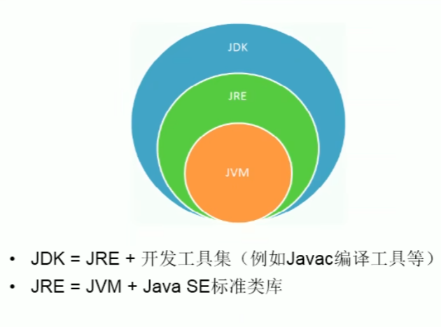
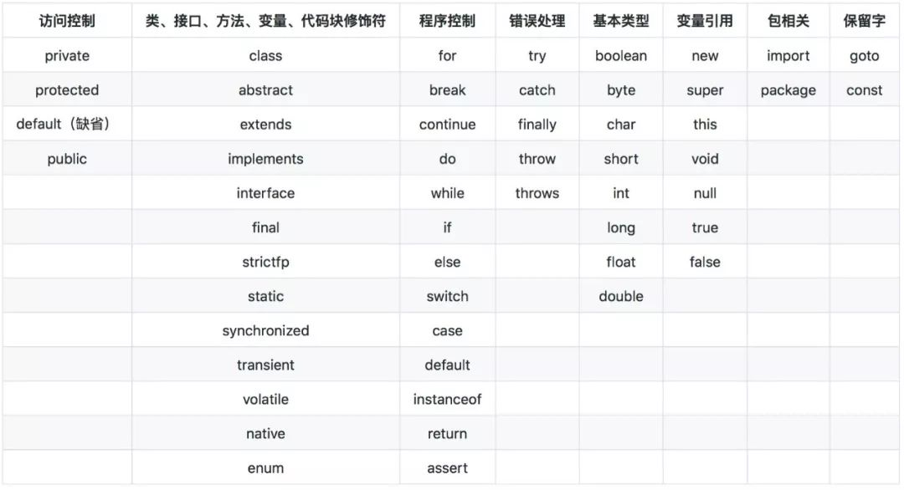

[toc]
<!-- TOC -->

- [Java基础](#java%E5%9F%BA%E7%A1%80)
    - [常用dos命令](#%E5%B8%B8%E7%94%A8dos%E5%91%BD%E4%BB%A4)
    - [Java语言特点](#java%E8%AF%AD%E8%A8%80%E7%89%B9%E7%82%B9)
    - [Java语法](#java%E8%AF%AD%E6%B3%95)
        - [关键字和保留字](#%E5%85%B3%E9%94%AE%E5%AD%97%E5%92%8C%E4%BF%9D%E7%95%99%E5%AD%97)
        - [java数据类型](#java%E6%95%B0%E6%8D%AE%E7%B1%BB%E5%9E%8B)
        - [java数据类型转换](#java%E6%95%B0%E6%8D%AE%E7%B1%BB%E5%9E%8B%E8%BD%AC%E6%8D%A2)
        - [java算术运算符](#java%E7%AE%97%E6%9C%AF%E8%BF%90%E7%AE%97%E7%AC%A6)
        - [java语句](#java%E8%AF%AD%E5%8F%A5)
        - [字符串](#%E5%AD%97%E7%AC%A6%E4%B8%B2)
        - [正则表达式](#%E6%AD%A3%E5%88%99%E8%A1%A8%E8%BE%BE%E5%BC%8F)
        - [Pattern类和Matcher类](#pattern%E7%B1%BB%E5%92%8Cmatcher%E7%B1%BB)
    - [java数字和日期的处理](#java%E6%95%B0%E5%AD%97%E5%92%8C%E6%97%A5%E6%9C%9F%E7%9A%84%E5%A4%84%E7%90%86)

<!-- /TOC -->
## Java基础

### 常用dos命令

> dir:	列出当前目录下的文件以及文件夹
>
> md:	创建目录
>
> rd:	删除目录
>
> cd:	进入指定目录
>
> cd ..： 退回到上一级目录
>
> cd\:	退回到根目录
>
> del:	删除文件
>
> exit:	退出dos命令行
>
> 补充： echo javase>1.doc	将javase写入到1.do中

### Java语言特点

> **特点一：面向对象**
>
> ​				两个基本概念：类、对象
>
> ​				三大特性：封装、继承、多态
>
> **特点二：健壮性**
>
> ​				吸收C/C++有点，去掉其影响程序健壮性的部分（如指针、内存的申请和释放），提供了一个相对安全的内存管理和访问机制。
>
> **特点三：跨平台性**
>
> ​		通过Java语言编写的应用程序在不同的系统平台上都可以运行。JVM
>
> **Java核心机制：垃圾回收**
>
> ​		在C/C++等语言中，由程序员负责回收无用内存。
>
> ​		Java语言消除了程序员回收无用内存空间的责任，提供了一种系统级线程跟踪存储空间的分配情况。并在JVM空闲时，检查并释放哪些可被释放的存储空间。

JDK(Java Development Kit  Java开发工具包)

JRE(Java Runtime Environment Java运行环境)




**Java文档注释**：

```
/**    */
```

注释内容可以被JDK提供的JDK提供的工具javadoc所解析，生成一套网页文件形式体现该程序的说明文档。

```java
javadoc -d "文件夹名" -author "作者" -version "版本" 文件名
```

一个java源文件中可以声明多个类，但只能有一个可以声明为public。声明为pubic的类的类名必须与源文件名相同。

**Java命名规范**

​		包名：多单词组成时所有字母都小写，如xxxyyyzzz

​		类名、接口名：多单词组成时，所有单词的首字母大写，如XxxYyyZzz

​		变量名、方法名：多单词组成时，第一个单词首字母小写，第二个单词开始每个单词首字母大写：xxxYyyZzz

​		常量名：所有字母都大写。多单词时每个单词用下划线连接：XXX_YYY_ZZZ

### Java语法

#### 1.关键字和保留字

关键字：被java语言赋予了特殊含义，用作专门用途的字符串  关键字中所有字母都为小写

*保留字：现在java版本尚未使用，但以后版本可能作为关键字使用。*



#### 2.java数据类型

java数据类型分为两种：**基本数据类型**（Primitive Type）和**引用数据类型**（Reference Type）.

**基本数据类型**

| 类型名称     | 关键字  | 占用内存 | 取值范围                                   |
| ------------ | ------- | -------- | ------------------------------------------ |
| 字节型       | byte    | 1 字节   | -128~127                                   |
| 短整型       | short   | 2 字节   | -32768~32767                               |
| 整型         | int     | 4 字节   | -2147483648~2147483647                     |
| 长整型       | long    | 8 字节   | -9223372036854775808L~9223372036854775807L |
| 单精度浮点型 | float   | 4 字节   | +/-3.4E+38F（6~7 个有效位）                |
| 双精度浮点型 | double  | 8 字节   | +/-1.8E+308 (15 个有效位）                 |
| 字符型       | char    | 2 字节   | ISO 单一字符集                             |
| 布尔型       | boolean | 1 字节   | true 或 false                              |

**引用数据类型**

类：class 		接口：interface		数组：[ ]  


> string属于class。
>
> Java默认的浮点型为double，如果要说明一个float类型数值，就需要在器后面追加字母f或者F，如11.11f和1.2345F都是float类型的常数。
>
> **一个值要被真正看作float，它必须以f或者F后援结束，否则会被当做double值。对double来说，d或D后援是可选的。**

#### 3.java数据类型转换

​		数据类型转换可以分为隐式转换（自动类型转换）和显式转换（强制类型转换）两种。

**隐式转换（自动类型转换）**

需要满足两个条件：

- 两种数据类型彼此兼容
- 目标类型的取值范围大于源数据类型（低级类型数据转换成高级类型数据）

在运算过程中，由于不同的数据类型会转换成同一种数据类型，所以整型、浮点型以及字符型都可以参与混合运算。自动转换的规则是从低级类型数据转换成高级类型数据。转换规则如下：

- 数值型数据的转换：byte→short→int→long→float→double。
- 字符型转换为整型：char→int

注意：char 类型比较特殊，char 自动转换成 int、long、float 和 double，但 byte 和 short 不能自动转换为 char，而且 char 也不能自动转换为 byte 或 short。

**显式转换（强制类型转换）**

当两种数据类型不兼容，或目标类型的取值范围小于源类型时，自动转换将无法进行，这时就需要进行强制类型转换。

```java
(type)variableName
```

#### 4.java算术运算符

**一元运算符**

| 运 算 符 | 名 称    | 说 明                        | 例 子      |
| :------: | :------: | :------------------: | ---------- |
| -        | 取反符号 | 取反运算                     | b=-a       |
| ++       | 自加一   | 先取值再加一，或先加一再取值 | a++ 或 ++a |
| --       | 自减一   | 先取值再减一，或先减一再取值 | a-- 或 --a |

**二元运算符**

| 运 算 符 | 名 称 |                          说 明                           | 例 子 |
| :------: | :---: | :------------------------------------------------------: | ----- |
|    +     |  加   | 求 a 加 b 的和，还可用于 String 类型，进行字符串连接操作 | a + b |
|    -     |  减   |                      求 a 减 b 的差                      | a - b |
|    *     |  乘   |                     求 a 乘以 b 的积                     | a * b |
|    /     |  除   |                     求 a 除以 b 的商                     | a / b |
|    %     | 取余  |                    求 a 除以 b 的余数                    | a % b |

**算术赋值运算符**

| 运 算 符 |  名 称   | 例 子            |
| :------: | :------: | ---------------- |
|    +=    |  加赋值  | a += b、a += b+3 |
|    -=    |  减赋值  | a -= b           |
|    *=    |  乘赋值  | a *= b           |
|    /=    |  除赋值  | a /= b           |
|    %=    | 取余赋值 | a %= b           |

b java逻辑运算符

| 运算符 | 用法   | 含义   |                        说明                        | 实例       | 结果  |
| :----- | :----- | :----- | :------------------------------------------------: | :--------- | :---- |
| &&     | a&&b   | 短路与 |  ab 全为 true 时，计算结果为 true，否则为 false。  | 2>1&&3<4   | true  |
| \|\|   | a\|\|b | 短路或 | ab 全为 false 时，计算结果为 false，否则为 true。  | 2<1\|\|3>4 | false |
| !      | !a     | 逻辑非 | a 为 true 时，值为 false，a 为 false 时，值为 true | !(2>4)     | true  |
| \|     | a\|b   | 逻辑或 |  ab 全为 false 时，计算结果为 false，否则为 true   | 1>2\|3>5   | false |
| &      | a&b    | 逻辑与 |   ab 全为 true 时，计算结果为 true，否则为 false   | 1<2&3<5    | true  |

**关系运算符**

关系运算符的优先级为：>、<、>=、<= 具有相同的优先级，并且高于具有相同优先级的 !=、==。关系运算符的优先级高于赋值运算符而低于算术运算符，结合方向是自左向右。

注意：

1. 基本类型的变量、值不能和引用类型的变量、值使用 == 进行比较；**boolean 类型的变量、值不能与其他任意类型的变量、值使用 == 进行比较**；**如果两个引用类型之间没有父子继承关系，那么它们的变量也不能使用 == 进行比较**。
2. == 和 != 可以应用于基本数据类型和引用类型。当用于引用类型比较时，比较的是两个引用是否指向同一个对象，但当时实际开发过程多数情况下，只是比较对象的内容是否相当，不需要比较是否为同一个对象。

**条件运算符**

条件运算符的符号表示为“?:”，使用该运算符时需要有三个操作数，因此称其为三目运算符。使用条件运算符的一般语法结构为：

```java
result = <expression> ? <statement1> : <statement3>;
```

**运算符优先级**

| 优先级 | 运算符                                           | 结合性   |
| ------ | ------------------------------------------------ | -------- |
| 1      | ()、[]、{}                                       | 从左向右 |
| 2      | !、+、-、~、++、--                               | 从右向左 |
| 3      | *、/、%                                          | 从左向右 |
| 4      | +、-                                             | 从左向右 |
| 5      | «、»、>>>                                        | 从左向右 |
| 6      | <、<=、>、>=、instanceof                         | 从左向右 |
| 7      | ==、!=                                           | 从左向右 |
| 8      | &                                                | 从左向右 |
| 9      | ^                                                | 从左向右 |
| 10     | \|                                               | 从左向右 |
| 11     | &&                                               | 从左向右 |
| 12     | \|\|                                             | 从左向右 |
| 13     | ?:                                               | 从右向左 |
| 14     | =、+=、-=、*=、/=、&=、\|=、^=、~=、«=、»=、>>>= | 从右向左 |

#### 5.java语句

**空语句：** `;`

**switch case:**

​	case类型为byte, short, int, char。Java7增加了字符串字面值。

**foreach:**

​	主要用于遍历。

```java
for(类型 变量名 :集合){
	语句块;
}
```

#### 6.字符串

字符串对象一旦被创建，其值是不能改变的，但可以使用其他变量重新赋值的方式进行更改。

**字符串定义方式：**

- 直接定义字符串

  ```java
  String str = "Hello world!"
  ```

- 使用String类定义

  字符串是String类的对象，可以通过使用String类的构造方法来创建字符串。

​	  1.String()

```java
 String str = new String()
```

​	  2.String(String original)

```java
  String str1 = new String("Hello Java");
  String str2 = new String(str1);
```

​		3.String(char[] value)

```java
char a[] = {'H','e','l','l','0'};
String sChar = new String(a);
a[1] = 's';
```

​		4.String(char[] value, int offset, int count)

​		分配一个新的 String，它包含来自该字符数组参数一个子数组的字符。offset 参数是子数组第一个字符的索引，count 参数指定子数组的长度。该子数组的内容已被赋值，后续对字符数组的修改不会影响新创建的字符串。

```java
char a[]={'H','e','l','l','o'};
String sChar=new String(a,1,4);
a[1]='s';
```

**String字符串转整型int**

- Integer.parseInt(str)

- Integer.valueOf(str).intValue()

  Integer是一个类，是int基本数据类型的封装类。

  ```java
  举例：
  String str = "123";
  int n = Integer.parseInt(str);
  int n = Integer.valueOf(str).intValue();
  ```

**int转String**

- String s = String.valueOf(i);

- String s = Integer.toString(i);

- String s = "" + i;

  ```java
  举例：
  int num = 10;
  String str = String.valueOf(num);
  String str = Integer.toString(num);
  String str = "" + num;
  ```

**valueOf()、parse()和toString()**

- `valueOf()`

  `valueOf()`方法返回相关的`Number`对象，其中包含传递的参数的值。参数可以是原始数据类型，字符串等。

  这个方法是一种静态方法。它接收两个参数，其中一个是String，另一个是基数。

  ```java
  static Integer valueOf(int i)
  static Integer valueOf(String s)
  static Integer valueOf(String s, int radix)
  ```

  这个方法是一种静态方法。它接收两个参数，其中一个是`String`，另一个是基数。

  **语法**

  以下是此方法的所有变体 - 

  ```java
  static Integer valueOf(int i)
  static Integer valueOf(String s)
  static Integer valueOf(String s, int radix)
  Java
  ```
  
  **参数**

  - `i`  - 将返回表示`int`类型参数的`Integer`对象。
  - `s`  - 将返回字符串参数的`Integer`对象。
  - `radix`  - 这将用于根据传递的`String`确定返回`Integer`的值。
  
  **返回值**

  - `valueOf(int i)` - 返回一个包含指定原始值的`Integer`对象。

  - `valueOf(String s)` - 返回一个包含指定字符串表示形式值的`Integer`对象。
  
  - `valueOf(String s, int radix)` - 返回一个`Integer`对象，该对象包含指定字符串表示形式的整数值，并使用`radix`值进行解析。

    ```java
    举例：
    public class Test { 
    
       public static void main(String args[]) {
          Integer x =Integer.valueOf(9);
          Double c = Double.valueOf(5);
          Float a = Float.valueOf("80");               
          Integer b = Integer.valueOf("444",16);
    
          System.out.println(x); 
          System.out.println(c);
          System.out.println(a);
          System.out.println(b);
       }
    }
    结果：
        9
        5.0
        80.0
        1092
    
    
    ```
  
- `parse()`

  `parseXxx(String)` 这种形式，是指把**字符串转换为数值型**，其中 Xxx 对应不同的数据类型，然后转换为 Xxx 指定的类型，如 int 型和 float 型。

- `toString()`

​		`toString()`可以把一个引用类型转换为String字符串类型。

**字符串拼接**

​	String 字符串拼接可以使用“+”运算符或 String 的 concat(String str) 方法。“+”运算符优势是可以连接任何类型数据拼接成为字符串，而 concat 方法只能拼接 String 类型字符串。

```java
str1.concat(str2);
```

**获取字符串长度**:  `str.length();`

**字符串大小写转换:**	 `toUpperCase(); toLowerCase()` 

```java
String类的toLowerCase()方法可以将字符串的所有字符转换成小写，非字母不受影响。
str.toLowerCase();
toUpperCase()则将字符串中所有字符全部转换成大写，非字母不受影响。
str.toUpperCase();
```

**去除字符串首尾空格：**`str.trim()`

如果是中文空格需要：

```java
str = str.replace((char) 12288, ' ');  // 将中文空格替换为英文空格
str = str.trim();
其中，12288 是中文全角空格的 unicode 编码。
```

**截取子字符串substring**

- ​	substring(int beginIndex)

  此方法用于提取从索引位置开始至结尾处的字符串部分。调用时，括号中是需要提取字符串的开始位置。

  ```java
  String str1 = str.substring(1);
  ```

- substring(int beginIndex, int endIndex)

  此方法中beginIndex表示截取的起始索引，endIndex表示结束索引，截取的部分不包括结束索引对应的字符。如果不指定endIndex则表示截取到末尾。

  ```java
  String str1 = str.substring(1,5);
  ```

**分割字符串split**

String类的split()方法可以按指定的分割符对目标字符串进行分割，分割后的内容存放在**字符串数组**中。该方法有两种重载形式：

```java
str.split(String sign);
str.split(String sign, int limit);
```

参数：

- str 为需要分割的目标字符串。
- sign 为指定的分割符，可以是任意字符串。
- limit 表示分割后生成的字符串的限制个数，如果不指定，则表示不限制，直到将整个目标字符串完全分割为止。

使用分隔符**注意**：

​	1）“.”和“|”都是转义字符，必须得加“\\”。

- 如果用“.”作为分隔的话，必须写成`String.split("\\.")`，这样才能正确的分隔开，不能用`String.split(".")`。

- 如果用“|”作为分隔的话，必须写成`String.split("\\|")`，这样才能正确的分隔开，不能用`String.split("|")`。

​	2）如果在一个字符串中有多个分隔符，可以用“|”作为连字符，如：“acount=? and uu =? or n=?”，把三个都分隔出来，可以用`String.split("and|or")`。

```java
举例：
    String Colors = "Red,Black,White,Yellow,Blue";
    String[] arr1 = Colors.split(","); // 不限制元素个数
    String[] arr2 = Colors.split(",", 3); // 限制元素个数为3
```

**字符串替换replace()、replaceFirst()、replaceAll()**

- replace()

  replace()方法用于讲目标字符串中的指定**字符串**替换成新的字符串。

  ```java
  atr.replace(String oldChar, String newChar);
  ```

- replaceFirst()

  replaceFirst()方法用于将目标字符串中匹配某个**正则表达式**的第一个子字符串替换成新的字符串。

  ```java
  str.replaceFirst(String regex, String replacement);
  ```

- replaceAll()

  replaceAll()方法用于将目标字符串中匹配某**正则表达式**的所有子字符串替换成新的字符串。

  ```java
  str.replaceAll(String regex, String replacement);
  ```

**字符串比较equals()、equalsIgnoreCase()、compareTo()**

- equals()方法

  equals()方法将逐个比较两个字符串的每个字符是否相同（区别大小写）。如果两个字符串具有相同的字符和长度，它返回true，否则返回false。

  ```java
  str1.equals(str2);
  ```

  str1和str2可以是字符串变量，也可以是字符串字面值。

  ```
  例如："Hello".equals("hello");
  ```

  

- equalsIgnoreCase()方法

  equalsIgnoreCase() 方法的作用和语法与 equals() 方法完全相同，唯一不同的是 equalsIgnoreCase() 比较时**不区分大小写**。

> **equals()与==比较**
>
> equals() 方法比较字符串对象中的字符，而`==`运算符比较两个对象引用看它们是否引用相同的实例。
>
> ```java
> 举例：
> String s1 = "Hello";
> String s2 = new String(s1);
> System.out.println(s1.equals(s2)); // 输出true
> System.out.println(s1 == s2); // 输出false
> ```
>
> 变量 s1 指向由“Hello”创建的字符串实例。s2 所指的的对象是以 s1 作为初始化而创建的。因此这两个字符串对象的内容是一样的。但它们是不同的对象，这就意味着 s1 和 s2 没有指向同一的对象，因此它们是不`==`的。
>
> 因此，千万不要使用`==`运算符测试字符串的相等性，以免在程序中出现糟糕的 bug。从表面上看，这种 bug 很像随机产生的间歇性错误。

- compareTo()方法

  compareTo() 方法用于按字典顺序比较两个字符串的大小，该比较是基于字符串各个字符的 Unicode 值。

  ```java
  str.compareTo(String otherstr);
  ```

  它会按字典顺序将 str 表示的字符序列与 otherstr 参数表示的字符序列进行比较。如果按字典顺序 str 位于 otherster 参数之前，比较结果为一个负整数；如果 str 位于 otherstr 之后，比较结果为一个正整数；如果两个字符串相等，则结果为 0。

**字符串查找**

- 根据字符查找

  String 类的 indexOf() 方法和 lastlndexOf() 方法用于在字符串中获取匹配字符（串）的索引值。

  - indexOf()方法

    indexOf() 方法用于返回字符（串）在指定字符串中首次出现的索引位置，如果能找到，则返回索引值，否则返回 -1。该方法有两种重载形式：

    ```java
    str.indexOf(value)
    str.indexOf(value,int fromIndex)
    ```

    其中，str 表示指定字符串；value 表示待查找的字符（串）；fromIndex 表示查找时的起始索引，如果不指定 fromIndex，则默认从指定字符串中的开始位置（即 fromIndex 默认为 0）开始查找.

  - lastIndexOf()方法

    lastIndexOf() 方法用于返回字符（串）在指定字符串中最后一次出现的索引位置，如果能找到则返回索引值，否则返回 -1。该方法也有两种重载形式：

    ```java
    str.lastIndexOf(value)
    str.lastlndexOf(value, int fromIndex)
    ```

    注意：lastIndexOf() 方法的查找策略是从右往左查找，如果不指定起始索引，则默认从字符串的末尾开始查找。

- 根据索引查找

  ​	String 类的 charAt() 方法可以在字符串内根据指定的索引查找字符，该方法的语法形式如下：

  ```java
  str.charAt(索引值)
  ```

  提示：字符串本质上是字符数组，因此它也有索引，索引从零开始。

**StringBuffer类**

​	StringBuffer 类是可变字符串类，创建 StringBuffer 类的对象后可以随意修改字符串的内容。每个 StringBuffer 类的对象都能够存储指定容量的字符串，如果字符串的长度超过了 StringBuffer 类对象的容量，则该对象的容量会自动扩大。

- **创建StringBuffer**
  - StringBuffer 类提供了 3 个构造方法来创建一个字符串，如下所示：StringBuffer() 构造一个空的字符串缓冲区，并且初始化为 **16 个字符**的容量。
  - StringBuffer(int length) 创建一个空的字符串缓冲区，并且初始化为指定长度**length 的容量**。
  - StringBuffer(String str) 创建一个字符串缓冲区，并将其内容初始化为指定的字符串内容 str，字符串缓冲区的初始容量为 **16 加上字符串 str 的长度**。

```java
// 定义一个空的字符串缓冲区，含有16个字符的容量
StringBuffer str1 = new StringBuffer();
// 定义一个含有10个字符容量的字符串缓冲区
StringBuffer str2 = new StringBuffer(10);
// 定义一个含有(16+4)的字符串缓冲区，"青春无悔"为4个字符
StringBuffer str3 = new StringBuffer("青春无悔");
```

- **追加字符串**

​		StringBuffer 类的 `append()` 方法用于向原有 StringBuffer 对象中追加字符串。该方法的语法格式如下：

```java
StringBuffer对象.append(String str)
```

- **替换字符**

​		StringBuffer 类的 `setCharAt()` 方法用于在字符串的指定索引位置替换一个字符。该方法的语法格式如下：

```java
StringBuffer对象.setCharAt(int index, char ch);
```

- **反转字字符串**

​		StringBuffer 类中的 reverse() 方法用于将字符串序列用其反转的形式取代。

```java
StringBuffer对象.reverse();
```

- **删除字符串**

  StringBuffer 类提供了 deleteCharAt() 和 delete() 两个删除字符串的方法。

  - deletecharAt()方法
    删除序列中指定位置的字符。

    ```java
    StringBuffer对象.deleteCharAt(int index);
    ```
    
  - delete()方法
  
    移除序列中子字符串的字符。
  
    ```java
    StringBuffer对象.delete(int start,int end);
    ```
  
    start 表示要删除字符的起始索引值（包括索引值所对应的字符），end 表示要删除字符串的结束索引值（不包括索引值所对应的字符）。该方法的作用是删除指定区域以内的所有字符.

**String、StringBuffer、StringBuilder的区别**

​	java中字符串属于对象，java提供String类来创建和操作字符串。**String是不可变类，一旦创建就不可改变**，直至对象被销毁。

​	java提供了**两个可变字符串类StringBuffer和StringBuilder**，中文翻译为字符串缓冲区。

​	StringBuilder和StringBuffer功能基本相似，方法也差不多。不同的是，StringBuffer是线程安全的，而StringBuilder则没有实现线程安全功能，所以性能略高。在通常情况下，如果要创建一个内容可变的字符串对象，优先考虑使用StringBuilder类。

#### 7.正则表达式

​	**正则表达式**，又称规则表达式**。**（英语：Regular Expression，在代码中常简写为 **regex**、**regexp** 或 **RE**）

​	正则表达式是对**字符串**（包括普通字符（例如，a 到 z 之间的字母）和**特殊字符**（称为“元字符”））操作的一种逻辑公式，就是用事先定义好的一些特定字符、及这些特定字符的组合，组成一个“规则字符串”，这个“规则字符串”用来表达对字符串的一种过滤逻辑。正则表达式是一种文本模式，该模式描述在搜索文本时要匹配的一个或多个字符串。

​	**String.matches()** 这个方法主要是返回是否匹配指定的字符串，如果匹配则为 true，反之为 false。

​	这个方法的参数为正则表达式，关于正则表达式的用法如下：

- 检查一个字符串中是否含有符合某个规则的子串，并且可以得到这个子串；
- 根据匹配规则对字符串进行灵活的**替换 / 检索**操作。

**正则表达式规则**

1. 字母、数字、汉字、下划线、以及没有特殊定义的标点符号，都是 "普通字符"。表达式中的普通字符，在匹配一个字符串的时候，匹配与之相同的一个字符。虽然可以匹配其中任意一个，但是**只能是一个，不是多个**。


2. 一些不便书写的字符，采用在前面加 "\" 的方法。


3. 能够与 '多种字符' 匹配的表达式

正则表达式中的一些表示方法，可以匹配 '多种字符' 其中的任意一个字符。比如，表达式 "\d" 可以匹配任意一个数字。虽然可以匹配其中任意字符，但是只能是一个，不是多个。


4. **自定义能够匹配 '多种字符' 的表达式**

使用方括号 [ ] 包含一系列字符，能够匹配其中**任意**一个字符。用[ ^ ]包含一系列字符，则能够匹配其中字符之外的任意一个字符。同样的道理，虽然可以匹配其中任意一个，但是只能是一个，不是多个。


5. **修饰匹配次数的特殊符号**

前面讲到的表达式，无论是只能匹配一种字符的表达式，还是可以匹配多种字符其中任意一个的表达式，都只能匹配一次。如果使用表达式再加上修饰匹配次数的特殊符号，那么不用重复书写表达式就可以重复匹配。


6. **代表抽象意义的特殊符号**  
一些符号在表达式中代表抽象的特殊意义：


**正则表达式工具** https://jex.im/regulex/#!flags=i&re=%5BABC%5D

#### Pattern类和Matcher类
java.util.regex 是一个用正则表达式所订制的模式来对字符串进行匹配工作的类库包。它包括两个类：Pattern 和 Matcher。

Pattern 对象是正则表达式编译后在内存中的表示形式，因此，正则表达式字符串必须先被编译为 Pattern 对象，然后再利用该 Pattern 对象创建对应的 Matcher 对象。执行匹配所涉及的状态保留在 Matcher 对象中，多个 Matcher 对象可共享同一个 Pattern 对象。
```java
// 将一个字符串编译成 Pattern 对象
Pattern p = Pattern.compile("a*b");
// 使用 Pattern 对象创建 Matcher 对象
Matcher m = p.matcher("aaaaab");
boolean b = m.matches(); // 返回 true
```
上面定义的 Pattern 对象可以多次重复使用。如果某个正则表达式仅需一次使用，则可直接使用 Pattern 类的静态 matches() 方法，此方法自动把指定字符串编译成匿名的 Pattern 对象，并执行匹配，如下所示。
```java
boolean b = Pattern.matches ("a*b","aaaaab");    // 返回 true
```
Pattern 是不可变类，可供多个并发线程安全使用。


|名称	|说明|
|:------:|:-------:|
|find()	|返回目标字符串中是否包含与 Pattern 匹配的子串|
|group()	|返回上一次与 Pattern 匹配的子串|
|start()	|返回上一次与 Pattern 匹配的子串在目标字符串中的开始位置|
|end()	|返回上一次与 Pattern 匹配的子串在目标字符串中的结束位置加 1|
|lookingAt()	|返回目标字符串前面部分与 Pattern 是否匹配,从第一个字符开始|
|matches()|	返回整个目标字符串与 Pattern 是否匹配|
|reset()	|将现有的 Matcher 对象应用于一个新的字符序列。|

### java数字和日期的处理

Math类位于java的lang包。
1. Math类常用方法
**静态常量**：E(自然对数 Math.E)和PI(圆周率 Math.PI)

**求最大值、最小值和绝对值**
|方法	|说明|
|:-----:|:------:|
|static int abs(int a)|	返回 a 的绝对值|
|static long abs(long a)|	返回 a 的绝对值|
|static float abs(float a)|返回 a 的绝对值|
|static double abs(double a)	|返回 a 的绝对值|
|static int max(int x,int y)	|返回 x 和 y 中的最大值|
|static double max(double x,double y)	|返回 x 和 y 中的最大值|
|static long max(long x,long y)	|返回 x 和 y 中的最大值|
|static float max(float x,float y)	|返回 x 和 y 中的最大值|
|static int min(int x,int y)	|返回 x 和 y 中的最小值|
|static long min(long x,long y)	|返回 x 和 y 中的最小值|
|static double min(double x,double y)	|返回 x 和 y 中的最小值|
|static float min(float x,float y)	|返回 x 和 y 中的最小值|

**求整运算**
|方法	|说明|
|:-----:|:------:|
|static double ceil(double a)	|返回大于或等于 a 的最小整数 向上取整|
|static double floor(double a)	|返回小于或等于 a 的最大整数 向下取整|
|static double rint(double a)	|返回最接近 a 的整数值，如果有两个同样接近的整数，则结果取偶数|
|static int round(float a)	|将参数加上 1/2 后返回与参数最近的整数|
|static long round(double a)	|将参数加上 1/2 后返回与参数最近的整数，然后强制转换为长整型|

**三角函数**

|方法	|说明|
|:-----:|:------:|
|static double sin(double a)	|返回角的三角正弦值，参数以孤度为单位|
|static double cos(double a)	|返回角的三角余弦值，参数以孤度为单位|
|static double asin(double a)	|返回一个值的反正弦值，参数域在 [-1,1]，值域在 [-PI/2,PI/2]|
|static double acos(double a)	|返回一个值的反余弦值，参数域在 [-1,1]，值域在 [0.0,PI]|
|static double tan(double a)	|返回角的三角正切值，参数以弧度为单位|
|static double atan(double a)	|返回一个值的反正切值，值域在 [-PI/2,PI/2]|
|static double toDegrees(double angrad)	|将用孤度表示的角转换为近似相等的用角度表示的角|
|staticdouble toRadians(double angdeg)	|将用角度表示的角转换为近似相等的用弧度表示的角|

**指数运算**
|方法	|说明|
|:-----:|:------:|
|static double exp(double a)	|返回 e 的 a 次幂|
|static double pow(double a,double b)|	返回以 a 为底数，以 b 为指数的幂值|
|static double sqrt(double a)	|返回 a 的平方根|
|static double cbrt(double a)|	返回 a 的立方根|
|static double log(double a)	|返回 a 的自然对数，即 lna 的值|
|static double log10(double a)	|返回以 10 为底 a 的对数|

2. Java生成随机数（Math.random()和Random类）

Random 类提供了丰富的随机数生成方法，可以产生 boolean、int、long、float、byte 数组以及 double 类型的随机数，这是它与 Math.random() 方法最大的不同之处。random() 方法只能产生 double 类型的 0~1 的随机数。

Random 类位于 java.util 包中，该类常用的有如下两个构造方法。
+ Random()：该构造方法使用一个和当前系统时间对应的数字作为种子数，然后使用这个种子数构造 Random 对象。
+ Random(long seed)：使用单个 long 类型的参数创建一个新的随机数生成器。

|方法	|说明|
|:-----:|:------:|
|boolean nextBoolean()	|生成一个随机的 boolean 值，生成 true 和 false 的值概率相等|
|double nextDouble()	|生成一个随机的 double 值，数值介于 [0,1.0)，含 0 而不包含 1.0|
|int nextlnt()|	生成一个随机的 int 值，该值介于 int 的区间，也就是 -231~231-1。如果需要生成指定区间的 int 值，则需要进行一定的数学变换|
|int nextlnt(int n)	|生成一个随机的 int 值，该值介于 [0,n)，包含 0 而不包含 n。如果想生成指定区间的 int 值，也需要进行一定的数学变换|
|void setSeed(long seed)	|重新设置 Random 对象中的种子数。设置完种子数以后的 Random 对象和相同种子数使用 new 关键字创建出的 Random 对象相同|
|long nextLong()	|返回一个随机长整型数字|
|boolean nextBoolean()	|返回一个随机布尔型值|
|float nextFloat()	|返回一个随机浮点型数字|
|double nextDouble()	|返回一个随机双精度值|

例：
```java
Random r = new Random();
double d1 = r.nextDouble(); // 生成[0,1.0]区间的小数
double d2 = r.nextDouble() * 7; // 生成[0,7.0]区间的小数
int i1 = r.nextInt(10); // 生成[0,10]区间的整数
int i2 = r.nextInt(18) - 3; // 生成[-3,15)区间的整数
long l1 = r.nextLong(); // 生成一个随机长整型值
boolean b1 = r.nextBoolean(); // 生成一个随机布尔型值
float f1 = r.nextFloat(); // 生成一个随机浮点型值
```

Math 类的 random() 方法没有参数，它默认会返回大于等于 0.0、小于 1.0 的 double 类型随机数，即 0<=随机数<1.0。对 random() 方法返回的数字稍加处理，即可实现产生任意范围随机数的功能。

3. java数字格式化
   DecimalFormat 是 NumberFormat 的一个子类，用于格式化十进制数字。DecimalFormat 类包含一个模式和一组符号
|符号	|说明|
|:-----:|:------:|
|0	|显示数字，如果位数不够则补 0|
|#	|显示数字，如果位数不够不发生变化|
|.	|小数分隔符|
|-	|减号|
|,	|组分隔符|
|E	|分隔科学记数法中的尾数和小数|
|%	|前缀或后缀，乘以 100 后作为百分比显示|
|?	|乘以 1000 后作为千进制货币符显示。用货币符号代替。如果双写，用国际货币符号代替；如果出现在一个模式中，用货币十进制分隔符代替十进制分隔符|
