#### C++面向对象

##### 面向对象vs面向过程

面向对象思想：面向对象是以对象为中心的编程思想，把要解决的对象分解成各个对象，建立对象目的不是为了完成某一个步骤，而是描述某个对象在整个问题解决过程中的属性和行为。

面向过程思想：面向过程是一种以事件为中心的编程思想，编程的过程把解决问题的步骤分析出来，然后用函数把这些步骤实现，再一步一步具体步骤按顺序调用函数。

以常见的例子五子棋游戏举例：

面向过程分为以下几个步骤：

1）开始游戏（2）黑子先走（3）绘制画面（4）判断输赢（5）轮到白子（6）绘制画面（7）判断输赢（8）返回步骤（2） （9）输出最后结果。

面向对象分为以下几个步骤：

（1）黑白双方，这两方的行为是一样的。

（2）棋盘系统，负责绘制画面

（3）规则系统，负责判定犯规、输赢等。

（4）第一类对象（黑白双方）负责接受用户输入，并告知第二类对象（棋盘系统）棋子布局的变化，棋盘系统接收到了棋子的变化，并负责在屏幕上面显示出这种变化，同时利用第三类对象（规则系统）来对棋局进行判定。

面向对象面向过程优缺点比较：

面向过程：优点效率高，适用于逻辑简单的程序编写。缺点：扩展能力差、代码复用能力差、后期维护成本高。

面向对象：优点结构清晰、易于扩展、易于维护。缺点：开销大，需要对对象做抽象，性能较低。

面向对象三大特性：封装、继承、多态

封装：将一个对象的各个组成部分封闭起来，通过访问说明符(public、private、protected)来控制成员变量和成员函数的访问权限，隐藏对象内部的实现机制。封装实现了数据和行为的统一管理，提高了系统的稳定性、安全性和扩展性。

继承：可以基于已有的类创建新类，子类继承父类的非私有成员和方法，实现代码复用。通过继承可以形成一个层级结构的类和子类的关系，更清晰的展示类与类之间的关系。

多态：多态通俗来说就是多种形态。当完成一个行为时，不同的对象去做就会有不同的状态。多态分为静态多态和动态多态。静态多态是通过函数重载和模板来实现的，确定在编译器；动态多态是通过虚函数和继承来实现的，确定在运行期。

向上转型：创建一个父类，父类的引用指向子类（安全）。因为子类相对于父类功能更多，父类有的子类都有。

向下转型：创建一个子类，子类的引用指向父类，需要进行强制转换。


##### 虚函数

多重继承下派生类有几个基类（带虚函数的）就有几个虚函数表指针。

纯虚函数：虚函数后面加上`=0`，继承后必须重写才能被实例化。

抽象类：包含纯虚函数的类称为抽象类，抽象类不能被实例化，只有派生类继承后重写纯虚函数才能实例化。

##### **虚函数和虚函数表位于哪个地方**

类的内存最开始四个字节就是虚函数表的指针，指针变量的值就是虚函数表的地址。C++中虚函数表位于数据段，也就是C++内存模型中的常量区；而虚函数位于代码段(.text)，也就是C++内存模型中的代码区。 

虚函数表生成时机：编译期

虚函数表指针生成时机：编译器会在类的构造函数中添加位虚函数表指针赋值的语句。虚函数表指针创建时机为运行时对象实例化时创建。


##### 虚函数的重写

虚函数的重写（覆盖）：派生类中有一个跟基类完全相同的虚函数（即派生类虚函数与基类虚函数的返回值类型、函数名称、参数列表完全相同）。

虚函数重写的两个例外：

1. 协变：基类与派生类虚函数返回值类型不同。即基类返回基类对象的指针或引用，派生类返回派生类的指针或引用。
2. 析构函数的重写：基类与派生类的析构函数名字不同。如果基类的析构函数为虚函数，此时派生类析构函数只要定义，无论是否加virtual关键字，都与基类的析构函数构成重写。

`override`和`final`

`final`：修饰虚函数，标识该虚函数不能再被继承

`override`：检查派生类函数是否重写了基类某个虚函数，如果没有重写编译报错。

##### 多重继承

多重继承：如果一个派生类继承了多个基类，就称为多继承。

多重继承下内存模型：

当一个类通过多重继承继承多个基类 时，它会包含每个基类的成员和虚函数表指针。每个基类的成员按派生类中按照声明的顺序依次排列，而虚函数表指针位于类对象的开始位置。最后才是派生类成员。

```text
[虚函数表指针] + [虚基类子对象1] + [虚基类子对象2] + ... + [派生类成员]
```

多重继承优点：可以调用多个基类的成员和方法。

多重继承缺点：多重继承占用内存较多；多重继承会出现二义性（命名冲突）

举例菱形继承：

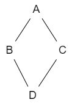

```cpp
class A; 
class B : public A;
class C : public A;
class D : public B, public C;
```

D中会出现两次A，使用A的成员变量时会出现二义性（使用来自B的还是来自C的）

二义性解决方法：

1. 加上类名或者域解析符`::`确定使用哪个父类的成员（增加代码的复杂度，降低了可读性）
2. 虚继承，在第一级继承时就将共同基类设置为虚基类（虚继承），只保留唯一的一份基类成员。

```cpp
class A; 
class B : public virtual A;
class C : public virtual A;
class D : public B, public C;
```

被虚继承的类称为虚基类。

#### 友元函数和友元类

类具有封装和隐藏信息的特性，只有类的成员函数才能访问类的私有成员和方法。如果要在外部访问类的私有成员和方法，需要定义新的public函数调用私有成员和方法，由于调用函数参数传递会检查类型安全等时间开销，影响程序的运行效率。为了让函数或者对象能在类外部调用类的私有成员或函数，引入友元函数friend。

友元是定义在类外部的普通函数，但是需要在类内部进行声明。声明时前面加上关键字friend。友元不是类的成员函数，但是可以访问类内的私有成员。

优点：友元的作用提高了系统的运行效率。

缺点：破坏了类的封装性和隐藏性，使得非成员函数也能访问类的私有成员。


友元类，当一个类是另一个类的友元类时，就以为着这个类的所有成员函数都是另一个类的友元函数，都可以访问另一个类中私有成员。

特性：

1. 友元的关系是单向的
2. 友元关系不能进行传递。B是A的友元类，C是B的友元类，不能说明C是A的友元。
3. 友元关系不能被继承。


#### C++如何实现接口类

接口类（抽象类），内部全是纯虚函数，需要继承并重写虚函数后才能使用。

c++实现接口需要注意：

1. 接口类中不应该声明成员变量，静态变量。
2. 可以声明静态常量作为接口的返回值状态，需要在对应的cpp中定义并初始化，访问时需要使用`接口类型::静态常量名`访问
3. 定义的接口方法用virtual修饰符和“=0”修饰，表示虚函数为纯虚函数。
4. 接口是无法创建的，所以不应该编写构造函数和虚构函数。

#### C++类会自动生成那些函数

空类声明时编译器不会生成任何的成员函数，只会生成一个字节的占位符。

在实例化时编译器会生成6个成员函数：

1. 缺省的构造函数
2. 拷贝构造函数
3. 析构函数
4. 赋值运算符
5. 两个取址运算符（const和非const）

#### 模板是什么，底层怎么实现的

C++中的模板是一种通用的代码机制，允许使用一种通用的算法或者数据结构处理不同类型的数据。使用模板，可以避免针对不同类型的数据写重复的代码，提高代码的重用性和可维护性。

模板(template)有类模板（`template<class T>`）和函数模板(`template<typename T>`)

底层实现：编译器从函数模板通过具体类型生成不同的函数；编译器会对模板函数进行两次编译：在声明的地方对函数模板本身进行编译，在调用的地方对参数替换后的代码进行编译。


#### **前向迭代器、双向迭代器、随机访问迭代器用法区别，迭代器之间元素的个数**

前向迭代器：支持`p++`、`++p`

双向迭代器：支持`p++`、 `++p`、 `p--`、 `--p`

随机访问迭代器：支持`p+=i`、 `p-=i` 、`p-i`、 `p+i`、 `p[i]`

| 容器                               | 对应的迭代器类型                                          |
| :--------------------------------- | --------------------------------------------------------- |
| array                              | 随机访问迭代器                                            |
| vector                             | 随机访问迭代器                                            |
| deque                              | 随机访问迭代器                                            |
| list                               | 双向迭代器                                                |
| set / multiset                     | 双向迭代器                                                |
| map / multimap                     | 双向迭代器                                                |
| forward_list                       | 前向迭代器                                                |
| unordered_map / unordered_multimap | 前向迭代器                                                |
| unordered_set / unordered_multiset | 前向迭代器                                                |
| stack                              | 不支持迭代器                                              |
| queue                              | 不支持迭代器（queue不支持顺序和随机访问，迭代器没有意义） |

求迭代器之间元素的个数：`std::distance()`

#### C++程序从编译到运行的过程

从编译到运行过程大致分为4个阶段：

预处理、编译、汇编、链接。

1. 预处理

   预处理是将以`#`开头的预编译指令处理成实际的代码，预处理指令包括`#inlcude、#define、#ifdef`等，预处理会扩展宏定义、处理条件编译指令、删除注释等等。预处理后生成`.i`的源代码文件.

   具体命令：`gcc -E hello.c -o hello.i`  `-E`为编译选项。

2. 编译

   将代码转为汇编代码，检查词法和语法规则，进行各种代码优化，比如删除无用代码、常量折叠、函数内联等，如果发现错误，还会产生相应的错误信息。编译后生成`.s`的文件。

   命令：`gcc -S hello.c -o hello.s`

   > 常量折叠：在编译时计算表达式的常量值，并将其替换为常量的结果，从而减少程序在运行时的计算量，提高程序的执行效率。常量折叠通常应用于算数表达式中，例如加减乘除、位运算等等。

3. 汇编

   汇编将汇编语言转成成机器指令，也就是可执行文件的二进制目标代码。汇编后生成`.o`的文件。

   命令：`gcc -c hello.c -o hello.o`

4. 链接

   链接是一个“打包”的过程，将所有二进制形式的目标文件(`.o`)和标准库、动态链接库组合成一个可执行文件。连接后生成`.out`文件。

   命令： `gcc main.o hello.o -o main.out`

> gcc提示找不到头文件的解决方法：
>
> 1. 直接在程序编写时指定头文件的地址
> 2. 在编译时使用`-I`参数，指定头文件所在文件夹的位置。
>
> gcc其他参数：
>
> -D 指定一个宏定义：不在程序中定义宏，在程序编译时定义。
>
> 例如：gcc main.c -o main -D DEBUG
>
> -Wall:输出程序中的警告信息
>
> -g 在程序中添加一些调试信息，加-g参数后输出的可执行的文件会比不加的大(因为包含调试信息) gdb调试时必须添加此参数。


#### main函数执行前和执行后执行的代码可能是什么

main函数执行**前**：

1. 初始化栈的指针（存储函数的局部变量、main函数调用的返回地址等）
2. 初始化static静态变量和global全局变量，即`.data段`的内容
3. 将未初始化的全局变量赋初值：数值型`short`，`int`，`long`等为`0`，`bool`为`FALSE`，指针为`NULL`等等，即`.bss`段的内容
4. 全局对象初始化，会调用默认构造函数进行初始化
5. 将main函数的参数`argc`,`argv`传给main,然后才真正运行main函数
6. 可能还会有标准输入输出或者错误流的初始化

main函数执行**后**：

1. 全局变量的析构，销毁堆内存，流的关闭
2. 可以用`atexit`注册一个函数，在main后执行。


#### 计算机系统的bss段、data段、code段、堆（heap）和栈（stack）

**bss段**（bss segment; Block Started by Symbol）：通常是指用来存放程序中**未初始化**的**全局变量**的一块内存区域。bss段属于静态分配。

**data段**（data segment）:通常是指用来存放程序中**已经初始化**的**全局变量**的一块内存区域。

**code段**（code segment/text segment）通常是指用来存放**程序执行代码**的一块内存区域。这部分区域的大小在程序运行之前就已经确定，并且内存区域通常属于只读（某些架构也允许代码段为可写，即允许修改程序）。

**堆**（heap）:堆是用于存放进程中被**动态分配**的内存段，他的大小并不固定，可动态扩张或缩减。

当进程调用malloc等函数分配内存时，新分配的内存就被动态添加到堆上（扩张）；

当利用free等函数释放内存时，被示范给的内存从堆中被剔除（堆被缩减）。

**栈**（stack）:栈又称堆栈，是用户存放程序**临时创建的局部变量**。(栈有静态分配和动态分配)（动态分配由编译器进行释放，alloca函数）

也就是函数括弧{}中定义的变量（不包括static声明的变量，static在data段中）。

除此之外，在函数调用时，其**参数**也会被压入发起调用的进程栈中，并且待到调用结束后，函数的**返回值**也会被存放回栈中。

由于栈先进后出（FILO）的特点，所以栈特别方便用来保存/恢复现场。从这个意义上将，我们可以把堆栈堪称一个寄存、交换临时数据的内存区。

##### 堆和栈的区别

- 申请方式不同：栈是系统自动分配，堆是自己申请和释放的。

- 申请大小限制不同：栈顶和栈底是之前预设好的，栈是向栈底扩展，大小固定，可通过ulimit -a查看，ulimit -s修改。

  堆向高地址扩展，是不连续的内存区域，大小可以灵活调整。栈空间默认是4M, 堆区一般是 1G - 4G

- 申请效率不同：栈由系统分配，速度快，不会有碎片；堆由程序员分配，速度慢，会有碎片。

   堆快还是栈快？

​           栈快一些。

​           因为操作系统会在底层对栈提供支持，会分配专门的寄存器存放栈的地址，栈的入栈出栈操作也十分简单，并且有专门的指令执行，所以栈的效率比较高也比较快。

​           而堆的操作是由C/C++函数库提供的，在分配堆内存的时候需要一定的算法寻找合适大小的内存。并且获取堆的内容需要两次访问，第一次访问指针，第二次根据指针保存的地址访问内存，因此堆比较慢。

|  |                              堆                              |                              栈                              |
| :---------------------: | :----------------------------------------------------------: | :----------------------------------------------------------: |
|   **管理方式**   |         堆中资源由程序员控制（容易产生memory leak）          |             栈资源由编译器自动管理，无需手工控制             |
| **内存管理机制** | 系统有一个记录空闲内存地址的链表，当系统收到程序申请时，遍历该链表，寻找第一个空间大于申请空间的堆结点，删 除空闲结点链表中的该结点，并将该结点空间分配给程序（大多数系统会在这块内存空间首地址记录本次分配的大小，这样delete才能正确释放本内存空间，另外系统会将多余的部分重新放入空闲链表中） | 只要栈的剩余空间大于所申请空间，系统为程序提供内存，否则报异常提示栈溢出。（这一块理解一下链表和队列的区别，不连续空间和连续空间的区别，应该就比较好理解这两种机制的区别了） |
|   **空间大小**   | 堆是不连续的内存区域（因为系统是用链表来存储空闲内存地址，自然不是连续的），堆大小受限于计算机系统中有效的虚拟内存（32bit 系统理论上是4G），所以堆的空间比较灵活，比较大 | 栈是一块连续的内存区域，大小是操作系统预定好的，windows下栈大小是2M（也有是1M，在 编译时确定，VC中可设置） |
|   **碎片问题**   |    对于堆，频繁的new/delete会造成大量碎片，使程序效率降低    | 对于栈，它是有点类似于数据结构上的一个先进后出的栈，进出一一对应，不会产生碎片。（看到这里我突然明白了为什么面试官在问我堆和栈的区别之前先问了我栈和队列的区别） |
|   **生长方向**   |                  堆向上，向高地址方向增长。                  |                  栈向下，向低地址方向增长。                  |
|   **分配方式**   |              堆都是动态分配（没有静态分配的堆）              | 栈有静态分配和动态分配，静态分配由编译器完成（如局部变量分配），动态分配由alloca函数分配，但栈的动态分配的资源由编译器进行释放，无需程序员实现。 |
|   **分配效率**   |  堆由C/C++函数库提供，机制很复杂。所以堆的效率比栈低很多。   | 栈是其系统提供的数据结构，计算机在底层对栈提供支持，分配专门 寄存器存放栈地址，栈操作有专门指令。 |


#### C++中内存对齐问题

1. 什么是内存对齐

   ```cpp
   //32位系统
   #include<stdio.h>
   struct{
       int x;
       char y;
   }s;
   
   int main()
   {
       printf("%d\n",sizeof(s));  // 输出8
       return 0;
   }
   
   ```

   例如：理论上，32位系统下，int占4byte，char占1byte，那么把他们放在一个结构体下应该占4+1=5byte，但实际上，通过运行程序得到的结果是8byte，这就是内存对齐导致的。

   现代计算机中内存空间都是按照 byte 划分的，从理论上讲似乎对任何类型的变量的访问可以从任何地址开始，但是**实际的计算机系统对基本类型数据在内存中存放的位置有限制，它们会要求这些数据的首地址的值是某个数k（通常它为4或8）的倍数**，这就是所谓的**内存对齐**。

2. 为什么要进行内存对齐 

   提高读写效率。

   尽管内存是以字节为单位，但是大部分处理器并不是按字节块来存取内存的。它一般会以双字节,四字节,8字节,16字节甚至32字节为单位来存取内存。
   例如4字节存取粒度的处理器取int类型变量（32位系统），该处理器只能从地址为4的倍数的内存开始读取数据。
   假如没有内存对齐机制，数据可以任意存放，现在一个int变量存放在从地址1开始的连续四个字节地址中，该处理器去取数据时，要先从0地址开始读取第一个4字节块,剔除不想要的字节（0地址）,然后从地址4开始读取下一个4字节块,同样剔除不要的数据（5，6，7地址）,最后留下的两块数据合并放入寄存器.这需要做很多工作.

3. 内存对齐规则

   每个特定平台上的编译器都有自己的默认“对齐系数”（也叫对齐模数）。gcc中默认#pragma pack(4)，可以通过预编译命令#pragma pack(n)，n = 1,2,4,8,16来改变这一系数。

   有效对其值：是给定值#pragma pack(n)和结构体中最长数据类型长度中**较小**的那个。有效对齐值也叫**对齐单位**。

   内存对齐规则：

   (1) 结构体第一个成员的**偏移量（offset）**为0，以后每个成员相对于结构体首地址的 offset 都是**该成员大小与有效对齐值中较小那个**的整数倍，如有需要编译器会在成员之间加上填充字节。

   (3) **结构体的总大小**为有效对齐值的**整数倍**，如有需要编译器会在最末一个成员之后加上填充字节。

#### 指针和引用的区别

- 指针是一个变量，存储的是一个地址，引用跟原来的变量实质上是同一个东西，是原变量的别名
- 指针可以有多级，引用只有一级
- 指针可以为空，引用不能为NULL且在定义时必须初始化
- 指针在初始化后可以改变指向，而引用在初始化之后不可再改变
- sizeof指针得到的是本指针的大小，sizeof引用得到的是引用所指向变量的大小
- 当把指针作为参数进行传递时，也是将实参的一个拷贝传递给形参，两者指向的**地址相同**，但不是同一个变量，在函数中改变这个变量的**指向**不影响实参（改变指针指向的值是影响实参），而引用却可以。
- 引用本质是一个指针（常量指针），同样会占4字节内存；指针是具体变量，需要占用存储空间（具体情况还要具体分析，32位系统占4个字节，64位系统占8个字节）。
- 引用在声明时必须初始化为另一变量，一旦出现必须为typename refname &varname形式；指针声明和定义可以分开，可以先只声明指针变量而不初始化，等用到时再指向具体变量。
- 不存在指向空值的引用，必须有具体实体；但是存在指向空值的指针。 

#### 为什么有了指针还要有引用

因为C++是一个面向对象的编程方式，指针是C语言中的语法不支持函数运算符的重载， 引入引用机制主要是为了支持运算符的重载，可以让语言的表达更直观

#### 传递函数参数时，什么时候用指针，什么时候使用引用

-  引用：**类对象**作为参数传递时使用引用（C++类对象传递的标准方式）。
         对栈空间大小比较敏感（比如递归）时使用引用，使用引用传递不需要创建临时变量，开销更小。

修改调用函数中数据的函数：

	1. 数据对象是内置的数据类型：用指针
	2. 数据对象是数组：用指针
	3. 数据对象是结构体：用引用或指针
	4. 数据对象是类：用引用。

#### new/delete与malloc/free

##### new/delete与malloc/free的异同

- 相同点：都可以用于内存的动态申请与释放

- 不同点：1.  new/delete是C++运算符，malloc/free是C/C++语言标准库函数；

  ​               2. new自动计算要分配空间的大小，malloc需要手动计算

  ​               3. new是类型安全的，malloc不是。例如：

  ```cpp
  int *p = new float[2]; //编译错误
  int *p = (int*)malloc(2 * sizeof(double));//编译无错误
  ```

  > malloc线程安全但是不可重入。
  >
  > 线程安全：需要解决多个线程调用函数时访问共享资源的冲突。malloc函数在用户空间要自己管理各自进程共享的内存链表，由于有共享资源访问，本身会导致线程不安全。为了做到线程安全，malloc加了递归锁进行保护。（当程序调用malloc时收到信号，在信号处理函数中又调用malloc函数，如果使用一般的锁会造成死锁，因此使用递归锁）
  >
  > 不可重入：程序调用malloc函数时收到信号，在信号处理函数中再调用malloc函数可能破坏共享的内存链表等资源，因此不可重入。
  
  ​              4. new调用名为**operator new**的标准库函数分配足够空间并调用相关对象的构造函数，delete对指针所指对象运行适当的析构函数；然后通过调用名为**operator delete**的标准库函数释放该对象所用内存。后者均没有相关调用
  
  ​              5. 后者需要库文件支持，前者不用
  
     6. new是封装了malloc，直接free不会报错，但是这只是释放内存，而不会析构对象

##### new和delete是如何实现的

- new的实现过程是：首先调用名为**operator new**的标准库函数，分配足够大的原始为类型化的内存，以保存指定类型的一个对象；接下来运行该类型的一个构造函数，用指定初始化构造对象；最后返回指向新分配并构造后的的对象的指针
- delete的实现过程：对指针指向的对象运行适当的析构函数；然后通过调用名为**operator delete**的标准库函数释放该对象所用内存

##### malloc和new的区别

- malloc和free是标准库函数，支持覆盖；new和delete是运算符，支持重载。

- malloc仅仅分配内存空间，free仅仅回收空间，不具备调用构造函数和析构函数功能，用malloc分配空间存储类的对象存在风险；new和delete除了分配回收功能外，还会调用**构造函数**和**析构函数**。

- malloc和free**返回**的是void类型指针（必须进行类型转换），new和delete返回的是具体类型指针。

- malloc申请失败返回null，new申请失败返回`bad_alloc`
##### 既然有了malloc/free，C++中为什么还需要new/delete呢？ 
- malloc/free和new/delete都是用来申请内存和回收内存的。
- 在对**非基本数据类型**的对象使用的时候，对象创建的时候还需要执行构造函数，销毁的时候要执行析构函数。而malloc/free是库函数，是已经编译的代码，所以不能把**构造函数**和**析构函数**的功能强加给malloc/free，所以new/delete是必不可少的。

##### 为什么malloc需要传参，free不需要传参

背景上：free没必要传递需要释放内存大小这个参数，如果传入大小和malloc大小不一样，大了破坏内存空间，小了会导致内存泄漏。并且在malloc时申请的内存通常会比传入的大小会大（生成一个结构体和考虑到内存对齐问题），所以手动传入的参数也是一个无效的值。

实现上：在进行malloc(size)的时候，实际分配的内存大小大于size字节，因为在分配的内存区域头部有类似于

```c
struct control_block{
unsigned size;
int used;
};
```

结构，如果mallic函数内部得到的内存区域的首地址为void *p，那么malloc返回时给的是p+sizeof(control_block)，而调用free的时候，p减去sizeof(control_block)就可以根据结构体得到要释放内存的大小。

##### 被free回收的内存是立即返还给操作系统吗

 	不是。被free回收的内存会首先被ptmalloc使用双链表保存起来，当用户下一次申请内存的时候，会尝试从这些内存中寻找合适的返回。这样就避免了频繁的系统调用，占用过多的系统资源。同时ptmalloc也会尝试对小块内存进行合并，避免过多的内存碎片。

> ptmalloc是glibc默认的内存管理器。我们常用的malloc和free就是由ptmalloc内存管理器提供的基础内存分配函数。ptmalloc有点像我们自己写的内存池，当我们通过malloc或者free函数来申请和释放内存的时候，ptmalloc会将这些内存管理起来，并且通过一些策略来判断是否需要回收给操作系统。这样做的最大好处就是：让用户申请内存和释放内存的时候更加高效。
>
> 为了内存分配函数malloc的高效性，ptmalloc会预先向操作系统申请一块内存供用户使用，并且ptmalloc会将已经使用的和空闲的内存管理起来；当用户需要销毁内存free的时候，ptmalloc又会将回收的内存管理起来，根据实际情况是否回收给操作系统

##### malloc实现原理

在进程中malloc申请内存实际上是在进程虚拟内存空间的堆内存上进行申请的。Linux堆内存维护一个break指针，指向堆空间中的某个地址，从堆开始到break指针之间的地址是映射好的，可供进程访问。而break指针之上的空间是未经过映射的，如果访问这段空间则程序会报错。

malloc底层通过`brk`和`sbrk`两个系统调用来操作break指针。

```cpp
int brk(void* addr);//执行成功返回0 否则返回-1。并设置errno未ENOMEM
void *sbrk(inptr_t increment);//执行成功返回break移动之前指向的地址。否则返回(void*)-1;
```

`brk`是直接将break设置为某个地址，而`sbrk`将break从当前位置移动到increment所指定的增量。

资源限制和`rlimit`

系统未每一个进程分配的资源不是无限的，包括可映射的空间，因此每个进程有一个`rlimit`表示当前进程可用的资源上限，这个限制可以通过`getrlimit`系统调用得到。

```cpp
struct rlimit
{
	rlimit rlim_cur;
	rlimit rlim_max;
};
```

每种资源有硬限制和软限制，并且可以通过`setrlimit`对`rlimit`修改软限制的上限，非特权进程智能修改软限制，不能修改硬限制。

数据结构

内存空间以块的形式组织起来，每个块有meta区和数据区组成。

使用malloc申请的内存包括两部分：meta元数据去和数据区，meta区记录数据块的元信息(数据区的大小、空闲标志位、指针等)，数据区是真实分配的内存区域，并且数据区的第一个字节地址为malloc返回的地址。

```
typedef struct s_block *t_block;
struct s_block{
	size_t size;//数据区的大小
	t_block next;//指向下个数据块的指针
	int free;//是否空闲块
	int paddding;//填充四字节，保证meta块长度为8的倍数(内存对齐)
	char data[1];//虚拟字段，表示数据块的第一个字节，长度不应计入meta
}
```

寻找合适的block块

一般有两种查找算法：

1. First fit：从头开始i，使用第一个数据区大小大于要求size的块用于此次分配的块。（运行效率高）
2. Best fit：从投开始，遍历所有快，使用数据区大小大于size且差值最小的块最为此次分配的块。（内存利用率高）

如果现有的block块都不能满足要求，则需要在链表最后开辟一个新的block。


#### 宏定义和函数有什么区别

- 宏在预处理**阶段**完成替换，之后被替换的文本参与编译，相当于直接插入了代码，运行时不存在函数调用，执行起来更快；函数调用在运行时需要跳转到具体调用函数。
- 宏定义属于在**结构**中插入代码，没有返回值；函数调用具有返回值。
- 宏定义参数没有类型，不进行**类型检查**；函数参数具有类型，需要检查类型。
- 宏定义不要在最后加**分号**。

#### 宏定义和typedef的区别

- 宏主要用于定义常量及书写复杂的内容；typedef主要用于定义类型别名。
- 宏替换发生在编译阶段**之前预处理阶段**，属于文本插入替换；typedef是编译的一部分。
- 宏不检查类型；typedef会检查数据类型。
- 宏不是语句，不在在最后加分号；typedef是语句，要加分号标识结束。

#### 变量声明和定义区别

- 声明仅仅是把变量的声明的位置及类型提供给编译器，并**不分配内存空间**；定义要在定义的地方为其分配存储空间。
- 相同变量可以在多处声明（外部变量extern），但只能在一处定义。

#### strlen和sizeof区别

- sizeof是**运算符**，并不是函数，结果在编译时得到而非运行中获得；strlen是字符处理的**库函数**。
- sizeof参数可以是**任何数据的类型或者数据**（sizeof参数不退化）；strlen的参数只能是字符指针且结尾是'\0'的**字符串**。
- 因为sizeof值在编译时确定，所以不能用来得到**动态分配**（运行时分配）存储空间的大小。

#### 一个指针占多少字节
一个指针占内存的大小跟编译环境（系统位数）有关。指针指向的是地址，和系统的寻址能力有关。
32位系统一个指针占4字节。
64位系统一个指针占8字节。

#### C++和C的区别

- C++是面向对象的语言，而C是面向过程的语言；

- C++引入`new/delete`运算符，取代了C中的`malloc/free`库函数；

- C++引入引用的概念，而C中没有；

- C++引入类的概念，而C中没有；

- C++引入函数重载的特性，而C中没有

- C++中的struct引入了静态成员变量和成员函数而C中没有，C++结构体可以继承、实现多态。

#### C++和Java的区别

1. 语言特性
   - Java语言给开发人员提供了更为简洁的语法；完全面向对象，由于JVM可以安装到任何的操作系统上，所以说它的可移植性强
   - Java语言中没有指针的概念，引入了真正的数组。这将有利于防止在C++程序中常见的因为数组操作越界等指针操作而对系统数据进行非法读写带来的不安全问题
   - C++也可以在其他系统运行，但是需要不同的编码（这一点不如Java，只编写一次代码，到处运行），例如对一个数字，在windows下是大端存储，在unix中则为小端存储。Java程序一般都是生成字节码，在JVM里面运行得到结果
   - Java用接口(Interface)技术取代C++程序中的抽象类。接口与抽象类有同样的功能，但是省却了在实现和维护上的复杂性
   - Java中类只能单继承，而C++中类可以多继承。
   
2. 垃圾回收
   - C++用析构函数回收垃圾，写C和C++程序时一定要注意内存的申请和释放
   - Java语言不使用指针，内存的分配和回收都是自动进行的，程序员无须考虑内存碎片的问题

3. 应用场景

   - Java在桌面程序上不如C++实用，C++可以直接编译成exe文件，指针是c++的优势，可以直接对内存的操作，但同时具有危险性 。（操作内存的确是一项非常危险的事情，一旦指针指向的位置发生错误，或者误删除了内存中某个地址单元存放的重要数据，后果是可想而知的）

   - Java在Web 应用上具有C++ 无可比拟的优势，具有丰富多样的框架

   - 对于底层程序的编程以及控制方面的编程，C++很灵活，因为有句柄的存在

#### C++中struct和class的区别

- 默认的继承访问权。class默认的是private,strcut默认的是public。

  > **struct可以继承class，同样class也可以继承struct，那么默认的继承访问权限是看子类到底是用的struct还是class。**

- 默认访问权限：struct作为数据结构的实现体，它默认的数据访问控制是public的，而class作为对象的实现体，它默认的成员变量访问控制是private的。

- class这个关键字还用于定义模板参数，就像“typename”。但关键字“struct”不用于定义模板参数

- struct更适合看成是一个数据结构的实现体，class更适合看成是一个对象的实现体

#### C++中const和static的作用

1. static
   - 不考虑类的情况
     - 隐藏。所有不加static的全局变量和函数具有全局可见性，可以在其他文件中使用，加了之后只能在该文件所在的编译模块中使用
     - 默认初始化为0，包括未初始化的全局静态变量与局部静态变量，都存在data段。
     - 静态变量在函数内定义，始终存在，且只进行一次初始化，具有记忆性，其作用范围与局部变量相同，函数退出后仍然存在，但不能使用
   - 考虑类的情况
     - static成员变量：只与类关联，不与类的对象关联。定义时要分配空间，**不能在类声明中初始化，必须在类定义体外部初始化**，初始化时不需要标示为static；可以被非static成员函数任意访问。
     - static成员函数：不具有this指针，无法访问类对象的非static成员变量和非static成员函数；**不能被声明为const、虚函数和volatile**；可以被非static成员函数任意访问

2. const

   - 不考虑类的情况
     - const常量在定义时必须初始化，之后无法更改
     - const形参可以接收const和非const类型的实参，函数内不能对其进行更改。例如// i 可以是 int 型或者 const int 型void fun(const int& i){ //...}
     
   - 考虑类的情况
     - const成员变量：**不能在类定义外部初始化**，**只能通过构造函数初始化列表进行初始化**，并且必须有构造函数；不同类对其const数据成员的值可以不同，所以不能在类中声明时初始化
     
     - const成员函数：const对象不可以调用非const成员函数；非const对象都可以调用；不可以改变非mutable（用该关键字声明的变量可以在const成员函数中被修改）数据的值
     
       (**非const对象(成员函数)即可以调用const对象(成员函数)，也可以调用非const对象(成员函数)**)
     
       (**const对象(成员函数)只能调用const对象(成员函数)，想调用非const对象(成员函数)就需要强转**)
   
   补充一点const相关：const修饰变量是也与static有一样的隐藏作用。只能在该文件中使用，其他文件不可以引用声明使用。 因此在头文件中声明const变量是没问题的，因为即使被多个文件包含，链接性都是内部的，不会出现符号冲突。

#### C++的顶层const和底层const

**概念区分**

- **顶层**const：指的是const修饰的变量**本身**是一个常量，无法修改，指的是指针，就是const在 * 号的右边
- **底层**const：指的是const修饰的变量**所指向的对象**是一个常量，指的是所指变量，就是const在 * 号的左边
- 区分顶层const和底层const很简单：一个指针本身添加const限定符就是顶层const，而指针所指的对象添加const限定符就是底层const。

```cpp
int a = 10;
int* const b1 = &a;        //顶层const，b1本身是一个常量
const int* b2 = &a;       //底层const，b2本身可变，所指的对象是常量
const int b3 = 20; 		   //顶层const，b3是常量不可变
const int* const b4 = &a;  //前一个const为底层，后一个为顶层，b4不可变
const int& b5 = a;		   //用于声明引用变量，都是底层const   
```

**区分作用**

- 执行对象拷贝时有限制，常量的底层const不能赋值给非常量的底层const
- 使用命名的强制类型转换函数const_cast时，只能改变运算对象的底层const

```cpp
const int a;int const a;const int *a;int *const a;
```

- const* 是常量指针，*const是指针常量
- **int const *a a指针指向的内存量的值不变。 *a不变**
- **int *const a  a指针指向的地址不变，即a不变**
- int const a和const int a均表示定义常量类型。 
- const int *a，其中a为指向int型变量的指针，const在 * 左侧，表示a指向不可变常量。(看成const (*a)，对引用加const)
- int *const a，依旧是指针类型，表示a为指向整型数据的常指针。(看成const(a)，对指针const)

#### 拷贝初始化和直接初始化

初始化的拷贝形式和直接形式有所不同：**直接初始化**直接调用与实参匹配的构造函数，拷贝初始化总是调用拷贝构造函数。拷贝初始化首先使用指定构造函数创建一个**临时对象**，然后用拷贝构造函数将那个临时对象**拷贝**到正在创建的对象。

```cpp
string str1("I am a string");//语句1 直接初始化
string str2(str1);//语句2 直接初始化，str1是已经存在的对象，直接调用拷贝构造函数对str2进行初始化
string str3 = "I am a string";//语句3 拷贝初始化，先为字符串”I am a string“创建临时对象，再把临时对象作为参数，使用拷贝构造函数构造str3
string str4 = str1;//语句4 拷贝初始化，这里相当于隐式调用拷贝构造函数，而不是调用赋值运算符函数
```

- 为了提高效率，允许编译器跳过创建临时对象这一步，**直接调用构造函数构造要创建的对象，这样就完全等价于**直接初始化了

  （语句1和语句3等价），但是需要辨别两种情况。

  - 当拷贝构造函数为private时：语句3和语句4在编译时会报错
  - 使用explicit修饰构造函数时：如果构造函数存在隐式转换，编译时会报错

#### C++11新特性

##### 智能指针

##### 移动语义

左值(lvalue)和右值(rvalue):凡是能取到地址的称为左值，反之为右值。也可以说有名字的叫做左值，没有名字的是右值。

移动语义（Move Semantics）是C++11引入的一项重要特性，旨在提高在对象所有权转移时的性能效率。传统上，当将一个对象赋值给另一个对象或将一个对象作为参数传递给函数时，通常会进行深拷贝（deep copy），即复制对象的所有成员变量。然而，对于大型对象或资源密集型对象，深拷贝可能会导致性能下降。

移动语义通过引入右值引用（Rvalue references）和移动构造函数（Move constructors）以及移动赋值运算符（Move assignment operators）来解决这个问题。右值引用允许我们标识出临时对象或将要销毁的对象，并对其进行有效的操作。

移动构造函数用于接受右值引用参数的构造函数，它将源对象的资源（如堆内存）所有权转移到新创建的对象，而不需要进行深拷贝。移动构造函数通过将源对象的指针（或其他资源）设置为nullptr，避免了资源的复制和释放。

##### 完美转发

完美转发，它会将输入的参数原封不动地传递到下一个函数中，这个“原封不动”指的是，如果输入的参数是左值，那么传递给下一个函数的参数的也是左值；如果输入的参数是右值，那么传递给下一个函数的参数的也是右值。

传统的函数调用中，参数会被复制或者移动到下一个函数，导致类型信息和修饰符的丢失。但有时候我们希望将参数原封不动地传递给下一个函数。

完美转发通过引用折叠+万能引用+`std::forward`函数来实现这一目标。

使用场景：通过模板函数调用另一个函数。

**引用折叠**

1.所有右值引用折叠到右值引用上仍然是一个右值引用。（A&& && 变成 A&&）
2.所有的其他引用类型之间的折叠都将变成左值引用。 （A& & 变成 A&; A& && 变成 A&; A&& & 变成 A&）

**万能引用**

万能引用能够接收左值或右值，返回左值引用或右值引用。

万能引用有两种使用场景：

1. 作为函数模板地形参

   ```cpp
   template<typename T>
   void f(T&& param);
   ```

   其中`param`就是一个万能引用

2. auto声明

   ```cpp
   auto&& var2=var1
   ```

这两种情况都涉及到了型别的推导，也就是说，如果你虽然遇到了T&&的形式，但是不涉及型别推导，那么它只是一个右值引用,，如下就是右值引用：

```cpp
void f(Widget&& param);
```

如下void fun(T && t); 中T&&并不是万能引用，因为T的类型在模板实例化时已经确定(类模板需要先实例化)，当实例函数void fun(T && t);时 T的类型已经确定。

```cpp
template<typename T>
class A
{
	void fun(T && t); //这里是右值引用
};
```

`std::forward()`

`std::forward`通常是用于完美转发。

对于`std::move()`可以实现将左值变为右值。但是模板是通用地，不能直接用`std::move()`写死，C++提供了`std::forward`模板类来保持类型地原有参数。

```cpp

template<typename F,typename T, typename U>
void  tempFun(F f, T && t1, U && t2)
{
	f(std::forward<T>(t1), std::forword<U>(t2));
}

```

这样传过来的参数t1、t2的类型被直接转发到函数f()中去，称为完美转发。


##### 关键字`noexpect`

`noexcept`关键字可以放在函数声明和函数定义的括号后面，表示该函数不会抛出任何异常，可以减少运行时期开销。

编译器需要为代码生成一些额外的代码用来包裹原始代码，当出现异常时可以抛出一些相关的堆栈`stack unwinding`错误信息, 这里面包含错误位置, 错误原因, 调用顺序和层级路径等信息。当使用`noexcept`声明一个函数不会抛出异常候, 编译器就不会去生成这些额外的代码, 直接的减小的生成文件的大小, 间接的优化了程序运行效率。

noexcept 标识符有几种写法: noexcept、noexcept(true)、noexcept(false)、noexcept(expression)(满足条件不抛出异常)、throw() (C++11前用这个，C++20弃用)。

其中 noexcept 默认表示 noexcept(true).
当 noexcept 是 true 时表示函数不会抛出异常,
当 noexcept 是 false 时表示函数可能会抛出异常.

```cpp
void myFunction() noexcept {//该函数不会抛出异常
    // function body
}
```

```cpp
void myFunction() noexcept(false) {//该函数可能抛出异常
    // function body
}
```

##### [=default和=delete](#C++中=default和=delete的作用)

##### 关键字constexpr

constexpr 关键字的功能是使指定的常量表达式获得在程序编译阶段计算出结果的**能力**，而不必等到程序运行阶段。

C++ 11 标准中，constexpr 可用于**修饰普通变量**、**函数**（包括模板函数）以及**类的构造函数**。

注意，获得在编译阶段计算出结果的能力，并不代表 constexpr 修饰的表达式一定会在程序编译阶段被执行，具体的计算时机还是编译器说了算。


constexpr修饰函数(常量表达式函数)，需满足以下条件：

1) 整个函数的函数体中，除了可以包含 using 指令、typedef 语句以及 static_assert 断言外，只能包含一条 return 返回语句。
2) 该函数必须有返回值，即函数的返回值类型不能是 void。
3) 函数在使用之前，必须有对应的定义语句。我们知道，函数的使用分为“声明”和“定义”两部分，普通的函数调用只需要提前写好该函数的声明部分即可（函数的定义部分可以放在调用位置之后甚至其它文件中），但常量表达式函数在使用前，必须要有该函数的定义。
4)  return 返回的表达式必须是常量表达式。


constexpr修饰类的构造函数：

1. 不能直接用constexpr修饰自己定义的类，应该修饰类的构造函数
2. constexpr 修饰类的构造函数时，要求该构造函数的函数体必须为空，且采用初始化列表的方式为各个成员赋值时，必须使用常量表达式。
3. C++11 标准中，不支持用 constexpr 修饰带有 virtual 的成员方法。


constexpr修饰模板函数：

constexpr 可以修饰模板函数，但由于模板中类型的不确定性，因此模板函数实例化后的函数是否符合常量表达式函数的要求也是不确定的。针对这种情况下，C++11 标准规定，如果 constexpr 修饰的模板函数实例化结果不满足常量表达式函数的要求，则 constexpr 会被自动忽略，即该函数就等同于一个普通函数。


const和constexpr的区别：

const 用于为修饰的变量添加“**只读**”属性；而 constexpr 关键字则用于指明其后是一个**常量（或者常量表达式）**，编译器在编译程序时可以顺带将其结果计算出来，而无需等到程序运行阶段，这样的优化极大地提高了程序的执行效率。


##### Lambda表达式

Lambda表达式语法：


```cpp
[捕获列表] (形参列表) mutable 异常列表-> 返回类型{函数体}
```

捕获列表：C++规范中也称为Lambda导入器。捕获列表能够捕捉上下文中的变量以供lambda函数使用。（多个捕获项用`,`分隔）

- []：默认不捕获任何变量；
- [=]：默认以值捕获所有变量；
- [&]：默认以引用捕获所有变量；
- [x]：仅以值捕获x，其它变量不捕获；
- [&x]：仅以引用捕获x，其它变量不捕获；
- [=, &x]：默认以值捕获所有变量，但是x是例外，通过引用捕获；
- [&, x]：默认以引用捕获所有变量，但是x是例外，通过值捕获；
- [this]：通过引用捕获当前对象（其实是复制指针）；
- [*this]：通过传值方式捕获当前对象；

参数列表：与普通函数的参数列表一致，如果不需要传递参数，则可以连同`()`一起省略

可变规则：mutable修饰符。默认情况下，Lambda函数总是一个const函数，mutable可以取消其常量性。使用该修饰符时参数列表不可省略（即使参数为空）。

异常说明：用于Lambda表达式内部函数抛出异常。

返回类型： Lambda表达式的返回类型会自动推导。除非你指定了返回类型，否则不必使用关键字，连同`->`省略。

函数体：内容与普通函数一样，不过除了可以使用参数还可以使用捕获的变量。

**Lambda函数优缺点：**

优点：语法灵活，短小精悍，不需要预先定义函数。

缺点：对函数的复用无能为力。

Lambda表达式工作原理：

编译器会把一个lambda表达式生成一个匿名类的匿名对象，并在类中重载函数调用运算符，实现一个`operator ()`方法。

```cpp
auto print = []{cout << "Hello World!" << endl; };
```

编译器优化为：

```cpp
class print_class
{
public:
	void operator()(void) const
	{
		cout << "Hello World！" << endl;
	}
};
//用构造的类创建对象，print此时就是一个函数对象
auto print = print_class();
```

**Lambda表达式使用场景**

1. Lambda表达式应用于STL算法库

   ```cpp
   1. sort(a, a+4, [=](int x, int y) -> bool { return x%10 < y%10; } );
   2. auto pos = find_if(coll.cbegin(), coll.cend(), [=](int i) { return i > x && i < y;});
   3. std::for_each(vec.date.begin(), vec_data.end(), [](int i) { std::cout << i << std::endl;});
   ```

2.  短小且不需要复用场景

##### 并发相关

1. **std::atomic相关**

   C++中原子变量（atomic）是一种多线程编程中常用的同步机制，它能够确保对共享变量的操作在执行时不会被其他线程的操作干扰，从而避免竞态条件（race condition）和死锁（deadlock）等问题。原子变量可以看作是一种特殊的类型，它具有类似于普通变量的操作，但是这些操作都是原子级别的，即要么全部完成，要么全部未完成。

   底层原理：底层对原子操作有两种支持
   
   1. bus lock
   
      当CPU发出一个原子操作的时候，可以先锁住bus总线，这样可以避免其他CPU的内存操作。等到原子操作结束后，释放bus。这种方式可以实现原子操作，但是锁住Bus会导致后续无关内存操作都不能继续。实际上，我们只关心我们操作的地址数据，只需要将我们操作的地址锁住即可，而其他的无关的地址可以继续访问。
   
   2. Cache lock
   
      为了实现多核Cache一致性，现在的硬件基本上采用了MESI协议维护一致性。假设一个系统有2个CPU，当CPU0试图执行原子递增操作时。a) CPU0发出"Read Invalidate"消息，其他CPU将原子变量所在的缓存无效，并从Cache返回数据。CPU0将Cache line置成Exclusive状态。然后将该**cache line标记locked**。b) 然后CPU0读取原子变量，修改，最后写入cache line。c) 将cache line置位unlocked。

   3. 除此之外，还有一些硬件操作指令，CAS(Compare and Swap)、内存屏障、防止内存重排序等。

   > atomic和volatile区别和联系
   >
   > volatile关键字防止编译器读取缓存而是直接读取内存上的数据。不能保证原子性。
   >
   > （图中为读-改-写三部，其中每一步是原子的，整体没有原子性）
   >
   > 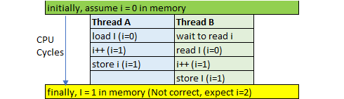
   >
   > atomic能够保证变量的原子性。
   
   atomic 原子操作支持bool、int、char等数据数据类型，但是**不支持浮点数类型** 。
   
   构造函数：
   
   **`std::atomic::atomic`**
   
   （1）默认：使对象处于未初始化状态。 `atomic() noexcept = default;`
   （2）初始化 ：使用val初始化对象。` constexpr atomic (T val) noexcept;`
   （3）复制 [删除] ：无法复制/移动对象。` atomic (const atomic&) = delete;`
   
   ```cpp
   std::atomic <bool>  atomic_bool_test1(false);
   std::atomic <int>   atomic_int_test1(0);
   ```

   **`store`函数**
   
   `std::atomic<T>::store()`是一个成员函数，用于将给定的值存储到原子对象中。
   
   ```cpp
   void store(T desired, std::memory_order order = std::memory_order_seq_cst) volatile noexcept;
   void store(T desired, std::memory_order order = std::memory_order_seq_cst) noexcept;
   ```

   - `desired`：要存储的值。
   - `order`：存储操作的内存顺序。默认是`std::memory_order_seq_cst`（顺序一致性）。
   
   **`load`函数**
   `load`函数用于获取原子变量的当前值。它有以下两种形式：
   
   ```cpp
   T load(memory_order order = memory_order_seq_cst) const noexcept;
   operator T() const noexcept;
   ```
   其中，第一种形式是显式调用load函数，第二种形式是通过重载类型转换运算符实现隐式调用。

   **`exchange`函数**

   访问和修改包含的值，将包含的值替换并返回它前面的值。

   ```cpp
   template< class T >
   T exchange( volatile std::atomic<T>* obj, T desired );
   ```
   其中，obj参数指向需要替换值的atomic对象，desired参数为期望替换成的值。如果替换成功，则返回原来的值。
   
   整个操作是原子的（原子读-修改-写操作）：从读取（要返回）值的那一刻到此函数修改值的那一刻，该值不受其他线程的影响。
   
   **`compare_exchange_weak`函数**
   
   这个函数的作用是比较一个值和一个期望值是否相等，如果相等则将该值替换成一个新值，并返回true；否则不做任何操作并返回false。

   ```cpp
   bool compare_exchange_weak (T& expected, T val,memory_order sync = memory_order_seq_cst) volatile noexcept;
   bool compare_exchange_weak (T& expected, T val,memory_order sync = memory_order_seq_cst) noexcept;
   bool compare_exchange_weak (T& expected, T val,memory_order success, memory_order failure) volatile noexcept;
   bool compare_exchange_weak (T& expected, T val,memory_order success, memory_order failure) noexcept;
   ```
   
   - expected：期望值的地址，也是输入参数，表示要比较的值；
   - val：新值，也是输入参数，表示期望值等于该值时需要替换的值；
   - success：表示函数执行成功时内存序的类型，默认为memory_order_seq_cst；
   - failure：表示函数执行失败时内存序的类型，默认为memory_order_seq_cst。
   
   | 成员函数 | 含义                     |
   | --------- | ------------------------------------------------------------ |
   | fetch_add | 添加到包含的值并返回它在操作之前具有的值                     |
   | fetch_sub | 从包含的值中减去，并返回它在操作之前的值。                   |
   | fetch_and | 读取包含的值，并将其替换为在读取值和 之间执行按位 AND 运算的结果。 |
   | fetch_or  | 读取包含的值，并将其替换为在读取值和 之间执行按位 OR 运算的结果。 |
   | fetch_xor | 读取包含的值，并将其替换为在读取值和 之间执行按位 XOR 运算的结果。 |
   
2. std::thread相关

   头文件`#include<thread>`std::thread常用成员函数
   <div class="table-box"><table><thead><tr><th>函数</th><th>类别</th><th>作用</th></tr></thead><tbody><tr><td>thread() noexcept</td><td>默认构造函数</td><td>创建一个线程，<br>什么也不做</td></tr><tr><td>template &lt;class Fn, class… Args&gt;<br>explicit thread(Fn&amp;&amp; fn, Args&amp;&amp;… args)</td><td>初始化构造函数</td><td>创建一个线程，以<code>args</code>为参数执行<code>fn</code>函数（注意参数为右值引用）</td></tr><tr><td>thread(const thread&amp;) = delete</td><td>复制构造函数</td><td>禁用（已删除）</td></tr><tr><td>thread(thread&amp;&amp; x) noexcept</td><td>移动构造函数</td><td>构造一个与<code>x</code><br>相同的对象,会破坏<code>x</code>对象</td></tr><tr><td>~thread()</td><td>析构函数</td><td>析构对象</td></tr></tbody></table></div>

   <div class="table-box"><table><thead><tr><th>函数</th><th>作用</th></tr></thead><tbody><tr><td>void join()</td><td>等待线程结束并清理资源（会阻塞）</td></tr><tr><td>bool joinable()</td><td>返回线程是否可以执行join函数(如果没有设置线程入口函数返回false)</td></tr><tr><td>void detach()</td><td>将线程与调用其的线程分离，彼此独立执行（此函数必须在线程创建时立即调用，且调用此函数会使其不能被join）</td></tr><tr><td>std::thread::id get_id()</td><td>获取线程id</td></tr><tr><td>thread&amp; operator=(thread &amp;&amp;rhs)</td><td>见移动构造函数（如果对象是joinable的，那么会调用<code>std::terminate()</code>结果程序）</td></tr></tbody></table></div>

   多线程传参：

   `thread(Fn&& fn, Args&& ...args)`为右值引用，如果要传递左值可以使用`std::ref`和`std::cref`解决；

   `std::ref`：可以包装按引用传递的值。

   `std::cref`：可以包装按const引用传递的值

   即使线程函数的参数是引用类型，参数会先被拷贝到线程空间，然后被线程执行体访问。线程内对参数的操作并不会改变器传参之前的值。 

   引用传参解决方案：使用`std::ref`包装引用传递的值。

   **对于可以移动不可拷贝的对象，例如`std::unique_ptr`对象，如果源对象是临时的，移动操作是自动执行的；如果源对象是左值，必须显示调用`std::move`函数**。

   `std::thread`是可移动的，不可拷贝。在`std::thread`对象之间转移线程所有权使用`std::move`函数。

   如果要析构thread对象，必须等待join返回或者detach。通用如果要转移线程所有权，必须要等待接收线程对象的执行函数完成，不能通过复制一个新值给thread对象的方式来丢弃一个线程。

   注意事项：

   - 线程是在thread对象被定义的时候开始执行的，而不是在调用join函数时才执行的，调用join函数只是阻塞等待线程结束并回收资源。
   - 分离的线程（执行过detach的线程）会在调用它的线程结束或自己结束时释放资源。
   - 线程会在函数运行完毕后自动释放，不推荐利用其他方法强制结束线程，可能会因资源未释放而导致内存泄漏。
   - 没有执行join或detach的线程在程序结束时会引发异常

3. `std::lock`相关

   C++11提供了RAII方式的锁封装，可以动态的释放所资源，防止线程由于编码事务导致一直有锁。

   C++主要有`std::lock_guard`和`std::unique_lock`两种方式。

   `std::lock_gurad`相比于`std::unique_lock`更加轻量级，少了一些成员函数，`std::unique_lock`类有`unlock`函数，可以手动释放锁，所以条件变量都配合`std::unique_lock`使用，而不是`std::lock_guard`。

4. `std::call_once`相关

   C++11提供了`std::call_once`老保证某一函数在多线程环境下只调用一次，需要配合`std::once_flag`使用。

   ```cpp
   std::once_flag onceflag;
   void CallOnce() {
       std::call_once(onceflag, []() {
           cout << "call once" << endl;
       });
   }
   int main() {
       std::thread threads[5];
       for (int i = 0; i < 5; ++i) {
           threads[i] = std::thread(CallOnce);
       }
       for (auto& th : threads) {
           th.join();
       }
       return 0;
   }
   ```

5. [`std::condition_variable`相关](#条件变量)

6. `std::future`相关

   头文件`#include<future>`

   `std::thread`是C++提供异步创建多线程的工具，如果想从线程中返回异步任务结果一般需要依靠全局变量。从安全角度不安全。为此C++11提供了`std::future`类模板，**`future`对象提供访问异步操作结果的机制，解决异步通信问题**。

   provider:`promise`、`packaged_task`

   Futures:`future`、`shared_future`

   `std::future`用于访问异步操作的结果，而`std::promise`和`std::packaged_task`在`future`高一层，它们内部都有一个`future`，`promise`包装的是一个值，`packaged_task`包装的是一个函数，当需要获取线程中的某个值，可以使用`std::promise`，当需要获取线程函数返回值，可以使用`std::packaged_task`。

   `std::promise`作用是提供一个不同线程之间的数据同步机制，可以存储一个某种类型的值，并将其传递给对应的`fulture`,即使这个`future`不在同一个线程中也可以安全访问到这个值。

   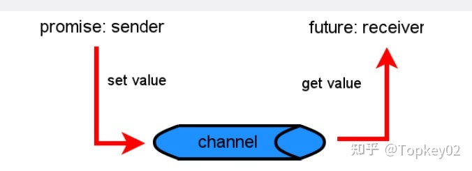

   ```cpp
   // promise example
   #include <iostream>       // std::cout
   #include <functional>     // std::ref
   #include <thread>         // std::thread
   #include <future>         // std::promise, std::future
   
   void print_int (std::future<int>& fut) {
     int x = fut.get();
     std::cout << "value: " << x << '\n';
   }
   
   int main ()
   {
     std::promise<int> prom;                      // create promise
     std::future<int> fut = prom.get_future();    // engagement with future
     std::thread th1 (print_int, std::ref(fut));  // send future to new thread
     prom.set_value (10);                         // fulfill promise
                                                  // (synchronizes with getting the future)
     th1.join();
     return 0;
   }
   ```

   `std::async`异步运行一个函数，并返回最终保有该函数调用结果的`std::fulture`

   async()的三种典型用法：

   　　1）`async(std::launch::async, ...)`，这种调用会立即启动一个线程，并且该线程保证在返回的future被销毁时完成工作，或者对返回的future调用get()或wait()时完成工作。

   　　2）`async(std::launch::deferred, ...)`，这种调用会在返回的future调用wait()或get()时启动线程，可相当于推迟的同步调用。如果不调用get()或wait()，则线程不会启动。

   　　3）`async(...)`，系统自动选择发射策略，如果可以立即启动，那么就启动线程，否则推迟启动线程。

   ```cpp
   #include <future>
   #include <iostream>
   #include <stout/stringify.hpp>
   
   bool is_prime(int x)
   {
     for (int i=0; i<x; i++)
     {
       if (x % i == 0)
         return false;
     }
     return true;
   }
   
   int main()
   {
     std::future<bool> fut = std::async(is_prime, 700020007);
     std::cout << "please wait";
     std::chrono::milliseconds span(100);
     while (fut.wait_for(span) != std::future_status::ready)
       std::cout << ".";
     std::cout << std::endl;
   
     bool ret = fut.get();
     std::cout << "final result: " << stringify(ret) << std::endl;
     return 0;
   }
   ```

   `shared_future`

   `shared_future`类似future，但可以支持多线程同步，等待信号状态。`future在`调用`get`后失效。shared_future支持拷贝构造及移动，允许有多个对象监听状态，因此可以支持拷贝


##### function函数包装器

std::function是C++11的新特性，包含在头文件<functional>中。

std::function是一个函数包装器，可以实现函数指针的功能，该函数包装器模板能包装任何类型的可调用实体，如**普通函数**，**函数指针**，**仿函数（函数对象）**，**lamda表达式**、**成员函数**、**静态函数**等。std::function对象实例可被拷贝和移动，并且可以使用指定的调用特征来直接调用目标元素。

std::function对象实例不允许进行==和!=比较操作

1. function包装函数

```cpp
int fun1(int a){
    return a;
}

int main(int argc, char *argv[]){
	std::function<int(int)> callback;
    callback = fun1; //std::function包装函数
    std::cout << callback(42) << std::endl; //std::function对象实例调用包装的调用实体

    return 0;
}
```

2. 包装函数指针

```cpp
int (*fun_ptr)(int);

int fun1(int a){
    return a;
}

int main(int argc, char *argv[]){
    
	std::function<int(int)> callback;
    fun_ptr = fun1; //函数指针fun_ptr指向fun1函数
    callback = fun_ptr; //std::function对象包装函数指针
    std::cout << callback(10) << std::endl; //std::function对象实例调用包装的实体

    return 0;
}
```

3. 包装仿函数（函数对象）

​	仿函数即为重载了operator()操作符的函数

```cpp
class Test
{
public:
    Test(){};
    ~Test(){};
    int operator() (int x){
        cout<< x <<endl;
        return 0;
    };

};

int main(int argc, char const *argv[])
{
    //std::function<int(Test*, int)> fun(&Test::operator());
    std::function<int(int)> dun;
    dun = Test();
    dun(123);
    return 0;
}
```

4. 包装匿名函数lambda表达式

```cpp
int main(int argc, char *argv[]){

	std::function<int(int)> callback;
    auto fun3 = [](int a) {return a * 2;}; //lamda表达式
    callback = fun3; //std::function包装lamda表达式
    std::cout << callback(9) << std::endl; //std::function对象实例调用包装的调用实体

    return 0;
}
```

5. 包装静态成员函数

```cpp
class foo1{
    static int foo(int a){
        return a * 3;
    }
};

int main(int argc, char *argv[]){
    std::function<int(int)> callback;
    callback = foo1::foo; //std::function包装对象静态函数
    std::cout << callback(5) << std::endl; //std::function对象实例调用包装的调用实体

    return 0;
}
```

6. 包装类成员函数

```cpp
class foo3{
    int foo(int a){
        return a * a;
    }
};

int main(int argc, char *argv[]){
    std::function<int(int)> callback;

    foo3 test_foo1;
    callback = std::bind(&foo3::foo, test_foo1, std::placeholders::_1); //std::function包装类成员函数
    std::cout << callback(9) << std::endl; //std::function对象实例调用包装的调用实体

    return 0;
}
```

std::bind的思想其实是一种延迟计算的思想，将可调用对象保存起来，然后在需要的时候再调用。而且这种绑定是非常灵活的，不论是普通函数还是函数对象还是成员函数都可以绑定，而且其参数可以支持占位符。

这里的std::placeholders::_1是一个占位符，且绑定第一个参数，若可调用实体有2个形参，那么绑定第二个参数的占位符是std::placeholders::_2。

```cpp
int add(int a, int b){return a+b;}
auto fun1 = std::bind(add,1,2);
auto fun2 = std::bind(add,std::placeholders::_1,std::placeholders::_2);
fun1();//1+2=3
fun2(1,2);
```

##### `std::bind()`函数

bind用来将可调用对象与其参数一起进行绑定，绑定后的结果可以使用`std::function`进行保存，并延迟调用到我们需要的时候。

通常来说有两大作用：

1. 将可调用对象与其参数一起绑定成一个仿函数。
2. 将多元函数(多个参数)可调用对象转换成一元可调用对象，即只绑定部分参数(使用`std::placeholder`占位符)

```cpp
void output(int x)
{
    std::cout << x << " ";
}
auto fr = std::bind(output, std::placeholders::_1);
```


#### 悬空指针、野指针

悬空指针：指针指向的内存被释放了但是指针没有改变指向，仍然指着内存被回收的内存地址。

野指针：不知道具体指向的指针，比如定义但没有初始化的指针。

产生原因以及解决方法：

野指针：指针变量未及时初始化 => 定义指针变量及时初始化，要么置空。

悬空指针：指针free或delete之后没有及时置空 => 释放操作后立即置空

#### 重载、重写（覆盖）和隐藏的区别

1. 重载（overload）

   重载是指在**同一范围**定义中的**同名成员函数**才存在重载关系。主要特点是**函数名**相同，**参数类型**和**数目**有所不同，不能出现参数个数和类型均相同，仅仅依靠返回值不同来区分的函数。重载和函数成员是否是虚函数无关。

2. 重写（覆盖）

   重写指的是在派生类中覆盖基类中的同名函数，**重写就是重写函数体**，**要求基类函数必须是虚函数**且：

   - 与基类的虚函数有相同的参数个数
   
   - 与基类的虚函数有相同的参数类型
   
   - 与基类的虚函数有相同的返回值类型
   
   重载与重写的区别：
   - 重写是父类和子类之间的垂直关系，重载是不同函数之间的水平关系
   - 重写要求参数列表相同，重载则要求参数列表不同，返回值不要求
   - 重写关系中，调用方法根据对象类型决定，重载根据调用时实参表与形参表的对应关系来选择函数体

3. 隐藏（hide）

   隐藏指的是某些情况下，派生类中的函数屏蔽了基类中的同名函数，包括以下情况：

   -  两个函数参数**相同**，但是基类函数不是虚函数。**和重写的区别在于基类函数是否是虚函数。**
   -  两个函数参数**不同**，无论基类函数是不是虚函数，**都会被隐藏**。和重载的区别在于两个函数不在同一个类中。

#### C++有几种构造函数

- 默认构造函数

- 初始化构造函数（有参数）

- 拷贝构造函数

- 移动构造函数（move和右值引用）

- 委托构造函数

- 转换构造函数

注：
  - 默认构造函数和初始化构造函数在定义类的对象，完成对象的初始化工作

  - 复制构造函数用于复制本类的对象

  - 转换构造函数用于将其他类型的变量，隐式转换为本类对象

 > **移动构造函数**：
 >
 > 1. 我们用对象a初始化对象b，后对象a我们就不在使用了，但是对象a的空间还在呀（在析构之前），既然拷贝构造函数，实际上就是把a对象的内容复制一份到b中，那么为什么我们不能直接使用a的空间呢？这样就避免了新的空间的分配，大大降低了构造的成本。这就是移动构造函数设计的初衷；
 > 2. 拷贝构造函数中，对于指针，我们一定要采用深层复制，而移动构造函数中，对于指针，我们采用浅层复制。浅层复制之所以危险，是因为两个指针共同指向一片内存空间，若第一个指针将其释放，另一个指针的指向就不合法了。所以我们只要避免第一个指针释放空间就可以了。避免的方法就是将第一个指针（比如a->value）置为NULL，这样在调用析构函数的时候，由于有判断是否为NULL的语句，所以析构a的时候并不会回收a->value指向的空间
 > 3. 移动构造函数的参数和拷贝构造函数不同，拷贝构造函数的参数是一个左值引用，但是移动构造函数的初值是一个右值引用。意味着，移动构造函数的参数是一个右值或者将亡值的引用。也就是说，只用用一个右值，或者将亡值初始化另一个对象的时候，才会调用移动构造函数。而那个move语句，就是将一个左值变成一个将亡值

#### 深拷贝和浅拷贝的区别

**浅拷贝**

浅拷贝只是拷贝一个指针，并没有新开辟一个地址，拷贝的指针和原来的指针指向同一块地址，如果原来的指针所指向的资源释放了，那么再释放浅拷贝的指针的资源就会出现错误。

**深拷贝**

深拷贝不仅拷贝值，还开辟出一块新的空间用来存放新的值，即使原先的对象被析构掉，释放内存了也不会影响到深拷贝得到的值。在自己实现拷贝赋值的时候，如果有指针变量的话是需要自己实现深拷贝的。

#### 内联函数和宏定义的区别

- 在使用时，宏只做简单字符串替换（编译前）。而内联函数可以进行参数**类型检查**（**编译时**），且具有返回值，空间换时间。
- 内联函数在编译时直接将函数代码嵌入到目标代码中，省去函数调用的开销来提高执行效率，并且进行参数类型检查，**具有返回值**，可以实现**重载**。
- 宏定义时要**注意书写（参数要括起来）**否则容易出现歧义，内联函数不会产生歧义
- 内联函数有**类型检测、语法判断**等功能，而宏没有，内联函数可以理解为更加安全的宏。
- debug模式下宏不能进行调试，内联函数可以，内联函数只在release模式下生效

**内联函数适用场景:**

- 一个函数不断地被重复调用（函数体小适宜）
- 函数只有简单几行，且函数不包括for,while,switch语句。

#### 如何用代码判断大小端存储

大端存储：字数据的低字节存储在高位中(ps:网络通信协议例如TCP/IP协议)

小端存储：字数据的低字节存储在低位中(ps:windows系统、x86架构处理器、ARM默认情况下使用小端存储)

**方式一：使用强制类型转换**(类型截断)

```cpp
#include <iostream>
using namespace std;
int main()
{
    int a = 0x1234;
    //由于int和char的长度不同，借助int型转换成char型，只会留下低地址的部分
    char c = (char)(a);
    if (c == 0x12)
        cout << "big endian" << endl;
    else if(c == 0x34)
        cout << "little endian" << endl;
}
```

**方式二：巧用union联合体**

```cpp
#include <iostream>
using namespace std;
//union联合体的重叠式存储，endian联合体占用内存的空间为每个成员字节长度的最大值
union endian
{
    int a;
    char ch;
};
int main()
{
    endian value;
    value.a = 0x1234;
    //a和ch共用4字节的内存空间
    if (value.ch == 0x12)
        cout << "big endian"<<endl;
    else if (value.ch == 0x34)
        cout << "little endian"<<endl;
}
```

#### volatile、mutable和explicit关键字的用法

1. volatile

   volatile 关键字是一种类型修饰符，用它声明的类型变量**表示可以被某些编译器未知的因素更改。比如：操作系统、硬件或者其它线程等**。遇到这个关键字声明的变量，编译器对访问该变量的代码就不再进行优化，从而可以提供对特殊地址的稳定访问。
   
   声明时语法：**volatile int vInt;**
   
   当要求使用 volatile 声明的变量的值的时候，系统总是重新从它所在的内存读取数据，即使它前面的指令刚刚从该处读取过数据。
   
   **volatile定义变量的值是易变的，每次用到这个变量的值的时候都要去重新读取这个变量的值，而不是读寄存器内的备份。多线程中被几个任务共享的变量定义为volatile类型，不能依靠volatile来解决多线程并发问题。**（volatile不具备原子性，多线程中原子操作用atomic）

注意：

- 可以把一个非volatile **int**赋给volatile int，但是不能把非volatile**对象**赋给一个volatile对象。

- 除了基本类型外，对用户定义类型也可以用volatile类型进行修饰。

- C++中一个有volatile标识符的类只能访问它接口的子集，一个由类的实现者控制的子集。用户只能用const_cast来获得对类型接口的完全访问。此外，volatile向const一样会从类传递到它的成员。

**多线程下的volatile**

有些变量是用volatile关键字声明的。当两个线程都要用到某一个变量且该变量的值会被改变时，应该用volatile声明，**volatile具有可见性**，**该关键字的作用是防止优化编译器把变量从内存装入CPU寄存器中。**如果变量被装入寄存器，那么两个线程有可能一个使用内存中的变量，一个使用寄存器中的变量，这会造成程序的错误执行。volatile的意思是让编译器每次操作该变量时一定要从内存中真正取出，而不是使用已经存在寄存器中的值。

2. mutable

   mutable的中文意思是“可变的，易变的”，跟constant（既C++中的const）是反义词。在C++中，mutable也是**为了突破const的限制而设置**的。被mutable修饰的变量，将永远处于可变的状态，即使在一个const函数中。我们知道，如果类的成员函数不会改变对象的状态(不会修改对象的数据成员，也不会调用其他会修改数据成员的非const成员函数)，那么这个成员函数一般会声明成const的。但是，有些时候，我们需要**在const函数里面修改一些跟类状态无关的数据成员，那么这个函数就应该被mutable来修饰，并且放在函数后后面关键字位置**。

```cpp
举例：
class person
{
int m_A;
mutable int m_B;//特殊变量 在常函数里值也可以被修改
public:
     void add() const//在函数里不可修改this指针指向的值 常量指针
     {
        m_A=10;//错误  不可修改值，this已经被修饰为常量指针
        m_B=20;//正确
     }
}

class person
{
int m_A;
mutable int m_B;//特殊变量 在常函数里值也可以被修改
}
int main()
{
const person p;//修饰常对象 不可修改类成员的值
p.m_A=10;//错误，被修饰了指针常量
p.m_B=200;//正确，特殊变量，修饰了mutable
}
```

3. explicit

explicit关键字用来修饰**类的构造函数**，被修饰的构造函数的类，**不能发生相应的隐式类型转换**，只能以**显式的方式进行类型转换**，注意以下几点：

- explicit 关键字只能用于**类内部的构造函数声明**上
- explicit 关键字作用于**单个参数的构造函数**
- 被explicit修饰的构造函数的类，不能发生相应的隐式类型转换


#### C++中有几种类型的new

在C++中，new有三种典型的使用方法：**plain new**，**nothrow new**和**placement new**

1. **plain new**

   言下之意就是普通的new，就是我们常用的new，在C++中定义如下：

```cpp
void* operator new(std::size_t) throw(std::bad_alloc);
void operator delete(void *) throw();
```

因此**plain new**在空间分配失败的情况下，抛出异常**std::bad_alloc**而不是返回NULL，因此通过判断返回值是否为NULL是徒劳的

> 内存不足申请失败后怎么处理？
>
> 使用异常捕获：
>
> ```cpp
> try{
>     ...
> }catch(std::bad_alloc){
>     ...
> }
> ```
>
> new分配失败说明内存不足，可以设置自定义的内存回收函数

2. **nothrow new**

   nothrow new在空间分配失败的情况下是不抛出异常，而是返回NULL，定义如下：

```cpp
void * operator new(std::size_t,const std::nothrow_t&) throw();
void operator delete(void*) throw();
```

```cpp
用法:char *p = new(nothrow) char[10e11];
```

3. **placement new**

   这种new允许在一块已经分配成功的内存上重新构造对象或对象数组。placement new不用担心内存分配失败，因为它根本不分配内存，它做的唯一一件事情就是调用对象的构造函数。定义如下：

```cpp
void* operator new(size_t,void*);
void operator delete(void*,void*);
```

使用placement new需要注意两点：

- palcement new的主要用途就是反复使用一块较大的动态分配的内存来构造不同类型的对象或者他们的数组

- placement new构造起来的对象数组，要显式的调用他们的析构函数来销毁（析构函数并不释放对象的内存），千万不要使用delete，这是因为placement new构造起来的对象或数组大小并不一定等于原来分配的内存大小，使用delete会造成内存泄漏或者之后释放内存时出现运行时错误。 

  

#### C++中异常处理方法

在程序执行过程中，由于程序员的疏忽或是系统资源紧张等因素都有可能导致异常，任何程序都无法保证绝对的稳定，常见的异常有：

- 数组下标越界
- 除法计算时除数为0
- 动态分配空间时空间不足

**（1）try、throw和catch关键字**

C++中的异常处理机制主要使用**try**、**throw**和**catch**三个关键字：

```cpp
#include <iostream>
using namespace std;
int main()
{
    double m = 1, n = 0;
    try {
        cout << "before dividing." << endl;
        if (n == 0)
            throw - 1;  //抛出int型异常
        else if (m == 0)
            throw - 1.0;  //拋出 double 型异常
        else
            cout << m / n << endl;
        cout << "after dividing." << endl;
    }
    catch (double d) {
        cout << "catch (double)" << d << endl;
    }
    catch (...) {
        cout << "catch (...)" << endl;
    }
    cout << "finished" << endl;
    return 0;
}
//运行结果
//before dividing.
//catch (...)
//finished
```

代码中，对两个数进行除法计算，其中除数为0。可以看到以上三个关键字，程序的执行流程是先执行try包裹的语句块，如果执行过程中没有异常发生，则不会进入任何catch包裹的语句块，如果发生异常，则使用throw进行异常抛出，再由catch进行捕获，throw可以抛出各种数据类型的信息，代码中使用的是数字，也可以自定义异常class。**catch根据throw抛出的数据类型进行精确捕获（不会出现类型转换），如果匹配不到就直接报错，可以使用catch(...)的方式捕获任何异常（不推荐）。**当然，如果catch了异常，当前函数如果不进行处理，或者已经处理了想通知上一层的调用者，可以在catch里面再throw异常。

**（2）函数的异常声明列表**

有时候，程序员在定义函数的时候知道函数可能发生的异常，可以在函数声明和定义时，指出所能抛出异常的列表，写法如下：

```cpp
int fun() throw(int,double,A,B,C){...};
```

这种写法表名函数可能会抛出int,double型或者A、B、C三种类型的异常，如果throw中为空，表明不会抛出任何异常，如果没有throw则可能抛出任何异常

**（3）C++标准异常类 exception**

C++ 标准库中有一些类代表异常，这些类都是从 exception 类派生而来的，如下图所示


- bad_typeid：使用typeid运算符，如果其操作数是一个多态类的指针，而该指针的值为 NULL，则会拋出此异常

- bad_cast：在用 dynamic_cast 进行从多态基类对象（或引用）到派生类的引用的强制类型转换时，如果转换是不安全的，则会拋出此异常
- bad_alloc：在用 new 运算符进行动态内存分配时，如果没有足够的内存，则会引发此异常
- out_of_range:用 vector 或 string的at 成员函数根据下标访问元素时，如果下标越界，则会拋出此异常

#### 什么是内存泄漏，如何检测和避免

**内存泄漏**：一般常说的内存泄漏是指堆内存的泄露。堆内存是指从程序中分配的，大小任意的（内存块的大小可以在程序运行期决定）内存块。应用程序使用malloc、realloc、new等函数从堆中分配到内存块，使用完后，程序必须相应的调用free或delete释放该内存块，否则这块内存就不能被再次使用了，这就是内存泄漏。

**避免内存泄漏的几种方式**：

- 计数法：使用new或者malloc时该数+1，delete或者free时该数-1，程序执行结束打印这个计数，如果不为0则表示有内存泄漏。

- 一定要将基类的析构函数声明为虚函数

  > Tips:基类的构造函数不能声明为虚函数：**因为在执行构造函数前对象尚未完成创建，虚函数表还不存在。**
  >
  > 析构函数为什么要定义为虚函数：**当基类指针指向派生类的时候，若基类析构函数不声明为虚函数，在析构时，只会调用基类而不会调用派生类的析构函数。**（静态类型为基类类型，调用基类的析构函数）

- **对象数组**的使用一定要用delete []

  > []的存在会是编译器获取数组大小size然后析构函数再依次应用到每个元素上，一共size次。否则只有一个元素被析构。无论哪种情况，分配的全部空间都被返还给自由存储区。
  >
  > 普通数组delete和delete[]效果一样。

- 使用智能指针，如std::shared_ptr和std::unique_ptr，它们可以自动管理内存，避免手动释放内存时出现的错误。

- 有new就有delete，有malloc就有free，保证它们一定成对出现

**检测工具**：Linux下使用[Valgrind工具](https://blog.csdn.net/weixin_45518728/article/details/119865117)；Windows下可以使用[CRT库](https://learn.microsoft.com/zh-cn/cpp/c-runtime-library/find-memory-leaks-using-the-crt-library?view=msvc-170&viewFallbackFrom=vs-2019)

Valgrind: `valgrind --leak-check=yes --log-file=1_g ./test1_g`

使用crtdbg模块的`_CrtDumpMemoryLeaks`函数可以用于检测C、C++代码中的内存泄漏错误。具体使用方法：

C程序：

1、定义宏CRTDBG_MAP_ALLOC并包含crtdbg.h头文件

```c++
#define CRTDBG_MAP_ALLOC
#include “crtdbg.h”
```

2、在需要检测的代码前后分别调用_CrtDumpMemoryLeaks函数；

C++程序：

以前的技术使用标准 CRT`malloc`函数确定存在内存泄漏的内存分配。 但是，如果你的程序使用 c + +`new`运算符分配内存，可能只能在内存泄漏报告中看到`operator new`调用`_malloc_dbg`的文件名和行号。现在可以在代码中**使用`DBG_NEW`宏来替换`new`运算符**。 在调试版本中， `DBG_NEW` 使用全局 `operator new` 重载，该重载采用块类型、文件和行号的额外参数。 重载`new` 调用 `_malloc_dbg` 以记录额外信息。 内存泄漏报告显示分配了泄漏对象的文件名和行号。 

```cpp
#ifdef _DEBUG
    #define DBG_NEW new ( _NORMAL_BLOCK , __FILE__ , __LINE__ )
    // Replace _NORMAL_BLOCK with _CLIENT_BLOCK if you want the
    // allocations to be of _CLIENT_BLOCK type
#else
    #define DBG_NEW new
#endif
```

#### coreudmp

coredump：coredump叫做核心转储，是进程运行在突然崩溃时的内存快照。操作系统在程序发生异常而且异常在进程内部没有被捕获的情况下，会把此刻的内存、寄存器状态、运行堆栈等信息转储保存到一个文件里。

这个文件是一个二进制文件，可以使用gdb等工具进行调试分析。

可以通过`ulimit -c [size]`修改core文件的大小，一般size设为`unlimited`

##### coredump产生原因

1. 内存访问越界（数组下标越界等）
2. 使用非法指针（使用空指针，指针错误转换）
3. 堆栈溢出（局部变量过大，错误使用递归）
4. 多线程读写数据未加锁保护造成读写冲突。

##### 如何调试coredump

gdb调试时首先在编译时要加`-g`选项。如`g++ test.cpp -o test -g`

使用`bt`查看堆栈信息找到内存异常的地方。


#### 对对象的复用，零拷贝的了解

**对象复用**

减少对象的创建和销毁开销，提高性能和效率，通过对象复用，可以重复利用已经存在的对象，而不是频繁地创建或者销毁不需要的对象。对象复用包括模板、宏、继承和多态、享元模式

**零拷贝**

避免CPU将数据从一块存储拷贝到另一块存储的技术

零拷贝可以减少数据拷贝和共享总线操作的次数。在C++中，vector中的**emplace_back()**函数很好的体现了零拷贝技术，它跟push_back()函数一样可以将一个元素插入容器尾部，区别在于：**使用push_back()函数需要调用拷贝构造函数和转移构造函数，而使用emplace_back()插入的元素原地构造，不需要触发拷贝构造和转移构造**，效率更高。

#### 成员列表初始化为什么会快一些

对于内置数据类型来说，成员列表初始化和构造函数体内初始化性能和结果都是一样的。

对于用户自定义类型（类类型）结果上相同，性能上成员列表初始化快一些。

**成员列表初始化**：在类的构造函数中，不在函数体内对成员变量赋值，而是在构造函数的花括号前面使用冒号和初始化列表赋值

**效率**：用初始化列表快一些的原因是，对于类型它**少了一次调用构造函数的过程**，而在函数体中赋值则会多一次调用（函数体内初始化先调用默认构造函数，再调用赋值函数）。而对于内置数据类型没有差别。

#### C++中的四种强制转换reinterpret_cast、const_cast、static_cast 、dynamic_cast

**reinterpret_cast**

`reinterpret_cast<type-id> (expression)`

将内存上的内容重新解释，用type-id进行解释。不会自动进行类型检查，运行期才能判断类型是否正确，在bit层面进行转换。

type-id 必须是一个指针、引用、算术类型、函数指针或者成员指针。它可以用于类型之间进行强制转换。

**const_cast**

` const_cast<type_id> (expression)`

该运算符用来**修改类型的const或volatile属性**。除了const 或volatile修饰之外， type_id和expression的类型是一样的。

用法如下：

- **常量指针**被转化成非常量的指针，并且仍然指向原来的对象
- **常量引用**被转换成非常量的引用，并且仍然指向原来的对象
- const_cast一般用于修改底指针。如const char *p形式

去除const后编译器还是认为对象是不会改变的，读取寄存器中的值

解决方法：加上`volatile`修饰，告诉编译器不要优化，每次从内存中取值。

举例：

```cpp
int main()
{
    //const修饰的是常变量
    const int a = 10;
    int* p = const_cast<int*>(&a); //去掉了const属性
    *p = 100;
    cout << a << endl;  //10
    cout << *p << endl; //100
    
    cout << &a << endl;//00D9FE08
    cout << p << endl;//00D9FE08
    return 0;
}

```

```cpp
int main()
{
    volatile const int a = 10;
    int* p = const_cast<int*>(&a); //去掉了const属性
    *p = 100;
    cout << a << endl;  //100
    cout << *p << endl; //100
    return 0;
}

```

**static_cast**

`static_cast<type-id> (expression)`

该运算符把expression转换为type-id类型，静态类型转换在**编译期**进行类型检查，但**没有运行时类型检查**来保证转换的安全性。在类型层面进行转换，不允许没有关系的两个类的指针进行转换。它主要有如下几种用法：

- 用于类层次结构中基类（父类）和派生类（子类）之间指针或引用引用的转换
  - 进行上行转换（把派生类的指针或引用转换成基类表示）是安全的
  - 进行下行转换（把基类指针或引用转换成派生类表示）时，由于没有动态类型检查，所以是不安全的
- 用于基本数据类型之间的转换，如把int转换成char，把int转换成enum。这种转换的安全性也要开发人员来保证。
- 把空指针转换成目标类型的空指针
- 把任何类型的表达式转换成void类型

注意：static_cast不能转换掉expression的const、volatile、或者__unaligned属性。

**dynamic_cast**

`dynamic_cast <type-id> (expression)`

该运算符把expression转换成type-id类型的对象。type-id 必须是**类的指针、类的引用或者void***

如果 type-id 是类指针类型，那么expression也必须是一个指针，如果 type-id 是一个引用，那么 expression 也必须是一个引用

dynamic_cast运算符可以在执行期决定真正的类型，也就是说expression必须是多态类型。如果下行转换是安全的（也就说，如果基类指针或者引用确实指向一个派生类对象）这个运算符会传回适当转型过的指针。如果 如果下行转换不安全，这个运算符会传回空指针（也就是说，基类指针或者引用没有指向一个派生类对象）

dynamic_cast主要用于**类继承层次间的上行转换和下行转换，还可以用于类之间的交叉转换**，主要还是用于执行“安全的向下转型（safe downcasting）”

在类层次间进行上行转换时，dynamic_cast和static_cast的效果是一样的

在进行下行转换时，dynamic_cast具有类型检查的功能，比static_cast更安全


#### 如何获得结构成员相对于结构开头的字节偏移量

使用<stddef.h>头文件中的offsetof宏

```cpp
#include <iostream>
#include <stddef.h>
using namespace std;

struct  S
{
	int x;
	char y;
	int z;
	double a;
};
int main()
{
	cout << offsetof(S, x) << endl; // 0
	cout << offsetof(S, y) << endl; // 4
	cout << offsetof(S, z) << endl; // 8
	cout << offsetof(S, a) << endl; // 12
	return 0;
}
```

#### 静态类型和动态类型，静态绑定和动态绑定

静态类型：对象在声明时采用的类型，在编译期已确定

动态类型：通常是一个指针或引用目前所指对象的类型，是在运行期决定的

静态绑定：绑定的是静态类型，所对应的函数或属性依赖于对象的静态类型，发生在编译器。

动态绑定：绑定的是动态类型，所对应的函数或属性依赖于对象的动态类型，发生在运行期。

```cpp
class A
{
public:
    /*virtual*/ void func(){ std::cout << "A::func()\n"; }
};
class B : public A
{
public:
    void func(){ std::cout << "B::func()\n"; }
};
class C : public A
{
public:
    void func(){ std::cout << "C::func()\n"; }
};
```

```cpp
C* pc = new C(); //pc的静态类型是它声明的类型C*，动态类型也是C*；
B* pb = new B(); //pb的静态类型和动态类型也都是B*；
A* pa = pc;      //pa的静态类型是它声明的类型A*，动态类型是pa所指向的对象pc的类型C*；
pa = pb;         //pa的动态类型可以更改，现在它的动态类型是B*，但其静态类型仍是声明时候的A*；
C *pnull = NULL; //pnull的静态类型是它声明的类型C*,没有动态类型，因为它指向了NULL；
```

```cpp
pa->func();      //A::func() pa的静态类型永远都是A*，不管其指向的是哪个子类，都是直接调用A::func()；
pc->func();      //C::func() pc的动、静态类型都是C*，因此调用C::func()；
pnull->func();   //C::func() 不用奇怪为什么空指针也可以调用函数，因为这在编译期就确定了，和指针空不空没关系；
```

 如果注释掉类C中的func函数定义，其他不变，即

```cpp
class C : public A
{
};

pa->func();      //A::func() 理由同上；
pc->func();      //A::func() pc在类C中找不到func的定义，因此到其基类中寻找；
pnull->func();   //A::func() 原因也解释过了；
```

如果为A中的void func()函数添加virtual特性，其他不变，即

```cpp
class A
{
public:
    virtual void func(){ std::cout << "A::func()\n"; }
};

pa->func();      //B::func() 因为有了virtual虚函数特性，pa的动态类型指向B*，因此先在B中查找，找到后直接调用；
pc->func();      //C::func() pc的动、静态类型都是C*，因此也是先在C中查找；
pnull->func();   //空指针异常，因为是func是virtual函数，因此对func的调用只能等到运行期才能确定，然后才发现pnull是空指针；
```

在上面的例子中，

1. 如果基类A中的func**不是virtual函数**，那么不论pa、pb、pc指向哪个子类对象，对func的调用都是在定义pa、pb、pc时的**静态类型决定**，早已在编译期确定了。同样的空指针也能够直接调用no-virtual函数而不报错（这也说明一定要做空指针检查啊！），因此**静态绑定不能实现多态**；

2. 如果func是**虚函数**，那所有的调用都要等到运行时根据其指向对象的类型才能确定，比起静态绑定自然是要有性能损失的，但是却能**实现多态特性**；

**静态绑定和动态绑定的区别**

- 绑定时间:静态绑定发生在编译期，动态绑定发生在运行期
- 能否更改：静态绑定不能更改，动态绑定可以更改
- 实现多态：要想实现多态，必须使用动态绑定
- 在继承体系中只有虚函数使用的是动态绑定，其他的都是静态绑定。

**绝对不要重新定义继承而来的非虚(non-virtual)函数**（《Effective C++ 第三版》条款36），因为这样导致函数调用由对象声明时的静态类型确定了，而和对象本身脱离了关系，没有多态，也这将给程序留下不可预知的隐患和莫名其妙的BUG；

#### 怎样判断两个浮点数是否相等

对两个浮点数判断大小和是否相等不能直接用==来判断，会出错！明明相等的两个数比较反而是不相等！对于两个浮点数比较只能通过**相减并与预先设定的精度比较，记得要取绝对值**！浮点数与0的比较也应该注意。与浮点数的表示方式有关。

#### C++怎么实现类对象只能动态分配或只能静态分配

C++中建立类的对象有两种方式：
（1）静态建立，例如 A a;
静态建立一个类对象，就是由编译器为对象在栈空间中分配内存。使用这种方法，是直接调用类的构造函数。
（2）动态建立，例如 A* p = new A();
动态建立一个类对象，就是使用new[运算符]为对象在堆空间中分配内存。这个过程分为两步：第一步执行operator new( )函数，在堆空间中搜索一块内存并进行分配；第二步调用类的构造函数构造对象。这种方法是间接调用类的构造函数。

**只能静态分配**：new、delete运算符重载为private属性

**只能动态分配**：把构造、析构函数设为protected属性

解析：

只能静态分配：只有使用new运算符对象才会被建立在堆上，因此只要限制new运算符就可以实现类对象只能建立在栈上，可以将new运算符设为私有private。

只能动态分配：类对象只能通过new运算符建立在堆中，不能静态分配，即不能直接调用类的构造函数。编译器在为类对象分配栈空间时，会先检查类的析构函数的访问性。如果类的析构函数在类外无法访问，则编译器拒绝在栈空间上为类对象分配内存。就可以通过将构造函数和析构函数设置为private或protected，又因为析构函数通常要设为virtual，类对象继承时在子类中重写。所以将构造函数和析构函数设置为protect。

#### C++中的指针参数传递和引用参数传递有什么区别

- 指针传递类似于值传递，传入函数的指针只是原指针的一个拷贝，所以此时是存在**两个指针**，同时指向一个内存空间（同时指向原对象）。当在函数中不改变拷贝指针的指向时，修改指针的值，就相当于修改原指针指向的对象。当在函数中改变拷贝指针的指向时，只是改变了拷贝指针的指向，不改变原指针的指向，所以不改变原指针指向的对象。
- 引用参数传递过程中，被调函数的形式参数也作为局部变量在栈中开辟了内存空间，但是这时存放的是由主调函数放进来的实参变量的地址。被调函数对形参（本体）的任何操作都被处理成间接寻址，即通过栈中存放的地址访问主调函数中的实参变量（根据别名找到主调函数中的本体）。因此，被调函数对形参的任何操作都会影响主调函数中的实参变量。
- 引用传递和指针传递是不同的，虽然他们都是在被调函数栈空间上的一个局部变量，但是任何对于**引用参数**的处理都会通过一个**间接寻址**的方式操作到主调函数中的相关变量。而对于**指针传递**的参数，如果**改变被调函数中的指针地址，它将应用不到主调函数的相关变量**。
- 如果想通过指针参数传递来改变主调函数中的相关变量（地址），那就得使用指向指针的指针或者指针引用。
- 从编译角度来讲，程序在编译时分别将指针和引用添加到符号表上，符号表记录的时变量名以及变量所对应的地址。指针变量在符号表上对应的地址为指针变量的地址值，而引用在符号表上对应的地址值为引用对象的地址值。符号表生成之后就不会更改，因此指针可以改变指向（指针变量的值可以改），而引用不可以更改。

ps:C++中函数中值的传递方式有哪几种

值传递、指针传递、引用传递

#### 优先级队列问题

C++中，使用优先级队列(`priority_queue`)需要包含<queue>头文件

定义：`priority_queue<typename, container, functional>`

`priority_queue<int, vector<int>, less<int>>`

- **typename**是数据的类型；
- **container**是容器类型，可以是vector,queue等用数组实现的容器，不能是list，默认可以用vector；
- **functional**是比较的方式，默认是大顶堆（就是元素值越大，优先级越高）；如果使用C++基本数据类型，可以直接使用自带的**less**和**greater**这两个仿函数（**默认**使用的是less，就是构造**大顶堆**）。使用自定义的数据类型的时候，可以重写比较函数，也可以进行运算符重载（**less重载小于“<”运算符，构造大顶堆**；**greater重载大于“>”运算符，构造小顶堆**）(**不要重载>**)。

重载`()`:

```cpp
struct cmp    
{
	bool operator() ( Data &a, Data &b) {
		return a.getId() < b.getId();
	}
```

重载`< 或 >`

```cpp
bool operator < (const Data &a, const Data &b) {
	return a.id < b.id;
}
```

优先级队列操作：

- push() ：入队。向队列添加一个元素，无返回值；
- pop() ：将队列中优先级最高的元素出队。将队列中优先级最高的元素删除（出队），无返回值；
- top() ：获得队列优先级最高的元素。此函数返回值为队列中优先级最高的元素；
- size() ：获得队列大小。此函数返回队列的大小，返回值是“size_t”类型的数据，“size_t”是“unsigned int”的别名。
- empty() ：判断队列是否为空。此函数返回队列是否为空，返回值是bool类型。队列空：返回true；不空：返回false。
  

#### 智能指针

C++11引入3个智能指针类型：

`std::unique_ptr<T>`:独占资源所有权的指针

`std::shared_ptr<T>`:共享资源所有权的指针

`std::weak_ptr<T>`:弱引用指针，与`std::shared_ptr<T>`配合使用。

头文件`#include<memory>`

1. `std::unique_ptr<T>`

   `std::unique_ptr<T>`独享资源的所有权。转移一个unique_ptr会把所有权从源指针转移给目标指针，源指针置空,所以unique_ptr不支持普通的拷贝和赋值操作。.

2. `std::shared_ptr<T>`

   `std::shared_ptr<T>`共享指针的所有权。

   实现原理：采用引用计数的方法，允许多个智能指针指向同一个对象，每当多一个指针指向该对象时，指向该对象的所有智能指针内部的引用计数加1.每当减少一个指针指向该对象，引用计数减1，当计数为0时会自动释放动态分配的资源。

   - 智能指针将一个计数器与类指向的对象相关联，引用计数器跟踪共有多少个类对象共享同一指针

   - 每次创建类的新对象时，初始化指针并将引用计数置为1

   - 当对象作为另一对象的副本而创建时，拷贝构造函数拷贝指针并增加与之相应的引用计数

   - 对一个对象进行赋值时，赋值操作符减少左操作数所指对象的引用计数（如果引用计数为减至0，则删除对象），并增加右操作数所指对象的引用计数

   - 调用析构函数时，构造函数减少引用计数（如果引用计数减至0，则删除基础对象）


3. `std::weak_ptr<T>`

   `std::weak_ptr<T>`弱引用与`std::shared_ptr<T>`配合使用。引用计数有一个问题就是互相引用形成环（环形引用），那这两个指针指向的内存都无法释放。weak_ptr是一个弱引用，它是为了配合shared_ptr而引入的一种智能指针，它指向一个由shared_ptr管理的对象而不影响所指对象的生命周期，也就是说，它只引用，不计数。如果一块内存被shared_ptr和weak_ptr同时引用，当所有shared_ptr析构了之后，不管还有没有weak_ptr引用该内存，内存也会被释放。所以weak_ptr不保证它指向的内存一定是有效的，在使用之前使用函数lock()检查weak_ptr是否为空指针。

##### 语法

```cpp
shared_ptr和unique_ptr都支持的操作：
//初始化：
shared_ptr<T> sp;
unique_ptr<T> up;
*p //解引用p，获取它指向的对象
p->mem//等价于(*p).mem
p.get()//返回p中保存的指针。要小心使用，如果智能指针释放了其对象，返回的指针所指向的对象也就消失了
swap(p,q)、p.swap(q)//交换p和q中的指针

    
share_ptr独有的操作：
make_shared<T>(args)//返回一个shared_ptr，指向一个动态分配的类型为T的对象。使用args初始化此对象
shared_ptr<T> p(q)//p是q的拷贝，此操作会递增q中的计数器。q中的指针必须能转换为T*
p = q//p和q都是shared_ptr，所保存的指针必须能相互转换。
p.unique()//若p.use_count()为1，返回true,否则返回false
p.use_count()//返回与p共享对象的智能指针数量；可能很慢，主要用于调试
```
##### [智能指针的实现](https://github.com/tacgomes/smart-pointers)

C++11 中引入了智能指针（Smart Pointer），它利用了一种叫做 **RAII**（Resource Acquire Is Initialization，资源获取即初始化）的技术将普通的指针封装为一个栈对象。当栈对象的生存周期结束后，会在析构函数中释放掉申请的内存，从而防止内存泄漏。这使得智能指针实质是一个对象，行为表现的却像一个指针。

`unique_ptr`：将`unique_ptr(const unique_ptr& up) = delete;`和`unique_ptr& operator=(const unique_ptr& up) = delete;`

`shared_ptr`仿写思路：

1. 定义`cblock`结构体，内部含有`shared_count=1`和`weak_count=0`；定义`shared_ptr`类，定义`private`中的`_data、_cblock`
2. 构建模板`template <class T>`，实现默认构造函数`shared_ptr(T* data)`和拷贝构造函数`shared_ptr(const shared_ptr& sp)`
3. 实现析构函数(shared_count减一，为0时析构)
4. 重载`->`、`*`、`=`、实现`swap(shared_ptr& sp)`和`reset(T* data)`
5. 如果要实现线程安全则需要引入锁。`shared_count`加减前后加锁释放锁（初始化时`new`锁，拷贝构造函数中拷贝锁，`reset`时建新锁 ，析构时加删除锁的标志位）。

```cpp
#include<iostream>
#include<mutex>
#include<assert.h>
using namespace std;
struct cblock
{
    int shared_count = 1;
    int weak_count = 0;
};
template <class T>
class shared_ptr{
public:
    shared_ptr() noexcept = default;
    explicit shared_ptr(T* data) : _data(data){
        //_shared_ptr_mutex = new mutex(); //线程安全 初始化锁
        if (_data)
        {
            _cblock = new cblock(); //使用new的原因是支持多线程访问。
        }
    }

    shared_ptr(const shared_ptr& sp) noexcept
        : _data(sp._data)
        , _cblock(sp._cblock){
        //_shared_ptr_mutex = sp._shared_ptr_mutex; //拷贝锁
        if (_cblock)
        {
            //_shared_ptr_mutex->lock();//加锁
            ++_cblock->shared_count;
            //_shared_ptr_mutex->unlock();//解锁
        }
    }
    ~shared_ptr(){
        dec_shared_count();
    }
    shared_ptr& operator=(const shared_ptr& sp) noexcept{
        shared_ptr tmp(sp);
        swap(tmp);
        return *this;
    }
    //右值引用
    shared_ptr& operator=(shared_ptr&& sp) noexcept{
        swap(sp);
        sp.reset();
        return *this;
    }
    T* get() const noexcept{
        return _data;
    }
    T& operator->(){
        return _data;
    }
    T* operator*(){
        assert(*this);
        return *_data;
    }
    void reset(T* data){
        dec_shared_count();
        _data = data;
        _cblock = new cblock();
        //_shared_ptr_mutex = new mutex(); //建一把新锁

    }
private:
    void dec_shared_count(){
        if (!_cblock)
        {
            return;
        }
        //bool deleteMutex = false; //锁删除标志位
        //_shared_ptr_mutex->lock(); //加锁
        --_cblock->shared_count;
        if (_cblock->shared_count==0)
        {
            delete _data;
            _data = nullptr;
            if (_cblock->weak_count <= 0)
            {
                delete _cblock;
                _cblock = nullptr;
                //deleteMutex = true; //删除锁
            }
        }
        //_shared_ptr_mutex->unlock(); //解锁
        // if (deleteMutex) //删除锁
        // {
        //     delete _shared_ptr_mutex;
        // }
        
    }
    void swap(shared_ptr& sp) noexcept{
        std::swap(_data, sp._data);
        std::swap(_cblock, sp._cblock);
        //std::swap(_shared_ptr_mutex,sp._shared_ptr_mutex); //swap锁
    }

private:
    T* _data;
    cblock* _cblock = nullptr;
    mutex* _shared_ptr_mutex;

};
```

##### 如何将一个unique_ptr转移给另一个unique_ptr

在C++中，可以使用`std::move`将一个对象的所有权转移给另一个unique_ptr。让出所有权的只能只能变为null。

`std::move`将unique_ptr变为右值，调用移动构造函数。

##### `shared_ptr`缺点

1. 线程不安全

   `shared_ptr`除了有一个指针管理数据的地址，还有一个引用计数。对引用计数的操作是原子的，因此是线程安全的。

   同一个`shared_ptr`被多个线程写不是线程安全的，比如对`shared_ptr`进行复制操作，需要两步：1.复制ptr指针 2.复制引用计数并加1

   指针拷贝和引用计数增加时两个操作，不是原子的，线程不安全，因此需要手动加锁。

2. 管理资源能力单一：不能管理malloc出来的资源，不能管理文件指针

3. 可能会产生循环引用的问题


##### 智能指针引用计数为什么要使用new在堆上申请内存

使用new的原因是支持多线程访问，使用new在堆上申请内存，其他的线程也能进行访问。如果在栈上，如果这个`shared_ptr`被析构了，那么指向原对象的其他`shared_ptr`也无法访问。

##### 智能指针引用计数为什么不用static计数

static变量是属于类的，再创建一个指向其他对象的智能指针，两个智能指针的指会相同。


#### 什么情况下auto不能使用

1. 不能作为函数形参使用

   因为只有在函数调用的时候才会给函数参数传递实参，auto要求必须要给修饰的变量赋值，两者矛盾。

2. 不能用于类的非静态成员变量初始化

   ```cpp
   class Test
   {
   	auto a = 0;//error
   	static auto b = 2;//error,类的静态非常量成员不允许在类内部直接初始化
   	static const auto c = 10;//ok
   };
   ```

3. 不能使用auto关键字定义数组

4. 无法通过auto推导出模板参数类型

   ```cpp
   template <typename T>
   struct Test
   {
   
   };
   
   int func()
   {
   	Test<double> t;
   	Test<auto> t1 = t;//error,无法推导模板类型
   	return 0;
   }
   ```

   

#### 求类的大小

求类的大小实际上是求实例化对象的大小。为类的非静态成员数据之和（注意内存对齐）

**sizeof()一个空类，带构造函数的，以及带虚函数的**：

```cpp
#include<iostream>
using namespace std;
class A
{
};
class B
{
public:
    B() {}
    ~B() {}
};
class C
{
public:
    C() {}
    virtual ~C() {}
};
int main()
{
    cout <<"sizeof一个空类的大小为  "<< sizeof(A) << endl;//1
    cout << "sizeof一个带有构造函数和析构函数的类的大小为  " << sizeof(B) << endl;//1
    cout << "sizeof一个带有虚函数的类的大小为  " << sizeof(C) << endl;//4
    return 0;

}
```

解析：

> class A是一个空类型，它的实例不包含任何信息，本来求sizeof应该是0。但当我们声明该类型的实例的时候，它必须在内存中占有一定的空间，否则无法使用这些实例。至于占用多少内存，由编译器决定。Visual Studio 2008中每个空类型的实例占用一个byte的空间。
>
> class B在class A的基础上添加了构造函数和析构函数。由于构造函数和析构函数的调用与类型的实例无关（调用它们只需要知道函数地址即可），在它的实例中不需要增加任何信息。所以sizeof(B)和sizeof(A)一样，在Visual Studio 2008中都是1。
>
> class C在class B的基础上把析构函数标注为虚拟函数。C++的编译器一旦发现一个类型中有虚拟函数，就会为该类型生成虚函数表，并在该类型的每一个实例中添加一个指向虚函数表的指针。**在32位的机器上，一个指针占4个字节的空间，因此sizeof(C)是4。**
>
> **C++标准规定类的大小不为0，空类的大小为1，当类不包含虚函数和非静态数据成员时，其对象大小也为1。 如果在类中声明了虚函数（不管是1个还是多个），那么在实例化对象时，编译器会自动在对象里安插一个指针指向虚函数表VTable**，在32位机器上，一个对象会增加4个字节来存储此指针，它是实现面向对象中多态的关键。而虚函数本身和其他成员函数一样，是不占用对象的空间的。

**sizeof()类中带成员变量的**

```cpp
class D {

    char ch;

    void func() { }

};

class E {

    char ch1; //占用1字节

    char ch2; //占用1字节

    virtual void func() { }

};
class F {

    int in;

    virtual void func() { }

};
```

```cpp
cout << "D的大小"<< sizeof(D) << endl;//1
cout << "E的大小" << sizeof(E) << endl;//8  内存对齐
cout << "F的大小" << sizeof(E) << endl;//8
```

**sizeof()求继承类的大小**

```cpp
class G :public A, public C {};
class H :public A, public B, public C {};
class I :public A, public C, public B {};
```

```cpp
cout << "G的大小" << sizeof(G) << endl;//4
cout << "H的大小" << sizeof(H) << endl;//8  内存对齐
cout << "I的大小" << sizeof(I) << endl;//8  内存对齐
```

**sizeof()求含有静态数据成员的类的大小**

```cpp
class K {
private:
    int data;
    static int data1;
};
int K::data1 = 0;
```

```cpp
cout << “K的大小” << sizeof(K) << endl;//4
```

类K的**静态数据成员**被编译器放在程序的一个global  data members中，它是类的一个数据成员．但是它**不影响类的大小**，不管这个类实际产生了多少实例，还是派生了多少新的类，静态成员数据在类中永远只有一个实体存在，而类的非静态数据成员只有被实例化的时候，他们才存在．但是类的静态数据成员一旦被声明，无论类是否被实例化，它都已存在．可以这么说，类的静态数据成员是一种特殊的全局变量．


#### GDB

GDB的主要功能 是监控程序的执行流程。（[学习链接](https://blog.csdn.net/qq_28351609/article/details/114855630)）

编译时需要`gcc/g++ -g`选项编译源文件，才可生成满足GDB要求的可执行文件。

常用调试命令：

<table><thead><tr><th>调试命令 (缩写)</th><th>作用</th></tr></thead><tbody><tr><td>(gdb) break (b)</td><td>在源代码指定的某一行设置断点，其中xxx用于指定具体打断点位置</td></tr><tr><td>(gdb) tbreak </td><td>在源代码指定的某一行设置断点，与break区别在于tbreak打的断点仅会作用一次</td></tr><tr><td>(gdb) run (r）</td><td>执行被调试的程序，其会自动在第一个断点处暂停执行。</td></tr><tr><td>(gdb) continue (c）</td><td>当程序在某一断点处停止后，用该指令可以继续执行，直至遇到断点或者程序结束。</td></tr><tr><td>(gdb) next (n)</td><td>令程序一行代码一行代码的执行。</td></tr><tr><td>(gdb) step（s）</td><td>如果有调用函数，进入调用的函数内部；否则，和 next 命令的功能一样。</td></tr><tr><td>(gdb) until (u) <br>(gdb) until (u) location</td><td>当你厌倦了在一个循环体内单步跟踪时，单纯使用 until 命令，可以运行程序直到退出循环体。<br>until n 命令中，n 为某一行代码的行号，该命令会使程序运行至第 n 行代码处停止。</td></tr><tr><td>(gdb) print (p）</td><td>打印指定变量的值，其中 xxx 指的就是某一变量名。</td></tr><tr><td>(gdb) list (l)</td><td>显示源程序代码的内容，包括各行代码所在的行号。</td></tr><tr><td>(gdb) finish（fi）</td><td>结束当前正在执行的函数，并在跳出函数后暂停程序的执行。</td></tr><tr><td>(gdb) return（return）</td><td>结束当前调用函数并返回指定值，到上一层函数调用处停止程序执行。</td></tr><tr><td>(gdb) jump（j)</td><td>使程序从当前要执行的代码处，直接跳转到指定位置处继续执行后续的代码。</td></tr><tr><td>(gdb) quit (q)</td><td>终止调试。</td></tr></tbody></table></div>

##### **启动调试**

最常用的是`run`指令，其次是`start`指令。

`run`:默认情况下，`run`会一直执行程序，直到执行结束。如果程序中设置有断点，则`run`执行到程序第一个断点。

`start`:会执行至主函数的起始位置，即在`main()`函数的第一句语句处停止执行。

当调试完成后，如果想令当前程序继续执行，消除调试操作对它的影响，需手动将GDB调试器与程序分离，分离过程分2步：

1. 执行`detach`指令，使`GDB`调试器与程序分离
2. 执行`quit`指令，退出`GDB`调试。

##### **`break`两种形式**

```cpp
(gdb) break location
(gdb) break ... if condition
```

第一种：`location`用于指定断点的位置，表示方法如下所示：

<table><thead><tr><th>location的值</th><th>含义</th></tr></thead><tbody><tr><td>linenum</td><td>linenum 是一个整数，表示要打断点处代码的行号。要知道，程序中各行代码都有对应的行号，可通过执行 l（小写的 L）命令看到。</td></tr><tr><td>filename:linenum</td><td>filename 表示源程序文件名；linenum 为整数，表示具体行数。整体的意思是在指令文件 filename 中的第 linenum 行打断点。</td></tr><tr><td>+ offset<br>- offset</td><td>offset 为整数（假设值为 2），+offset 表示以当前程序暂停位置（例如第 4 行）为准，向后数 offset 行处（第 6 行）打断点；-offset 表示以当前程序暂停位置为准，向前数 offset 行处（第 2 行）打断点</td></tr><tr><td>function</td><td>function 表示程序中包含的函数的函数名，即 break 命令会在该函数内部的开头位置打断点，程序会执行到该函数第一行代码处暂停。</td></tr><tr><td>filename:function</td><td>filename 表示远程文件名；function 表示程序中函数的函数名。整体的意思是在指定文件 filename 中 function 函数的开头位置打断点。</td></tr></tbody></table>

第二种：`...`可以是上表中所有参数的值，用于指定打断点的位置；`condition`为条件表达式。

每次执行到`...`都计算`condation`的值，如果为`True`则程序在该位置暂停，反之继续执行。

`tbreak`:`tbreak` 和 `break` 命令的用法和功能都非常相似，唯一的不同在于，使用 `tbreak` 命令打的断点仅会作用 1 次，即使程序暂停之后，该断点就会自动消失。

`rbeadk`:和 `break` 和`tbreak` 命令不同,`rbreak` 命令的作用对象是 C、C++ 程序中的函数，它会在指定函数的开头位置打断点。格式：

```cpp
(gdb) rbreak regex
```

其中`regex`为一个正则表达式，程序中函数的函数名只要满足`regex`条件,`rbreak`命令就会其内部的开头位置打断点。值得一提的是，`rbreak `命令打的断点和 break 命令打断点的效果是一样的，会一直存在，不会自动消失。

##### **禁用或删除断点**

删除断点：

1. `quit`退出调试可以删除上次调试中建立的所有断点

2. `clear`或者`delete`命令删除断点。

   ```cpp
   (gdb) clear location  //clear 命令可以删除指定位置处的所有断点
   //location通常为某一行代码的行号或者某个具体的函数名，为函数名时表示删除位于函数入口处的所有断点。
   (gdb) delete [breakpoints] [num] //delete命令（可以缩写为 d）通常用来删除所有断点，也可以删除指定编号的各类型断点 
   //num为指定断点的编号 如果不指定num。则会删除当前程序中的所有断点
   ```

禁用断点：

禁用断点可以使用 `disable` 命令：

```cpp
disable [breakpoints] [num...]
```

`breakpoints` 参数可有可无；`num...`表示可以有多个参数，每个参数都为要禁用断点的编号。如果指定 `num...`，`disable` 命令会禁用指定编号的断点；反之若不设定 `num...`，则 `disable` 会禁用当前程序中所有的断点。

##### **查看堆栈信息**

`backtrace`命令用于打印当前调试环境中的所有栈帧的信息，格式：

```cpp
(gdb) backtrace [-full] [n]
```

其中，用[]括起来的参数为可选项，含义分别为：

- `n`:一个整数，当为正整数时，表示打印最里层的`n`个栈的信息，`n`为负整数时，打印最外层的`n`个栈帧的信息。
- `-full`:打印栈帧信息的同时，打印出局部变量的值。

注意，当调试多线程程序时，该命令仅用于打印当前线程中所有栈帧的信息。如果想要打印所有线程的栈帧信息，应执行`thread apply all backtrace`命令。

`frame`命令

`frame`命令有两种形式：

1. 根据栈帧的编号或者栈帧的地址，选定查看的栈帧，语法格式如下：

   ```cpp
   (gdb) frame spec
   ```

   将`spec`参数指定的栈帧选定为当前栈帧。

   可任意通过`up`和`down`来调整栈帧

   ```cpp
   (gdb) up n
   (gdb) down n//n为正整数，默认为1
   ```

2. 查看当前栈帧中存储的信息

   ```cpp
   (gdb) info frame
   ```

   除此之外，还可以使用`info args`命令查看当前函数各个参数的值；使用`info locals`命令查看当前函数中各局部变量的值。

##### 跟踪变量

`watch var`

watch的前提是变量是存在的

##### 调试正在执行的程序

首先要找到运行程序的PID,之后使用如下命令进入调试：

```cpp
gdb attach PID
gdb 文件名 PID
gdb -p PID
    
file 文件名
```

##### GDB函数怎么传参的

运行GDB后，再GDB环境下的命令行输入`set args "arg1" "arg2"` `arg1` `arg2`分别代表参数一和参数二

##### 调试执行异常崩溃的程序

在Linux操作系统中，当程序执行发生异常崩溃是，系统可以将发生崩溃时的内存数据、调用堆栈信息自动记录下载，并存储到`core`文件中。

当程序发生异常崩溃时，通过GDB调试`core`文件可以快速的解决问题。

##### 多线程调试

| 调试命令                            | 功 能                                                        |
| ----------------------------------- | ------------------------------------------------------------ |
| info thread                         | 查看当前调试环境中包含多少个线程，并打印出各个线程的相关信息，包括线程编号（ID）、线程名称等。 |
| thread id                           | 将线程编号为 id 的线程设置为当前线程。                       |
| thread apply id... command          | id... 表示线程的编号；command 代指 GDB 命令，如 next、continue 等。整个命令的功能是将 command 命令作用于指定编号的线程。当然，如果想将 command 命令作用于所有线程，id... 可以用 all 代替。 |
| break location thread id            | 在 location 指定的位置建立普通断点，并且该断点仅用于暂停编号为 id 的线程。 |
| set scheduler-locking off\|on\|step | 默认情况下，当程序中某一线程暂停执行时，所有执行的线程都会暂停；同样，当执行 continue 命令时，默认所有暂停的程序都会继续执行。该命令可以打破此默认设置，即只继续执行当前线程，其它线程仍停止执行。 |

**切换线程调试**

​	 `info thread`查看当前进程有哪些线程，当前线程的id前标有`*`。

​	`thread 线程编号`却换到具体的线程上去，然后输入`bt`就可以查看这个线程的调用堆栈了。

**GDB设置线程锁**

使用 GDB 调试多线程程序时，默认的调试模式为：一个线程暂停运行，其它线程也随即暂停；一个线程启动运行，其它线程也随即启动。要知道，这种调试机制确实能帮我们更好地监控各个线程的“一举一动”，但并非适用于所有场景。
一些场景中，我们可能只想让某一特定线程运行，其它线程仍维持暂停状态。要想达到这样的效果，就需要借助 set scheduler-locking 命令。 此命令可以帮我们将其它线程都“锁起来”，使后续执行的命令只对当前线程或者指定线程有效，而对其它线程无效。

```shell
set scheduler-locking mode
```

其中，参数 mode 的值有 3 个，分别为 off、on 和 step，它们的含义分别是：

- off：不锁定线程，任何线程都可以随时执行；
- on：锁定线程，只有当前线程或指定线程可以运行；
- step：当**单步执行**某一线程时，其它线程不会执行，同时保证在调试过程中当前线程不会发生改变。但如果该模式下执行 continue、until、finish 命令，则其它线程也会执行，并且如果某一线程执行过程遇到断点，则 GDB 调试器会将该线程作为当前线程。

**多进程调试**

GDB默认情况下，父进程fork一个子进程，GDB只会继续调试父进程而不会管子进程的运行，可以通过`set follow-fork-mode`来设置fork的跟随模式。

```cpp
set follow-fork-mode child/parent //跟随子进程/父进程
```

```cpp
set detach-on-fork  on/off  
//同时调试父进程和子进程 默认on(只调试父进程或子进程中的一个)  off(父子进程都在GDB控制下，其中一个正常调试，另一个暂停。)
```

```cpp
show detach-on-fork //显示当前跟踪模式
```


#### STL容器底层

顺序容器：vector、deque、list、stack、queue、priority_queue

关联式容器：set、multiset、map、multimap、hashtable、unordered_map 

##### STL线程安全问题

STL不保证容器的线程安全。

STL线程安全的情况：

- 多个线程读取是安全的。多线程可能同时读取一个容器的内容，读取时不能有任何写入这操作这个容器。
- 对不同容器的多个写入是安全的，多线程可以同时写不同的容器。

STL线程不安全的情况：

- 对同一个容器进行多线程的读写、写写操作时

如何解决STL线程安全问题：

- 每次调用容器的成员函数期间需要锁定
- 每个容器返回迭代器（例如通过调用begin或end）的生存期之内需要锁定
- 每个容器在调用算法的执行期需要锁定


##### 顺序容器

###### **vector**

特点：

1. 查询时间复杂度`O(1)`，尾部插入和删除时间复杂度`O(1)`,头部插入和删除的代价很大。
2. 内存可以2倍增长的动态数组
3. 数据结构：线性连续空间
4. 内部维护三个迭代器：`start`、`finish`、`end_of_storage`

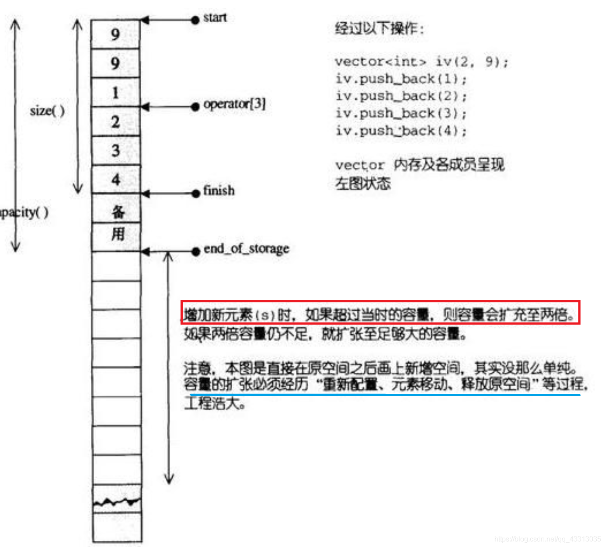

**注意**：动态增加大小，并不是在原空间之后接续新空间（因为无法保证之后尚有可供分配的空间），而是每次再分配原大小两倍的内存空间。因此，对vector的任何操作，一旦引起空间重新配置，指向原vector的所有迭代器就都失效了。

**vector中`push_back()`和`emplace_back()`的区别**

`push_back()`申请一片内存调用构造函数，之后调用移动构造函数将所有权转移至vector尾部。

`emplace_back()`只在vector尾部调用一次构造函数（就地构造）。

某些场景下获取到已经构造好的对象要添加进vector，两者的性能没有差距。

`emplace_back()`可以完全替代`push_back()`吗

不可以，`emplace_back()`是模板，参数需要进行推导，不可以调用隐式构造函数创建对象，而`push_back()`是函数，知道入参的类型，可以进行隐式转换。

```cpp
struct A{
	int a;
	int b;
};
vector<A> vec;
vec.emplace_back({1,2});//编译失败
vec.push_back({1,2});//编译成功
```

**vector中resize和reserve区别**

1. reserve增加了vector的容量，但是它的size并没有改变。resize改变vector容量的同时改变了size的大小
2. reserve是为容器预留空间，但在空间内并不创建真正的元素，所有在没添加新元素前，不能引用元素。resize是改变容器大小的同时创建对象，可以引用容器内的元素。
3. 两者的形式也是有差别的，reserve函数之后一个参数需要预留容器的空间；resize函数可以有两个参数，一个为容器大小，另一个是参数为要加入容器的新元素（可选）。

```cpp
void resize(size_type n, value_type val = value_type());

- 如果n<当前容器的size，则将元素减少到前n个，移除多余的元素(并销毁）
- 如果n>当前容器的size，则在容器中追加元素，如果val指定了，则追加的元素为val的拷贝，否则，默认初始化
- 如果n>当前容器容量，内存会自动重新分配


void reserve(size_type n)

- 如果n>容器的当前capacity，该函数会使得容器重新分配内存使capacity达到n
- 任何其他情况，该函数调用不会导致内存重新分配，并且容器的capacity不会改变
- 该函数不会影响向量的size而且不会改变任何元素

```

**vector进行扩容时是进行深拷贝还是移动构造**

如果vector中存放的对象中有移动构造函数，则进行移动构造，否则进行深拷贝。

**vector是线程安全的吗**

**vector不是线程安全的**。

原因一：对于vector来说，即使生产者单线程写入，但是并发读的时候，由于潜在的内存重新申请和对象复制问题，会导致消费者的**迭代器失效**。

原因二：内存读取异常，多线程同时读写操作时会导致容器内数据不一致。

解决方法：

1. 加锁，使用std::mutex互斥锁（性能较差），对于读多写少的场景可以用读写锁。

2. 使用无锁设计，常见的思路是CAS(compare and swap)和原子变量(atomic)

3. 可以固定vector的大小，避免动态扩容。即在开始并发读写之前给vector设置好大小。reserve函数。

**如何提高vector的并发性能**

1. vector不是线程安全的，所以在并发时需要避免读写冲突。使用锁编程（互斥锁或者读写锁）或者无锁编程（原子量）避免竞争，
2. 提前分配足够的空间以避免不必要的重新分配和复制周期
3. 尽量避免在vector前部插入元素
4. 插入元素的时候用`emplace_back()而不是push_back()`
5. 彻底释放vector内存时，使用swap而不是clear或者erase.（clear和erase不会减少vector的内存）,也可以使用clear+shrink_to_fit达到一样的目的。

vector正确释放内存：clear知识将size置为0，vector的capacity不变，即vector不会释放内存。

```cpp
vector<int> v{1,2,3};
vector<int>().swap(v);
```


###### **deque(双端队列)**

deque与vector的最大差异：

1. deque允许常数时间内对首端进行元素的插入和删除。

2. deque没有所谓的容量概念，因为它是以分段连续空间组合而成，随时可以增加一段新的空间并连接起来。中控器(map，不是STL中的map容器)保存一组指针，每个指针指向一段数据空间的起始位置，通过中控器可以找到所有的数据空间。如果中控器的数据满了，会申请一块更大的空间，并将中控器中的所有指针拷贝到新空间中。

3. deque不支持下标访问。

   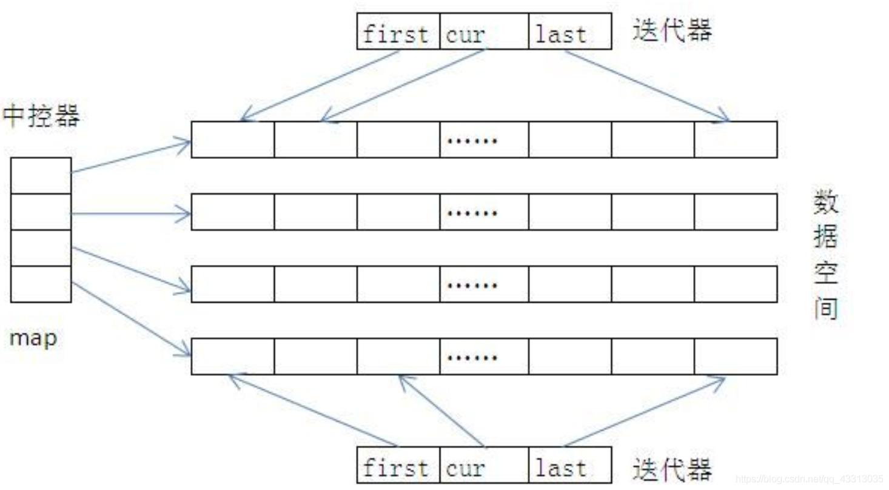

特点：

1. 数据结构：动态数组+双向链表。一种双向开口的存储空间分段连续的数据结构，每段数据空间内部是连续的，而每段数据空间之间则不一定连续。
2. deque的迭代器由四个属性组成：`cur`、`first`、`last`、`node`。`cur`指向实际访问的元素，[`first`,`last`）规定访问本区间的边界条件，`node`指向要map中访问该组元素的入口地址。deque迭代器：`start迭代器`,`finish迭代器`
3. deque迭代器失效情况:
   - 在deque容器首部或者尾部插入元素不会使得任何迭代器失效。
   - 在其首部或尾部删除元素则只会使指向被删除元素的迭代器失效。
   - 在deque容器的任何其他位置的插入和删除操作将使指向该容器元素的所有迭代器失效。

queue和stack底层实现是dequeue

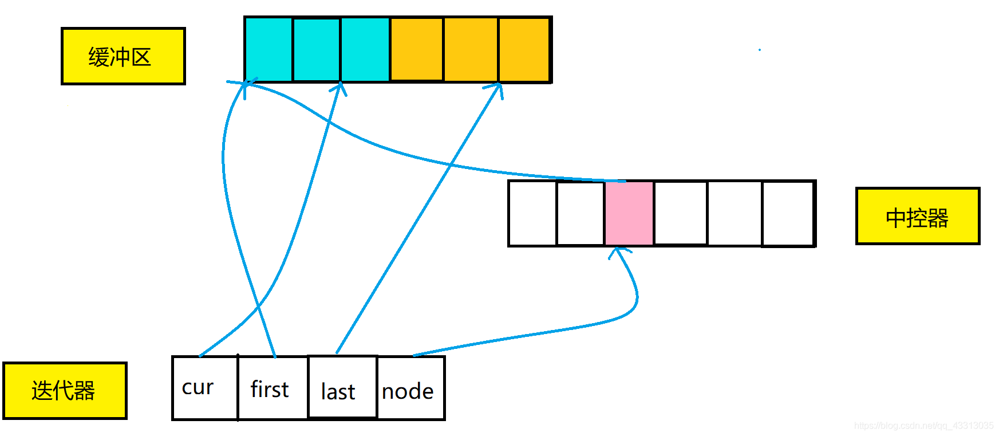

###### **list**

特点：

1. 有效利用空间。
2. 数据结构：环状双向链表
3. 在开头、末尾、中间任何地方增加或删除元素所需时间都为常量。
4. 插入(insert)和接合(splice)操作都不会造成原来list的迭代器失效。
5. 删除(erase)操作仅仅使指向被删除元素的迭代器失效，其他迭代器不受影响。
6. 随机访问速度慢

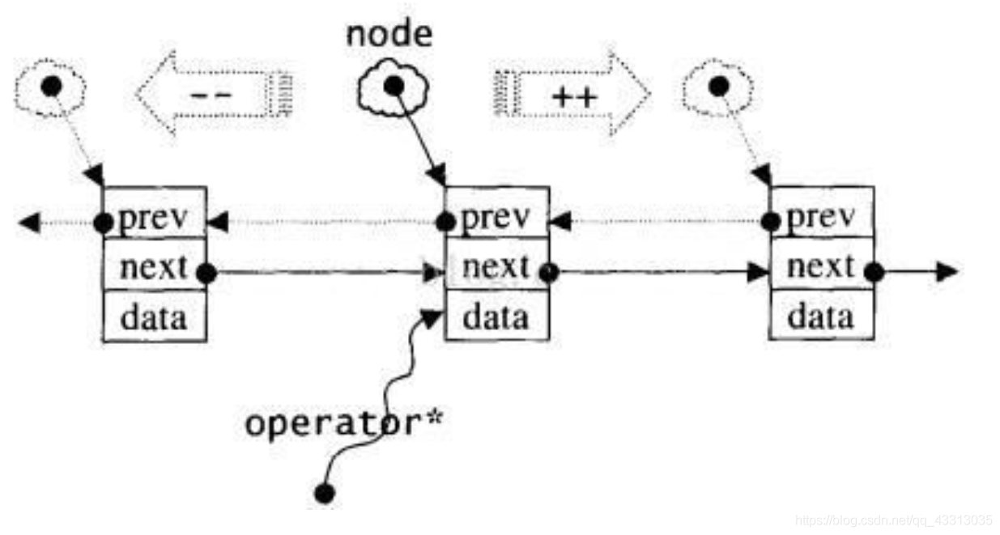

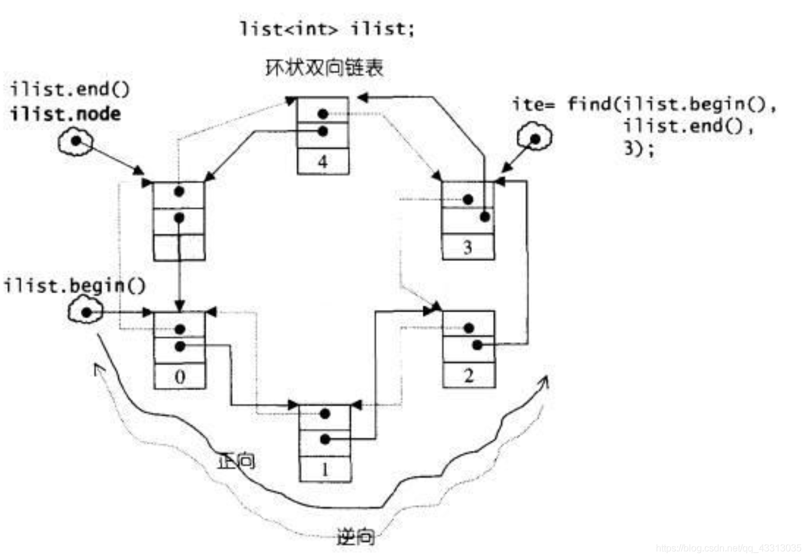

##### **关联容器**

###### **set**

特点：

1. 数据结构：底层使用平衡的搜索树——红黑树实现。
2. 增、删、查操作的时间复杂度为`O(logn)`
3. 插入删除元素仅仅需要指针操作节点即可完成，不涉及到内存移动和拷贝。
4. set中元素都是唯一的，而且默认情况下会对元素进行自动升序排列。
5. set内部元素也是以键值对的方式存储的，只不过它的键值相同，不允许修改键值。(迭代器被定义为const iterator)
6. 支持集合的交(set_intersection)叉(set_difference)并(set_union)，对称差(set_symmetric_difference)等一些集合上的操作。

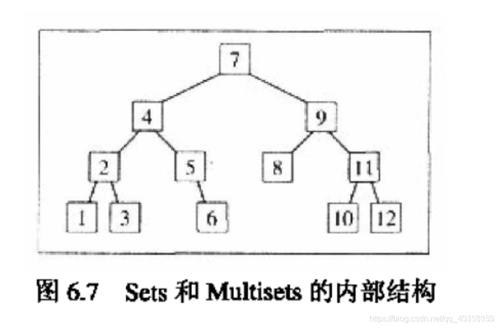

###### multiset

特点：

1. 数据结构：底层实现和set一样，也采用了红黑树。
2. 允许插入重复的键值，使用`insert_equal`机制.
3. 增、删、查操作的时间复杂度为`O(logn)`

###### map

特点：

1. 数据结构：红黑树(变体的平衡二叉树结构)

2. map中的key值是唯一的(重复插入则插入无效，可以通过`insert`返回的`pair`中第二个`bool`类型变量判断插入是否成功)，可以修改实值不能修改key。

   ```cpp
   pair<iterator, bool> insert(const value_type& x)
   ```

3. 增、删、查操作的时间复杂度`O(logn)`

###### multimap

特点：

1. 与map基本相似，不同之处`multimap`可以包含重复键
2. `multimap::insert()` 和`map::insert()`的返回值不同,`multimap::insert()`:返回指向新插入元素的迭代器（`multimap::insert()`总是能执行成功）


###### unordered_map、unordered_set

特点:

1. 数据结构：底层是通过**哈希桶**实现的，利用开链法解决哈希冲突的。
2. 内部是无序的，增、删、查操作的时间复杂度为`O(1)`,扩容时耗费时间（当哈希表中的元素的数量超过其容量的一定比例（负载因子），就会触发扩容操作，扩容操作需要新建一个更大的哈希表（通常是2倍），将原来的所有元素重新插入到新的哈希表中（重新哈希），并释放原有的哈希表空间，默认负载因子是0.75）
3. `unordered_set`不支持修改操作，每一个元素都是唯一的，修改可能会破坏哈希表。如果要修改元素可以删除该元素再插入新的值。

###### 如何解决哈希冲突

1. 线性探测法：遇到哈希冲突时，去寻找下一个新的空闲的地址存放。
2. 再哈希法：同时构建多个哈希函数，等发生哈希冲突时使用第二个哈希函数，直到不发生哈希冲突。
3. 开链法：将所有哈希地址相同的记录链接在同一链表中。
4. 建立公共溢出区：将哈希表分为基本表和溢出表，将发生哈希冲突的都存放在溢出表。

线性探测法优点：

1. 空间效率高，采用动态数组的结构，不需要维护额外的链表指针，节省空间内存。
2. 内存连续访问：空间连续存储有利于缓存命中，提升性能，查询速度快

线性探测法缺点：

1. 聚集现象：线性探测法同一发生聚集，即哈希表中连续槽位被占用的情况，导致查找、插入和删除的时间复杂度增加。
2. 删除操作复杂：线性探测法中删除元素比较复杂，需要注意处理删除后的聚集问题。
3. 装载因子限制：线性探测法的性能受到装载因子的影响，装载因子过高会导致冲突增多，性能下降。

开链法优点：

1. 简单易于实现，容易理解
2. 适用性广泛，适合于任何哈希函数和哈希表大小
3. 不会产生聚集：每个槽位都是一个链表，不会发生线性探测法中的聚集现象。
4. 装载因子灵活：可以调整链表长度和重新分配哈希表的大小来适应不同的装载因子。

开链法缺点：

1. 额外的空间消耗：需要为每个槽维护一个维护一个链表，导致额外的空间消耗
2. 内存访问不连续：大量随机IO导致无法命中缓存，影响性能。
3. 链表长度过长会导致哈希表退化成链，导致查找、插入、删除的时间复杂度增加。

开链法适用于装载因子较高且内存空间相对充裕的情况，而线性探测适用于空间敏感、装载因子较低的情况。

###### 如何解决哈希表退化成链

哈希表退化成链是因为产生哈希冲突的元素过多，在某些位置形成了过长的链表，导致哈希表性能下降。

产生原因：

1. 哈希函数设置不合理(导致哈希冲突发生)
2. 哈希表容量过小（无法容纳更多的元素，导致元素被挤压到一些位置上，形成链表）
3. 哈希表负载因子过大，没有及时动态扩容

解决方法：

1. 动态扩容，降低哈希表负载因子
2. 更换哈希函数，使得元素均匀的落在哈希表中
3. 拉链法和线性探测法结合使用。将哈希表中的元素分为两类，一类通过拉链法解决哈希冲突，一类通过线性探测法解决哈希冲突，


#### 设计模式有哪些

总体来说设计模式分为三大类：

**创建型模式**（对象创建的问题），共五种：**工厂模式**、**抽象工厂模式**、**单例模式**、建造者模式、原型模式。

**结构型模式**（类或对象组合的问题），共七种：适配器模式、装饰器模式、代理模式、外观模式、桥接模式、组合模式、享元模式。

**行为型模式**（类或对象之间交互的问题），共十一种：策略模式、模板方法模式、观察者模式、迭代子模式、责任链模式、命令模式、备忘录模式、状态模式、访问者模式、中介者模式、解释器模式。

其实还有两类：并发型模式和线程池模式。

总的设计原则：**开闭原则**（在程序需要进行拓展的时候不能去修改原有的代码，而是要扩展原有代码。）

##### 工厂模式

工厂模式(有简单工厂、工厂方法、抽象工厂3种细分方法)

工厂模式用来创建**不同但是相关类型**的对象（继承同一父类或者接口的一组子类），由给定的参数来决定创建哪种类型的对象。实际上，如果创建对象的逻辑并不复杂，可以直接通过new类创建对象。当创建逻辑比较复杂时，就考虑使用工厂模式，封装对象的创建过程，**将对象的创建和使用分离**。

工厂类负责根据客户端的需求创建不同类型的产品，并将创建的产品返回给客户端使用。客户端只需要向工厂类发送请求，并接收工厂类返回的产品，而不需要知道产品的具体创建细节。

简单工厂

简单工厂结构组成：

1. 工厂类：工厂模式的核心类，会定义一个用于创建指定的具体实例对象的接口
2. 抽象产品类：是具体产品类的继承的父类或实现的接口
3. 具体产品类：工厂类所创建的对象就是具体产品实例

简单工厂的缺点：扩展性较差，新增产品的需要修改工厂类，违反了设计模式的开闭原则（对扩展开放，对修改封闭）

举例:

```CPP
class Shoes{
public:
    Shoes(){};
    virtual ~Shoes(){};
    virtual void createShoes()=0;
};
class Adidas : public Shoes{
public:
    Adidas(){};
    ~Adidas(){};
    void createShoes(){
        std::cout << "create Adidas" << std::endl;
    }
};
class Nike : public Shoes{
public:
    Nike(){};
    ~Nike(){};
    void createShoes(){
        std::cout << "create Nike" << std::endl;
    }
};
enum SHOES_TYPE{
    NIKE,
    ADIDAS
};
class Fatory{
public:
    Shoes* creatShoes(SHOES_TYPE type)
    {
        switch (type)
        {
        case NIKE:
            return new Nike();
            break;
        case ADIDAS:
            return new Adidas();
        default:
            break;
        }
    }
};
```

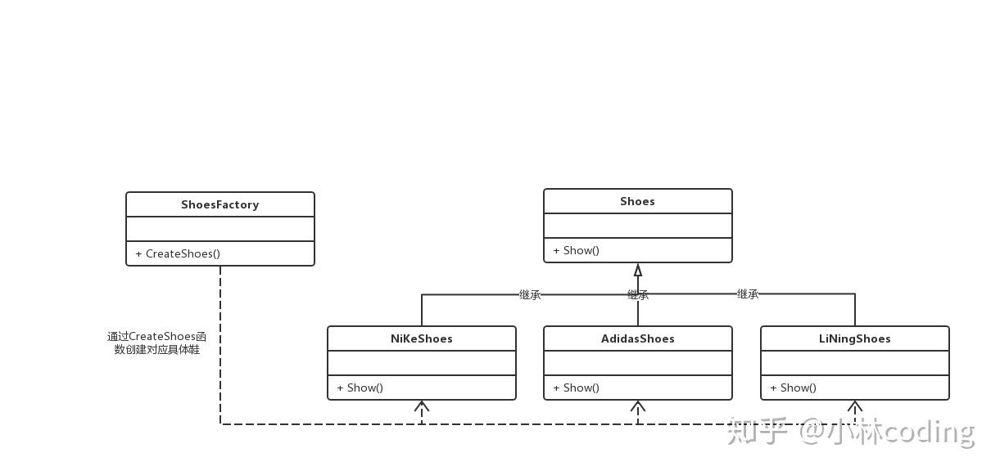

工厂方法

对简单工厂的改进，使用一个工厂接口，创建多个工厂类，每个工厂类负责创建对应的对象。一旦需要新增产品，直接增加新的工厂类。

工厂方法结构组成：

1. 抽象工厂类：工厂方法模式的核心类，提供创建具体产品的接口，有具体工厂类实现
2. 具体工厂类：继承于抽象工厂，实现创建对应具体产品对象的方式
3. 抽象产品类：产品继承的父类
4. 具体产品类：具体工厂创建的类的实例。

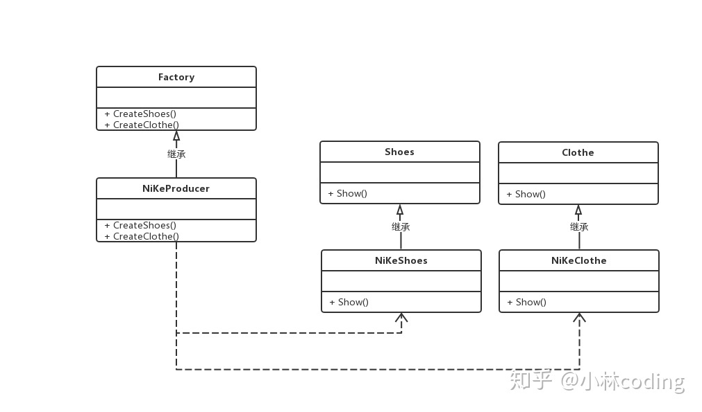

抽象工厂模式

围绕一个超级工厂创建其他工厂，每个工厂可以生成不同类型的产品。

抽象工厂组成：

1. 抽象工厂类：工厂方法模式的核心类，提供创建具体产品的接口，有具体工厂类实现
2. 具体工厂类：继承于抽象工厂，实现创建对应具体产品对象的方式
3. 抽象产品类：是具体产品的父类
4. 具体产品类：具体工厂创建的对象。


##### 单例模式

单例模式是在整个系统生命周期内，保证一个类只能产生一个实例，确保该类的唯一性。

为什么需要单例模式：为了确保线程安全。

> 什么是线程安全：
>
> 线程安全是指在拥有共享数据的多条线程并执行的程序中，线程安全的代码会通过同步机制保证各个线程都可以正常且正确的执行，不会出现数据污染等意外情况。
>
> 如何保证线程安全：
>
> 1. 给共享的资源加锁，保证每个变量每时每刻至多有一个线程占用。
> 2. 让线程也拥有私有资源，不去竞争共享资源。如使用`thread_local`

单例模式分为**懒汉式**和**饿汉式**，两者的区别在于创建实例的时间不同。

懒汉式：系统运行在实例并不存在，只有当需要使用该实例时，才会创建并使用实例。这种方式需要考虑线程安全。

优点：延迟实例化，需要时再实例化，避免了不必要的初始化和内存

缺点：多线程环境下会出现线程安全问题

```cpp
class LazySingleInstance{
public:
    static LazySingleInstance* getInstance()//注意：不能返回指针的引用，否则存在外部被修改的风险
    {
        if (_lazySingleInstance==nullptr)
        {
            _lazySingleInstance = new LazySingleInstance();
            
        }
        return _lazySingleInstance;
        
    };

private:
    LazySingleInstance(){/*构造函数*/};
    ~LazySingleInstance(){/*析构函数*/};
    LazySingleInstance(const LazySingleInstance &single){};
    const LazySingleInstance& operator=(const LazySingleInstance& single){};

private:
    static LazySingleInstance* _lazySingleInstance;
};

LazySingleInstance* LazySingleInstance::_lazySingleInstance = nullptr;
```

存在内存泄漏有两种解决方法：

1. 使用智能指针
2. 使用静态的嵌套类对象

存在线程安全问题解决方法：

**加锁实现线程安全**

```cpp
class LazySingleInstance{
public:
    static LazySingleInstance* getInstance()//设置位static的原因为getInstance为静态成员函数，不需类的初始化就可以调用
    {
        //这里使用两个if判断语句的计数称为双检锁
        //使用双检锁的目的是：避免多次初始化
        if (_lazySingleInstance==nullptr)//线程1和线程2同时到达，均通过_lazySingleInstance==nullptr判断
        {
            std::unique_lock<std::mutex> lock(_mutex);//线程1加锁，线程2被阻塞
            if(_lazySingleInstance==nullptr)//线程1发现_lazySingleInstance为空，初始化实例后释放锁。
                //线程2进入同步块，此时_lazySingleInstance已经被初始化。无法通过if语句，避免多次重复初始化，
            {
               _lazySingleInstance = new (std::nothrow) LazySingleInstance();  
            }
            
        }
        return _lazySingleInstance;
        
    };

private:
    LazySingleInstance(){/*构造函数*/};
    ~LazySingleInstance(){/*析构函数*/};
    LazySingleInstance(const LazySingleInstance &single){};
    const LazySingleInstance& operator=(const LazySingleInstance& single){};

private:
    static LazySingleInstance* _lazySingleInstance;
    static std::mutex _mutex;
};

LazySingleInstance* LazySingleInstance::_lazySingleInstance = nullptr;
std::mutex LazySingleInstance::_mutex;
```

**静态局部变量实现线程安全**

```cpp
class LazySingleInstance{
public:
    static LazySingleInstance* getInstance()
    {
        static LazySingleInstance* _lazySingleInstance;//静态局部变量
        return _lazySingleInstance;    
    };

private:
    LazySingleInstance(){/*构造函数*/};
    ~LazySingleInstance(){/*析构函数*/};
    LazySingleInstance(const LazySingleInstance &single){};
    const LazySingleInstance& operator=(const LazySingleInstance& single){};

};
```


饿汉式：系统一运行就初始化创建实例，需要时直接调用。这种方式线程安全，没有多线程线程安全问题。

饿汉式优点：适用于单例对象较少的情况，这样可以保证绝对线程安全，执行效率较高

缺点：所有类对象加载的时候就实例化。这样一来，如果系统中有大量的单例对象存在 。

```cpp
class HungrySingleton {
public:
    static HungrySingleton* getInstance() {
        return _hungrySingleton;
    }
private:
    static HungrySingleton* _hungrySingleton;

    HungrySingleton() {/*构造函数*/};
    ~HungrySingleton() {/*析构函数*/};
    // 将其拷贝构造和赋值构造成为私有函数, 禁止外部拷贝和赋值
    HungrySingleton(const HungrySingleton &signal){};
    const HungrySingleton& operator=(const HungrySingleton &signal){};
}
HungrySingleton*  HungrySingleton::_hungrySingleton = new HungrySingleton();
```


单例类特点：

- 构造函数和析构函数为私有类型，目的是禁止外部构造和析构。
- 拷贝构造和赋值构造函数是私有类型，目的是禁止外部拷贝和赋值，确保实例的唯一性。
- 类中有一个获取实例的静态方法，可以全局访问。调用这个方法时，如果类持有的引用不为空则返回这个引用，如果为空则创建该类的实例并返回引用。

单例模式应用场景：

- 需要生成唯一序列的环境
- 需要频繁实例化然后销毁的对象
- 创建对象时耗时过多或者耗资源过多，但又经常用到的对象
- 方便资源互相通信的环境

​    资源共享：当多个对象需要共享一个资源时，可以使用单例模式确保只有一个实例对该资源进行管理

​	配置处理：项目中的全局配置文件、环境参数对象等需要作为系统全局唯一实例。    

​	对象缓存：当需要缓存对象以提高性能时，可以使用单例模式。单例模式可以在内存中维护一个对象实例，避免频繁的创建和销毁对象，从而提高系统的响应速度。例如：一个图片加载器可以使用单例模式避免重复创建实例。

##### 适配器模式

适配器是是用来做适配的，将不兼容的接口转换为可兼容的接口，让原本由于接口不兼容而不能一起工作的类可以一起工作。适配器模式有两种实现方式：类适配器和对象适配器。其中，类适配器使用继承关系来实现，对象适配器使用组合关系来实现。


##### 观察者模式

观察者模式作用是当一个对象的状态发生变化时，能够自动通知其他关联对象，自动刷新对象状态。

观察者模式将观察者和被观察者解耦，观察者模式的应用场景非常广泛，小到代码层面的解耦，大到架构层面的系统解耦。实现方式有同步阻塞和异步阻塞。同步阻塞是最经典的实现方式，主要是为了代码解耦；异步阻塞除了能实现代码解耦外，还能提高代码的执行效率。

实现：

1. 提供一个抽象目标类：被观察的对象，抽象基本的属性状态及其他操作
2. 提供一个具体目标类：被观察对象的具体实现
3. 提供一个抽象观察者类：抽象观察者的具体的业务逻辑处理
4. 提供一个具体的观察者类：观察者的具体实现，得到通知后完成一些具体的业务逻辑处理。

```cpp
class Interview;
class Student{
public:
    Student(string name, Interview* inter):m_name(name),pintervirw(inter){};
    ~Student(){};
    void Update(string action)
    {
        cout << action << endl;
    }

private:
    Interview* pintervirw;
    string m_name;
};

class Interview{
public:
    Interview(){};
    ~Interview(){};
    void AddObserver(Student* stu)
    {
        observer.push_back(stu);
    }
    void SetState(string result)
    {
        state = result;
        Notify();
    }
    void Notify()
    {
        for(auto iter : observer)
        {
            iter->Update(state);
        }
        
    }
private:
    vector<Student*> observer;
    string state;

};
```

##### 责任链模式

责任链模式主要用于处理请求，将处理请求的对象连成链，每个请求处理者都有自己的处理权限。

责任链按照顺序将请求动态传递给一系列的潜在接收者， 直至其中一名接收者对请求进行处理

举例：一般请假按照时间长短不同需要跟不同级别的管理者请假，如果前面处理着成功处理就结束，如果不处理的话交给下一个处理者进行处理。

作用：避免请求的发送者和处理者之间的耦合关系。

应用场景：

1. 当程序需要不同方式处理不同种类的请求，而且请求类型和顺序预先未知时可以使用责任链模式。
2. 当必须按照顺序执行多个处理者时可以使用责任链模式
3. 如果所需处理者及其顺序必须在运行时进行动态改变。（动态插入和删除处理者）

#### C++面向对象/设计模式原则

七大设计原则：

1. 单一职责原则

   一个类应该仅有一个引起它变化的原因，变化的方向隐含着类的责任。通俗来将，一个类只负责一项职责

2. 开放封闭原则

   软件实体（类、模块、函数）对扩展开放，对更改封闭

3. 里氏转换原则

   当使用继承的时候，除添加新的方法完成新功能外，尽量不要修改父类方法。里氏转换原则重点在于不影响原功能，而不是不覆盖原方法。

   通俗来将就是：子类可以扩展父类的功能，但不能改变父类原本的功能。基类存在的地方，子类可以替换

4. 依赖倒置原则

   高层模块不应该依赖底层模块，二者都应该依赖于抽象。 实现尽量依赖抽象，不依赖具体实现。依赖倒置原则的核心时面向接口编程。

5. 接口隔离原则

   接口隔离原则的思想在于建立单一接口，尽可能地去细化接口，不应该依赖不需要的接口。

   应当为客户端提供尽可能小的单独的接口，而不是提供大的总的接口，接口应该小而完备。

6. 迪米特法则

   迪米特法则又称为最小知道原则，表示一个对象应该尽可能少的与其他实体发生互相作用。这样当一个模块修改时，就会尽量少的影响其他额模块，扩展相对容易。

   迪米特法则是对软件实体之间通信的限制，他对软件实体之间的通信的宽度和深度做出了要求：

   - 只与直接的朋友通信
   - 不要跟陌生人说话
   - 每个软件单位对其他的单位都只有最少的知识，而且局限于那些与本单位密切相关的软件单位。

   朋友的条件为：

   - 当前对象本身（this）
   - 被当作当前对象的方法的参数传入进来的对象
   - 当前对象的方法所创或实例化的对象
   - 当前对象的任何组件（被当前对象的实例变量引用的任何对象）

7. 组合/聚合原则

   要尽量使用组合/聚合达到复用，而不是继承关系达到复用目的。继承在某种程度上破坏了封装性，子类父类耦合度高。

   组合/聚合原则就是在一个新的对象里面使用一些已有的对象，使之称为新对象的一部分，新对象通过向这些对象的委派达到复用已有功能的目的。


#### 如何判断一段程序是由C编译器还是由C++编译器编译的

每种编译器编译程序时会有内置宏(预定义宏)，判断有无相应的预定义宏，在`main`函数中加入下面判断。

```c++
#ifdef __cplusplus
	cout << "C++";
#else
	cout << "C";
#endif
```

#### extern "C"的作用、使用方法

`extern "C"`的主要作用就是为了能够实现C++调用其他C语言代码，加上`extern "C"`后会提示编译器这部分代码按C语言进行编译。

使用场景：1. C++中调用C语言代码 2.多人写作开发，有人用C有人用C++ 3. C++头文件中使用

使用原因：由于C++支持函数重载，因此编译器编译函数过程中会将函数的参数类型也加到编译后的代码中，而不仅仅是函数名。而C语言不支持函数重载，因此C语言编译时函数不会带上参数类型，一般只包括函数名。C++底层的一些库也是C语言写的，需要C++中尽可能支持C，`extern "C"`就是其中的一个策略。

**使用方法**

一般在头文件中使用，表示该文件用C编译器编译

```C++
#ifdef __cplusplus //而这一部分就是告诉编译器，如果定义了__cplusplus(即如果是cpp文件， 
extern "C"{ //因为cpp文件默认定义了该宏),则采用C语言方式进行编译
#include"moduleA.h"
#endif
… //其他代码
 
#ifdef __cplusplus
}
#endif
```


#### 如何不用sizeof的情况下判断系统是32位还是64位

借助移位32位系统和64位系统的`long`类型字节数不同：

**不同平台整型字节长度区别**

| 平台/类型 | char | short | int  | long | long long |
| --------- | ---- | ----- | ---- | ---- | --------- |
| 16位      | 1    | 2     | 2    | 4    | 8         |
| 32位      | 1    | 2     | 4    | 4    | 8         |
| 64位      | 1    | 2     | 4    | 8    | 8         |

```cpp
#include <iostream>
using namespace std;

int main() {
	long ldTmp = 1L<<32;
	cout << "sizeof(long):" << sizeof(long) << endl;
	cout << "ldTmp:" << ldTmp << endl;
	if(ldTmp) {
		cout<<"64 bits"<<endl;
	} else {
		cout<<"32 bits"<<endl;
	}
}
```

#### 字符编码中ASCII、Unicode和UTF-8的区别

ASCII：ASCII是最早的字符编码标准，定义了128个字符的编码方式，包括英文字母、数字和一些符号。ASCII用7位二进制表示一个字符。

Unicode：是一种更加全面和复杂的字符编码标准，可以支持几乎所有的语言和字符集，使用16位二进制表示一个字符。缺点是编码长度较长，不利于存储、传输、和处理。

UTF-8：是一种以字节为单位对Unicode码进行编码的方法，可以保证兼容ASCII码。即ASCII字符使用一个字节，其他编码使用两个字节。优点是长度可变，节省空间。

GBK：GBK支持中文的编码方式。

#### 重复多次fclose关闭打开过的文件会有什么结果

文件指针已经失效，不再指向有效地文件对象，对已关闭的文件指针调用fclose可能会导致程序崩溃、内存错误或者其他未定义的行为(可能内存被分配给其他文件)。


#### sizeof函数数组、指针

sizeof原理：sizeof是在编译的时候，查找符号表，判断类型，然后根据基础类型来取值。

如果sizeof的参数是一个不定长数组，则需要在运行时计算数组长度。

```cpp
char *ptr;
char arr[10];
sizeof(ptr)=4;//32位编译器4个字节，64位编译器8个字节
sizeof(arr)=10；//数组10个字节
    
void fun(char arr[10])
{
	cout << sizeof(arr);//32位编译器4个字节，64位编译器8个字节
    cout << sizeof(*arr);//1个字节
}
```

#### 什么是类型安全，C++是类型安全的吗

类型安全很大程度上可以等价为内存安全，类型安全的代码不会试图访问自己没被授权的内存区域。类型安全是指同一段内存在不同的地方，会被强制使用相同的办法解释。

C++不是类型安全的，因为C++存在各种隐式转换和显式转换，不同类型的指针也可以进行强制转换（`reinterpret cast`）

例如：C++中我们可以将0作为false，非零作为true。一个函数即使是bool类型的，但是我们还是可以返回int类型的，并且自动将0转换成false，非零转换成true。

#### C++中常用的锁

线程之间的锁有：互斥锁、条件变量、自旋锁、读写锁、递归锁

条件变量一般用于同步问题，互斥量用于用于线程间互斥的机制，信号量可以用于线程间的互斥和同步。

##### 互斥锁（Mutex）

互斥锁用于控制多个线程对他们共享资源互斥访问的一个信号量。也就是为了避免多个线程在某一时间同时操作一个共享资源。

```cpp
#include<mutex>
std::mutex g_mutex;//初始化锁
g_mutex.lock();//上锁
g_mutex.unlock();//释放锁
```

这样可能会产生死锁问题，一般不这么使用，通常使用`lock_guard`自动加锁、释放锁。原理是RAII，和智能指针类似

```cpp
#include<mutex>
std::mutex g_mutex;//初始化锁
std::lock_guard<std::mutex> lock(g_mutex);// lock_guard 在构造函数里加锁，在析构函数里解锁

std::lock_guard<std::mutex> sbguard1(my_mutex1, std::adopt_lock);// std::adopt_lock标记作用；
//std::adopt_lock标记的效果就是假设调用一方已经拥有了互斥量的所有权（已经lock成功了）；通知lock_guard不需要再构造函数中lock这个互斥量了。
```

还有一种`unique_lock`可以取代mutex的lock()和unlock();`unique_lock`比`lock_guard`灵活很多（可以再需要的时候进行lock或者unlock调用，不非得是析构或者构造时），效率上差一点，内存占用多一点。

##### 条件变量

条件锁即条件变量，某一个线程因为某个条件未满足时可以使用条件变量更改程序处于阻塞状态。

一旦条件满足，以“信号量”的方式唤醒一个因为该条件而被阻塞的线程。

为了防止竞争，条件变量的使用总是和一个互斥锁结合在一起；通常情况下这个锁是std::mutex，RAII模板类管理。

```cpp
#include<condition_variable>
std::condition_variable cv;//初始化条件变量

//阻塞等待
wait()://阻塞当前线程，直到条件变量被唤醒
void wait(std::unique_lock<std::mutex>& lock);
//Predicate 谓词函数，可以普通函数或者lambda表达式
template< class Predicate >
void wait( std::unique_lock<std::mutex>& lock, Predicate pred );
//以上二者都被notify_one())或notify_all()唤醒，但是第二种方式是唤醒后也要满足Predicate的条件。
//如果不满足条件，继续解锁互斥量，然后让线程处于阻塞或等待状态。

wait_for();//阻塞当前线程，直到条件变量被唤醒，或到指定时限时长
template<class Rep, class Period>
std::cv_status wait_for(std::unique_lock<std::mutex>& lock, const std::chrono::duration<Rep, Period>& rel_time);
或
template<class Rep, class Period, class Predicate>
bool wait_for(std::unique_lock<std::mutex>& lock,const std::chrono::duration<Rep, Period>& rel_time,Predicate pred);

notify_all()/notify_one(); //唤醒
void notify_one() noexcept;//若任何线程在 *this 上等待，则调用 notify_one 会解阻塞(唤醒)等待线程之一。
void notify_all() noexcept;//若任何线程在 *this 上等待，则解阻塞（唤醒)全部等待线程。 但只有一个线程可以抢到锁，抢到锁的线程继续执行
```

`**notify_one()`和`notify()_all()`的使用**

`notify_one()`只会唤醒一个阻塞中的线程

`notify()_all()`唤醒所有阻塞中的线程，但只有一个线程可以抢到锁，拿到锁的先执行。

如果`notify()_all()`换成`notify_one()`，会在有些情况下导致并发不充分：假设再队列为空的情况下连续put几次，则只有一次put唤醒了一个take线程。如果之后的队列一直维护非空，则take线程们始终只有一个是活跃的。如果掉进陷阱的县城非常关键，则系统可能陷入活锁状态。

**总之，使用`notify()_all()`比较安全，但可能带来明显的效率下降**。

**虚假唤醒**

在正常情况下，wait类型函数返回时要么是因为被唤醒，要么是因为超时才返回，但是在实际中发现，多核处理器下由于操作系统的原因，wait类型在不满足条件时，它也会返回，这就导致了虚假唤醒。因此，我们一般都是使用带有谓词参数的wait函数，因为这种(xxx, Predicate pred )类型的函数等价于：
```cpp
while (!pred()) //while循环，解决了虚假唤醒的问题
{
    wait(lock);
}
```

[参考连接](https://blog.csdn.net/weixin_42108411/article/details/110138238)


##### 自旋锁

C++11可以用`std::atomic_flag`来创建自旋锁，`std::atomic_flag`有两个值true和false。

当一个线程尝试获取锁时，会在一个循环中不断检查`std::atomic_flag`的值，直到这个变量的值变为false。获取锁后将`std::atomic_flag`设为true，释放锁后设为false。

##### 信号量

（C++20才支持，C++11实现信号量用互斥锁和条件变量使用）

信号量其实是一个整形计数器，主要用于实现进程间的互斥与同步，而不是用于缓存进程间通信的数据。

两种原子操作：P操作信号量减1，V操作信号量加1。互斥：信号量为1，同步：信号量为0。

- *P 操作*：将 `sem` 减 `1`，相减后，如果 `sem < 0`，则进程/线程进入阻塞等待，否则继续，表明 P 操作可能会阻塞；
- *V 操作*：将 `sem` 加 `1`，相加后，如果 `sem <= 0`，唤醒一个等待中的进程/线程，表明 V 操作不会阻塞；

```cpp
class Semphore{

public:
    Semphore(int count=0):_count(count){}

    void signal()  //v操作：唤醒
    {
        unique_lock<mutex> lock(_mutex);
        ++_count;
        if (_count<=0)
        {
            _cv.notify_one();
        }
    }
    void wait()   //p操作：阻塞
    {
        unique_lock<mutex> lock(_mutex);
        --_count;
        while (_count<0)
        {
            _cv.wait(lock);
        }

    }
private:
    int _count;
    mutex _mutex;
    condition_variable _cv;
};
```

##### 读写锁

C++17开始，标准库提供了shared_mutex类（在这之前，可以使用boost的shared_mutex类或系统相关api）

`shared_mutex`通常用于多个读线程能同时访问同一资源而不导致数据竞争，但只有一个写线程能访问的情形。

```cpp
#include <shared_mutex>
#include <mutex> 
//写锁/排他性锁定
void lock();//通常不直接调用 lock():用 std::unique_lock 与 std::lock_guard 管理排他性锁定。
bool try_lock();//尝试锁定互斥。立即返回。成功获得锁时返回 true ，否则返回 false 
void unlock()//通常不直接调用 unlock() ：用 std::unique_lock 与 std::lock_guard 管理互斥锁定。
    
//读锁/共享锁定
void std::shared_mutex::lock_shared();//该函数获得互斥的共享所有权。通常不直接调用 lock_shared() ：用 std::shared_lock 管理共享锁定。
bool std::shared_mutex::try_lock_shared();//若成功获得锁则为 true ，否则为 false 
void std::shared_mutex::unlock_shared();//通常不直接调用 unlock_shared() ：用 std::shared_lock 管理共享锁定
```

C++14起，类 shared_lock 是通用共享互斥所有权包装器（unique_lock则是独占互斥所有权包装器）

```cpp
std::shared_lock<Mutex>::lock//等效于调用 mutex()->lock_shared();
std::shared_lock<Mutex>::try_lock//等效于调用 mutex()->try_lock_shared()。
std::shared_lock<Mutex>::unlock//等效于调用 mutex()->unlock_shared()
```

#### 线程池

线程池组成：工作线程队列、任务队列、提交任务函数。

任务队列存放主线程需要处理的任务，工作线程队列其实是一个死循环，负责从任务队列中读取和运行任务，可以看成是单生产者多消费者模型。

线程池应用场景：Socket网络编程、处理异步任务（如图像处理、音视频处理）、高性能计算、日志系统

线程池实现： 

```cpp
#include<iostream>
#include<vector>
#include<thread>
#include<mutex>
#include<condition_variable>
#include<queue>
#include<functional>
#include<chrono>

using namespace std;
//需要一个任务队列 ， 线程池， 锁， 条件变量 线程池停止标志位
template<typename Task>
class ThreadPool{
public:
    ThreadPool(size_t thread_nums){
        for (size_t i = 0; i < thread_nums; i++)
        {
            m_threads.emplace_back([this](){
                for (;;)
                {
                    Task task;
                    {
                        std::unique_lock<std::mutex> lock(m_mutex);
                        m_cv.wait(lock,[this](){return m_stop || !m_tasks.empty();});
                        if (m_stop && m_tasks.empty())
                        {
                            return;
                        }
                        task = std::move(m_tasks.front());//转移所有权，不涉及内存的搬迁和拷贝
                        m_tasks.pop();//将对应内存上的数据弹出
                        
                    }
                    {
                    std::unique_lock<std::mutex> lock(m_mutex);
                    task();
                    }

                    
                }
                
            });
        }
    }

    ~ThreadPool(){
        {
            std::unique_lock<std::mutex> lock(m_mutex);
            m_stop = true;
        }
        m_cv.notify_all();
        for (size_t i = 0; i < m_threads.size(); i++)
        {
            m_threads[i].join();
        }
    }

    void submit(Task task){
        {
            std::unique_lock<std::mutex> lock(m_mutex);
            if (m_stop)
            {
                throw std::runtime_error("submit on a stopped threadpool");
            }
            m_tasks.emplace(task);
        }
        m_cv.notify_one();
    }


private:
    std::vector<std::thread> m_threads;
    std::queue<Task> m_tasks;
    std::mutex m_mutex;
    std::condition_variable m_cv;
    bool m_stop=false;

};


int main(int argc, char const *argv[])
{
    ThreadPool<std::function<void(void)>> threadpool(4);
    cout << std::this_thread::get_id()<<endl;
    for (int i = 0; i < 1000; i++)
    {
        threadpool.submit([i](){cout << "任务" << i <<"运行在"<< std::this_thread::get_id() <<endl;});
    }
    std::this_thread::sleep_for(std::chrono::seconds(5));

    return 0;
}

```

存在问题：

生产者线程向队列中push数据，消费者线程从队列中pop数据。因此存在多线程资源竞争问题，因此必须考虑要做保护，简单操作就是加互斥锁。在实际运行代码时会发现CPU占用过高的问题，原因在于消费者线程不止一个，会频繁地判断队列是否为空，导致CPU做无用功。

提出优化策略：

改用条件变量实现，不让消费者线程取频繁判断队列是否为空，当队列中有数据是调用`notify()_all()`唤醒阻塞中地消费者线程。


#### 所有的运算符都能重载吗

在C++运算符集合中，有一些运算符是不允许被重载的。这种限制是处于安全方面的考虑，可防止错误和混乱。

1. 不能改变C++内部数据类型（如int、float等）的运算符。
2. 不能重载`.`,因为`.`在类中对任何成员都有意义，已经成为标准用法。
3. 不能重载目前C++运算符集合中没有的符号，如`#`、`@`、`$`等。原因有两点，一是难以理解，二是难以确定优先级。
4. 对已经存在的运算符进行重载时，不能改变其优先级规则，否则将引起混乱。

#### [C++中=default和=delete的作用](https://blog.csdn.net/weixin_38339025/article/details/89161324)

C++11允许添加`=default`到函数声明的末尾，以将该函数声明为显式默认构造函数。（**默认构造函数就是在调用时不需要显式地传入实参的构造函数**）

C++中约定如果一个类中自定义了带参数的构造函数，那么编译器就不会再自动生成默认构造函数，也就是说该类将不能默认创建对象，只能携带参数进行创建一个对象。

```cpp
class A{
	A(int x){cout<<"This is a parameterized constructor";}
	A()=default;//将A()声明为默认构造函数
}
----------------------------------------------------------
class A
{
public:
    A() = default;

    A(int B) {
    b = B；
    };
 
private:
	int b;
};
// 定义一个默认的对象
A a；
//如果没有A() = default; 那么就会报错，或者需要你手动实现一个A() { b =0;}。
```

**`=delete`**

在C ++ 11之前，操作符delete 只有一个目的，即释放已动态分配的内存。而C ++ 11标准引入了此操作符的另一种用法，即：**禁用成员函数的使用**。这是通过附加= delete来完成的; 说明符到该函数声明的结尾。

使用’= delete’说明符禁用其使用的任何成员函数称为**expicitly deleted函数。**通常针对隐式函数

**禁用拷贝构造函数**

```cpp
// copy-constructor using delete operator 
#include <iostream> 
using namespace std; 
  
class A { 
public: 
    A(int x): m(x) { } 
    // Delete the copy constructor 
    A(const A&) = delete;      
    // Delete the copy assignment operator 
    A& operator=(const A&) = delete;  
    int m; 
}; 
  
int main() { 
    A a1(1), a2(2), a3(3); 
    // Error, the usage of the copy assignment operator is disabled 
    a1 = a2;   
    // Error, the usage of the copy constructor is disabled 
    a3 = A(a2);  
    return 0; 
} 
```

**禁止不需要的参数转换**

```cpp
// type conversion using delete operator 
#include <iostream> 
using namespace std; 
class A { 
public: 
    A(int) {} 

    // Declare the conversion constructor as a  deleted function. Without this step,  
    // even though A(double) isn't defined,  the A(int) would accept any double value
    //  for it's argumentand convert it to an int 
    A(double) = delete;  
}; 
int main() { 
    A A1(1); 
    // Error, conversion from  double to class A is disabled. 
    A A2(100.1);  
    return 0; 
} 
```

**明确删除函数有什么好处**

删除特殊成员函数提供了一种更简洁的方法来防止编译器生成我们不想要的特殊成员函数。（如“禁用拷贝构造函数”示例中所示）。
删除正常成员函数或非成员函数可防止有问题的类型导致调用非预期函数（如“禁用不需要的参数转换”示例中所示）。


#### 并发相关问题

**可见性问题**

多个CPU有各自的缓存区域，而且彼此之间无法互相感知，当一个CPU对共享数据进行修改之后，其他CPU不知道内容已经被修改，还是从自己缓存区中读取旧的数据。解决这个问题的根本是需要一种机制来保证一个CPU修改了内存数据后其他CPU缓存可以感知到，就可以保证各个缓存之间的数据一致性。

解决方法是使用`volatile`关键字。

##### 进程之间同步方式

信号量、互斥量、管程、进程间通信

##### 线程间同步方式

信号量、互斥量、临界区、事件(event)、条件变量

##### 多线程编程注意事项/原则

1. 对于CPU开销大的场景，能利用多核就尽量利用多核。
2. 使用多线程的时候，默认是加锁的。在加锁保证业务正常的条件下再考虑锁带来的性能损耗。互斥锁<读写锁<自旋锁<无锁（原子操作）
3. 减少线程间的相关性，减少线程间的同步。线程间共享变量<线程内变量<函数式编程（没有变量）
4. 尽量减少锁的粒度。a.减少加锁的代码段（减少加锁的时间） b.分成多个锁，减少竞争。

##### 无锁编程

无锁编程：就是不使用锁的情况下实现多线程之间的**变量同步**，也就是在没有线程被阻塞的情况下实现变量同步，也叫做**非阻塞同步**。

**原子操作**时多数无锁编程的前提。原子操作可以保证指令以原子的方式执行，执行过程不被打断。

对共享变量使用原子操作的规则：

任何时刻，只要存在两个或多个线程并发地对同一个共享变量进行操作，并且这些操作中地其中一个是执行了写操作，那么所有的线程都必须使用原子操作。

C++11中有`atomic`库来保证对一些变量的操作是原子的。

CAS（compare-and-swap）也能够保障原子操作，比较修改后提交前值有没有发生变化。

```txt
CSA会产生ABA问题，改变后又变回来，解决方法是加上版本号或者时间戳
```

C++无锁队列怎么实现的

无锁队列是一种多线程编程技术，可以在不使用锁的情况下实现线程安全的队列，提高线程并发读写的性能。

C++实现无锁对队列通常使用原子操作和CAS来实现线程安全。

CAS是一种原子指令，它在执行时需要指定要修改的内存位置和期望值，如果内存位置的值与期望值相等，则将其设置为新值，否则不做任何操作。

原子操作可以实现多种操作，CAS 只能实现单个操作。
原子操作可以实现多种操作，如加减、位运算、赋值等，可以根据具体需求来选择操作。CAS只能实现单个操作，如赋值操作。

原子操作的实现方式更多样化，CAS 的实现方式相对单一。
原子操作可以通过多种方式来实现，如自旋锁、互斥锁、信号量等，可以根据具体需求来选择实现方式。CAS 的实现方式相对单一，主要是通过 CPU的指令来实现。

##### 指令重排序

**什么是指令重排序/为什么会进行指令重排序**：

为了对性能的优化，CPU的运行效率相比缓存、内存、磁盘IO之间的效率有着指数级的差别。CPU作为宝贵的计算资源需要得到更好的利用，指令重排序能够在保证不改变单线程语义的情况下对指令进行重排提高效率，比如IO等待时CPU执行其他的指令。

**指令重排序有原则**：

重排序后不会改变单线程执行程序的结果。

**指令重排序三种场景**：

1. 编译器重排序

   针对程序代码而言，编译器可以在**不改变单线程程序语义**的情况下，可以对**代码语句顺序进**行调整重新排序。

2. 指令集并行的重排序

   针对CPU指令级别来说，处理器采用了指令集并行技术来将多条指令重叠执行，如果不存在**数据依赖性**，处理器可以改变语句对应的**机器指令执行顺序**。

3. 内存重排序

   由于处理器使用**缓存**和读写**缓冲区**，使得加载和存储操作看上去可能是在乱序执行。

**如何解决多线程下指令重排序的问题**：

采用内存屏障，使用`volatile`关键字，在`volatile`生成的指令前后插入内存屏障(Memory Barries)来禁止处理器重排序。

##### 线程安全和函数可重入

线程安全：多个线程并发执行同一段代码是，不会出现错误的结果。非线程安全可以通过加锁或者原子操作来实现线程安全。

可重入：重入表示可以重复进入，意味着这个函数的运行过程是可以被中断的，并且该函数除了使用自己栈上的变量外不依赖任何全局的数据（包括static），可以允许有该函数的多个副本在运行，由于它们使用的都是各自的栈空间，所以互相不会干扰。

可重入函数任何时候都可以被中断，中断返回后继续运行，相应的数据不会丢失或改变。可重入函数若只使用局部变量，即保存在CPU寄存器或者栈中，如果使用的是全局变量，则要对全局变量予以保护。

不可重入的特点:

1. 调用了malloc/free函数，因为malloc函数是用全局链表来管理的
2. 调用了标准I/O函数，标准I/O库的很多实现都以不可重入的方式适用全局数据结构。
3. 函数内使用了静态数据结构。

函数线程安全和可重入的关系：可重入函数是线程安全的，线程安全的函数不一定是可重入函数。

可重入函数与线程安全函数的区别：

1. 线程安全不一定可重入，可重入一定线程安全
2. 线程安全一定是多个线程引起的，可重入函数可以在单线程下发生
3. 若一个函数中存在全局变量，那么这个函数既不是线程安全也不是可重入的

##### Linux线程退出、资源回收的方法

**线程需要回收的内容**

1. 子线程创建时从父线程copy出来的栈内存

2. 子线程内部单独请求的堆内存(malloc、realloc、calloc)和锁资源mutex。

   意外情况下：一旦有处于挂起状态的取消请求（即加锁之后，解锁之前），线程在执行到取消点如果只是草草收场，这会将共享变量置于不一致的状态，可能导致其他线程产生错误、死锁、甚至程序崩溃。（最近常出现的情形时资源独占锁的使用：线程为了**访问临界共享资源而为其加上锁**，但在访问过程被外界取消，或者发生了中断，则该临界资源将永远处于锁定状态得不到释放。）

   为避免这种问题：使用清理函数`pthread_cleanup_push()`或者`pthread_cleanup_pop()`来处理，这两个函数必须成对出现，不然会编译错误。

**线程回收的方法**

线程退出方式有多种：`return`、`pthread_exit`、`pthread_cancel`等。

线程分为可结合的`joinable`、分离的`detached`两种（默认是joinable，如果是detached则需要在创建时指定线程属性为`PTHREAD_CREATE_DETACHED`）。**可结合的线程在退出后不会立刻释放资源，需要调用`pthread_join`来显式结束线程。分离的线程在线程退出时系统会自动回收资源。**

1. 系统自动释放

   将线程设置为detach，将其与主线程分离。

   ```c
   pthread_t t;
   pthread_attr_t a; //线程属性
   pthread_attr_init(&a);  //初始化线程属性
   pthread_attr_setdetachstate(&a, PTHREAD_CREATE_DETACHED);      //设置线程属性
   pthread_create( &t, &a, GetAndSaveAuthviewSDRStub, (void*)lp);                   //建立线程
   ```

2. 由父进程进行释放

   - 子进程使用`return`退出后，主进程调用`pthread_join`阻塞等待进程结束并释放线程占用的资源。
   - 子进程使用`pthread_exit`退出后，主进程使用`pthread_join`接收`pthread_exit`的返回值，并回收线程
   - 主线程调用`pthread_cancel`，然后调用`pthread_join`回收线程


#### 进程API(Linux)

##### fork函数

`fork()`函数作用是创建一个新的进程，新进程和当前进程几乎一模一样。创建后这两个进程都会继续运行。

如果创建成功：在子进程中返回0，父进程中返回子进程的pid号。

`fork`函数最常用的用法是创建一个新的进程，然后调用`exec()`执行新的程序。


##### wait系统调用

编程过程中，最常见的是父进程等待自己的子进程，或者父进程回收自己的子进程资源。

进程等待的作用：

- 父进程在它的执行代码中调用进程等待的方法，等待子进程退出，防止子进程变成僵尸进程;
- 也就是说，进程等待是父进程调用某个接口进行等待，父进程等待子进程退出回收子进程的资源，防止子进程变成僵尸进程

进程等待的方法：`wait`函数和`waitpid`函数

```cpp
pid_t wait(int* status)
pid_t waitpid(pid_t pid, int* status, int options)
形参是一个指针类型，但是该指针类型并不是要传递一个指针参数，而是输出型参数
将wait函数内部计算的某个结果通过status变量返回给调用者  
options:
   0:阻塞模式，如果waitpid没有等到子进程退出，那么就陷入waitpid内部阻塞
   WNOHANG:非阻塞模式，不管子进程是否退出。如果子进程退出，那么waitpid等待子进程结束，然后返回。如果子进程没有退出，该模式下直接退出并返回，执行其他语句。（非阻塞模式下需搭配循环使用）
编码时规范：
如果是输入型，参数定义成引用
如果是输出型，参数定义成指针
```

进程一旦调用了wait就会阻塞自己，由wait分析当前进程中的某个子进程是否已经退出，如果找到这样一个已经变为僵尸的进程的子进程，wait就会收集这个子进程的信息，并将它彻底销毁后返回。如果没有找到就会一直阻塞。

##### clone函数

函数作用：clone函数允许用户指定子进程继承或者拷贝父进程的某些特定资源，如信号量、文件描述符、文件系统、内存等内容。

```cpp
int clone(int (*fn)(void *), void *child_stack, int flags, void *arg, ... /* pid_t *ptid, struct user_desc *tls, pid_t *ctid */ );
```

1）fn 新创建进程的入口函数；

2）clid_stack 子进程栈空间的起始地址；

3）arg 传递给子进程的参数，需要和CLONE_SETTLS一起使用

4）ptid 存储父进程的pid，需要和CLONE_PARENT_SETTID一起使用

5）tls (Thread Local Storage) descriptor，需要和CLONE_SETTLS一起使用

6）ctid 存储子进程的pid，需要和CLONE_CHILD_SETTID选项一起使用

3）flag 创建进程的属性

clone和fork区别：

clone允许新创建的进程共享调用它的进程（通常为父进程）的部分资源，比如内存空间、文件描述符表、信号量等，具体需要共享哪些内容可以通过clone的flag参数设置。

fork创建的子进程可以看成是父进程的完全拷贝，而clone是有选择性的拷贝。

##### exec族函数

函数族所用：调用exec族函数可以使进程执行另外一个程序。

通常使fork创建一个新进程后，调用exec函数执行另外一个程序。

应用：

1. 网络服务进程中父进程等待客户端的请求。收到一个请求后父进程调用fork创建子进程，调用exec执行任务处理的程序。父进程继续等待。
2. shell脚本。执行语句后创建一个新的进程执行对应的程序，父进程继续等待下一个命令的输入。

```cpp
#include<unistd.h>
int execl(const char *path, const char *arg, ...)
int execv(const char *path, char *const argv[])
int execle(const char *path, const char *arg, ..., char *const envp[])
int execve(const char *path, char *const argv[], char *const envp[])
int execlp(const char *file, const char *arg, ...)
int execvp(const char *file, char *const argv[])
```

`path`参数表示你要启动程序的名称,包括路径名;

`arg`参数表示启动程序所带的参数，一般第一个参数为要执行命令名

返回值:成功返回0,失败返回-1

##### 僵尸进程/孤儿进程

正常情况下：子进程由父进程创建，子进程再创建新的进程。父子进程是一个异步的过程，父进程永远无法预测子进程的结束，所以当子进程结束后，它的父进程会调用wait或者waitpid取得子进程的终止状态，回收子进程的资源。

僵尸进程：子进程退出了，但是父进程没有用wait或者waitpid去获取子进程的状态信息，那么子进程的进程描述符仍然保存在系统中，这种进程称为僵死进程。

孤儿进程：父进程结束了，而它的一个或多个子进程还在运行，那么这些子进程就成为孤儿进程。子进程的资源回收由init进程(进程号pid=1)进行。

（孤儿进程是没有父进程的进程，由init进程循环的wait回收资源，init进程充当父进程，因此孤儿进程没有什么危害）

僵尸进程的危害：

unix提供了一种机制保证父进程知道子进程结束时的状态信息。

该机制：在每个进程退出的时候，内核会释放所有的资源，包括打开的文件，占有的内存等。但是仍保留一部分信息（进程号PID，退出状态，运行时间等）。直到父进程调用wait或者waitpid后才释放。

这样就存在一个问题，如果父进程不调用wait或者waitpid的话，那么保留的信息就不会被释放，其进程号就一直被占用称为僵尸进程。系统使用的进程号是有限的，如果产生大量的僵尸进程，将有可能导致没有可用的进程号而无法创建新进程。

如何解决僵尸进程：

1. kill杀死父进程(一般不用)

   严格来说僵尸进程不是问题的根源，罪魁祸首是产生大量僵尸进程的父进程。因此可以杀掉父进程，使其变为孤儿进程，由init进程来进行回收

   `kill -9 pid`只会杀死父进程，子进程还在，需要在进程号前加上`-`会杀掉进程组`kill -9 -pid`

2. 父进程用wait或者waitpid来回收资源（方案不好）

   父进程通过wait或者waitpid等函数去等待子进程结束，会导致父进程一直被挂起，相当于只有子进程在干活，没有起到多进程的作用

3. 通过信号机制，在处理函数中调用wait，回收资源

   通过信号机制，子进程在退出时向父进程发送`SIGCHLD`信号，父进程调用`signal(SIGCHLD,sig_child)`去处理`SIGCHLD`xinhao ,在信号处理函数中调用wait回收子进程。什么时候得到子进程信号，什么时候去处理，父进程不用阻塞等待。

Linux如何查看一个进程的pid号

1. ps -aux | grep 进程名称  //aux参数表示列出系统所有用户的所有进程
2. top | grep 进程名称 //top命令可以实时查看Linux系统中的所有进程

#### 线程API(Linux)

##### 创建线程`pthread_create`

头文件`#include<pthread.h>`

```cpp
int pthread_create(pthread_t *thread, const pthread_attr_t *attr, void *(*start_routine) (void *), void *arg);
thread：传出参数，用于获取现成的ID
attr：设置线程的属性，通常为默认值NULL
start_routeine：函数指针，线程开始执行的函数
arg：传递给线程的参数
返回值：创建成功返回0，失败返回出错编号。
```

**类成员函数如何作为`pthread_create`的线程函数**

类的普通成员函数由于`this`指针的问题，不能作为`pthread_create`的线程参数，如果要作为`pthread_create`的线程参数，必须是**static**。

C++通过传递一个指向自身的隐式指针this给其成员函数从而实现程序函数可以访问C++的数据成员。C++多个实例可以共享成员函数，但数据成员不同。

this指针和线程函数参数`(viod*)`不匹配。

##### 线程退出`pthread_exit`

```cpp
void pthread_exit(void *value_ptr);//线程内部调用该函数用于退出当前线程
value_ptr：用于将线程中的值传递出去
```

##### 线程回收`pthread_join`

```cpp
int pthread_join(pthread_t thread, void **value_ptr);//线程外部调用 阻塞等待id为thread的线程退出
pthread_t thread 回收的线程id
void **value_ptr 传出参数，可以通过该参数获取线程退出时状态，不需要时可以设置为NULL
```

##### 线程分离`pthread_detach`

```cpp
int pthread_detach(pthread_t thread);
除非线程是被分离了的，否则在线程退出时，它的资源是不会被释放的，需要调用pthread_join回收（注意：进程结束后，占用的资源全部会被释放的）。
调用该函数分离线程，子线程主动与主线程断开关系，线程结束后，其退出状态不能由其他线程获取，而自己自动释放资源，多用于网络、多线程服务器。
返回值 成功0，失败错误码
```

##### 线程取消`pthread_cancel`

```
int pthread_cancel(pthread_t thread);
thread 取消的线程id
该函数不阻塞调用点成，发出取消线程后就返回了，类似于进程中的kill函数。
但调用该函数时，并非一定能取消该线程，因为这个函数需要线程进到内核时才会被杀掉，所以线程如果一直运行于用户空间，就没有契机进入内核被取消。
返回值：成功0，不成功返回错误码
```


#### 指针相关问题

##### `int *p[10]`与`int (*p)[10]`的区别

`int *p[10]`是一个有十个指针的**数组**，`sizeof(p)=40`

`int (*p)[10]`是一个指向十个整型数据数组的**指针**,`sizeof(p)=4`


##### `int *p(int)`和`int (*p)(int)`的区别

`int *p(int)`是一个函数，该函数有一个整型参数，返回值是一个指向整型的指针。

`int (*p)(int)`是一个函数指针，该函数有一个整型的参数，返回值为整数类型


##### 函数指针和指针函数区别

**函数指针**

函数名代表函数的入口地址，我们可以通过一个指针变量来存放这个入口地址，然后通过指针变量调用函数。

**函数指针就是指向函数的指针变量**。因此函数指针本身首先应是指针变量，只不过指针指向函数。在编译时每一个函数都有一个入口地址，该入口地址就是函数指针所指向的地址。`int (*fun)(int x, int y)`

函数指针有两个**用途**：调用函数和做函数的参数。比如C语言可以通过函数指针实现C++中的多态。

函数指针用法

```c
#include <stdio.h>
#include <stdlib.h>
 
int (*pfun)(int x, int y);
int add(int x, int y)
{
	return x+y;
}
int sub(int x, int y)
{
    return x-y;
}
int main(int argc,char *argv[])
{
    
	pfun = add;
    printf("1+2=%d",(*pfun)(1,2));
	pfun = sub;
    printf("1-2=%d",(*pfun)(1,2));
     
	return 0;
}
```


**指针函数**

指针函数是一个函数，**返回类型为指针**。`int* fun(intx, inty)`

##### 回调函数

回调函数是一种特殊的函数，它作为参数传递给另一个函数，并在被调用函数执行完毕后被调用。回调函数通常用于事件处理、异步编程和处理各种操作系统和框架的API。

使用回调函数的作用是：

1. 将代码逻辑分离出来，使得代码更加模块化和可维护
2. 避免阻塞程序的运行，提高程序的性能和效率。
3. 实现代码的复用，可以被多个地方调用。

回调函数使用场景：

1. 事件处理：回调函数可以用于处理各种事件，例如鼠标点击、键盘输入、网络请求等，
2. 异步操作：回调函数可以用于异步操作，例如读取文件、发送邮件、下载文件等。QT中的信号和槽是使用回调函数的方式进行的。
3. 数据处理：回调函数可以用于处理数据，例如对数据进行排序、过滤、映射等

回调函数的实现：

```txt
通过函数指针或者函数对象来实现。
```

#### assert作用

头文件`#include<assert.h>`

程序分为release版本和debug版本，assert断言仅在debug版本下有效。主要作用是对一个bool表达式进行检查，若程序正常运行那么这个bool表达式值为true，如果表达式值为false，说明程序已处于不正确的状态，系统会提示警告信息并退出程序。

使用assert的缺点是，频繁的调用会极大的影响程序的性能，增加额外的开销

断言assert使用规则：

1. 每个assert只检验一个条件，因为同时检验多个条件时，如果断言失败无法直观判断哪个条件失败
2. 不能使用改变变量的语句，仅使用判断
3. 可以放在函数参数的入口处检查传入参数的合理性

assert 的**应用范围**很多，主要包括1、检查控制流；2、检查输入参数是否有效；3、检查函数结果是否有效；4、检查程序不变量

```c
#include <stdio.h>
#include <assert.h>
int main(void)
{
   int  i;
   i = 1;
   assert(i++);
   printf(“%d\n”,i);
   return 0;
}
```


#### C++函数调用过程

调用函数时，编译器会先将当前函数的运行状态压栈，再将调用函数的返回地址，传递实参从右到左依次压栈。接着使用call指令调用子函数。

出栈时，局部变量最先出栈，然后是参数，最后栈顶指针指向最开始存的指令地址。


#### C++临时变量作为返回值处理过程

临时变量在函数调用过程中进栈，函数退出时，临时变量出栈，即临时变量已经被销毁，临时变量占用的空间没有被清空，有可能被分给其他变量，所以在函数退出过程中该内存已经被修改了，这个临时变量已经没有任何意义了。

退出过程中临时变量返回值存放在寄存器中，并没有存放在堆或栈中。


#### 类和类之间的关系

一个项目中的类与类之间的关系通常使用UML类图表现出来。

1. 泛化（继承）

​	C++中两个类之间最重要的关系，表示is-a的关系。

​	举例：动物类作为基类，老虎类继承自动物类。老虎不但有动物的一切特征同时还有自己的特征

​	代码体现：继承

2. 组合

​	组合关系：整体与局部的关系，更强调的是具备相同的生命周期，具有很强的耦合关系，表示contains-a关系

​	比如：老虎和虎皮的关系。只要有老虎就有虎皮，老虎没了也就没有虎皮了

3. 聚合

​	聚合关系：整体和局部的关系，成员对象是整体的一部分，但是成员对象可以脱离整体对象存在。

​	比如：森林与植物、动物、水、阳光；老虎与虎群

4. 关联

​	关联关系：表示两个类之间有关联，类之间有影响。

​	比如：一个类包含了另一个类的实例对象

5. 接口

​	接口：也是继承关系，只不过这里只提供响应的方法，而不提供实现。在子类中实现，

6. 依赖

​	依赖关系：表达了使用关系，也就是一个类需要另外一个类作为参数，是临时性的关联。依赖关系尽量是单向的，不要双向的。

​	依赖关系通常使用三种方法实现：

​	（1） 将一个类对象作为另一个类中方法的参数

​	（2） 在一个类的方法中将另一个类的对象最为局部变量

​	（3） 在一个类的方法中调用另一个类的静态方法

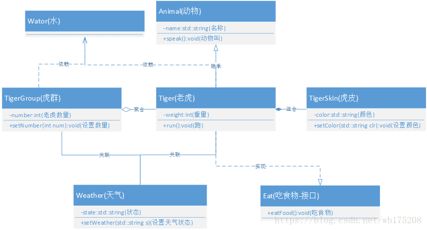

#### C++中cout和printf有什么区别

`std::cout`，`std::cin`是**全局对象**，`operator <<`和`operator >>`是流运算符，`std::cout`重载了`<<`，`std::cin`重载了`>>`

`printf`是**函数**

#### printf的实现原理

在C/C++中，函数调用时参数的入栈顺序是从后向前的（栈是一种先进后出的结构），栈是从内存的高地址到低地址生长的。printf第一个被找到的参数就是字符指针，也就是被双引号括起来的那一部分，函数通过判断字符串控制参数的个数来判断参数个数以及数据类型，通过这些就可以算出数据需要的堆栈指针的偏移量了。如`printf("%d,%d",a,b);`

在printf函数内部，使用`vfprintf`系统调用对参数进行格式化，使用`write`系统调用将其输出到终端上。


#### C++中ifdef endif用法

1. `ifdef endif`是条件编译，正常情况下所有行都要进行编译，但希望对某一部分进行满足一定条件才进行编译，也就是条件编译使用。
2. 使用形式

```cpp
#ifdef 标识符
code1
#else
code2
#endif
```

当标识符被定义过（一般使用#define 命令定义），则对code1进行编译，否则对code2进行编译

3.头文件使用`ifdef endif`可以避免头文件重定义


#### malloc怎么和物理内存产生关联

malloc的实现申请的是虚拟内存，和物理内存无直接关联。内核为每个进程维护一张页表，页表存储进程空间内每页的虚拟地址，页表项中有的虚拟内存页有对应的物理内存页面，也有的虚拟内存没有实际的物理内存对应。无论通过sbrk还是mmap实现，分配到的内存只是虚拟内存，代表这块空间可以使用，实际上还没有分配到实际的物理页面。等进程访问这个新分配的内存空间的时候，如果还没有对应的物理页面分配，就会产生缺页中断，内核这个时候会给这个进程分配实际的物理页面，与这个未被映射的虚拟页面对应起来，程序就可以继续运行了。


#### 静态库动态库的区别和使用场景

Linux下动态库`.so`静态库`.a`

Windows下动态库`.dll`静态库`.lib`

静态库和动态库的区别：

- 载入时机不同：静态库是在编译过程载入可执行程序，因此体积较大，运行时不需要静态库。动态库是在可执行程序运行时在载入内存的，编译过程仅简单的引用，因此代码体积较小，运行时需要动态库文件，多个程序需要同一个动态库只需要加载一份。
- 代码复用性不同：静态库编译过程中加载到程序中，而动态库链接的时候只是保留接口，将动态库与程序代码独立，可以提高代码的复用性，降低程序的耦合度。当动态库内容发生改变时，只要接口不变就不需要重新编译程序。
- 加载速度：静态库加载速度比动态库快一些。

使用场景：

静态库：静态库链接会使得可执行文件变大，加载时间较快，适用于小型应用的开发

动态库：动态库常用于大型项目或者共享库的情况，可以减小目标程序的体积，同时对于需要频繁更新或升级的项目，只需要更新动态库文件即可，不需要重新编译目标程序。此外，动态库还支持插件式编程，使得程序功能能够动态的扩展。

静态库的制作：

1. 静态库命名规则：`lib`+库的名字+`.a`
2. 制作步骤：
   - 生成对应的`.o`二进制文件，例如`gcc sum.c -c sum.o`
   - 将生成的`.o`文件打包，使用`ar rcs + 静态库的名字(libxx.a) + 生成的所有.o文件`， rcs为打包参数
   - 发布和使用静态库`gcc main.c -L 静态库文件夹名 -l 静态库名 -o main`

`nm命令`查看静态库具体打包了哪些`二进制文件`即.o文件。

动态库的制作：

1. 动态库命名规则：`lib+库的名字+.so`
2. 制作步骤：
   - 生成与位置无关的二进制文件`.o` ，`gcc -fpic sum.c  -c sum.o `
   - 将`.o`打包成共享库`gcc -shared -o libxx.so *o`
   - 使用动态库`gcc main.c lib/libxx.so -o main -I include`或`gcc main -I include -L lib -l libxx.so -o main`

与位置无关是指将动态库加载到内存中。静态库与位置有关是生成的二进制文件会被放到代码段，生成的.o代码每次都被放到同一个位置，因为使用的是虚拟空间中的绝对地址。

> 动态库查找不到的解决方法：
>
> 执行可执行程序的时候，提示找不到动态库，这并不一定是动态库文件不存在，可能是链接不到。
>
> 可以通过`ldd`命令，查看可执行文件在执行时候依赖的所有共享库/动态库:`ldd 可执行文件名`
>
> 解决方法：
>
> 1. 将动态库添加到动态库环境变量中，即`LD_LIBRARY_PATH`：`export  LD_LIBRARY_PATH=$LD_LIBRARY_PATH:/lib`（临时测试）
> 2. `.bashrc`中永久设置动态库环境变量`.bashrc中export  LD_LIBRARY_PATH=$LD_LIBRARY_PATH:/lib`
> 3. 推荐使用：
>    - 找到动态连接器的配置文件：`/etc/ld.so.conf`
>    - 将自己之多的动态库目录的绝对路径写入配置文件
>    - 更新配置文件`sudo ldconfig -v`（ld dynamic library缩写）

[静态库动态库参考链接](https://blog.csdn.net/weixin_41010198/article/details/105434085)

#### 原码、反码、补码

原码、反码、补码是计算机中对数字的二进制表示方式。

机器数：一个数在计算机中的存储形式是二进制的，有符号。

原码：将最高位作为符号位(0表示正、1表示负)，其他数字位表示数值本身的绝对值的数字表示方式。（原码和）

反码：如果是正数，反码和原码一样。如果是负数，符号位不变，其余为取反。

补码：如果是正数，补码和原码一样，如果是负数，等于反码加1。


计算机实际上只存储补码。

使用补码的原因：计算机进行减法计算转换成加法计算。并且可以用`1000 0000`表示-128。因此计算机中一个字节取值范围为`-128~127`

(-1) + (-127) = -128

= 原：[1000 0001] + 原：[ 1111 1111 ]

= 补：[ 1111 1111 ] + 补：[ 1000 0001 ]

= 补：[ 1000 0000 ]


`a=a+b`和`a+=b`有什么区别

对相同类型的变量来说：两者的运行结果是一样的，编译角度上看`a+=b`的效率高一些。`a=a+b`回生成一个中间变量进行赋值。

对不同类型的变量来说：不同类型变量运算过程涉及到低精度类型想高精度类型转换。


#### 内存池

**为什么要使用内存池**

利用new/delete或者malloc/free在堆上分配和释放内存会有一些额外的开销。如果频繁的在堆上分配和释放内存，会导致性能的损失，并且系统中出现大量的内存碎片会降低内存的利用率。对于一个具体的程序来说，适合自身特定的内存分配模式的自定义内存池可以获得更好的性能。

**内存池的定义**

内存池是一种内存分配方式。通常使用的new、malloc等api申请的内存，内存卡大小不定，频繁使用时会造成大量的内存碎片并降低性能。

内存池则是在真正使用内存前，预先申请分配一定数量、大小相等的内存块留作备用。当有新的内存需求时，就从内存池中分出一部分内存块，若内存块不够继续申请新的内存，能够使内存分配效率得到提升。

**内存池分类**

从**线程安全问题来分**，内存池可以分为单线程内存池和多线程内存池。

- 单线程内存池生命周期制备一个线程使用，不需要考虑互斥访问的问题。

- 多线程线程池可能被多个线程共享，因此需要在每次分配和释放内存时加锁。

从**可分配内存单元大小**分，可以分为固定内存池和可变内存池。

- 固定内存池是指应用程序每次从内存池中分配出来的内存单元大小事先已经确定，是固定不变的。

- 可变内存池则每次分配内存单元大小可以按需变化，应用范围更广，性能比固定内存池要低。

**内存池设计**

todo....https://blog.csdn.net/k346k346/article/details/49538975


基础知识：

#### float和double在计算机底层的存储机制

float占四个字节，double占8个字节。float和double都是二进制存储结构：符号位+指数位+尾数位。

单精度浮点数float：

- 第一位符号位，表示该数的正负，0表示正数，1表示负数。
- 接下来8位标识浮点数的指数位
- 接下来的23位表示尾数部分


**尾数位**：尾数位是指十进制的浮点数换算成二进制后转换成科学计数法小数点后的二进制表示（因为浮点数换算成二进制然后转化成科学计数法后小数点前面的一位一定是1，因此可以不需要存储），如果小数点后的二进制数不够23位，则补0

例如浮点数26.625

整数部分：除2取余，逆序	整数部分：乘2取整，正序

因此最终浮点数的二进制表示为11001.101		由于小数点前面的1不需要存储，所以得到尾数为 1001 1010 0000 0000 0000 000

指数位：指数位是指十进制的浮点数换算成二进制后转化成科学技术法得到浮点数的指数，然后通过以为存储原理得到的指数位


#### 幂等性

概念：幂等就是一个执行操作，无论执行多少次，产生的效果和返回的结果是一样的。

举例：insert操作、update操作 通常会在分布式场景下会出现幂等性问题

我们在填写某些表单时，保存按钮不小心快速点了两次，表中竟然产生两条重复的数据，只是id不一样。

项目中为了解决接口超时的问题，通常会引入重试机制。第一次请求接口超时了，请求方没能返回正确的结果（可能已经执行成功了），重复请求产生重复的记录。

如何实现幂等：

1. 数据库防重insert前先select

   在保存数据的接口中，为了防止重复数据，一般会在insert前，先根据name或者code字段select一下数据，如果已经存在则执行update操作，如果不存在再执行insert操作。该方案不适于并发场景，并发场景下要配合其他方案一起使用。

2. 加分布式锁

   redis使用`setNx()、expire()、delete()`三个API实现分布式锁

   `setNx`:向redis中存key-value，只有当key不存在时才会设置成功，否则返回0。用于体现互斥性

   `expire`:设置key的过期时间，用于避免死锁的出现。

   `delete`：删除key，用于释放锁。
