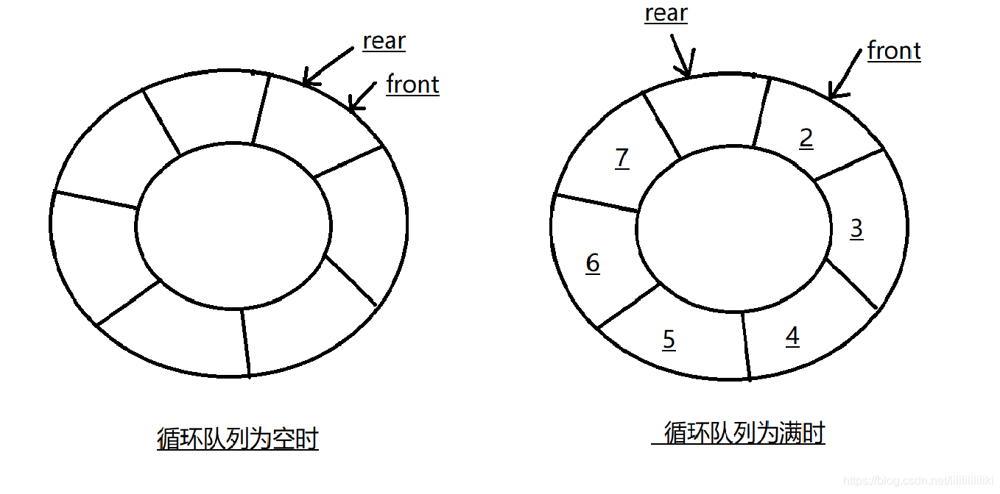

#### **冒泡排序**

冒泡排序是一种简单的排序算法。它重复地走访过要排序的数列，一次比较两个元素，如果它们的顺序错误就把它们交换过来。走访数列的工作是重复地进行直到没有再需要交换，也就是说该数列已经排序完成。这个算法的名字由来是因为越小的元素会经由交换慢慢“浮”到数列的顶端。

**时间复杂度**：O( n2 )

 **算法描述**

1. 比较相邻的元素。如果第一个比第二个大，就交换它们两个；
2. 对每一对相邻元素作同样的工作，从开始第一对到结尾的最后一对，这样在最后的元素应该会是最大的数；
3. 针对所有的元素重复以上的步骤，除了最后一个；
4. 重复步骤1~3，直到排序完成。


**算法实现**

```cpp
void bubbleSort(vector<int> &q){
    for(int i = q.size() - 1; i > 0; i--){
        bool flag = false;
        for(int j = 0; j < i; j++){
            if(q[j] > q[j+1]){
                swap(q[j], q[j+1]);
                flag = true;
            }
        }
        if(!flag)
            break;
    }
}
```

**稳定性**

在相邻元素相等时，它们并不会交换位置，所以，冒泡排序是**稳定排序**。

**适用场景**

冒泡排序思路简单，代码也简单，特别适合小数据的排序。但是，由于算法复杂度较高，在数据量大的时候不适合使用。

#### 选择排序

选择排序提高了冒泡排序的性能，它每一次遍历一次数组只会进行一次交换，即在遍历过程中记录最大项的索引，完成遍历后，再把它换到正确的位置，同样若数组有n项，它也需要遍历n-1次。

**时间复杂度**：O( n2 )

**算法描述**

1. 在未排序序列中找到最小（大）元素，存放到排序序列的起始位置
2. 从剩余未排序元素中继续寻找最小（大）元素，然后放到已排序序列的末尾。
3. 重复第二步，直到所有元素均排序完毕。


**算法实现**

```cpp
void selectSort(vector<int>& v){
	for(int i=0;i<v.size()-1;i++){
		int index = i;//最小数的索引
		for(int j=i+1;j<v.size();j++){
			if(v[j] < v[index]){
				index = j;
			}
		}
        if(index!=i){
            swap(v[index], v[n-1-i]);
        }
	}
}
```

**稳定性**

用数组实现的选择排序是不稳定的，用链表实现的选择排序是稳定的。
不过，一般提到排序算法时，大家往往会默认是数组实现，所以**选择排序是不稳定的**。

**适用场景**

选择排序实现也比较简单，并且由于在各种情况下复杂度波动小，因此一般是优于冒泡排序的。在所有的完全交换排序中，选择排序也是比较不错的一种算法。但是，由于固有的O(n2)复杂度，选择排序在海量数据面前显得力不从心。因此，它适用于简单数据排序。

#### 插入排序

插入排序是一种简单直观的排序算法。它的工作原理是通过构建有序序列，对于未排序数据，在已排序序列中从后向前扫描，找到相应位置并插入。

**时间复杂度**：O( n2 )

**算法描述**

1. 把待排序的数组分成已排序和未排序两部分，初始的时候把第一个元素认为是已排好序的。
2. 从第二个元素开始，在已排好序的子数组中寻找到该元素合适的位置并插入该位置。
3. 重复上述过程直到最后一个元素被插入有序子数组中。

**算法实现**

```cpp
void insertSort(vector<int>& v){
	for(int i=1;i<v.size();i++){
		for(int j=i;j>0;j--){
			if(v[j] < v[j-1]){
				swap(v[j], v[j-1]);
			}
			else{
				break;
			}
		}
	}
}
```

**稳定性**

由于只需要找到不大于当前数的位置而并不需要交换，因此，直接插入排序是**稳定**的排序方法。

**适用场景**

插入排序由于**O( n2 )**的复杂度，在数组较大的时候不适用。但是，在数据比较少的时候，是一个不错的选择，一般做为快速排序的扩充。例如，在STL的sort算法和stdlib的qsort算法中，都将插入排序作为快速排序的补充，用于少量元素的排序。

**在待排序元素基本有序的情况下，直接插入排序效率比较高。**


#### 归并排序

归并排序是一种递归算法，持续地将一个数组分成两半。如果数组是空的或者只有一个元素，那么根据定义，它就被排序好了。如果数组里的元素超过一个，我们就把数组拆分，然后分别对两个部分调用递归排序，一旦这两个部分被排序好了，就对这两个部分进行归并。

**算法描述**

两种方法

- 递归法（Top-down）

1. 申请空间，使其大小为两个已经排序序列之和，该空间用来存放合并后的序列
2. 设定两个指针，最初位置分别为两个已经排序序列的起始位置
3. 比较两个指针所指向的元素，选择相对小的元素放入到合并空间，并移动指针到下一位置
4. 重复步骤3直到某一指针到达序列尾
5. 将另一序列剩下的所有元素直接复制到合并序列尾

- 迭代法（Bottom-up）

原理如下（假设序列共有n个元素）：

1. 将序列每相邻两个数字进行归并操作，形成ceil(n/2)个序列，排序后每个序列包含两/一个元素
2. 若此时序列数不是1个则将上述序列再次归并，形成ceil(n/4)个序列，每个序列包含四/三个元素
3. 重复步骤2，直到所有元素排序完毕，即序列数为1

```cpp
void merge(vector<int>& v, int left, int mid, int right){
	vector<int> temp = v;
	int i = left, j = mid + 1;
	int index = left;
	while(i <= mid || j <= right){
		if(i > mid){
			v[index++] = temp[j];
			j++;
		}
		else if(j > right){
			v[index++] = temp[i];
			i++;
		}
		else if(temp[i] < temp[j]){
			v[index++] = temp[i];
			i++;
		}
		else{
			v[index++] = temp[j];
			j++;
		}
	}
	
}
void merge_Sort(vector<int>& v, int left, int right){
	if(left >= right) return;
	int mid = (left + right) / 2;
	merge_Sort(v, left, mid);
	merge_Sort(v, mid + 1, right);
	if(v[mid] > v[mid + 1]){
		merge(v, left, mid, right);
	}
}
void mergeSort(vector<int>& v){
	int n = v.size();
	merge_Sort(v, 0, n - 1);
}
```

**时间复杂度**

归并排序的效率是比较高的，设数列长为N，将数列分开成小数列一共要logN步，每步都是一个合并有序数列的过程，时间复杂度可以记为O(N)，故一共为**O(NlogN)**。

**稳定性**

因为我们在遇到相等的数据的时候必然是按顺序“抄写”到辅助数组上的，所以，**归并排序**同样是**稳定算法**。

**适用场景**

归并排序在数据量比较大的时候也有较为出色的表现（效率上），但是，其空间复杂度O(n)使得在数据量特别大的时候（例如，1千万数据）几乎不可接受。而且，考虑到有的机器内存本身就比较小，因此，采用归并排序一定要注意。


#### 快速排序

通过一趟排序将要排序的数据分割成独立的两部分，其中一部分的所有数据都比另外一部分小，然后对两部分进行递归的快速排序。

**算法描述**

1. 从数列中挑出一个元素，称为"基准"（pivot），
2. 重新排序数列，所有比基准值小的元素摆放在基准前面，所有比基准值大的元素摆在基准后面（相同的数可以到任何一边）。在这个分区结束之后，该基准就处于数列的中间位置。这个称为分区（partition）操作。
3. 递归地（recursively）把小于基准值元素的子数列和大于基准值元素的子数列排序。

**算法实现**

```cpp
int Paritition1(int A[], int low, int high) {
   int pivot = A[low];//第一个数作为基准
   while (low < high) {
     while (low < high && A[high] >= pivot) {//找到
       --high;
     }
     A[low] = A[high];
     while (low < high && A[low] <= pivot) {
       ++low;
     }
     A[high] = A[low];
   }
   A[low] = pivot;
   return low;
 }

 void QuickSort(int A[], int low, int high) //快排母函数  low和high是下标
 {
   if (low < high) {
     int pivot = Paritition1(A, low, high);
     QuickSort(A, low, pivot - 1);
     QuickSort(A, pivot + 1, high);
   }
 }
```

**时间复杂度**

平均情况下，快速排序的运行时间为O(nlogn)，在最糟情况下，其运行时间为O(n2)。

**稳定性**

**快速排序并不是稳定**的。这是因为我们无法保证相等的数据按顺序被扫描到和按顺序存放。

**适用场景**

快速排序在大多数情况下都是适用的，尤其在数据量大的时候性能优越性更加明显。但是在必要的时候，需要考虑下优化以提高其在最坏情况下的性能。


#### 堆排序

**堆的性质**

堆是一个**完全二叉树**。

完全二叉树：假设二叉树深度为h，除第h层外，其余层数节点数都达到最大值，第h层所有节点都连续集中在最左边。

> 平衡二叉树：左右子树高度差不超过1的树。

堆的性质：堆的每一个父节点的值都大于或小于其子节点，堆的每个左子树和右子树也是一个堆。

堆分为最小堆和最大堆。最大堆就是每个父节点的数值要大于子节点，最小堆就是每个父节点的值小于子节点。排队要求从小到大的话构建最大堆，反之建立最小堆。

堆的存储一般用数组来实现。加入堆的父节点的数组下标为i的话，那么其左右节点的下标分别为**（2i+1）**和**（2i+2）**.如果孩子节点下标为j的话，父节点的下标为（j-1）/2。

完全二叉树，加入有n个元素，那么在堆中最后一个父节点位置为**(n/2-1）**

**建堆**

建堆时间复杂度为O(n)

堆排序时间复杂度为O(logn)

```cpp
void heapify(int arr[], int i, int n)//比较父节点与子节点大小，递归进行交换
{
    int largest = i;
    int lson = 2*i+1;
    int rson = 2*i+2;
    if (lson<n && arr[lson] > arr[largest])
    {
        largest = lson;
    }
    if (rson<n && arr[rson] > arr[largest])
    {
        largest = rson;
    }
    if (largest!=i)
    {
        swap(arr[largest], arr[i]);
        heapify(arr, largest, n);
    }
        
}

void heapSort(int arr[], int n)
{
    for (int i = n/2-1; i >= 0; i--)//建堆  建堆后最大值在下标为数组头部
    {
        heapify(arr, i, n);
    }
    for (int i = n-1; i > 0; i--)//堆排序
    {
        swap(arr[i], arr[0]);//从后向前排序，交换头节点与当前节点（头节点下沉完成后该节点为最大值，交换到数组后面）
        heapify(arr, 0, i);
    }
}
```


循环列表判断队满

1. 少用一个存储位置

   

判断队空条件：rear==front

判断队满条件：(rear+1)%maxsize==front

2. 计数count--队列中有效元素个数

   队列为空时，count==0

   有元素入队时count++，当count==maxsize是代表队列满。

   