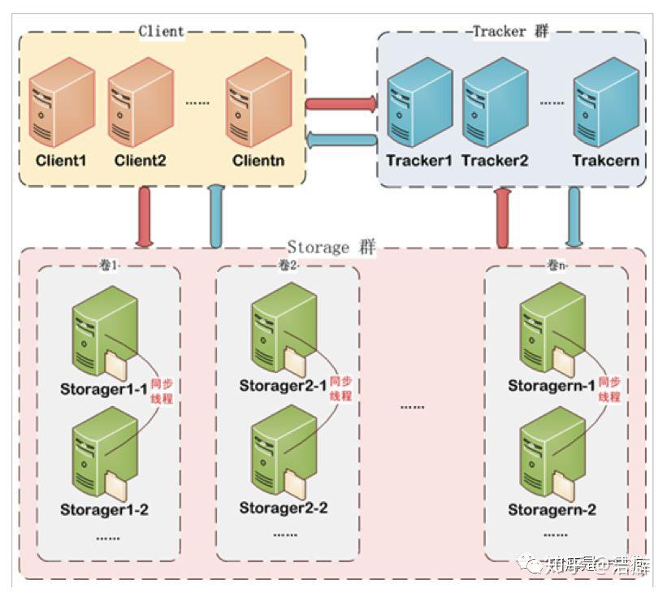
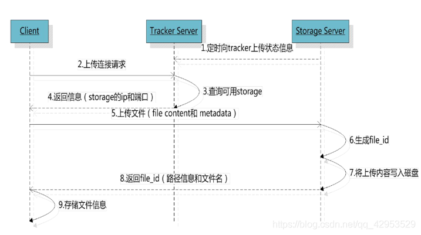
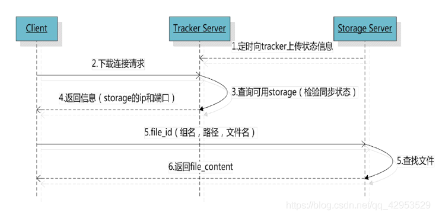
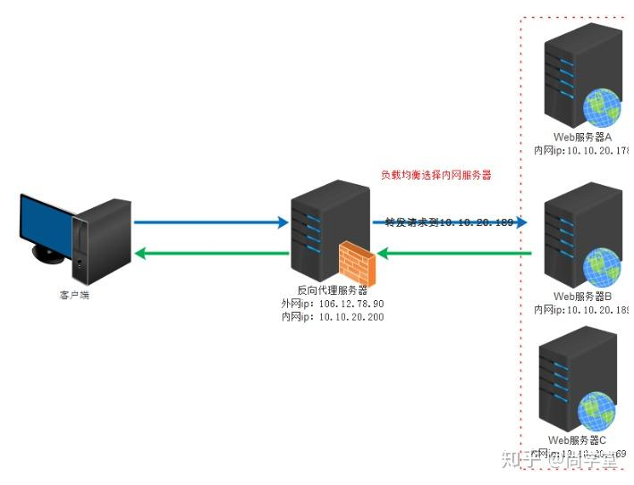
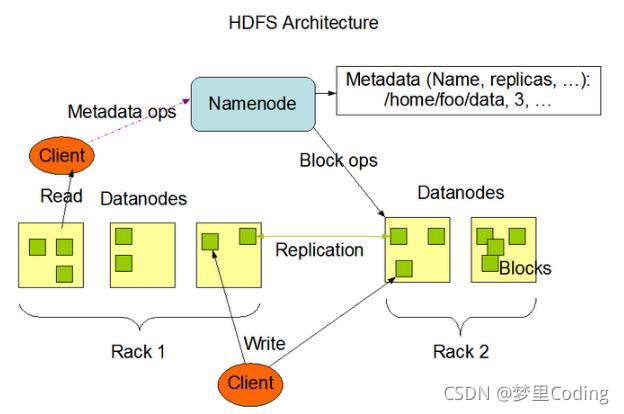

//项目背景：为了学习一些分布式方面的知识，同时也对建立一个个人服务器有兴趣就做了这个项目，分布式文件管理系统FastDfs。

项目介绍：

首先说明以下，fastdfs这个//Fastdfs是使用C语言编写的高性能分布式文件系统。

用来对文件进行管理，功能包括文件同步，文件访问，解决大容量存储和负载均衡的问题。Fastdfs考虑了冗余备份，负载均衡，在线扩容等机制。fastdfs特别适合中小文件为载体的在线服务，如相册网站、视频网站、电商网站。客户端是使用QT进行设计，可以实现对文件的上传、下载和访问，同时也可以在客户端实现在线扩容。

接下来讲一讲整体的设计思路：

像其他的分布式文件系统一样，首先要有三个角色：Tracker跟踪者，用于负责协调作用，监控各个存储节点的状态，负责与客户端建立连接；Storage存储节点：用于真实存储数据；client客户端，用户用来上传下载文件使用。

接下要考虑项目中的各个需求，根据需求来进行设计。为了实现冗余备份：将不同的存储节点分组，一个组内的多个存储节点存储相同的数据，起到相互备份的作用，这又需要设计不同节点进行数据同步的流程。在实际计算过程中，该组的实际容量为节点中容量最小的节点为准。为了实现在线扩容：就设计可以方便增加组的接口，节点上线后就主动和tracker连接并保持周期性心跳。为了实现负载均衡和http访问：引入nginx进行反向代理，不仅为文件系统增加了http访问的功能，还能进行负载均衡


#### FastDFS是什么

Fastdfs是使用C语言编写的高性能分布式文件系统。

用来对文件进行管理，功能包括文件同步，文件访问，解决大容量存储和负载均衡的问题。Fastdfs考虑了冗余备份，负载均衡，在线扩容等机制。

fastdfs特别适合中小文件为载体的在线服务，如相册网站、视频网站、电商网站。

#### Fastdfs原理

fastdfs系统分为三个角色，跟踪服务器（tracker server）,存储服务器（storage server），客户端（client）。

##### tracker server

- 主要负责协调调用工作，并对storage server起到负载均衡的作用
- 负责管理所有的storage server和group，每个storage server启动后会连接tracker，并告知自己的所属group信息，并保持周期性心跳（报告状态，包括磁盘空间，文件同步状态，文件上传下载次数统计等信息）。
- tracker server可以有多台，tracker server之间互相平等，客户端请求tracker server采用轮询的方式，如果请求的tracker server无法提供服务，则换一台请求。

##### storage server

- 主要提供容量和备份服务
- 以group为单位，每一个group里有多个storage server,数据互为备份，各个group互相独立。
- 采用分组存储方式好处是灵活和可控性强，比如上传文件可以由客户端指定，也可以由tracker server进行调度选择。
- 一个group的存储压力过大，可以改组增加存储服务器扩充服务能力，当容量不足时，可以增加组扩充容量。

##### client

上传下载的数据服务器



#### 存储策略

冗余备份：为了支持大容量，存储节点采用分组的组织方式，存储系统由一个或多个组组成，组与组之间文件相互独立，所有组加起来就是存储系统的容量。一个组可以由一个或者多个存储服务器组成，一个组下的存储服务器文件都是相同的，组中的多台服务器起到了冗余备份和负载均衡的作用。

动态扩容：在组中新增加服务器时，同步已有的文件由系统自动完成，同步完成后，系统将自动将新增服务器切换到线上提供服务，当存储空间不足或者消耗完时，可以动态加组，只需要增加一台或者多台服务器，并将他们组成一个新组，这样就扩大了存储系统的容量。


#### 文件上传流程



1. tracker server收集storage server的状态信息

   storage server定期向tracker server发送磁盘剩余空间，文件同步状况，上传和下载次数的能够信息。因此tracker server中存有各个storage server的状态信息。

2. 选择tracker server

   当集群中不止一个·tracker server时，由于tracker server都是对等的，因此客户端在upload文件时可以任意选择一个tracker server进行上传。

3. 选择存储group

   当tracker server接收到upload文件的请求时，会为该文件分配一个可以存储该文件的group。

   （分配策略：1.所有group轮询 2.指定某一group 3.选择空间更多的group）

4. 选择storage server

   选择group后，tracker server会在group内选择一个storage server给客户端。（分配策略：1.在group中的storage轮询 2.按ip进行排序 3.按优先级选择）

5. 选择storage path

   当分配好storage server后，客户端要向storage发送写文件请求，storage将会分配一个存储目录。（分配策略：1.多个存储目录轮询 2.剩余空间最多优先）

6. 生成文件名

   选定文件存储目录后，storage会为文件生成一个文件名称，由源storage server ip，文件创建时间，文件大小，文件crc32和一个随机数拼接而成，然后将这个二进制串进行base64编码，转换为字符串。（crc32：循环冗余校验，用于检测数据损坏的错误检测码。这里将文件转换为8个字符的字符串用作哈希函数。）

7. 选择两级目录

   当选定存储目录后，storage会为文件分配一个file id，每个存储目录下由两级256*256的子目录，storage会按照文件名称进行两次哈希，路由到其中一个目录下，然后将文件存储在该子目录下。

8. 生成file id

   当文件存储到文件目录后，即认为文件存储成功，接下来就会为该文件生成一个文件id，文件id由group,存储目录，两级目录，文件名和文件后缀名拼接醉成。将文件的file id返回给客户端，

9. 客户端保存该文件的存储信息。

#### 文件同步分析

写文件时，客户端将问及那写到group的一个storage server即认为写入成功，storage  server写完文件后，会由后台线程将文件同步到同group的其他storage server中。

每个storage server写文件后，同时会写一份binlog, binlog中不包含文件数据，只包含文件名信息。binlog用于同步，storage会记录group内其他storage同步的进度，以便重启之后接着上次的进度继续同步，进度以时间戳的方式记录，所以最好将集群中所有server的时钟保持同步。

storage的同步进度会作为元数据的一部分汇报到tracker上，tracker在选择读storage的时候会将已同步进度作为参考。

binlog中记录内容：

```txt
1418285342 c M01/00/00/CgAHl1SJUR6AZqSHAAAF1vgN0rw59.conf
1418285734 C M00/00/00/CgAFklSJUqaAL7hBAAAF1vgN0rw38.conf
1418285809 C M01/00/00/CgAFklSJUvGAL96CAAAF1vgN0rw96.conf
```

其中每一条数据都是由三个字段组成的：

分别是：

1. `1418285342 时间戳`

2. C表示源创建、c表示副本创建 A表示源追加、a表示副本追加 D表示源删除、d表示副本删除 T表示源Truncate、t表示副本Truncate
3. 文件的fileid


binlog同步过程：(增量同步)[https://blog.csdn.net/hfty290/article/details/42041155]

在Fastdfs中，每个storage之间的同步都是由一个独立线程负责的。每两个storage之间都有一个线程负责同步。

1. 获取组内其他storage信息，并启动同步线程

   在storage.conf配置文件中，只配置了tracker的ip地址，并没有配置组内其他storage的ip。因此同组的其他storage信息必须从tracker中获取。具体如下：

   ① storage启动时要配置一个线程负责与tracker的通信

   ② 默认30s，storage会像storage发送一次心跳包，在心跳包的回复中会有组内其他storage的信息。

   ③ storage获取到同组的其他storage信息之后，为组内的每个其他storage开启一个线程负责同步

2. 同步线程执行过程

   每个同步线程负责一台storage的同步，以阻塞方式进行。

   ① 打开对应storage的mark文件，读取binlog_idx和binlog_offset两个字段。找到源storage binlog的对应位置。

   ② 进入一个while循环，将binlog中对应的操作方式同步到对方，同步成功后更新binlog_offset标志。

   ③ 同步前删除。加入同步较为缓慢，那么有可能在开始同步一个文件前，这个文件已经被客户端删除，此时同步线程将打印一条日志，然后直接处理后面的binlog。

   


#### 文件下载流程



1. tracker server收集storage server的状态信息

   storage server定期向tracker server发送磁盘剩余空间，文件同步状况，上传和下载次数的能够信息。因此tracker server中存有各个storage server的状态信息。

2. 选择tracker server

   当集群中不止一个·tracker server时，由于tracker server都是对等的，因此客户端在upload文件时可以任意选择一个tracker server进行下载。

3. 选择可用的storage server

   客户端下载请求给某个tracker，必须附带上传文件名信息。tracker从文件名中解析group、路径信息、大小信息、创建信息、源storage server ip等信息。然后选择一个storage进行服务读请求。返回该storage的ip和端口。

   由于group同步是后台的一个异步线程进行的，所以可能出现在读的时候文件还没有同步，为了避免这种情况，tracker会按照如下规则选择group中可读storage:

   - 该文件上传的源storage只要存活，选择该节点。文件名信息中包含源storage的IP信息。
   - 当前时间-文件创建时间>文件同步最大时间。即认为经过文件最大同步时间后，文件肯定完成同步。
   - 文件创建时间<文件同步时间戳，即文件同步时间戳之前的文件已经同步。
   - 当前时间-文件创建时间>同步延迟阈值，即经过同步延迟阈值，认为文件肯定同步了。

4. 访问storage中的文件

   找到对应storage中的目录和文件名，查找对应的文件，返回。


#### 优缺点

优点：比较灵活、支持在线扩容，考虑了负载均衡，性能有保障。具有冗余备份，安全性也有保障。

缺点：

- 不支持断线续传
- 不支持大文件的传输
- 少权限管理，不同的用户只能访问自己有权限的文件

解决：将文件分块，。。。。


难点：

同一组节点如何实现文件同步这一点我在读源码的时候就很困惑，对这个过程不理解，组内的其他节点怎么知道组内谁文件上传，怎么主动去建立连接请求同步。后来自己重新梳理一个各个角色的工作，才明白节点间的同步过程。。。。


#### 如何实现断点续传


秒传：将上传的内容先做一个MD5校验，如果数据库中有一样的内容，就直接返回一个新地址，不需要重新上传文件。

分片上传：将要上传的文件，按照一定的大小，将整个文件分割成多个数据块来分别进行上传，上传完后再由服务端对所有上传的文件汇总整合成原始的文件。

分片上传的场景：1. 大文件上传 2.网络环境不好，存在需要重传风险的场景。


断点续传：将大文件进行分片，每隔部分采用一个线程进行上传或下载，如果碰到网络故障，可以从已经上传或下载的部分开始继续上传或者 下载未完成的部分，而没有必要从头开始上传或下载。


#### fastdfs如何保证传输文件的正确性

1. 首先在传输阶段使用的基于TCP的HTTP协议，TCP为可靠的传输层协议，有确认应答机制、序列号、滑动窗口、流量控制、拥塞控制和超时重传保证报文正确传输到对方。

2. 其次，发送方在文件的元数据中加入一个校验和（比如MD5），接收方在接收到文件后计算接收内容的校验和，并于发送方提供的校验和进行比较，如果不匹配说明内容存在错误或者损坏。

3. fastdfs支持冗余备份，如果某个节点上的内容出现错误，还可以通过同组的其他节点内容来进行恢复。


> MD5加密算法
>
> MD5（message-digest algorithm 5），信息摘要算法5，用于确保信息传输完整一致，是计算机广泛使用的摘要算法之一。
>
> MD5算法特点：
>
> 1. 压缩性：任意长度的数据，算出的MD5值的长度都是固定的。
> 2. 容易计算：从元数据计算出MD5值很容易
> 3. 抗修改性：对原数据的任何改动，哪怕只有一字节，所得到的MD5值都有很大区别。
> 4. 强抗撞性：很难找到一个与原数据相同MD5值的数据。
>
> MD5算法用途：
>
> 1. 防止被篡改：MD5生成摘要后，接收方对接收到的数据生成MD5值进行对比，一致说明未被篡改。
> 2. 防止直接看到明文：存储密码时数据库中存储的是密码对应的MD5值，用户输入密码后生成MD5值传输到服务器进行与数据库比较。
> 3. 数字签名：CA机构申请数字证书时需要摘要算法可以用MD5实现。
>
> MD5是小端存储


#### Fastdfs怎么实现负载均衡的

- Tracker会记录每个group内每个storage server的负载状况，如当前磁盘利用率、带宽利用率等。
- 客户端上传或下载文件时，会先询问tracker寻找一个负载较低的group（分配策略可以进行配置）
- 选定group后会在group内选择一个storage server给客户端，可以按照优先级排序（比如选择带宽高的storage，分配策略可以进行配置）
- 选择storage后，客户端向storage发送写文件请求，storage将为文件分配一个数据存储目录，可以选择剩余空间多的优先（分配策略可以进行配置）


#### 为什么要搭配使用nginx

##### nginx作用

Fastdfs作为分布式文件系统，主要功能是提供高容量的文件存储。它本身没有提供HTTP/HTTPS协议的访问接口，无法直接响应浏览器或者客户端的HTTP/HTTPS请求。

解决方案是使用Nginx这样的反向代理服务器来实现对文件的访问。

1. 对tracker做负载均衡

   为了承载更高的并发量，tracker可以做成集群，通过nginx可以实现负载均衡。

2. 避免同步延迟带来的错误

   上传文件后存放在源存储节点，同一组节点之间的文件同步是异步进行的。如果还没完成同步就有一个新请求去访问这个文件，如果访问到同一组的其他节点上就会出现文件无法访问的错误。nginx可以在文件无法访问时重定向到文件存放的源存储节点，避免由于文件同步延迟带来的错误。  

##### 使用方法

tracker上有一个nginx反向代理服务器，nginx服务器存储各存储节点的nginx代理服务器地址。nginx配置文件中有几各后台存储节点就加几个`server `。

在反向代理服务器中进行解析请求的文件ID(文件id由组名、存储目录、两级目录、文件名和文件后缀组成)，提取出文件的组名后找到对应组的地址配置，再根据负载均衡来转发至具体的节点。

```
server{
	listen 80;
	server_name baidu.com //客户端访问反向代理服务器用到的域名
	location /group1/M00
	{
		proxy_pass http:group1
	}
	location /group2/M00
	{
		proxy_pass http:group2
	}
}
upstream group1
{
	server 182.168.1.1:80 weight=1;//所有后端web服务器地址信息 默认按照轮询方式转发 weight权重越高被分配的客户端数量越多
	server 182.168.1.2:80 weight=3;

upstream group2
{
	server 182.168.1.3:80 weight=1;//所有后端web服务器地址信息 默认按照轮询方式转发 weight权重越高被分配的客户端数量越多
	server 182.168.1.4:80 weight=3;
}

```


```txt
server{
	listen 80;
	server_name baidu.com //客户端访问反向代理服务器用到的域名
	location / { proxy_pass http://server_list }//转发的地址
}
```

负载均衡设置

```
#反向代理配置
upstream server_list
{
	server 182.168.1.1:80 weight=1;//所有后端web服务器地址信息 默认按照轮询方式转发 weight权重越高被分配的客户端数量越多
	server 182.168.1.1:80 weight=3;
}
upstream server_list
{
	//ip_hash; //每个请求按照ip的哈希值分配，这样每个客户端每次都会固定访问一个后端服务器，可以解决session丢失的问题
	//least_conn //web请求被转发至连接数量最少的服务器上。
	server 182.168.1.1:80 weight=1;
	server 182.168.1.1:80 weight=3;
}
```

动静分离实现：

通过`location`指定不同的后缀名(使用正则表达式进行匹配)实现不同的请求转发


各个存储节点上也部署有nginx代理服务器（正向代理）

比如客户端要下载文件，只靠文件的ID无法得知文件存储在哪个存储节点下，加上nginx反向代理服务器地址后就可以请求tracker。tracker解析出文件在哪个节点后将请求转发给对应的


代理方式：

##### **正向代理**

正向代理部署在客户端，由客户端使用。隐藏客户端真实IP地址，代替客户端对外发送请求，实现对客户端的保护和访问控制。

工作原理：

1. 客户端将一个请求发送给正向代理服务器
2. 代理服务器封装并隐藏客户端IP地址信息
3. 代理服务器向真实服务器发送已封装的请求
4. 服务器处理完毕返回结果给代理服务器
5. 代理服务器将结果传回客户端。

主要功能:

1. 缓存响应数据，减少重复对远程服务器的访问。
2. 隐藏真实IP，增强客户端的隐秘性
3. 过滤限制请求，实现基于客户端的访问控制。


##### **反向代理**

反向代理（Reverse Proxy）：反向代理部署在服务器端，由服务器使用，它代替多个后端真实服务器对外服务，对外暴露反向代理服务器的地址。
工作原理：

1. 客户端向反向代理服务器发送请求
2. 反向代理服务器根据负载均衡或者负载分发规则，将请求转发给后端真实服务器集群某个服务器。
3. 后端真实服务器处理完请求后，将结果返回给反向代理服务器。
4. 反向代理服务器进一步返回结果到客户端。

主要功能：

1. 负载均衡：将负载分摊到各个后端服务器上，提高并发量和可用性。
2. 动静分离：分开处理静态文件和动态请求，减轻后端服务器资源压力
3. 高可用：当后端某服务节点挂掉后，通过代理迅速切换到另一服务节点。



两种的区别：

1. 位置不同
   - 正向代理架设在客户端，为客户端屏蔽真实服务器的地址，服务器和客户端只能看到代理服务器的地址。
   - 反向代理架设在服务端，
2. 代理对象不同
   - 正向代理代理客户端，服务端不知道实际发送请求的客户端
   - 反向代理代理服务端，客户端不知道实际提供服务的服务端。
3. 目的不同
   - 正向代理用于客户端资源请求，保护和隐藏客户端真实IP。
   - 反向代理用于服务器端资源访问，负载均衡，动静分离，增强系统可用性。


#### 为什么要用FastCGI

nginx是无法处理动态请求的，因此要将nginx和FastCGI进行搭配来实现动态请求的访问。

CGI是通用网关接口，是客户端和服务器程序之间传输数据的一种标准。

nginx对于一些动态请求无法处理，比如登录。将数据发送给CGI进行处理。

比如登录信息，FastCGI会连接数据库验证登录账号密码是否正确。将结果返回客户端。

```
静态请求：文件上传到服务器，不会修改，无论谁取都是一个样子。
动态请求：请求的内容是动态的，不同的人请求得到的结果是不一样的。
```

nginx对于动态请求转发至`localhost`的`FastCGI`端口号。


#### 怎么使用mysql

安装mysql后在对应的文件加下有mysql的.h文件和静态库lib文件。在程序中创建mysql的句柄，调用对应的api就可以完成操作。

```cpp
MYSQL mysql;
mysql_init(&mysql);
mysql_real_connect(&mysql, "localhost", "root", "root", "test_mysql", 3306, nullptr, 0)
mysql_real_query(&mysql, sql, (unsigned int)strlen(sql));
mysql_free_result(res);
mysql_close(&mysql);
```

MySQL存储内容：

文件表：文件id、url、size、type、filename、上传下载次数、创建时间、权限、创建者、文件的MD5值

新增：用户表：用户组、用户id、权限等级


#### redis怎么连接使用的

使用hiredis库进行和redis进行连接的。

数据是存储在存储节点的物理内存上，对于经常访问的文件，会以key-value形式存储在redis缓存中，key为文件的id，value为文件数据。文件存入时会用base64对文件进行编码后存入redis缓存中，提取后进行解码生成文件。

周期性心跳如何实现的

使用最小堆构建定时器，最小堆是一个完全二叉树，每一个节点的值总是小于等于它的子节点的值，堆中每个节点的子树都是最小堆。

最小堆查找最小时间时间复杂度为O1,插入删除时间复杂度为O(logn)。

最小堆是数组进行存储的。一个点的父节点：(x-1)/2，左子节点2x+1，右子节点2x+2。


#### HDFS

HDFS: hadoop分布式文件存储系统。

适用场景：

1. 适合大数据文件：处理数据达到GB、TB甚至PB级别的数据，能够处理百万规模以上的文件数量。
2. 文件分块存储，适合批处理：HDFS将大文件分块，将一个完整的大文件平均分块存储到不同的计算机上，可以同时从多个主机读取不同区域的文件。
3. 高容错性：数据自动保存多个副本，通过增加副本的方式提高容错性。某一个副本丢失后可以自动恢复。
4. 流失文件（无结构文件）访问：一次写入，多次读取。文件一旦写入不能修改，只能追加，能保证数据的一致性。
5. 支持廉价硬件：能够应用在普通的廉价PC机器上。

不适用场景：

1. 不适合低延时数据访问，比如ms级的存储数据(hadoop的map/reduce执行会产生大量的中间数据，节点之间交换大量的数据，从而导致巨大的磁盘IO延迟，它必须在磁盘中保留大量数据以实现阶段之间的同步，以便它可以支持作业从故障中恢复)
2. 无法高效的对大量小文件进行存储
   - 存储大量小文件会占用NameNode大量的内存来存储文件目录和块信息。
   - 小文件存储的寻址时间会超过读取时间，违反了HDFS的设计目标。
3. 不支持并发写入，不支持文件随机修改。（一个文件只能有一个写，不允许多个线程同时写）



HDFS 采用的是master/slaves主从结构模型来管理数据，这种结构模型主要由四个部分组成：Client(客户端)、Namenode(名称节点)、Datanode(数据节点)和SecondaryNamenode(第二名称节点，辅助Namenode)。

NameNode（nn）：就是Master，它是一个主管、管理者。
（1）管理HDFS的名称空间；
（2）配置副本策略；
（3）管理数据块（Block）映射信息；
（4）处理客户端读写请求。

DataNode：就是Slave。NameNode下达命令，DataNode执行实际的操作。
（1）存储实际的数据块；
（2）执行数据块的读/写操作。

Client：就是客户端。
（1）文件切分。文件上传HDFS的时候，Client将文件切分成一个一个的Block，然后进行上传；
（2）与NameNode交互，获取文件的位置信息；
（3）与DataNode交互，读取或者写入数据；
（4）Client提供一些命令来管理HDFS，比如NameNode格式化；
（5）Client可以通过一些命令来访问HDFS，比如对HDFS增删查改操作；

Secondary NameNode：并非NameNode的热备。当NameNode挂掉的时候，它并不能马上替换NameNode并提供服务。
（1）辅助NameNode，分担其工作量，比如定期合并Fsimage和Edits，并推送给NameNode ；
（2）在紧急情况下，可辅助恢复NameNode。


#### 分布式CAP理论

CAP理论：一个分布式系统最多只能同时满足一致性（Consistency）、可用性（Availability）和分区容错性Partition tolerance）这三项中的两项。


一致性：`all nodes see the same data at the same time`。即所有节点在同一时间的数据完全一致。

从客户端和服务端的角度看：

客户端：客户端关注一致性主要是在高并发访问时更新过的数据如何获取的问题。

服务端：更新如何分布到整个系统，以保证数据最终一致。

根据一致性的等级可以分为强/弱/最终一致性三类：

多进程并发访问时，更新过的数据在不同进程如何获取的不同策略决定了不同的一致性。

- 强一致性：对于关系型数据库，要求更新过的数据能被后续的访问都能看到。

- 弱一致性：如果能容忍后续的部分或者完全访问不到，则是弱一致性。

- 最终一致性：如果经过一段时间后要求访问到更新后的数据，则是最终一致性。

可用性：`Reads and writes always success`，即服务在正常响应时间内一直可用。

好的可用性是指系统能够很好的为用户服务，不出现用户操作失败或者访问超时等用户体验不好的情况。可用性通常和分布式数据冗余、负责均衡有很大的关系。

衡量分布式系统可用性的时候，都是通过停机时间来计算的。比如某个系统可用性可以达到五个9，意思就是说该系统的可用水平是99.999%.全年停机时间不超过（1-0.99999）*365*24*60=5.256min.


分区容错性

分区容错性`the system continues to operate despite arbitrary message loss or failure of part of the system `

即分布式系统在遇到某节点或者网络分区故障的时候，仍然能够对外提供满足一致性或者可用性服务。


CAP权衡:

CA without P:如果不要求P(不允许分区)，则C强一致性和A可用性是可以保证的。

CP without A:如果不要求A可用，相当于每个请求与都要在server之间强一致，而P分区会导致同步时间无线延长。如此CP也是可以保证的。

AP without C:要高可用并允许分区，则需放弃一致性。一旦分区发生，节点之间可能会市区联系，为了高可用，每个节点只能用本地数据提供服务，而这样这会导致数据的不一致性。


对于大型互联网应用场景，主机众多，部署分散，集群规模越来越大所以节点故障、网络故障是常态，而且要保证可用性，即保证AP舍弃C。

对于金融行业C必须保持，因此通常会保持CP，牺牲A。网络故障宁可停止服务。