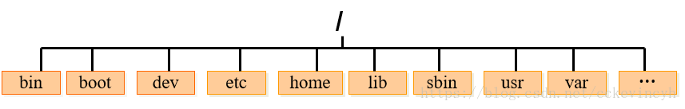
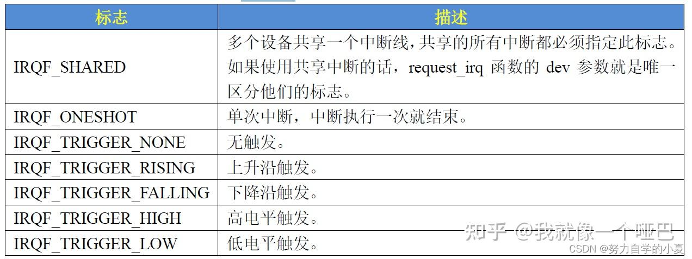

进程管理


#### ps

ps命令查看进程，可以看到有哪些进程正在运行，并且可以看到**进程的运行状态**、进程是否结束、**进程有没有僵死**、**哪些进程占用了过多的资源**。

ps显示瞬间进程的状态，并不动态连续，如果相对进程进行实时监控应该使用`top`命令

ps命令常用的选项参数有：

| 选项   | 功能                                           |
| ------ | ---------------------------------------------- |
| -A     | 显示所有的进程，跟-e的效果相同                 |
| **-a** | 显示现行终端机下的所有进程，包括其他用户的进程 |
| **-u** | 显示当前用户的进程状态                         |
| **-x** | 通常与 a 这个参数一起使用，可列出较完整信息    |
| **-l** | 较长、较详细的将该PID的信息列出                |
| -j     | 工作的格式(jobs format)                        |
| -f     | 把进程的所有信息都显示出来                     |
| -e     | 表示显示所有继承                               |

**ps使用实例**

**较详细的将本次登入用户的进程列出来**

```shell
ps -l
F S   UID     PID    PPID  C PRI  NI ADDR SZ WCHAN  TTY          TIME CMD
0 S  1001 1702969 1702967  0  80   0 - 11484 -      pts/1    00:00:01 zsh
0 R  1001 1710433 1702969  0  80   0 -  7460 -      pts/1    00:00:00 ps
```

表头含义：

- F:内核分配给进程的系统标记
- S:进程的状态（O代表正待运行，S代表在休眠，R代表可运行正等待运行，Z代表僵化，进程结束但父进程已不存在；T代表停止）
- PID:进程的ID
- PPID：父进程的ID
- C:占CPU资源的百分比
- PRI：进程的优先级，越小越早被执行
- NI：代表进程的nice值，表示进程可被执行的优先级修正数值。
- ADDR:代表进程的地址，指出进程在内存的哪个部分，如果是正在运行的程序一般是`-`
- SZ：占用内存的大小
- WATCH：判断当前进程是否正在运行，若为`-`则代表正在运行，若进程处于休眠状态值为在内核中的地址
- TTY:该进程在哪个终端机上面运行若与终端机无关，则显示?，另外，tty1-tty6 是本机上面的登入者程序，若为 pts/0 等等的，则表示为由网络连接进主机的程序。
- TIME:占用CPU的时间
- CMD:所下达的指令名称

**列出当前内存中的所有进程**

```shell
ps -aux
USER         PID %CPU %MEM    VSZ   RSS TTY      STAT START   TIME COMMAND
root           1  0.0  0.0 204676  7012 ?        Ss   Jul07   6:37 /sbin/init nokaslr
root           2  0.0  0.0      0     0 ?        S    Jul07   0:07 [kthreadd]
root           4  0.0  0.0      0     0 ?        I<   Jul07   0:00 [kworker/0:0H]
root           6  0.0  0.0      0     0 ?        I<   Jul07   0:00 [mm_percpu_wq]
root           7  0.0  0.0      0     0 ?        S    Jul07   7:03 [ksoftirqd/0]
root           8  0.0  0.0      0     0 ?        I    Jul07  54:18 [rcu_sched]
root           9  0.0  0.0      0     0 ?        I    Jul07   0:00 [rcu_bh]
......
```

- VSZ：该进程使用的虚拟内存量
- RSS：该进程占用的固定的内存量

ps -aux默认是无序的，可以通过`--sort`来排序，如：

```shell
ps -aux --sort -pcpu|less -N     #按照cpu占用来排序
ps -aux --sort -pmem|less -N     #按照内存占用来排序
```

**查看指定进程**

```shell
ps -ef | grep php #查看php
```


#### pstree

查看进程树

pstree [选项] [PID或用户名]

| 选项 | 含义                                                         |
| ---- | ------------------------------------------------------------ |
| -a   | 显示启动每个进程对应的完整指令，包括启动进程的路径、参数等。 |
| -c   | 不使用精简法显示进程信息，即显示的进程中包含子进程和父进程。 |
| -n   | 根据进程 PID 号来排序输出，默认是以程序名排序输出的。        |
| -p   | 显示进程的 PID。                                             |
| -u   | 显示进程对应的用户名称。                                     |

需要注意的是，在使用 pstree 命令时，如果不指定进程的 PID 号，也不指定用户名称，则会以 init 进程为根进程，显示系统中所有程序和进程的信息；反之，若指定 PID 号或用户名，则将以 PID 或指定命令为根进程，显示 PID 或用户对应的所有程序和进程。

init 进程是系统启动的第一个进程，进程的 PID 是 1，也是系统中所有进程的父进程。


#### netstat

显示网络状态信息

```
-a 显示所有连接和监听端口
-t (tcp)仅显示tcp相关选项
-u (udp)仅显示udp相关选项
-n 拒绝显示别名，能显示数字的全部转化成数字。
-p 显示建立相关链接的程序名
```


#### 文件处理

##### cat

作用：1.创建文件 2.显示文件内容

```
1.创建文件
cat > test
input message
输入完内容后按ctrl+d来保存退出
添加文件内容到另外一个文件末尾,使用>>而不是>：cat test >> test1

2.显示文件内容
cat test1 test2 test3

```

##### tac

作用：从最后一行倒序显示内容 

`-n`显示行号

##### more

作用：分页显示长文本

**空格**：查看下一页

**回车**：往下滚动一行

**b**：前一页

**q**：退出

按下/后可以进行搜索

```
more +N file  直接从第N行开始显示
moew -N file  限制每行显示行数为N
```

##### less

功能和more一样。

与more区别：

1. less可以按键盘的上下左右来显示上下文内容，而more不可以
2. less不必直接读整个文件，加载速度比more块
3. less退出后不会在shell中留下刚显示的内容，而more退出后会留下显示内容
4. 阅读到结尾后more会退出而less不会
5. 相比more，less在检索时更加友好，显示高亮。

##### head

作用：显示问价牛的前N行

```shell
head [-n] file
不指定n时默认显示10行
```

##### tail

作用：显示文件后n行

```
tail [-n-f] file
-n 显示文件后n行
-f 动态显示文件内容
```

##### find

`find . -name '*.exe' -type f -print -exec rm -rf {} \;`

```
-name 查找的文件名
-type 查询的文件类型 f为文件
-size +1M 大于1M的文件
-mtime -1 查找1天内修改过的文件
-user/group name 按用户或用户组查询
-exec 命令或脚本 {} \; 查询到的文件执行脚本命令{}表示找到的文件名，\;表示命令结束
```


#### 权限管理

##### chown

更改某个目录或文件的用户名和用户组

```
chown 用户名：组名 文件路径（可以是绝对路径也可以是相对路径）
例：chown -R root:root /tmp/tmp1
```

##### chmod

更改某个目录或文件的访问权限

```
chmod [-cfvR] [ugoa] [+-=] 文件或目录
-R递归修改
u---所有者   g---所属组    o---其他人    a---所有人
权限数字：r----4    w----2     x----1	例：rwxrw-r-- 764
操作符好：+添加某个权限 -取消某个权限  =赋予给定权限并取消其他权限
r:读权限 可以查看文件内容 可以列出目录中的内容
w:写权限 可以修改文件内容 可以在目录中创建、删除文件
x:执行权限 可以执行文件   可以进入目录
例：chmod -R 777 /home/linux
chmod ugo+r 1.txt  将文件1.txt设置为所有人可读取
chmod ug+w,o-w 1.txt 2.txt  将文件1.txt和2.txt设置为文件拥有者和所属组可写入，其他人不可写入。
```

##### umask

设置创建文件时的默认访问权限

```
umask [-p] -S [mode]
默认掩码值为0002
权限	八进制值	二进制值	描述
-	0	000	没有权限
-x	1	001	仅执行权限
-w-	2	010	仅写权限
-wx	3	011	写和执行权限
r-	4	100	仅读权限
r-x	5	101	读和执行权限
rw-	6	110	读和写权限
rwx	7	111	所有权限-读、写和执行权限
```


#### 磁盘管理

##### df

df查看磁盘空间的使用情况，默认以Kb为单位。

`df -B G`以GB为单位显示

`df -h`磁盘大小按照合适的单位展示

`df -H`使用1000进制


##### du

统计每个文件磁盘占用情况，会对目录进行递归运算，使用时需要指定文件

`du -h 文件`以合适的单位进行显示

`df -ah 文件`同时显示文件和子文件的大小

`df -h --time 文件`获取文件修改的时间

#### Linux查看内存使用

1. `free`命令
2. `cat /proc/meminfo`
3. `top`


#### wc

`wc [option]... [FILE]...`

wc （word count）命令常用于计算文件的行数、字数和字节数，日常操作以及脚本编程中经常使用到。

```
-l , --lines : 显示行数；
-w , --words : 显示字数；
-m , --chars : 显示字符数；
-c , --bytes : 显示字节数；
-L , --max-line-length : 显示最长行的长度；
```


#### xargs

Linux中有些命令只能以命令行参数的形式接受数据，而无法通过stdin接受数据流（管道符）。xargs将标准输入数据转换成命令行参数

```shell
-a，--arg-file=FILE	从指定的文件FILE中读取输入内容而不是从标准输入
-d, --delimiter=DEL  指定xargs处理输入内容时的分隔符。xargs处理输入内容默认是按空格和换行符作为分隔符，输出arguments时按空格分隔
-E EOF_STR			 end of file string，表示输入的结束

find查找并删除文件：
find 目录 -name .abc | xargs rm -rf
```

  


#### Linux三剑客

`grep` 擅长查找功能 `sed`擅长取行和替换   `awk`擅长取列

##### `grep`过滤

```text
grep [OPTIONS] PATTERN [FILE...]
--color=auto 对匹配到的文本着色显示
-v 显示不被pattern匹配到的行
-i 忽略字符大小写
-n 显示匹配的行号
-c 统计匹配的行数
-o 仅显示匹配到的字符串 --only-matching
-q 静默模式，不输出任何信息 --quiet或--silent
-A # after, 后#行
-B # before, 前#行
-C # context, 前后各#行
-e 实现多个选项间的逻辑or关系
grep –e ‘cat ’ -e ‘dog’ file
-w 匹配整个单词
-E 使用正则表达式,相当于egrep --extended-regexp
-F 相当于fgrep，不支持正则表达式
```

1. 在单个文件中查找字符串

```shell
grep "literal_string" filename
```

2. 在**多个文件**中查找指定字符串，`FILE_PATTERN` 表示文件通配符表示。比如当前目录下的所有文件 `./*`

```shell
grep "string" FILE_PATTERN
```

3. 查找的过程中**忽略大小写**

```
grep -i "string" FILE
```

4. 用正则表达式查找字符串

```shell
grep -E "REGEX" filename
```

- `?` 0到1次
- `*` 0到多次
- `+` 1到多次
- `{n}` 之匹配n次
- `{n,}` 最少n次
- `{,m}` 最多m次
- `{n,m}` 匹配最少n次，最多m次
- "^"表示行首 	”$“表示行尾
- ”|“表示或
- [abcd]匹配a或b或c或d
- [0-9]匹配0-9    [a-zA-Z]匹配a-z或者A-Z
- 放在括号内的表达式，即包在 "[:" 和 ":]" 之间的字符类的名字，它表示的是属于此类的所有字符列表。
  - `[:alnum:]` - 字母数字字符
  - `[:alpha:]` - 字母字符
  - `[:blank:]` - 空字符: 空格键符 和 制表符
  - `[:digit:]` - 数字: '0 1 2 3 4 5 6 7 8 9'
  - `[:lower:]` - 小写字母: 'a b c d e f g h i j k l m n o p q r s t u v w x y z'
  - `[:space:]` - 空格字符: 制表符、换行符、垂直制表符、换页符、回车符和空格键符
  - `[:upper:]` - 大写字母: 'A B C D E F G H I J K L M N O P Q R S T U V W X Y Z'
- 通配符
  - 可以用`.`来匹配单个字符。 点字符转义`\.`匹配`.`
  - `\<`匹配单词前面的空字符串 `/>`匹配单词后面的空字符串


匹配IP地址：`grep '[[:digit:]{1,3}]\.[[:digit:]{1,3}]]\.[[:digit:]{1,3}]]\.[[:digit:]{1,3}]]' 文件名`

5. 匹配完整的单词，而不是子串

```shell
grep -iw "is" demo_file # 只会完整的匹配is这个单词
```

6. 现在匹配字符串**前面/后面/前后两边**的字符串。(**A**fter/**B**efore/Around)。

```shell
grep -A 3 -i "example" demo_text # After 连着打印“example” 单词后的2行，共3行
grep -B 3 -i "example" demo_text # Before 连着打印“example” 单词前的2行，共3行
grep -C 3 -i "example" demo_text # Both 连着打印“example” 单词前后的2行，共5行
```

8. 取反搜索结果

```shell
grep -v "go" demo_text  # 显示哪些不包含 go 子串的行
```

9. 计算出命中匹配的**总行数**

```shell
grep -c "pattern" filename # 6
```

10. 使用 `-n` 显示匹配的字符串在**文件中的行数**。

```cpp
grep -n "go" demo_text
```


##### `sed`取行进行打印、转换、替换

```text
sed [option]... 'script' inputfile
选项
-n 不输出模式空间内容到屏幕，即不自动打印 只输出匹配到的行
-e 多点编辑
-f /PATH/SCRIPT_FILE: 从指定文件中读取编辑脚本
-r 支持使用扩展正则表达式
-i 直接编辑文件
-i.bak 备份文件并原处编辑
script 地址定界
不给地址：对全文进行处理
单地址：
#: 指定的行，$：最后一行
/pattern/：被此处模式所能够匹配到的每一行
地址范围：
#,#
#,+#
/pat1/,/pat2/
`#,/pat1/
~：步进
1~2 奇数行
2~2 偶数行
编辑命令：
d 删除模式空间匹配的行，并立即启用下一轮循环
p 打印当前模式空间内容，追加到默认输出之后
a [\]text1 在指定行后面追加文本,支持使用\n实现多行追加
i [\]text 在行前面插入文本
c [\]text 替换行为单行或多行文本
w /path/somefile 保存模式匹配的行至指定文件
r /path/somefile 读取指定文件的文本至模式空间中匹配到的行后
= 为模式空间中的行打印行号
! 模式空间中匹配行取反处理
s///：查找替换,支持使用其它分隔符，s@@@，s###
替换标记：
g 行内全局替换
p 显示替换成功的行
w /PATH/TO/SOMEFILE 将替换成功的行保存至文件中


常用命令：
a\ 在当前行下面插入文本
i\ 在当前行上面插入文本
c\ 把选定行改为新的文本
d  删除选择的行
D  删除模板快的第一行
s  替换指定字符

```

1. 替换操作

``` file
sed 's/book/books/' file	//替换文本中的字符串
sed -n 's/test/TEST/p' file		//只打印发生替换的行
sed -i 's/test/TEST/g' file		//匹配file文件每一行test替换为TEST
sed  's/test/TEST/2g' file		//匹配file文件每一行第2个开始的test替换为TEST 当需要从第N处匹配开始替换时，可以使用 /Ng

```

2. 删除操作

```
sed '/^$/d' file //删除空白行
sed '2d' file //删除第二行
sed '2,$d' file //删除第2行到末尾所有行
sed '$d' file //删除最后一行
sed '/^test/d' file //删除文件中所有开头是test的行
```

3. 追加命令

```
行下追加a\
sed '/^test/a\this is a test line' file   //将 this is a test line 追加到 以test 开头的行后面
行上追加i\
sed '/^test/i\this is a test line' file   //将 this is a test line 追加到 以test 开头的行后面：
```

4. 打印奇数行和偶数行

```
sed -n 'p;n' test.txt  #奇数行 sed -n 'n;p' test.txt  #偶数行 
sed -n '1~2p' test.txt  #奇数行 sed -n '2~2p' test.txt  #偶数行 

```

##### `awk`处理文本，将文本按照指定的格式输出

```
awk 'BEGIN{ commands } pattern{ commands } END{ commands }' file
一个awk脚本通常由：BEGIN语句块、能够使用模式匹配的通用语句块、END语句块3部分组成。三部分是可选的。

BEGIN语句块：在awk开始从输入流中读取行之前被执行，这是一个可选的语句块，比如变量初始化 、打印输出表格的表头等语句通常可以写在BRGIN语句块中。
END语句块：在awk从输入流中读取完成所有行后被执行，比如打印所有行的分析结果之类的信息汇总可以在END中完成，也是一个可选语句块。
pattern语句块是最重要的部分，如果没有提供pattern则默认执行{print},即打印每一个读取到的行，awk读取的每一行都会执行该语句。


匹配规则主要是正则表达式
处理规则主要是：设置变量；设置数组；定义函数；数组循环；加减乘除运算；字符串拼接

常用命令选项：
-F fs  fs指定输入分隔符mfs可以是字符串或正则表达式。如-F:默认的分隔符是连续空格或制表符
-v var=value 赋值一个用户定义变量，将外部变量传递给awk
-f scripfile 从脚本文件中读取awk命令awk 'BEGIN{ print "start" } pattern{ commands } END{ print "end" }' file

FS：列分割符。指定每行文本的字段分隔符，默认为空格或制表位。与"-F"作用相同
NF：当前处理的行的字段个数。
NR：当前处理的行的行号（序数）。
$0：当前处理的行的整行内容。
$n：当前处理行的第n个字段（第n列）。
FILENAME：被处理的文件名。
RS：行分隔符。awk从文件上读取资料时,将根据RS的定义把读取的资料切割成许多条记录,而awk一次仅读入一条记录,以进行处理。预设值是’\n’
```


```shell
awk '{print}' name.txt				#输出所有内容
awk '{print $0}' name.txt			#输出所有内容

awk 'NR==1,NR==3 {print}' name.txt	#输出第 1~3 行内容
awk 'NR==1;NR==3 {print}' name.txt	#输出第 1和第3 行内容
awk '(NR>=1)&&(NR<=3) {print}' name.txt	#输出第 1~3 行内容
awk '(NR%2)==1{print}' name.txt 		#输出所有奇数行的内容
awk '(NR%2)==0{print}' name.txt		#输出所有偶数行的内容

awk '/^root/{print}' /etc/passwd		#输出以 root 开头的行
awk '/nologin$/{print}' /etc/passwd		#输出以 nologin 结尾的行

awk 'BEGIN {x=0};/\/bin\/bash$/{x++};END {print x}' /etc/passwd		#统计以/bin/bash 结尾的行数，等同于 grep -c "/bin/bash$" /etc/passwd
注意：BEGIN模式表示，在处理指定的文本之前，需要先执行BEGIN模式中指定的动作；awk再处理指定的文本，之后再执行END模式中指定的动作，END{}语句块中，往往会放入打印结果等语句

awk -F ":" '{print $1}' /etc/passwd 		#输出每行中(以空格或制表位分隔)的第3个字段
echo $PATH | awk 'BEGIN{RS=":"};END{print NR}'		#统计以冒号分隔的文本段落数，END{}语句块中，往往会放入打印结果等语句

```

#### 文本编辑器Vim

Vim的工作模式有三种：

第一种：命令模式 vi/vim+文件名 进入命令模式 不可以输入文字，只能识别命令

插入命令：

```
a：在光标所在字符后插入
A：在光标所在行尾插入
i：在光标所在字符前插入
I：在光标所在行行首插入
o：在光标下插入新行
O：在光标上插入新行
dw：把光标停留在需要删除的单词前面，依次按下「d」「w」，即可
de：把光标停留在需要删除的单词前面（无视单词前面的空格），依次按下「d」「e」，即可
d$ :  从当前光标处删除到行末,把光标停,留在需要删除的句子前面，依次按下「d」「$」，即可
0:   快速跳转到行首,按下数字「0」，即可
```

删除当前行：
```
鉴于删除当前行这一操作的高频性，vim设计者简化了快捷键，按「d」「d」即可。
连续删除两行，从当前行开始，则为：「2」「d」「d」
```
撤销更改：
```
按小写字母「u」，撤销上一步的更改操作；
按大写字母「U」，撤销整行的更改操作；
「Ctrl+R」撤销上一步「撤销操作」。
```
替换：
```
将光标放到需要改的字符前，先按「r」键，再输入想更改的字符即可
```
跳转：
```
顶部跳转命令：先按「Control」+「g」键，在终端底部调出一栏，然后输入「g」「g」即可；

底部跳转命令：先按「Control」+「g」键，在终端底部调出一栏，然后输入大写字母「G」即可；

特定行跳转命令：直接输入行号，然后输入大写字母「G」即可。
```
**查找命令**

```
字符串查找：

输入英文斜杠「/」，后面紧接需要搜索的字符串即可。

查找下一个相同字符串，就紧接着按小写字母「n」；

查找上一个相同字符串，就紧接着按大写字母「N」。

配对括号查找：

在编程语言里，配对括号「 ( 」「 ) 」「 { 」「 } 」很常见，当定位到一个配对括号的一半时（注意光标要定位在该括号之前），按「%」，即可自动跳转到与之匹配的第一个配对括号处。
```


第二种：插入模式 按i/a/o进入，可以继续输入文字，按Esc退出

第三种：编辑模式 在命令模式下按:，即可进入 编辑模式 可以输入编辑命令 比如：保存并退出，加行号


分屏命令：`:sp` 横向增加分配      `:vsp`纵向增加分配

```shell
命令 英文       功能
w   window    切换到下一个窗口
r   reverse   互换窗口
c   close     关闭当前窗口
q   quit      退出当前窗口
o   other     关闭其他窗口
```


### Linux目录结构



- bin (binaries)存放二进制可执行文件
- sbin (super user binaries)存放二进制可执行文件，只有root才能访问
- etc (etcetera)存放系统配置文件
- usr (unix shared resources)用于存放共享的系统资源
- home 存放用户文件的根目录
- root 超级用户目录
- dev (devices)用于存放设备文件
- lib (library)存放跟文件系统中的程序运行所需要的共享库及内核模块
- mnt (mount)系统管理员安装临时文件系统的安装点
- boot 存放用于系统引导时使用的各种文件
- tmp (temporary)用于存放各种临时文件
- var (variable)用于存放运行时需要改变数据的文件

### Linux内核

#### Linxu内核组成

Linux内核主要由 **进程管理**、**内存管理**、**设备驱动**、**文件系统**、**网络协议栈** 外加一个 **系统调用**。

#### Linux体系架构/用户空间内核空间

Linux体系架构分为用户空间和内核空间。

以32位系统举例，操作系统采用的是虚拟地址空间，寻址空间4G。操作系统将这4G可访问的内存空间分为两部分：内核空间和用户空间。

用户空间：用户应用程序访问的空间。

内核空间：内核可访问的空间，用来控制计算机的硬件资源，如协调CPU资源、分配内存资源，为用户空间提供稳定的环境供应用程序运行。

为什么要区分用户空间和内核空间：

区分用户空间和内核空间的目的是为了给不同的操作不同的权限。

CPU指令中，有些指令是非常危险的，如果错用就会导致系统崩溃。比如清除操作系统的内存数据。如果让用户随意去访问和操作这些危险指令，很容易造成系统的崩溃。因此将CPU的指令等级分为特权指令和非特权指令。Linux下对CPU指令的重要等级分为Ring0到Ring3四个等级，Linux只使用了Ring0和Ring3两个运行等级，进程运行Ring3级别时在用户态，运行Ring0等级是在内核态可以访问任意内存。对操作系统起到保护作用。

进程/线程什么时候运行在内核态/用户态：

当进程运行在内核空间时就处于内核态，运行在用户空间的就处于用户态。

怎么实现用户空间到内核空间的切换：

执行系统调用或者中断（软中断/硬中断）（系统调用：比如用户调用read访问磁盘或者网卡上的数据。 软中断：比如异常。硬中断：比如鼠标、键盘、IO事件）

#### Linux开机启动过程

1. BIOS引导：主机执行上电自检(POST)，加载BIOS信息，初始化硬件设备，并加载下一阶段的引导程序
2. Bootloader引导：接下来Bootloader负责加载操作系统内核，常见的Bootloader有GRUB、LILO等。Bootloader位于磁盘的引导扇区，它会读取配置文件来确定要引导的系统。
3. 内核初始化：一旦Bootloader引导完毕，控制权就交给了Linux内核，内核首先会进行硬件初始化，包括处理器、内存、设备驱动等。然后会创建第一个用户进程(init进程)，此进程称为系统中其他进程的父进程。
4. init进程：init是Linux系统的第一个用户级进程，其PID为1。负责启动和管理其他所有进程，并执行系统初始化和配置工作。
5. 系统初始化：init进程会读取目录`/etc/init.d`中的启动脚本和配置文件，以初始化系统服务和应用程序。这些脚本和配置文件定义了哪些服务应该在系统启动时自动启动，并按照顺序进行启动。
6. 用户登录：一旦系统初始化完成后，系统进入登录界面，用户可以通过命令行或者图形界面登录系统。登录后可以运行各自程序。

BIOS：基本输入输出系统

GRUB：用于加载和管理系统启动的完整程序。

LILO：LILO是LInux的引导加载程序，主要用于将LInux操作系统加载到主内存中，以便它可以开始运行。

**自己的程序怎么实现开机自启**：将可执行文件路径放入`/etc/rc.loval`中。

#### Linux重要的日志文件

Linux系统的日志文件在`/var/log/`目录下。

比较重要的是`/var/log/messages`日志文件。

该日志文件是许多进程日志文件的汇总，记录内核消息以及各应用程序的日志信息，包括：启动、IO错误、网络错误、程序自定义日志等。

`/var/log/audit/audit.log`日志：记录系统内核、用户进程的行为事件，是Linux安全体系的重要部分，比message记录更详细的信息，可以查看文件权限、监控系统调用、记录用户指令、记录系统安全事件、监控网络访问。

`/var/log/boot.log`：记录开机自检启动过程显示的信息

`/var/log/lastlog`：记录最后一次登录的事件、IP等信息


#### 什么是交换空间

正常情况下，CPU只能访问RAM(内存)中的数据，磁盘上的数据需要加载到RAM中才能被访问。

交换空间的主要功能是当全部的RAM被占用并且需要更多内存时，用磁盘空间代替RAM内存。如果没有交换空间，当RAM满时需要更多的内存时就需要将RAM中不常用的数据页换页至磁盘中再加载需要的数据。

交换空间被称为虚拟内存。


#### Linux将路径加入到环境变量中

```shell
方式一：
export PATH=/usr/local/bin:$PATH
配置后立即生效 仅对当前窗口有效 仅限当前用户
方式二：
通过修改.bashrc文件：
vim ~/.bashrc
最后一行添加export PATH=/usr/local/bin:$PATH
生效方法：1.打开新的窗口 2.输入source ~/.bashrc立即生效
永久有效 仅限当前用户
方式三：
通过修改profile文件：
vim /etc/profile
最后一行添加export PATH=/usr/local/bin:$PATH
生效方式：系统重启
永久有效 针对所有用户
```

#### 查看Linux内核命令

1. `uname -a`
2. `cat /proc/version`
3. `dmesg`


### I/O机制

I/O设备又叫输入/输出设备，是人类与计算机进行通讯的外部硬件。输入/输出设备能够向计算机发送数据（输出），并从计算机接收数据（输入）。

I/O设备可以分为两种：**块设备(block devices)** 和 **字符设备(character devices)**

**块设备**

块设备是一个能够存储固定大小信息的设备，支持以固定大小的块，扇区或群集读取和写入设备。每个块都有自己的物理地址，通常块的大小在512-65536字节之间。所有传输的信息都会以连续的**块为单位**。块设备的基本特征是每个块都较为对立，能够独立的进行读写。

常见的块设备有 硬盘、蓝光光盘、USB盘。与字符设备相比，块设备通常需要较少的引脚。

块设备缺点：

基于给定固态存储器的块设备比基于相同类型的存储器的字节寻址要慢一些，因为必须在块的开头开始读取或写入。所以，要**读取**该块的任何部分，必须寻找到该块的开始，读取整个块，如果不使用该块，则将其丢弃。要**写入**块的一部分，必须寻找到块的开始，将整个块读入内存，修改数据，再次寻找到块的开头处，然后将整个块写回设备。

**字符设备**

字符设备**以字符为单位**发送或接收一个字符流，而不考虑任何块结构。字符设备是不可寻址的，也没有任何寻址操作。

常见的字符设备有 打印机、网络设备、鼠标、以及大多数与磁盘不同的设备。


#### 软连接和硬链接

链接简单说实际上时文件共享的方式。

硬链接：多个文件名指向同一索引节点(inode)。硬链接的作用时允许一个文件拥有多个有效路径。这样用户可以建立硬链接到重要文件，以防止误删。inode有多个硬链接，只删除一个不会影响inode本身和其他的链接。只有最后一个删除后，文件的数据块以及目录的链接才会被释放。（文件真正被删除的条件是所有的硬链接都被删除）

软连接：又称为符号链接，类似于windows的快捷方式。在软链接中，文件实际上是一个文本文件，其中包含另一文件的位置信息。在对软链接文件进行读写操作时，系统会自动把该操作转换为对源文件的操作。删除软链接时仅仅删除链接文件，不会删除源文件本身。


#### 常见面试指令

1. Linux如何查看一个进程的pid号
   - ps -aux | grep 进程名称     ps -ef | grep 进程名称
   - top | grep 进程名称

2. Linux查看当前进程
   - ps

3. 建立软链接、硬链接
   - 软链接:`ln -s name sourcefile`
   - 硬链接:`ln name sourcefile`

4. 对一个文件的内容进行统计(行号、单词书、字节数)
   - wc命令 `-c 统计字节数 -l 统计行数 -w 统计字数`

5. 终止进程命令
   - `kill -9 pid`

6. 查看系统支持的所有信号
   - `kill -l`

7. 查看用过的命令列表
   - `history`

8. 查看磁盘空间/空闲空间
   - `df -hl`

9. 查看端口占用情况
   - netstat -tln | grep 8080

10. 查看端口属于哪个程序
    - `lsof -i:8080`（lsof lie :list open files 列举打开的文件，进程打开的端口）

11. 更改某个目录或文件的用户名和用户组

    


#### Git

git分为本地仓库和远程仓库，一般情况都是写完代码，commit到本地仓库（生成commit id，代表当前提交代码的版本号），然后push到远程仓库（记录这个版本号）。

Git常用命令：

git init

git clone

git config 配置用户名和邮箱地址

git add 添加文件到缓存

git commit

git log 查看提交历史

git reset 版本回退

分支管理：

git brance

git brance  name 创建分支

git brance -d name 删除分支

git checkout 切换分支

git merge 合并分支

远程仓库：

git remote 查看当前远程仓库

git remote add

git fetch、git pull 提取远程仓库

git push 推送到远程仓库

git remote rm 删除远程仓库


pull和fetch区别：

- git fetch 相当于从远程获取最新的版本到本地，不自动合并
- git pull 相当于从远程获取最新版本并merge到本地


GIt分支模型：

主干开发模式：所有开发者尽在一个开发分支(主干)上进行写作开发的模式，在这种模式下不允许其他任何长期的开发分支，有且仅有主干分支进行开发协作。

Git-Flow：Git-Flow是为了解决多个不同特性之间并行开发需要的一种工作模式。当开始一个特性分支工作时，从主干上拉出一个特性分支，所有的关于该特性的开发都发生在这个分支上，完成该特性的工作后，再把特性分支合并回代码主路径上，并准备发布。

Git-Flow下有以下几种分支：

- feature分支：开发者进行功能开发的分支
- develop分支：对开发的功能进行集成的分支
- release分支：负责版本发布的分支
- hotfix分支：对线上缺陷进行修改工作的分支
- master分支：保存最新已发布版本基线的分支。


#### ping的原理

ping命令用于测试网络的连通情况。

ping是基于ICMP协议进行工作的。ICMP是互联网控制报文协议。主要功能包括：确认IP包是否成功发送达目标地址、报文发送过程中IP包被废弃的原因和改善网络设置等。在通信过程中如果某个IP包因为某种原因未能达到目标地址，那么这个具体的原因将由ICMP负责通知。

ping命令则是利用ICMP协议的回送消息，查询报文判断数据包数据是否到达到对端实现的。

回送消息字段有：ICMP报文类型，标识符和序号，选项等。

ICMP包头中查询报文类型中类型0是回送应答，类型8是回送请求。

标识符适用于区别哪个程序发送的ICMP包，比如通过进程号作为标识符。

序号：从0开始，每发送一个新的回送请求就会加1，用于确认网络包是否有丢失。

选项中会存放发送的时间值，来计算往返时间，说明延时。

在规定的时间内，源主机如果没有收到ICMP的应答包，说明目标主机不可达，如果接收到了ICMP的回送响应请求，说明目标主机可达。源主机会用当前时间减去该数据包起初发送的时间，从而得到ICMP包的数据延迟。

如果跨网段的话，还会涉及到网关、路由器的转发等。


### 中断

在计算机中，中断时系统用于响应硬件设备请求的一种机制，操作系统收到硬件的中断请求，会打断正在执行的进程，然后调用内核的中断处理程序来响应请求。

中断服务程序在响应中断时，可能还会临时关闭中断。这就意味着如果当前中断处理程序没有执行完之前，系统中其他的中断请求都无法响应，也就说中断有可能丢失，所以中断服务程序一定要快。

##### 软中断和硬中断

Linux系统为了解决中断服务程序执行过长和中断丢失的问题，将中断过程分为两个阶段：

- **上半部分直接处理硬件请求，也就是硬中断**，一般会关闭中断请求，主要是负责耗时短的工作，特点是快速执行。
- **下半部分用来延迟处理上半部分未完成的工作，由内核触发，也就是软中断**，一般以内核线程的方式运行，一般是耗时比较长的任务，特点是延时执行。

硬中断会打断CPU正在执行的任务，然后立即执行中断处理程序，而软中断是以内核线程的方式运行。

不过软中断不只是包括硬件设备中断服务程序的下半部分，一些内核自定义事件也属于软中断，比如内核调度，RCU锁（内核中常用的一种锁）等。

##### 中断过程

中断全过程分为5个阶段：中断请求、中断判优、中断响应、中断处理、中断返回。

1. 中断源发出中断请求
2. 判断当前操作系统是否允许中断和该中断源是否被屏蔽
3. 中断优先级排队，选择优先级高的中断请求进行处理
4. 操作系统执行完当前指令或者暂停执行，立即停止当前程序，保护现场（保存当前程序计数器、寄存器状态、堆栈指针），切换堆栈，执行中断服务程序
5. 中断服务程序执行完后返回，恢复被保护的状态。

##### 中断作用

中断是一种异步事件处理机制，可以提高系统的并发处理能力。

##### 中断实现API

1. 注册中断处理程序

   **request_irq函数用于申请中断**，request_irq函数可能会导致睡眠，因此**不能在中断上下文或者其他禁止睡眠的代码段中使用request_irq函数**。

```cpp
int request_irq(unsigned int irq, irq_handler_t handler,unsigned long flags, const char *name, void *dev)
函数参数和返回值含义如下： 
- irq：要申请中断的中断号。Linux根据中断号来区分不同的中断。
- handler：中断处理函数，当中断发生以后就会执行此中断处理函数。 
- flags：中断标志，可以在文件include/linux/interrupt.h里面查看所有的中断标志，这里介绍几个常用的中断标志

```



2. 删除中断

   注册中断通过`request_irq`函数申请，使用完成后通过`free_irq`函数释放相应的中断。如果中断不是共享的，那么free_irq会删除中断处理函数并且禁止中断。

```cpp
void free_irq(unsigned int irq, void *dev)
函数参数和返回值含义如下：
- irq：要释放的中断。
- dev：如果中断设置为共享(IRQF_SHARED)的话，此参数用来区分具体的中断。共享中断只有在释放最后中断处理函数的时候才会被禁止掉。
- 返回值：无。
```

3. 编写中断服务程序

   申请中断处理程序时注册的中断服务程序属于中断执行的上半部分，因此只要中断触发，中断处理函数就会执行完毕。中断处理函数一定要执行快速高效，时间越短越好。

```cpp
static inqreturn_t intr_handler(int irq, void *dev)
具体说明：
第一个参数irq就是这个处理程序要响应的中断号。
第二个参数dev是一个通用指针，它在与中断处理程序注册时传递给request_irq的产生dev必须一致。用于区分共享中断的不同设备，dev也可以指向设备数据结构。
中断处理程序可能返回两个特殊的值：IRQ_NONE和IRQ_HANDLED。当不是在注册处理函数期间产生源，返回IRQ_NONE。当中断处理程序被正确调用，且确实是它所对应的设备产生了中断时，返回IRQ_HALDLED。
linux下的中断处理函数无需考虑重入，默认中断嵌套功能是不开启的。
```

4. 中断使能与禁止函数

   常用的中断使能和禁止函数如下所示：

```cpp
void enable_irq(unsigned int irq) ;
void disable_irq(unsigned int irq);
irq就是要禁止和使能的中断号。
disable_irq函数要等到当前正在执行的中断处理函数执行完才返回，因此使用者需要保证不会产生新的中断，并且确保所有已经开始执行的中断处理程序已经全部退出。
```

5. 软中断处理耗时部分

   **Linux内核将中断分为上半部(硬中断)和下半部(软中断)的主要目的就是实现中断处理函数的快进快出**，那些对时间敏感、执行速度快的操作可以放到中断处理函数中，也就是上半部。剩下的所有工作都可以放到下半部去执行，比如在上半部将数据拷贝到内存中，关于数据的具体处理就可以放到下半部去执行。

   注册软中断服务函数

   ```cpp
   void open_softirq(int nr, void (*action)(struct softirq_action *))
   数参数和返回值含义如下：
   - nr：要开启的软中断类型。
   - action：软中断对应的处理函数。 - 返回值：没有返回值。
   ```

   注册好软中断服务函数后需要通过raise_softirq函数触发

   ```
   void raise_softirq(unsigned int nr)
   函数参数和返回值含义如下：
   - nr：要触发的软中断。
   - 返回值：没有返回值。
   ```

   

   

编写中断处理程序注意事项

1. 不可以执行耗时的任务

   代码执行效率尽量高，代码一定要简洁，尽量少调用其他函数，尽量避免增加中断的执行时长，中断处理需要快进快出。

   - 不可以使用耗时很长的函数，因为中断会关闭系统调度，中断的优先级高于其他事务的优先级，长时间中断处理会影响到系统的响应速度，造成任务超时。
   - 对于一些必须的操作可以放在中断中处理，其他的以异步方式执行，以内核线程方式解决。

2. 不可以睡眠或者放弃CPU

   中断处理程序不可以睡眠，也不能调用可能引起睡眠的函数，也不可以使用可能会引起睡眠的锁。(原因：在执行中断时系统调度会被关闭，如果睡眠或者放弃CPU，此时系统无法调度别的进程执行，会引起系统死掉)

   - 不可以使用metux等一起休眠的锁。可以使用自旋锁，但必须保证锁等待时间足够短。
   - 不可以使用引起休眠的函数，如`ssleep()`、`msleep()`等。

3. 中断是不可重入函数

   同一时刻同一中断只能在一个CPU上被触发，中断被响应后会被关闭该中断，相同的中断处理函数不能再多个处理器上运行。


#### 守护进程Daemon

##### 定义

守护进程是运行在后台的一种特殊进程，独立于控制终端并周期性地执行某种任务或循环等待某些事件的发生。

守护进程一般是在系统启动时开始运行，除非强制终止，否则直到系统关机才随之一起停止运行。

守护进程一般都以root权限运行，因为要使用某些特殊的端口（1-1024）或者资源。

守护进程的父进程一般都是init进程，因为它真正的父进程在fork出守护进程侯就直接退出了，所以守护进程都是孤儿进程，由init接管。

守护进程时非交互式进程，没有控制终端，任何输出无论是向标准输出设备stdout还是标准出错设备stderr输出都要特殊处理。

守护进程的名称通常以d结尾，比如sshd、xinetd、crond

Linux系统的大多数服务器都是通过守护进程来实现的，常见的守护进程：

- 系统日志进程syslogd
- web服务器httpd
- 邮件服务器sendmall
- 数据库服务器mysqld


##### 作用

1. 守护继承是一个生存周期较长的进程，通常独立于控制终端并且周期性的执行某种任务或者等待某些待发生的事件
2. 大多数服务器都是通过守护进程实现的
3. 关闭终端，相应的进程都会被关闭，守护进程能够突破这种限制


##### 守护进程创建流程

1.创建子进程，父进程退出

子进程变成孤儿进程，然后由1号init进程收养

2.子进程创建新会话

调用setsid创建新的会话，摆脱原会话，原进程组，原终端的控制，自己成为新会话的组长

3.将当前工作目录改为根目录(`chdir`函数）

fork创建的子进程继承了父进程的当前工作目录。在进程运行中，当前目录所在的文件系统(如/mnt/usb)是不能卸载的，这对以后使用会造成麻烦。因此通常做法是让根目录作为守护进程的工作目录。当然如果有特殊需要，也可以把当前工作目录换成其他的路径，如/tmp，改变工作目录的常见函数是`chdir`

4.重设文件权限掩码（`umask`函数）

子进程的文件权限掩码是复制的父进程的，不重新设置的话，会给子进程使用文件带来诸多麻烦，通常的使用方法为umask(0)。

5.关闭不需要的文件描述符

子进程的文件描述符也是从父进程复制来的，那些不需要的文件描述符永远不会被守护进程使用，会白白的浪费系统资源，还可能导致文件系统无法结束

6.守护进程退出处理

当用户需要外部停止守护进程运行时，往往会使用kill命令停止该守护进程所以守护进程中要编码实现kill发出的信号处理函数，达到进程的正常退出。


### Shell脚本

Shell脚本是由Shell命令组成的执行文件，进行处理业务逻辑，脚本不用编译即可运行。

常用的shell类型为Bash.

语法：

单行注释：`#`

多行注释：`:<`

变量类型：Shell中会同时存在三种变量：

1. 局部变量：局部变量在脚本或命令中定义，仅在当前shell实例中有效，其他的shell启动的程序不能访问局部的变量。
2. 环境变量：所有的程序，包括shell启动的程序，都能访问环境变量，有些程序需要环境变量来保证其正常运行。必要的时候shell脚本也可以定义环境变量。
3. shell变量：shell变量是由shell程序设置的特殊变量。shell变量中一部分是局部变量，一部分是环境变量。

变量操作：

- 创建普通变量/变量重新赋值：`name="test"` (=两边不可有空格)
- 创建智能函数体内使用的局部变量：`loacl name="test"`（local限定变量只能函数体内访问）
- 使用变量的值：`$name 或 $(name)`
- 只读变量：`name="test"->readonly name`(使用readonly标识后的变量，不可被修改)
- 删除变量：`uset name`(删除后不可访问，删除不掉只读变量)

字符串操作：

- 拼接字符串：中间不需要+之类的字符，直接将要加的字符串跟在后面。`name="this is"" my name"; name="this is my name"等效`

- 获取字符串长度：在${}中使用`#`获取长度。`echo ${#name};`

- 提取子字符串：`:1:4从 第2个开始往后截4个字符` `::4从第一个字符开始往后截4个字符` 例`echo ${name:1:4}`

  

