#### 执行一条select语句，期间发生了什么

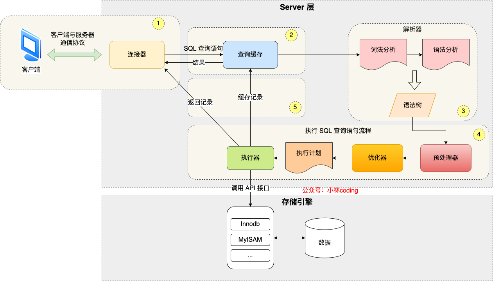

MySQL 的架构共分为两层：**Server 层和存储引擎层**

- **Server 层负责建立连接、分析和执行 SQL**。MySQL 大多数的核心功能模块都在这实现，主要包括连接器，查询缓存、解析器、预处理器、优化器、执行器等。另外，所有的内置函数（如日期、时间、数学和加密函数等）和所有跨存储引擎的功能（如存储过程、触发器、视图等。）都在 Server 层实现。
- **存储引擎层负责数据的存储和提取**。支持 InnoDB、MyISAM、Memory 等多个存储引擎，不同的存储引擎共用一个 Server 层。现在最常用的存储引擎是 InnoDB，从 MySQL 5.5 版本开始， InnoDB 成为了 MySQL 的默认存储引擎。我们常说的索引数据结构，就是由存储引擎层实现的，不同的存储引擎支持的索引类型也不相同，比如 InnoDB 支持索引类型是 B+树 ，且是默认使用，也就是说在数据表中创建的主键索引和二级索引默认使用的是 B+ 树索引。


总结：

- 连接器：建立连接，管理连接、校验用户身份；
- 查询缓存：查询语句如果命中查询缓存则直接返回，否则继续往下执行。MySQL 8.0 已删除该模块；
- 解析 SQL，通过解析器对 SQL 查询语句进行词法分析、语法分析，然后构建语法树，方便后续模块读取表名、字段、语句类型；
- 执行 SQL：执行 SQL 共有三个阶段：
  - 预处理阶段：检查表或字段是否存在；将 `select *` 中的 `*` 符号扩展为表上的所有列。
  - 优化阶段：基于查询成本的考虑， 选择查询成本最小的执行计划；
  - 执行阶段：根据执行计划执行 SQL 查询语句，从存储引擎读取记录，返回给客户端；

##### 第一步：连接器

总结：

- 与客户端进行 TCP 三次握手建立连接；
- 校验客户端的用户名和密码，如果用户名或密码不对，则会报错；
- 如果用户名和密码都对了，会读取该用户的权限，然后后面的权限逻辑判断都基于此时读取到的权限；

连接mysql

```mysql
# -h 指定 MySQL 服务得 IP 地址，如果是连接本地的 MySQL服务，可以不用这个参数；
# -u 指定用户名，管理员角色名为 root；
# -p 指定密码，如果命令行中不填写密码（为了密码安全，建议不要在命令行写密码），就需要在交互对话里面输入密码
mysql -h$ip -u$user -p
```

连接的过程需要先经过 TCP 三次握手，因为 MySQL 是基于 **TCP 协议**进行传输的

如果 MySQL 服务正常运行，完成 TCP 连接的建立后，连接器就要开始验证你的用户名和密码，如果用户名或密码不对，就收到一个"Access denied for user"的错误，然后客户端程序结束执行。

如果用户密码都没有问题，连接器就会获取该用户的权限，然后保存起来，后续该用户在此连接里的任何操作，都会**基于连接开始时读到的权限**进行权限逻辑的判断。

所以，如果一个用户已经建立了连接，即使管理员中途修改了该用户的权限，也不会影响已经存在连接的权限。修改完成后，只有再**新建的连接才会使用新的权限设置**。

查看mysql服务被多少个客户端连接了：`show processlist`

MySQL 定义了空闲连接的**最大空闲时长**，由 `wait_timeout` 参数控制的，**默认值是 8 小时**（28880秒），如果空闲连接超过了这个时间，连接器就会自动将它断开。

手动断开连接命令 `kill connection + id`

MySQL 服务支持的最大连接数由 max_connections 参数控制，比如我的 MySQL 服务默认是 151 个,超过这个值，系统就会拒绝接下来的连接请求，并报错提示“Too many connections”。

MySQL 的连接也跟 HTTP 一样，有短连接和**长连接**的概念.

**长连接存在的问题**

长连接后可能会占用内存增多，因为 MySQL 在执行查询过程中临时使用内存管理连接对象，这些连接对象资源只有在连接断开时才会释放。如果长连接累计很多，将导致 MySQL 服务占用内存太大，有可能会被系统强制杀掉，这样会发生 MySQL 服务异常重启的现象。

**怎么解决长连接占用内存问题**

1. **定期断开长连接**。断开连接后就会释放连接占用的内存资源，那么我们可以定期断开长连接。
2. **客户端主动重置连接**。MySQL 5.7 版本实现了 `mysql_reset_connection()` 函数的接口，注意这是接口函数不是命令，那么当客户端执行了一个很大的操作后，在代码里调用 mysql_reset_connection 函数来重置连接，达到释放内存的效果。这个过程不需要重连和重新做权限验证，但是会将连接恢复到刚刚创建完时的状态。

##### 第二步：查询缓存

连接器得工作完成后，客户端就可以向 MySQL 服务发送 SQL 语句了，MySQL 服务收到 SQL 语句后，就会解析出 SQL 语句的第一个字段，看看是什么类型的语句。

如果 SQL 是**查询语句（select 语句）**，MySQL 就会先去**查询缓存**（ Query Cache ）里查找缓存数据，看看之前有没有执行过这一条命令，这个查询缓存是以**key-value 形式**保存在内存中的，key 为 SQL 查询语句，value 为 SQL 语句查询的结果。

如果查询的语句命中查询缓存，那么就会直接返回 value 给客户端。如果查询的语句没有命中查询缓存中，那么就要往下继续执行，等执行完后，查询的结果就会被存入查询缓存中。

对于更新比较频繁的表，查询缓存的命中率很低的，因为**只要一个表有更新操作，那么这个表的查询缓存就会被清空**。如果刚缓存了一个查询结果很大的数据，还没被使用的时候，刚好这个表有更新操作，查询缓冲就被清空了，相当于缓存了个寂寞。

所以，MySQL 8.0 版本直接将查询缓存删掉了，也就是说 MySQL 8.0 开始，执行一条 SQL 查询语句，不会再走到查询缓存这个阶段了。

> 这里说的查询缓存是 server 层的，也就是 MySQL 8.0 版本移除的是 server 层的查询缓存，并不是 Innodb 存储引擎中的 buffer pool。

##### 第三步：解析SQL

在正式执行 SQL 查询语句之前， MySQL 会先对 SQL 语句做解析，这个工作交由「解析器」来完成。

**解析器**

解析器会做如下两件事情。

第一件事情，**词法分析**。MySQL 会根据你输入的字符串识别出关键字出来，**构建出 SQL 语法树**，这样方便后面模块获取 SQL 类型、表名、字段名、 where 条件等等。

第二件事情，**语法分析**。根据词法分析的结果，语法解析器会根据语法规则，判断你输入的这个 SQL 语句是否满足 MySQL 语法。

如果我们输入的 SQL 语句语法不对，就会在解析器这个阶段报错。

##### 第四步：执行SQL

经过解析器后，接着就要进入执行 SQL 查询语句的流程了，每条`SELECT` 查询语句流程主要可以分为下面这三个阶段：

- prepare 阶段，也就是预处理阶段；
- optimize 阶段，也就是优化阶段；
- execute 阶段，也就是执行阶段；

**预处理**

- 检查SQL查询语句中的表或者字段是否存在

- 将`select *`中的*符号扩展为表上所有列

**优化器**

**优化器主要负责将 SQL 查询语句的执行方案确定下来**，比如在表里面有多个索引的时候，优化器会基于查询成本的考虑，来决定选择使用哪个索引。

要想知道优化器选择了哪个索引，我们可以在查询语句最前面加个 `explain` 命令，这样就会输出这条 SQL 语句的执行计划，然后执行计划中的 key 就表示执行过程中使用了哪个索引。

**执行器**

经历完优化器后，就确定了执行方案，接下来 MySQL 就真正开始执行语句了，这个工作是由「执行器」完成的。在执行的过程中，执行器就会和存储引擎交互了，交互是以记录为单位的。

接下来，用三种方式执行过程，执行器和存储引擎的交互过程：

- 主键索引查询
- 全表扫描
- 索引下推

**主键索引查询**

```mysql
select * from product where id = 1;
```

这条查询语句的查询条件用到了主键索引，而且是等值查询，同时主键 id 是唯一，不会有 id 相同的记录，所以优化器决定选用访问类型为 const 进行查询，也就是使用主键索引查询一条记录，那么执行器与存储引擎的执行流程是这样的：

- 执行器第一次查询，会调用 read_first_record 函数指针指向的函数，因为优化器选择的访问类型为 const，这个函数指针被指向为 InnoDB 引擎**索引查询的接口**，把条件 `id = 1` 交给存储引擎，**让存储引擎定位符合条件的第一条记录**。
- 存储引擎通过主键索引的 B+ 树结构定位到 id = 1的第一条记录，如果记录是不存在的，就会向执行器上报记录找不到的错误，然后查询结束。如果记录是存在的，就会将记录返回给执行器；
- 执行器从存储引擎读到记录后，接着判断记录是否符合查询条件，如果符合则发送给客户端，如果不符合则跳过该记录。
- 执行器查询的过程是一个 while 循环，所以还会再查一次，但是这次因为不是第一次查询了，所以会调用 read_record 函数指针指向的函数，因为优化器选择的访问类型为 const，这个函数指针被指向为一个永远返回 - 1 的函数，所以当调用该函数的时候，执行器就退出循环，也就是结束查询了。

**全表扫描**

```mysql
select * from product where name = 'iphone';
```

这条查询语句的查询条件没有用到索引，所以优化器决定选用访问类型为 ALL 进行查询，也就是全表扫描的方式查询，那么这时执行器与存储引擎的执行流程是这样的：

- 执行器第一次查询，会调用 read_first_record 函数指针指向的函数，因为优化器选择的访问类型为 all，这个函数指针被指向为 InnoDB 引擎全扫描的接口，**让存储引擎读取表中的第一条记录**；
- 执行器会判断读到的这条记录的 name 是不是 iphone，如果不是则跳过；如果是则将记录发给客户的（是的没错，Server 层每从存储引擎读到一条记录就会发送给客户端，之所以客户端显示的时候是直接显示所有记录的，是因为客户端是等查询语句查询完成后，才会显示出所有的记录）。
- 执行器查询的过程是一个 while 循环，所以还会再查一次，会调用 read_record 函数指针指向的函数，因为优化器选择的访问类型为 all，read_record 函数指针指向的还是 InnoDB 引擎全扫描的接口，所以接着向存储引擎层要求继续读刚才那条记录的下一条记录，存储引擎把下一条记录取出后就将其返回给执行器（Server层），执行器继续判断条件，不符合查询条件即跳过该记录，否则发送到客户端；
- 一直重复上述过程，直到存储引擎把表中的所有记录读完，然后向执行器（Server层） 返回了读取完毕的信息；
- 执行器收到存储引擎报告的查询完毕的信息，退出循环，停止查询。

**索引下推**

在这部分非常适合讲索引下推（MySQL 5.6 推出的查询优化策略），这样大家能清楚的知道，「下推」这个动作，下推到了哪里。

索引下推能够减少**二级索引**在查询时的回表操作，提高查询的效率，因为它将 Server 层部分负责的事情，交给存储引擎层去处理了。

举一个具体的例子，方便大家理解，这里一张用户表如下，我对 age 和 reward 字段建立了联合索引（age，reward）：

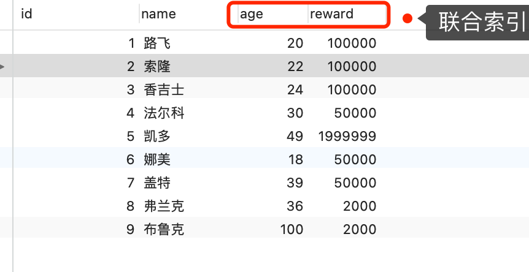

```mysql
select * from t_user  where age > 20 and reward = 100000;
```

联合索引当遇到范围查询 (>、<) 就会停止匹配，也就是 **age 字段能用到联合索引，但是 reward 字段则无法利用到索引**。


那么，不使用索引下推（MySQL 5.6 之前的版本）时，执行器与存储引擎的执行流程是这样的：

- Server 层首先调用存储引擎的接口定位到满足查询条件的第一条二级索引记录，也就是定位到 age > 20 的第一条记录；
- 存储引擎根据二级索引的 B+ 树快速定位到这条记录后，获取主键值，然后**进行回表操作**，将完整的记录返回给 Server 层；
- Server 层在判断该记录的 reward 是否等于 100000，如果成立则将其发送给客户端；否则跳过该记录；
- 接着，继续向存储引擎索要下一条记录，存储引擎在二级索引定位到记录后，获取主键值，然后回表操作，将完整的记录返回给 Server 层；
- 如此往复，直到存储引擎把表中的所有记录读完。

可以看到，没有索引下推的时候，每查询到一条二级索引记录，都要进行回表操作，然后将记录返回给 Server，接着 Server 再判断该记录的 reward 是否等于 100000。

而使用索引下推后，判断记录的 reward 是否等于 100000 的工作交给了存储引擎层，过程如下 ：

- Server 层首先调用存储引擎的接口定位到满足查询条件的第一条二级索引记录，也就是定位到 age > 20 的第一条记录；
- 存储引擎定位到二级索引后，**先不执行回表**操作，而是先判断一下该索引中包含的列（reward列）的条件（reward 是否等于 100000）是否成立。如果**条件不成立**，则直接**跳过该二级索引**。如果**成立**，则**执行回表**操作，将完成记录返回给 Server 层。
- Server 层在判断其他的查询条件（本次查询没有其他条件）是否成立，如果成立则将其发送给客户端；否则跳过该记录，然后向存储引擎索要下一条记录。
- 如此往复，直到存储引擎把表中的所有记录读完。

可以看到，使用了索引下推后，虽然 reward 列无法使用到联合索引，但是因为它包含在联合索引（age，reward）里，所以直接在存储引擎过滤出满足 reward = 100000 的记录后，才去执行回表操作获取整个记录。相比于没有使用索引下推，节省了很多回表操作。


#### mysql一行记录怎么储存的

##### mysql的数据存放在哪个文件

MySQL 存储的行为是由存储引擎实现的，MySQL 支持多种存储引擎，不同的存储引擎保存的文件自然也不同。

InnoDB 是我们常用的存储引擎，也是 MySQL 默认的存储引擎。所以，本文主要以 InnoDB 存储引擎展开讨论。

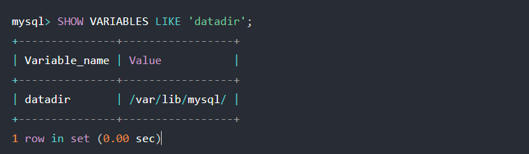

每创建一个 database（数据库） 都会在 /var/lib/mysql/ 目录里面创建一个以 database 为名的目录，然后保存表结构和表数据的文件都会存放在这个目录里。

共有三个文件：

db.opt：用来存储当前数据库的默认字符集和字符校验规则。

xxx.frm：存储xxx的表结构定义

xxx.ibd：存储xxx的表数据


**表空间文件的结构是怎样的**

**表空间由段(segment)、区(extent)、页(page)、行（row）组成**

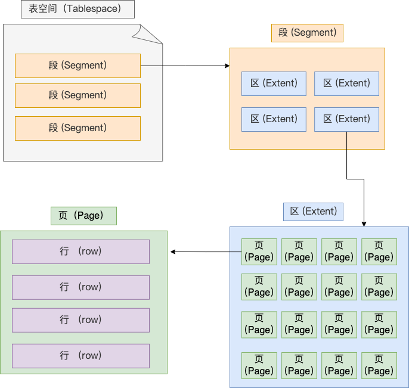

**行**：数据库中的记录都是按照行（row）进行存放的，每行记录根据不同的行格式，有不同的存储结构。

**页**：记录是按照行存储的，但是数据库的读取并不以行为单位，否则一次读取（也就是一次I/O操作）只能处理一行数据，效率会非常低。

因此，**InnoDB的数据是按照页为单位来读写的**，也就是说，当需要读取一条记录的时候，并不是将这个行记录从磁盘中读出来，而是以页为单位，将其整体读入。**默认每个页的大小为16KB**，也就是最多能保持16KB的连续存储空间。

页的类型有很多，常见的有数据页、undo日志页、溢出页等等。**数据表的行记录是用数据页来管理的**。

**区**：InooDB存储引擎使用B+树来组织数据的。B+树每一层都是通过双向链表连接起来的，如果以页为单位来分配存储空间，那么链表中相邻两个页之间的物理位置并不是连续的，可能里的非常远，那么磁盘查询是就会有大量的随机I/O，随机I/O速度很慢。

解决这个问题就是让链表中相邻的页的物理位置也相邻，这样就可以用顺序I/O了，那么在范围查询时性能就会很高。

**在表中数据量大的时候，为某个索引分配空间的时候就不再按照页为单位分配了，而是按照区（extent）为单位分配。每个区的大小为 1MB，对于 16KB 的页来说，连续的 64 个页会被划为一个区，这样就使得链表中相邻的页的物理位置也相邻，就能使用顺序 I/O 了。**

**段**：表空间是由各个段组成的的，段时由多个区组成的。段一般 分为数据段、索引段、回滚段等。

- 索引段：存放 B + 树的非叶子节点的区的集合；
- 数据段：存放 B + 树的叶子节点的区的集合；
- 回滚段：存放的是回滚数据的区的集合，之前讲[事务隔离 (opens new window)](https://xiaolincoding.com/mysql/transaction/mvcc.html)的时候就介绍到了 MVCC 利用了回滚段实现了多版本查询数据。

##### InooDB行格式有哪些

行格式（row_format），就是一条记录的存储结构。

InnoDB 提供了 4 种行格式，分别是 Redundant、**Compact**、Dynamic和 Compressed 行格式。

- Redundant 是很古老的行格式了， MySQL 5.0 版本之前用的行格式，现在基本没人用了。
- 由于 Redundant 不是一种紧凑的行格式，所以 MySQL 5.0 之后引入了 Compact 行记录存储方式，Compact 是一种紧凑的行格式，设计的初衷就是为了让一个数据页中可以存放更多的行记录，从 MySQL 5.1 版本之后，行格式默认设置成 Compact。
- Dynamic 和 Compressed 两个都是紧凑的行格式，它们的行格式都和 Compact 差不多，因为都是基于 Compact 改进一点东西。从 MySQL5.7 版本之后，默认使用 Dynamic 行格式。

Compact行格式：


记录头信息：

- delete_mask ：标识此条数据是否被删除。从这里可以知道，我们执行 detele 删除记录的时候，并不会真正的删除记录，只是将这个记录的 delete_mask 标记为 1。
- next_record：下一条记录的位置。从这里可以知道，记录与记录之间是通过链表组织的。在前面我也提到了，指向的是下一条记录的「记录头信息」和「真实数据」之间的位置，这样的好处是向左读就是记录头信息，向右读就是真实数据，比较方便。
- record_type：表示当前记录的类型，0表示普通记录，1表示B+树非叶子节点记录，2表示最小记录，3表示最大记录

变长字段的真实数据占用的字节数按照列的顺序**逆序存放**，NULL值不会记录在行格式记录的真实数据部分里的。

记录的真实信息：

- row_id

​	如果我们建表的时候**指定了主键或者唯一约束列**，那么就没有 row_id 隐藏字段了。如果既没有指定主键，又没有唯一约束，那么 InnoDB 就会为记录添加 **row_id 隐藏字段。**row_id不是必需的，占用 6 个字节。

- trx_id

事务id，表示这个数据是由哪个事务生成的。 trx_id是必需的，占用 6 个字节。

- roll_pointer

这条记录上一个版本的指针。roll_pointer 是必需的，占用 7 个字节。

**为什么边长字段长度列表需要逆序存放？**

主要是因为【记录头信息】中指向下一个记录的指针，指向的是【记录头信息】和【真实数据】之间的位置，这样的好处就是向左读就是记录头信息，向右读就是真实数据。【变长字段长度列表】逆序存放可以使得位置靠前的记录真实数据和数据对应的字段可以在同一个CPU Cache中，这样可以提高CPU Cache的命中率。

**同样的NULL值列表也需要逆序存放。**


##### mysql的NULL值是怎么存放的

MySQL 的 Compact 行格式中会用「NULL值列表」来标记值为 NULL 的列，NULL 值并不会存储在行格式中的真实数据部分。

如果存在允许NULL值的列，每个列对应一个二进制位，二进制位按照逆序排列。二进制位的值位1，代表该列的值位NULL;二进制的值位0，代表该列的值不为NULL。NULL值列表必须用整数个字节的位标识，如果使用的二进制位个数不足整数个字节，则在高位补0。

当表中所有字段都定义成 NOT NULL，行格式中就不会有 NULL值列表，这样可节省 1 字节的空间。


##### MySQL 怎么知道 varchar(n) 实际占用数据的大小？

MySQL 的 Compact 行格式中会用「**变长字段长度列表**」存储变长字段实际占用的数据大小。


##### **varchar(n)中n最大取值为多少**

**MySQL 规定除了 TEXT、BLOBs 这种大对象类型之外，其他所有的列（不包括隐藏列和记录头信息）占用的字节长度加起来不能超过 65535 个字节**

要算 varchar(n) 最大能允许存储的字节数，**还要看数据库表的字符集**，因为字符集代表着，1个字符要占用多少字节，比如 ascii 字符集， 1 个字符占用 1 字节，那么 varchar(100) 意味着最大能允许存储 100 字节的数据

**单字段的情况**

**一行数据的最大字节数 65535，其实是包含「变长字段长度列表」和 「NULL 值列表」所占用的字节数的**。所以， 我们在算 varchar(n) 中 n 最大值时，需要减去 storage overhead 占用的字节数。

储字段类型为 varchar(n) 的数据时，其实分成了三个部分来存储：

- 真实数据
- 真实数据占用的字节数
- NULL 标识占1个字节，如果不允许为NULL，这部分不需要

「变长字段长度列表」所占用的字节数 = 所有「变长字段长度」占用的字节数之和。

所以，我们要先知道每个变长字段

的「变长字段长度」需要用多少字节表示？具体情况分为：

- 条件一：如果变长字段允许存储的最大字节数小于等于 255 字节，就会用 1 字节表示「变长字段长度」；
- 条件二：如果变长字段允许存储的最大字节数大于 255 字节，就会用 2 字节表示「变长字段长度」；

在 UTF-8 字符集下，一个字符最多需要三个字节，varchar(n) 的 n 最大取值就是 65532/3 = 21844。

**多字段的情况**

**如果有多个字段的话，要保证所有字段的长度 + 变长字段字节数列表所占用的字节数 + NULL值列表所占用的字节数 <= 65535**。


##### 行溢出后，mysql是怎么处理的

MySQL 中磁盘和内存交互的基本单位是页，一个页的大小一般是 `16KB`，也就是 `16384字节`，而一个 varchar(n) 类型的列最多可以存储 `65532字节`，一些大对象如 TEXT、BLOB 可能存储更多的数据，这时一个页可能就存不了一条记录。这个时候就会**发生行溢出，多的数据就会存到另外的「溢出页」中**。

如果一个数据页存不了一条记录，InnoDB 存储引擎会自动将溢出的数据存放到「溢出页」中。在一般情况下，InnoDB 的数据都是存放在 「数据页」中。但是当发生行溢出时，溢出的数据会存放到「溢出页」中。

当发生行溢出时，在记录的真实数据处只会保存该列的一部分数据，而把剩余的数据放在「溢出页」中，然后真实数据处用 20 字节存储指向溢出页的地址，从而可以找到剩余数据所在的页。大致如下图所示。

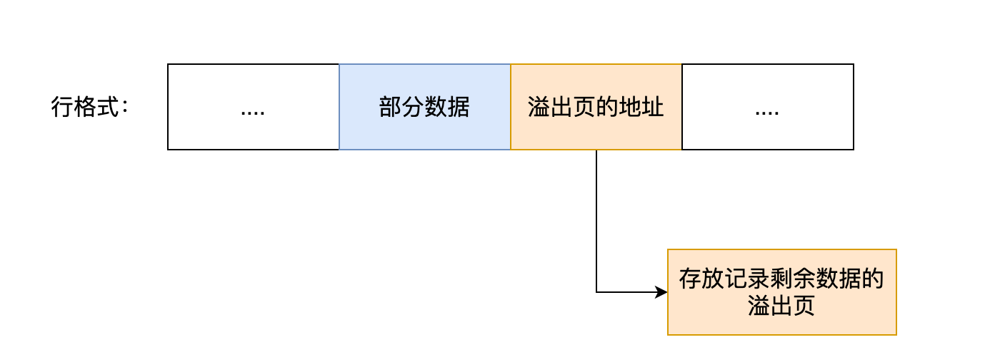


####  索引的分类

- 按「数据结构」分类：**B+tree索引、Hash索引、Full-text索引**。
- 按「物理存储」分类：**聚簇索引（主键索引）、二级索引（辅助索引）**。
- 按「字段特性」分类：**主键索引、唯一索引、普通索引、前缀索引**。
- 按「字段个数」分类：**单列索引、联合索引**

##### **按数据结构分类**

从数据结构的角度来看，MySQL 常见索引有 B+Tree 索引、HASH 索引、Full-Text 索引（全文索引）。

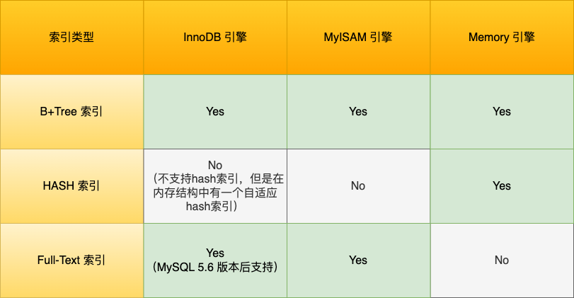

**B+Tree索引**

InnoDB 是在 MySQL 5.5 之后成为默认的 MySQL 存储引擎，B+Tree 索引类型也是 MySQL 存储引擎采用最多的索引类型。

在创建表时，InnoDB 存储引擎会根据不同的场景选择不同的列作为索引：

- 如果有主键，默认会使用主键作为聚簇索引的索引键（key）；
- 如果没有主键，就选择第一个不包含 NULL 值的唯一列作为聚簇索引的索引键（key）；
- 在上面两个都没有的情况下，InnoDB 将自动生成一个隐式自增 id 列作为聚簇索引的索引键（key）；

其它索引都属于辅助索引（Secondary Index），也被称为二级索引或非聚簇索引。**创建的主键索引和二级索引默认使用的是 B+Tree 索引**。

**通过主键查找**

B+Tree 是一种多叉树，叶子节点才存放数据，非叶子节点只存放索引，而且每个节点里的数据是**按主键顺序存放**的。每一层父节点的索引值都会出现在下层子节点的索引值中，因此在叶子节点中，包括了所有的索引值信息，并且每一个叶子节点都有两个指针，分别指向下一个叶子节点和上一个叶子节点，形成一个双向链表。

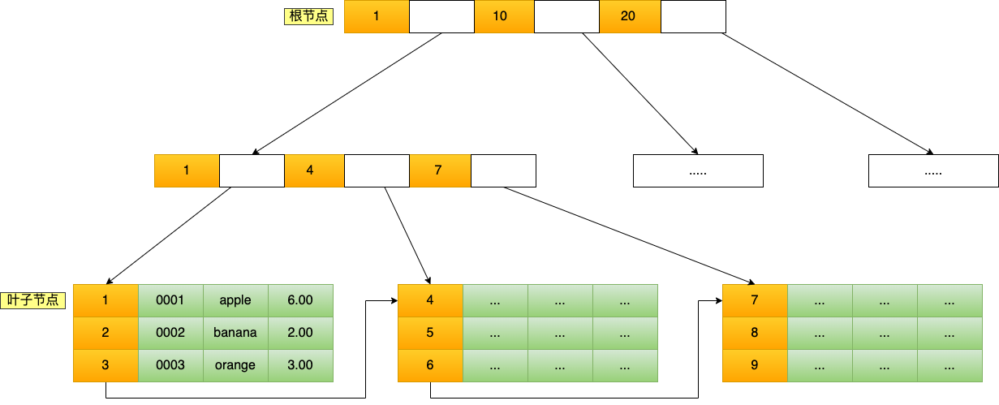

B+Tree 存储千万级的数据只需要 3-4 层高度就可以满足，这意味着从千万级的表查询目标数据最多需要 3-4 次磁盘 I/O，所以**B+Tree 相比于 B 树和二叉树来说，最大的优势在于查询效率很高，因为即使在数据量很大的情况，查询一个数据的磁盘 I/O 依然维持在 3-4次。**

**通过二级索引查找**

主键索引的 B+Tree 和二级索引的 B+Tree 区别如下：

- 主键索引的 B+Tree 的叶子节点存放的是**实际数据**，所有完整的用户记录都存放在主键索引的 B+Tree 的叶子节点里；
- 二级索引的 B+Tree 的叶子节点存放的是**主键值**，而不是实际数据。

会先检二级索引中的 B+Tree 的索引值，找到对应的叶子节点，然后获取主键值，然后再通过主键索引中的 B+Tree 树查询到对应的叶子节点，然后获取整行数据。**这个过程叫「回表」，也就是说要查两个 B+Tree 才能查到数据**。

不过，当查询的数据是能在二级索引的 B+Tree 的叶子节点里查询到，这时就不用再查主键索引查，比如下面这条查询语句：

```mysql
select id from product where product_no = '0002';
```

**这种在二级索引的 B+Tree 就能查询到结果的过程就叫作「覆盖索引」，也就是只需要查一个 B+Tree 就能找到数据**。

###### 为什么 MySQL InnoDB 选择 B+tree 作为索引的数据结构？

***1、B+Tree vs B Tree***

**单个节点数据量；维护效率；范围查询**

B+Tree 只在叶子节点存储数据，而 B 树 的非叶子节点也要存储数据，所以 B+Tree 的**单个节点的数据量更小**，在相同的磁盘 I/O 次数下，就能查询更多的节点。B+ 树有大量的冗余节点（所有非叶子节点都是冗余索引），这些冗余索引让 B+ 树在**插入、删除的效率都更高**，比如删除根节点的时候，不会像 B 树那样会发生复杂的树的变化；

另外，B+Tree 叶子节点采用的是**双链表连接**，适合 MySQL 中常见的基于**范围的顺序**查找，而 B 树无法做到这一点。(B树做范围查询需要使用中序遍历，涉及多个节点的磁盘访问。)

***2、B+Tree vs 二叉树***

**搜索复杂度**

对于有 N 个叶子节点的 B+Tree，其搜索复杂度为`O(logdN)`(d为下标)，其中 d 表示节点允许的最大子节点个数为 d 个（d叉树）。

在实际的应用当中， d 值是大于100的，这样就保证了，即使数据达到千万级别时，B+Tree 的高度依然维持在 3~4 层左右，也就是说一次数据查询操作只需要做 3~4 次的磁盘 I/O 操作就能查询到目标数据。

而二叉树的每个父节点的儿子节点个数只能是 2 个，意味着其搜索复杂度为 `O(logN)`，这已经比 B+Tree 高出不少，因此二叉树检索到目标数据所经历的磁盘 I/O 次数要更多。

***3、B+Tree vs Hash***

**范围查询**

Hash 在做等值查询的时候效率贼快，搜索复杂度为 O(1)。

但是 Hash 表不适合做**范围查询**，它更适合做**等值的查询**，这也是 B+Tree 索引要比Hash表索引有着更广泛的适用场景的原因。


##### 按物理存储分类

从物理存储的角度来看，索引分为**聚簇索引（主键索引）**、**二级索引（辅助索引）**。

这两个区别在前面也提到了：

- 主键索引的 B+Tree 的叶子节点存放的是**实际数据**，所有完整的用户记录都存放在主键索引的 B+Tree 的叶子节点里；
- 二级索引的 B+Tree 的叶子节点存放的是**主键值**，而不是实际数据。

所以，在查询时使用了二级索引，如果查询的数据能在二级索引里查询的到，那么就不需要回表，这个过程就是覆盖索引。如果查询的数据不在二级索引里，就会先检索二级索引，找到对应的叶子节点，获取到主键值后，然后再检索主键索引，就能查询到数据了，这个过程就是回表。

##### **按字段特性分类**

从字段特性的角度来看，索引分为主键索引、唯一索引、普通索引、前缀索引。

**主键索引**

主键索引就是建立在主键字段上的索引，通常在创建表的时候一起创建，一张表最多只有一个主键索引，**索引列的值不允许有空值**。

在创建表时，创建主键索引的方式如下：

```sql
CREATE TABLE table_name  (
  ....
  PRIMARY KEY (index_column_1) USING BTREE
);
```

**唯一索引**

唯一索引建立在 UNIQUE 字段上的索引，一张表可以有多个唯一索引，索引列的值必须**唯一**，但是**允许有空值**。

在创建表时，创建唯一索引的方式如下：

```sql
CREATE TABLE table_name  (
  ....
  UNIQUE KEY(index_column_1,index_column_2,...) 
);
```

建表后，如果要创建唯一索引，可以使用这面这条命令：

```sql
CREATE UNIQUE INDEX index_name
ON table_name(index_column_1,index_column_2,...); 
```

**普通索引**

普通索引就是建立在普通字段上的索引，既不要求字段为主键，也不要求字段为 UNIQUE。

在创建表时，创建普通索引的方式如下：

```sql
CREATE TABLE table_name  (
  ....
  INDEX(index_column_1,index_column_2,...) 
);
```

建表后，如果要创建普通索引，可以使用这面这条命令：

```sql
CREATE INDEX index_name
ON table_name(index_column_1,index_column_2,...); 
```

**前缀索引**

前缀索引是指对**字符类型字段**的前几个字符建立的索引，而不是在整个字段上建立的索引，前缀索引可以建立在字段类型为 char、 varchar、binary、varbinary 的列上。

使用前缀索引的**目的**是为了减少索引占用的存储空间，提升查询效率。

在创建表时，创建前缀索引的方式如下：

```sql
CREATE TABLE table_name(
    column_list,
    INDEX(column_name(length))
); 
```

建表后，如果要创建前缀索引，可以使用这面这条命令：

```sql
CREATE INDEX index_name
ON table_name(column_name(length)); 
```

##### 按字段个数分类

从字段个数的角度来看，索引分为单列索引、联合索引（复合索引）。

- 建立在单列上的索引称为单列索引，比如主键索引；
- 建立在多列上的索引称为联合索引；

**联合索引**

通过将多个字段组合成一个索引，该索引就被称为联合索引。

比如，将商品表中的 product_no 和 name 字段组合成联合索引`(product_no, name)`，创建联合索引的方式如下：

```sql
CREATE INDEX index_product_no_name ON product(product_no, name);
```

联合索引`(product_no, name)` 的 B+Tree 示意图如下

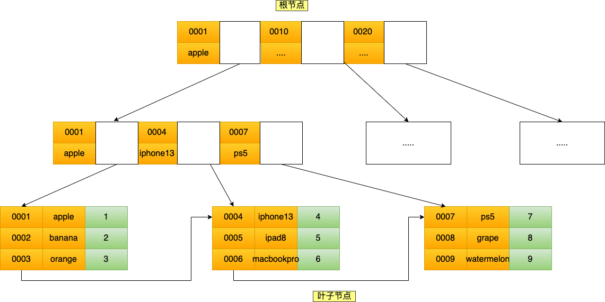

可以看到，联合索引的非叶子节点用两个字段的值作为 B+Tree 的 key 值。当在联合索引查询数据时，先按 product_no 字段比较，在 product_no 相同的情况下再按 name 字段比较。

也就是说，联合索引查询的 B+Tree 是先按 product_no 进行排序，然后再 product_no 相同的情况再按 name 字段排序。

因此，使用联合索引时，存在**最左匹配原则**，也就是按照最左优先的方式进行索引的匹配。在使用联合索引进行查询的时候，如果不遵循「最左匹配原则」，联合索引会失效，这样就无法利用到索引快速查询的特性了。**利用索引的前提是索引里的 key 是有序的**。

**联合索引范围查询**

联合索引有一些特殊情况，**并不是查询过程使用了联合索引查询，就代表联合索引中的所有字段都用到了联合索引进行索引查询**，也就是可能存在部分字段用到联合索引的 B+Tree，部分字段没有用到联合索引的 B+Tree 的情况。

这种特殊情况就发生在范围查询。联合索引的最左匹配原则会一直向右匹配直到遇到「范围查询」就会停止匹配。**也就是范围查询的字段可以用到联合索引，但是在范围查询字段的后面的字段无法用到联合索引**。

**联合索引的最左匹配原则，在遇到范围查询（如 >、<）的时候，就会停止匹配，也就是范围查询的字段可以用到联合索引，但是在范围查询字段的后面的字段无法用到联合索引。注意，对于 >=、<=、BETWEEN、like 前缀匹配的范围查询，并不会停止匹配，**


#### 什么时候索引会失效

索引失效场景：

1. 联合索引不符合最左匹配原则。

   原因：联合索引下，数据按照索引的第一列进行排序，第一列相同才会按照第二列排序。如果想使用索引必须从左到右。

2. like查询时`%`左模糊或者全模糊：`'%ab'、'a%b'`

   原因：B+树是按照索引值有序排列存储的，只能根据前缀进行比较。

3. 对索引列进行计算或使用了函数

   原因：因为索引保存的是索引字段的原始值，而不是经过函数计算后的值。（MySQL8.0后索引增加了函数索引，可以针对函数计算后的值建立索引）

4. 索引列进行了隐式类型转换 ： 查询是数值字符串，字段为数值类型不会失效

   原因：字段是字符串，查询为数值情况下，mysql会自动把字符串转为数字进行一次全表扫描

5. <>不等于导致索引失效

6. order by导致索引失效

   可能原因：（1）order by一个非索引字段 （2）order by一个索引字段，但是索引顺序和order by顺序不一致 （3）order by多个字段会进行回表，优化器选择进行全表扫描

7. 在where后错误使用or，导致索引失效（or前后条件只要有一个没有建立索引就会失效）

   原因：or前后有有未建立索引的条件

8. mysql优化器估计全表扫描比使用索引快，会导致索引失效


#### 什么时候需要索引、不需要索引

索引的好处：提高查询速度

缺点：

- 占用物理空间，数量越大，占用空间越大
- 创建索引和维护索引需要耗费时间，这种事件随数据量的增加而增大。
- 会降低表的增删改的效率，因为每次增删改索引，B+树为了维护索引的有序性，都需要进行动态维护

**什么时候使用索引**
- 字段有唯一性限制的，比如商品编码
- 经常用where查询条件的字段，这样能够提高整个表的查询速度，如果查询条件不是一个字段，可以建立联合索引。
- 经常用group by和order by的字段，这样在查询的时候就不需要再去做一次排序了，因为建立索引后B+树中的记录都是有序的

**什么时候不需要创建索引**
- where、 order by、 group by用不到的字段
- 字段中存在大量重复数据，不需要创建索引。
- 表数据太少的时候不需要创建索引
- 经常更新的字段，由于要维护B+树的有序性，就需要频繁的重建索引，影响性能

#### 优化索引的方法

常见的优化索引的方法：

- 前缀索引优化
- 覆盖索引优化
- 主键索引最好是自增的
- 防止索引失效

**前缀索引优化**

前缀索引顾名思义就是使用某个字段中字符串的前几个字符建立索引，使用前缀索引是为了**减小索引字段大小**，可以增加一个索引页中存储的索引值，有效提高索引的查询速度。在一些大字符串的字段作为索引时，使用前缀索引可以帮助我们减小索引项的大小。

不过，前缀索引有一定的局限性，例如：

- order by 就无法使用前缀索引；
- 无法把前缀索引用作覆盖索引；

**覆盖索引优化**

覆盖索引是指 SQL 中 query 的所有字段，在索引 B+Tree 的叶子节点上都能找得到的那些索引，从**二级索引中查询得到记录**，而不需要通过聚簇索引查询获得，可以**避免回表**的操作。

**主键索引最好是自增的**

InnoDB 创建主键索引默认为聚簇索引，数据被存放在了 B+Tree 的叶子节点上。也就是说，同一个叶子节点内的各个数据是按主键顺序存放的，因此，每当有一条新的数据插入时，数据库会根据主键将其插入到对应的叶子节点中。

**如果我们使用自增主键**，那么每次插入的新数据就会按顺序添加到当前索引节点的位置，不需要移动已有的数据，当页面写满，就会自动开辟一个新页面。因为每次**插入一条新记录，都是追加操作，不需要重新移动数据**，因此这种插入数据的方法效率非常高。

**如果我们使用非自增主键**，由于每次插入主键的索引值都是随机的，因此每次插入新的数据时，就可能会插入到现有数据页中间的某个位置，这将不得不移动其它数据来满足新数据的插入，甚至需要从一个页面复制数据到另外一个页面，我们通常将这种情况称为**页分裂**。**页分裂还有可能会造成大量的内存碎片，导致索引结构不紧凑，从而影响查询效率**。

**索引最好设置为NOT NULL**

索引列要设置为 NOT NULL 约束：

- 第一原因：索引列存在 NULL 就会导致优化器在做索引选择的时候更加复杂，更加难以优化，因为可为 NULL 的列会使索引、索引统计和值比较都更复杂，比如进行索引统计时，count 会省略值为NULL 的行。
- 第二个原因：NULL 值是一个没意义的值，但是它会占用物理空间，所以会带来的存储空间的问题，因为 InnoDB 存储记录的时候，如果表中存在允许为 NULL 的字段，那么[行格式 (opens new window)中**至少会用 1 字节空间存储 NULL 值列表**，如下图的紫色部分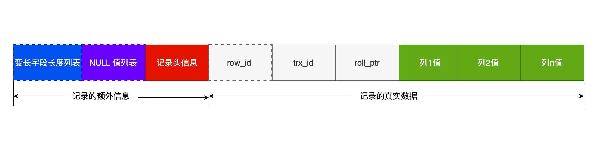

**防止索引失效**

发生索引失效的情况：

- 当我们使用左或者左右模糊匹配的时候，也就是 `like %xx` 或者 `like %xx%`这两种方式都会造成索引失效；（无法使用B+树快速定位）
- 当我们在查询条件中对索引列做了计算、函数、类型转换操作，这些情况下都会造成索引失效；
- 联合索引要能正确使用需要**遵循最左匹配原则**，也就是按照最左优先的方式进行索引的匹配，否则就会导致索引失效。
- 在 WHERE 子句中，如果在 OR 前的条件列是索引列，而在 OR 后的条件列不是索引列，那么索引会失效。


#### B+树是如何进行查询的

InnoDB 里的 B+ 树中的**每个节点都是一个数据页**，结构示意图如下：

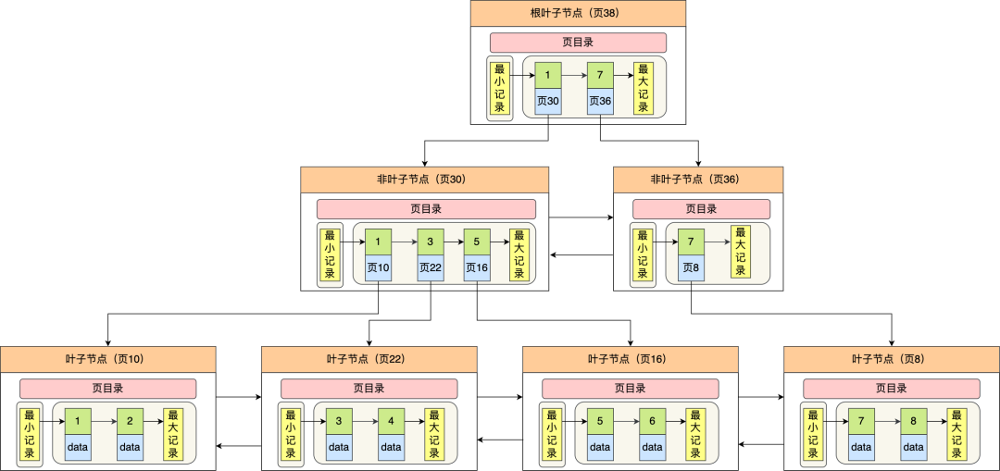

 B+ 树的特点：

- 只有叶子节点（最底层的节点）才存放了数据，非叶子节点（其他上层节）仅用来存放目录项作为索引。
- 非叶子节点分为不同层次，通过分层来降低每一层的搜索量；
- 所有节点按照索引键大小排序，构成一个双向链表，便于范围查询；

我们再看看 B+ 树如何实现快速查找主键为 6 的记录，以上图为例子：

- 从根节点开始，通过二分法快速定位到符合页内范围包含查询值的页，因为查询的主键值为 6，在[1, 7)范围之间，所以到页 30 中查找更详细的目录项；
- 在非叶子节点（页30）中，继续通过二分法快速定位到符合页内范围包含查询值的页，主键值大于 5，所以就到叶子节点（页16）查找记录；
- 接着，在叶子节点（页16）中，通过槽查找记录时，使用二分法快速定位要查询的记录在哪个槽（哪个记录分组），定位到槽后，再遍历槽内的所有记录，找到主键为 6 的记录。

可以看到，在定位记录所在哪一个页时，也是通过二分法快速定位到包含该记录的页。定位到该页后，又会在该页内进行二分法快速定位记录所在的**分组**（槽号），最后在分组内进行遍历查找。

#### count(*)和count(1)有什么区别？那个性能最好?

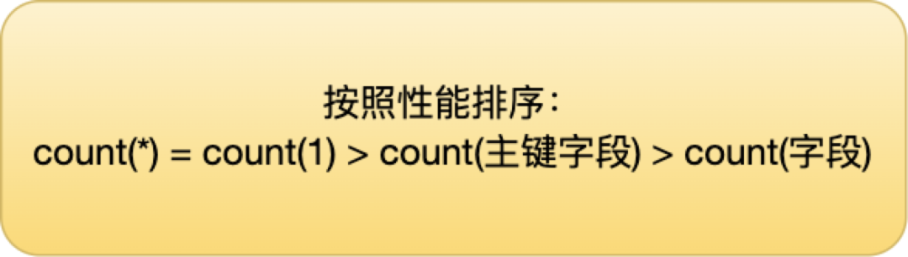

count() 是一个聚合函数，函数的参数不仅可以是字段名，也可以是其他任意表达式，该函数作用是**统计符合查询条件的记录中，函数指定的参数不为 NULL 的记录有多少个**。

```mysql
select count(name) from t_order;
```

这条语句是统计「 t_order 表中，name 字段不为 NULL 的记录」有多少个。也就是说，如果某一条记录中的 name 字段的值为 NULL，则就不会被统计进去。

```sql
select count(1) from t_order;
```

这条语句是统计「 t_order 表中，1 这个表达式不为 NULL 的记录」有多少个。1 这个表达式就是单纯数字，它永远都不是 NULL，所以上面这条语句，**其实是在统计 t_order 表中有多少个记录**。


##### count(1) 执行过程是怎样的

```sql
select count(1) from t_order;
```

InnoDB 循环遍历聚簇索引（主键索引），将读取到的记录返回给 server 层，**但是不会读取记录中的任何字段的值**，因为 count 函数的参数是 1，不是字段，所以不需要读取记录中的字段值。参数 1 很明显并不是 NULL，因此 server 层每从 InnoDB 读取到一条记录，就将 count 变量加 1。

可以看到，count(1) 相比 count(主键字段) **少一个步骤**，就是不需要读取记录中的字段值，所以通常会说 count(1) 执行效率会比 count(主键字段) 高一点。

##### count(*) 执行过程是怎样的？

**count(`*`) 其实等于 count(`0`)**，也就是说，当你使用 count(`*`) 时，MySQL 会将 `*` 参数转化为参数 0 来处理。所以，**count(\*) 执行过程跟 count(1) 执行过程基本一样的**，性能没有什么差异。

##### count(字段) 执行过程是怎样的？

对于这个查询来说，会采用全表扫描的方式来计数，所以它的执行效率是比较差的。

count(1)、 count(*)、 count(主键字段)在执行的时候，如果表里存在二级索引，优化器就会选择二级索引进行扫描。(二级索引的key值是主键)

所以，如果要执行 count(1)、 count(*)、 count(主键字段) 时，尽量在数据表上建立二级索引，这样优化器会自动采用 key_len 最小的二级索引进行扫描，相比于扫描主键索引效率会高一些。

再来，就是不要使用 count(字段) 来统计记录个数，因为它的效率是最差的，会采用全表扫描的方式来统计。如果你非要统计表中该字段不为 NULL 的记录个数，建议给这个字段建立一个二级索引。

#### 如何优化count(*)

1. 建立二级索引

2. 近似值

   如果对业务的统计数据不需要很精准，可以使用show tabel status或者explain来进行估算。执行 explain 命令效率是很高的，因为它并不会真正的去查询，而是估算值。

3. 额外表保存计数值

   如果想精确获取表的记录综述，可以将这个计数值单独保存到一张计数表中。

#### 事务由哪些特性

事务必须遵循的4个特性：

- **原子性**(Atomicity)：一个事务中的所有操作，要么全部完成，要么全部不完成，不会结束在中间的某个环节，而且事务在执行过程中发生错误，会被回滚到事务开始前的状态。
- **一致性**(Consistency)：是指事务操作前和操作后，数据满足完整性约束，数据库保持一致性状态。
- **隔离性**(Isolation)：数据库允许多个并发事务同时对数据库进行读写和修改的能力，隔离性可以防止多个事务并发执行时由于交叉执行而导致的数据的不一致。因为多个事务同时使用相同的数据时，不会相互干扰，每个事务都有一个完整的数据空间，对其他并发事务是隔离的。
- **持久性**(Durability)：事务处理结束后，对数据的修改是永久的，即便系统故障也不会丢失。

#### InnoDB引擎通过什么技术来保证事务的四个特性的？

- 持久性是通过redo log（重做日志）来保证的

- 原子性是通过undo log（回滚日志）来保证的

- 隔离性是通过MVCC(多版本并发控制)或锁机制来保证的

- 一致性是通过持久性+原子性+隔离性来保证的

#### 并发事务会引发什么问题？

在同时处理多个事务的时候，可能出现**脏读**（dirty read）、**不可重复读**（non-repeatable read）、**幻读**（phantom read）的问题。

这三个现象的严重性排序如下：


##### 脏读：读到其他事务未提交的数据；

**如果一个事务读到了另一个未提交事务修改过的数据，就意味着发生了脏读现象。**

假设有 A 和 B 这两个事务同时在处理，事务 A 先开始从数据库中读取小林的余额数据，然后再执行更新操作，如果此时事务 A 还没有提交事务，而此时正好事务 B 也从数据库中读取小林的余额数据，那么事务 B 读取到的余额数据是刚才事务 A 更新后的数据，即使没有提交事务。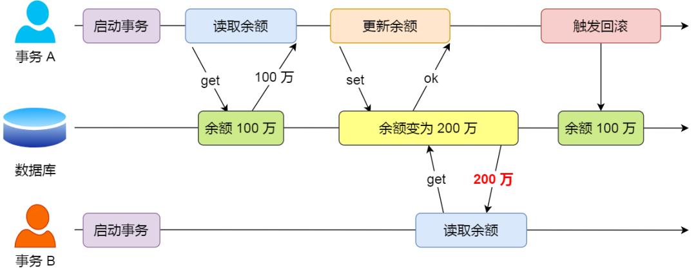

因为事务 A 是还没提交事务的，也就是它随时可能发生回滚操作，**如果在上面这种情况事务 A 发生了回滚，那么事务 B 刚才得到的数据就是过期的数据，这种现象就被称为脏读。**

##### 不可重复读：前后读取的数据不一致

**在一个事务内多次读取同一个数据，如果出现前后两次读到的数据不一样的情况，就意味着发生了「不可重复读」现象。**

假设有 A 和 B 这两个事务同时在处理，事务 A 先开始从数据库中读取小林的余额数据，然后继续执行代码逻辑处理，**在这过程中如果事务 B 更新了这条数据，并提交了事务，那么当事务 A 再次读取该数据时，就会发现前后两次读到的数据是不一致的，这种现象就被称为不可重复读。**

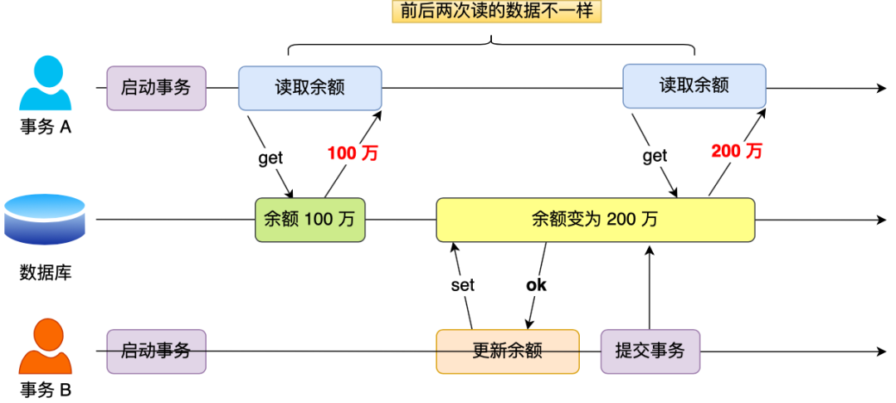

##### 幻读：前后读取的记录数量不一致

**在一个事务内多次查询某个符合查询条件的「记录数量」，如果出现前后两次查询到的记录数量不一样的情况，就意味着发生了「幻读」现象。**

假设有 A 和 B 这两个事务同时在处理，事务 A 先开始从数据库查询账户余额大于 100 万的记录，发现共有 5 条，然后事务 B 也按相同的搜索条件也是查询出了 5 条记录。

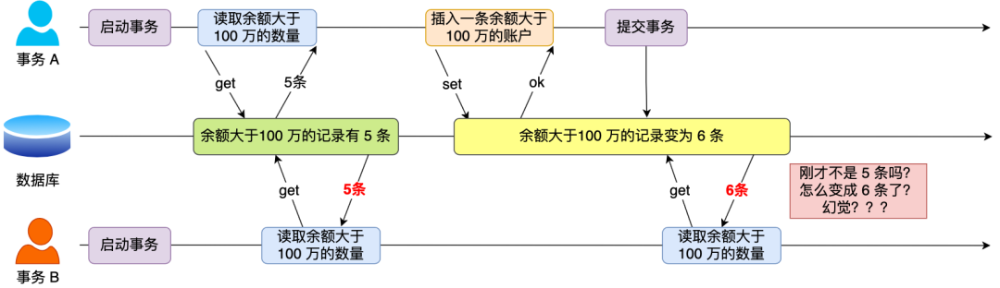

接下来，事务 A 插入了一条余额超过 100 万的账号，并提交了事务，此时数据库超过 100 万余额的账号个数就变为 6。

然后事务 B 再次查询账户余额大于 100 万的记录，此时查询到的记录数量有 6 条，**发现和前一次读到的记录数量不一样了，就感觉发生了幻觉一样，这种现象就被称为幻读。**

#### 事务的隔离级别有哪些

SQL 标准提出了四种隔离级别来规避脏读、不可重复度、幻读，隔离级别越高，性能效率就越低，这四个隔离级别如下：

- **读未提交（read uncommitted）**，指一个事务还没提交时，它做的变更就能被其他事务看到；
- **读提交（read committed）**，指一个事务提交之后，它做的变更才能被其他事务看到；
- **可重复读（repeatable read）**，指一个事务执行过程中看到的数据，一直跟这个事务启动时看到的数据是一致的，**MySQL InnoDB 引擎的默认隔离级别**；
- **串行化（serializable ）**；会对记录加上读写锁，在多个事务对这条记录进行读写操作时，如果发生了读写冲突的时候，后访问的事务必须等前一个事务执行完成，才能继续执行；

按隔离水平高低排序如下：


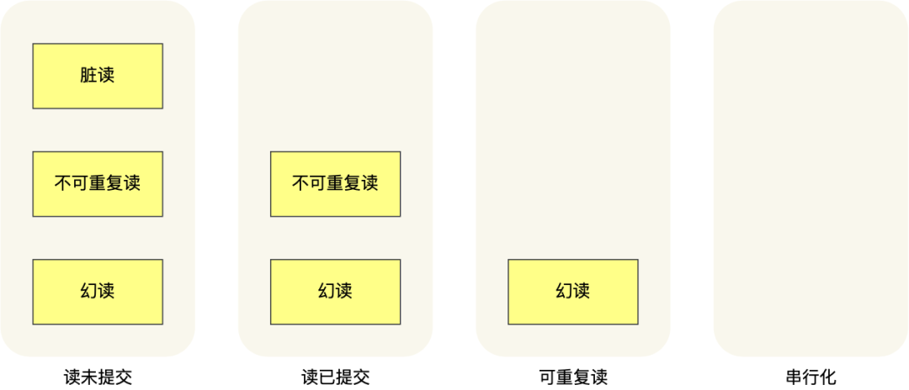

也就是说：

- 在「读未提交」隔离级别下，可能发生脏读、不可重复读和幻读现象；
- 在「读提交」隔离级别下，可能发生不可重复读和幻读现象，但是不可能发生脏读现象；
- 在「可重复读」隔离级别下，可能发生幻读现象，但是不可能脏读和不可重复读现象；
- 在「串行化」隔离级别下，脏读、不可重复读和幻读现象都不可能会发生。

**MySQL InnoDB 引擎的默认隔离级别虽然是「可重复读」，但是它很大程度上避免幻读现象（并不是完全解决了，详见这篇[文章 (opens new window)](https://xiaolincoding.com/mysql/transaction/phantom.html)）**，解决的方案有两种：

- 针对**快照读**（普通 select 语句），是**通过 MVCC 方式解决了幻读**，因为可重复读隔离级别下，事务执行过程中看到的数据，一直跟这个事务启动时看到的数据是一致的，即使中途有其他事务插入了一条数据，是查询不出来这条数据的，所以就很好了避免幻读问题。
- 针对**当前读**（select ... for update 、 update、insert、delete等语句），是**通过 next-key lock（记录锁+间隙锁）方式解决了幻读**，因为当执行 select ... for update 语句的时候，会加上 next-key lock，如果有其他事务在 next-key lock 锁范围内插入了一条记录，那么这个插入语句就会被阻塞，无法成功插入，所以就很好了避免幻读问题。


#### MVCC有完全解决幻读问题了吗

可重复读级别下虽然很大程度上避免了幻读，但还是没有完全解决幻读。

针对快照读，MVCC能够解决幻读问题，但对于当前读是直接读取内存在记录，是无法解决幻读问题的，解决方法是通过记录锁和间隙锁的方式解决。

但是当事务中间使用当前读还是会出现幻读。

出现幻读场景：

场景1：

- T1 时刻：事务 A 先执行「快照读语句」：select * from t_test where id > 100 得到了 3 条记录。
- T2 时刻：事务 B 往插入一个 id= 200 的记录并提交；
- T3 时刻：事务 A 再执行「当前读语句」 select * from t_test where id > 100 for update 就会得到 4 条记录，此时也发生了幻读现象。

这种场景下，应该尽量在开启事务之后，马上执行`select ... for update `类似的当前读语句生成next-key lock，避免其他事务插入记录。

场景2：

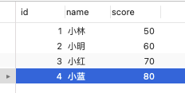

- 事务A执行查询id=5的记录，此时表中没有查询不出来
- 然后事务B插入一条id=5的记录，并提交事务
- 事务A更新id=5这条记录（事务A看不到id=5这条记录，但还是去更新了），然后再次查询id=5，事务A就可以看到事务B插入的记录了。
- （在可重复读隔离级别下，事务 A 第一次执行普通的 select 语句时生成了一个 ReadView，之后事务 B 向表中新插入了一条 id = 5 的记录并提交。接着，事务 A 对 id = 5 这条记录进行了更新操作，在这个时刻，这条新记录的 trx_id 隐藏列的值就变成了事务 A 的事务 id，之后事务 A 再使用普通 select 语句去查询这条记录时就可以看到这条记录了，于是就发生了幻读。）

这种场景下，MySQL innodb中的mvcc无法完全避免幻读现象。

#### 事务的隔离级别如何实现

- 读未提交：因为可以读到未提交事务的数据，所以直接读取最新数据就好
- 串行化：通过加读写锁的方式来避免并行访问
- 读提交和可重复读：通过Read View（数据快照）来实现的，他们的区别在于创建Read View的时机不同。读提交隔离级别是在每个语句执行前都会重新生成一个Read View，而可重复读隔离级别是启动事务时生成一个Read View，然后整个事务期间都在用这个Read View。


> 事务开启指令：
>
> - 第一种：begin/start transaction 命令；
> - 第二种：start transaction with consistent snapshot 命令；
>
> 执行「开始事务」命令，并不意味着启动了事务。
>
> 执行了` begin/start transaction`命令后，并不代表事务启动了，而是执行命令后执行增删改查操作的sql语句才会开启事务。
>
> 执行`start transaction with consistent snapshot `命令会马上启动事务。


#### Read View怎么实现/MVCC多版本控制原理

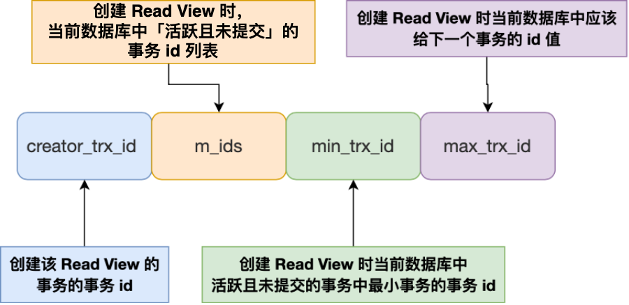

在 MySQL 中，Read View 是用于实现多版本并发控制（MVCC）的一种数据结构，它用于保证在并发读取数据库时，读取到的数据是一致的。

Read View 有四个重要的字段：

- m_ids ：指的是在创建 Read View 时，当前数据库中「活跃事务」的**事务 id 列表**，注意是一个列表，**“活跃事务”指的就是，启动了但还没提交的事务**。
- min_trx_id ：指的是在创建 Read View 时，当前数据库中「活跃事务」中事务 **id 最小的事务**，也就是 m_ids 的最小值。
- max_trx_id ：这个并不是 m_ids 的最大值，而是**创建 Read View 时当前数据库中应该给下一个事务的 id 值**，也就是全局事务中最大的事务 id 值 + 1；
- creator_trx_id ：指的是**创建该 Read View 的事务的事务 id**。

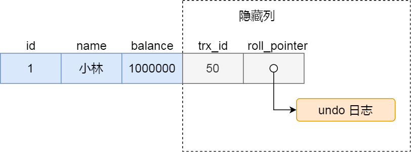

对于InnoDB存储的数据库列表，它的聚簇索引包括**trx_id**和**roll_pointer**两个隐藏列。

- trx_id：当一个事务对某条聚簇索引记录进行改动时，就会把该**事务的id记录在trx_id隐藏列**中。
- roll_pointer：每次对某条聚簇索引记录进行改动时，都会把旧版本的记录写入到undo日志中，这个隐藏列是一个指针，指向**每一个旧版本记录，能够通过他找到修改前的记录**。

创建Read View后，记录中的trx_id可以划分为三种情况：

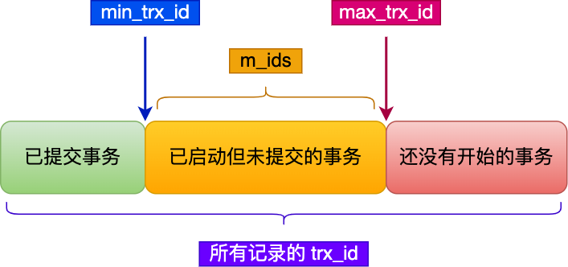

一个事务去访问记录的时候，除了自己的更新记录总是可见之外，还有这几种情况：

- 如果记录的 trx_id 值小于 Read View 中的 `min_trx_id` 值，表示这个版本的记录是在创建 Read View **前**已经提交的事务生成的，所以该版本的记录对当前事务**可见**。

- 如果记录的 trx_id 值大于等于 Read View 中的 `max_trx_id` 值，表示这个版本的记录是在创建 Read View **后**才启动的事务生成的，所以该版本的记录对当前事务**不可见**。 

- 如果记录的 trx_id 值在 Read View 的`min_trx_id`和`max_trx_id`之间，需要判断 trx_id 是否在 m_ids 列表中：

  - 如果记录的 trx_id **在** `m_ids` 列表中，表示生成该版本记录的活跃事务依然活跃着（还没提交事务），所以该版本的记录对当前事务**不可见**。
  - 如果记录的 trx_id **不在** `m_ids`列表中，表示生成该版本记录的活跃事务已经被提交，所以该版本的记录对当前事务**可见**。

**这种通过「版本链」来控制并发事务访问同一个记录时的行为就叫 MVCC（多版本并发控制）。**


#### MySQL锁

根据加锁的范围，可以分为全局锁、表级锁、行锁三类。

##### **全局锁**

加锁:`flush tables with read lock` 执行后数据库就处于只读状态了

释放锁:`unlock tables`

全局锁应用场景：**全库数据备份**，数据备份期间，不会因为数据或表结构的更新而出现备份文件的数据与预期不一样。

缺点：加上全局锁，数据库处于只读状态。如果数据库又很多数据，备份会花费很多的时间，关键在备份期间，业务只能读取数据，而不能更新数据，导致业务停滞。

既然备份数据库数据时使用全局锁会影响业务，有什么方法可以避免？

如果数据库的存储引擎支持可重复读隔离级别，就可以在备份数据库前先开启事务，创建Read view，然后整个事务的执行期间都用这个Read view，在MVCC的支持下备份期间业务依然可以进行更新操作。（Innodb存储引擎支持可重复读隔离级别，MylSam不支持，只能用全局锁来备份数据库）

##### 表级锁

MySQL表级锁有这几种：表锁、元数据锁（MDL）、意向锁、AUTO-INC锁

**表锁：**

```sql
//表级别的共享锁，也就是读锁；
lock tables t_student read;
//表级别的独占锁，也就是写锁；
lock tables t_stuent write;
//释放表锁
unlock tables
```

会话退出后也会释放表锁

表锁除了会限制别的线程的读写外，也会**限制本线程接下来的读写操作**。也就是说如果本线程对学生表加了「共享表锁」，那么本线程接下来如果要对学生表执行写操作的语句，是会被阻塞的，当然其他线程对学生表进行写操作时也会被阻塞，直到锁被释放。

缺点：表锁颗粒度太大，会影响并发性能。InnoDB实现了颗粒度更细的行级锁。

**元数据锁（MDL）：**

不需要显式的使用MDL，因为我们在对数据库表进行操作时会自动给这个表加上MDL。

- 对一张表进行 CRUD 操作时，加的是 **MDL 读锁**；
- 对一张表做结构变更操作的时候，加的是 **MDL 写锁**；

MDL 是为了保证当用户对表执行 CRUD 操作时，防止其他线程对这个表结构做了变更。

MDL 是在事务提交后才会释放，这意味着**事务执行期间，MDL 是一直持有的**。

为了能安全的对表结构进行变更，在对表结构变更前，先要看看数据库中的长事务，是否有事务已经对表加上了 MDL 读锁，如果可以考虑 kill 掉这个长事务，然后再做表结构的变更。

> 原因：
>
> 1. 首先，线程 A 先启用了事务（但是一直不提交），然后执行一条 select 语句，此时就先对该表加上 MDL 读锁；
> 2. 然后，线程 B 也执行了同样的 select 语句，此时并不会阻塞，因为「读读」并不冲突；
> 3. 接着，线程 C 修改了表字段，此时由于线程 A 的事务并没有提交，也就是 MDL 读锁还在占用着，这时线程 C 就无法申请到 MDL 写锁，就会被阻塞，
>
> 那么在线程 C 阻塞后，后续有对该表的 select 语句，就都会被阻塞，如果此时有大量该表的 select 语句的请求到来，就会有大量的线程被阻塞住（申请MDL操作队列中写锁优先级高于读锁），这时数据库的线程很快就会爆满了。

**意向锁：**

意向锁作用：**快速判断表里是否有记录被加锁**。

- 在使用 InnoDB 引擎的表里对某些记录加上「共享锁」之前，需要先在表级别加上一个「意向共享锁」；
- 在使用 InnoDB 引擎的表里对某些记录加上「独占锁」之前，需要先在表级别加上一个「意向独占锁」；

也就是当执行插入、更新、删除操作，需要对表加上意向独占锁，然后对该记录加独占锁。

普通的select语句不会加行级锁，因为普通的select是利用MVCC实现一致性读，是无锁的。

意向锁只会和表级锁（共享表锁、独占表锁）发生冲突。

如果没有「意向锁」，那么加「独占表锁」时，就需要遍历表里所有记录，查看是否有记录存在独占锁，这样效率会很慢。

那么有了「意向锁」，由于在对记录加独占锁前，先会加上表级别的意向独占锁，那么在加「独占表锁」时，直接查该表是否有意向独占锁，如果有就意味着表里已经有记录被加了独占锁，这样就不用去遍历表里的记录。

**AUTO-INC锁：**

自增主键使用。

在插入数据时，可以不指定主键的值，数据库会自动给主键赋值递增的值，主要是通过AUTO-INC实现的。

AUTO-INC 锁是特殊的表锁机制，锁**不是再一个事务提交后才释放，而是再执行完插入语句后就会立即释放**。

##### 行级锁

 InnoDB 引擎是支持行级锁的，而 MyISAM 引擎并不支持行级锁。

行级锁的类型主要有三类：

- Record Lock，记录锁，也就是仅仅把一条记录锁上；
- Gap Lock，间隙锁，锁定一个范围，但是不包含记录本身（左开右开）；间隙锁之间是兼容的，即两个事务可以同时持有包含共同间隙范围的间隙锁，并不存在互斥关系，因为间隙锁的目的是防止插入记录而提出的。
- Next-Key Lock：Record Lock + Gap Lock 的组合，称为一个临建锁，锁定一个范围，并且锁定记录本身。

插入意向锁（行级别锁）

一个事务在插入一条记录时，需要判断插入位置是否已被其他事务加了间隙锁。如果有的话插入操作就会**阻塞**，直到拥有间隙锁的哪个事务提交为止，在此期间会生成一个**插入意向锁**，表明有事务想在某个区间插入新记录，但现在处于等待状态。


#### 日志

undo log(回滚日志)：是**innodb存储引擎层**生成的日志，实现了事务中的**原子性**，主要用于**事务回滚**和**MVCC多版本控制**。

redo log(重做日志)：是**innodb存储引擎层**生成的日志，实现了事务中的**持久性**，主要用于**掉电等故障恢复**。

binlog(归档日志)：是**server层**生成的日志，主要用于**数据备份和主从复制**。

##### undo log

undo log是一种用于撤销回退的日志，在事务没提交之前，MySQL会先记录更新前的数据到undo log日志文件里，当事务回滚时，可以利用undo log进行回滚。

每次innodb引擎对一条记录进行操作（增删改）时，把回滚时需要的信息都记录到undo log里。如：

- **插入**记录时，把这条记录的**主键记录**下来，回滚时只需**删除主键**对应的记录。

- **删除**记录时，把记录中的**内容**都记录下来，回滚时把这些**内容插入**到表中。
- **更新**记录时，把被更新列的**旧值**记录下来，回滚时**更新为旧值**。

一条记录的每一次更新操作产生的 undo log 格式都有一个 roll_pointer 指针和一个 trx_id 事务id：

- 通过 trx_id 可以知道该记录是被哪个事务修改的；
- 通过 roll_pointer 指针可以将这些 undo log 串成一个链表，这个链表就被称为版本链；

另外，**undo log 还有一个作用，通过 ReadView + undo log 实现 MVCC（多版本并发控制）**。

因此undo log**两大作用**：

- **实现事务回滚，保障事务的原子性**。事务处理过程中，如果出现了错误或者用户执 行了 ROLLBACK 语句，MySQL 可以利用 undo log 中的历史数据将数据恢复到事务开始之前的状态。
- **实现 MVCC（多版本并发控制）关键因素之一**。MVCC 是通过 ReadView + undo log 实现的。undo log 为每条记录保存多份历史数据，MySQL 在执行快照读（普通 select 语句）的时候，会根据事务的 Read View 里的信息，顺着 undo log 的版本链找到满足其可见性的记录。

##### Buffer Pool

Buffer Pool（缓冲池）在Innodb存储引擎层，用来提高数据库的读写性能。在server端完成对数据的查询和更新后，将其存放入Buffer Pool中（基于**内存**的）。

MySQL以页为单位进行数据的读取，Buffer Pool同样以页来进行划分（记录一整页的数据）。Buffer Pool中的页称为**缓存页**。

Buffer Pool 除了缓存「**索引页**」和「**数据页**」，还包括了 **Undo 页**，**插入缓存**、**自适应哈希索引**、**锁信息**等等。

Buffer Pool作用：

- 当读取数据时，如果数据位于Buffer Pool中，客户端直接读取Buffer Pool中的数据，否则再去磁盘中读取。
- 当修改数据时，如果数据存在于Buffer Pool中，那直接修改Buffer Pool中数据所在的页，然后将其设置为脏页（表示该页内存数据和磁盘中不一致），为了减少磁盘I/O，不会立刻将脏页写入磁盘，而是由后台线程选择一个合适的时机将脏页写入磁盘中。


##### redo log

为了防止断电导致Buffer Pool脏页数据丢失的问题，当有一条记录需要更新的时候，InnoDB 引擎就会先更新Buffer Pool内存（同时标记为脏页），然后将本次对这个页的修改以 redo log 的形式记录下来，**这个时候更新就算完成了**。后续在合适的时候，由后台进程将Buffer Pool中的脏页刷新到磁盘中，这就是**WAL**(Write-Ahead Logging)技术。

**WAL 技术指的是， MySQL 的写操作并不是立刻写到磁盘上，而是先写日志，然后在合适的时间再写到磁盘上**。

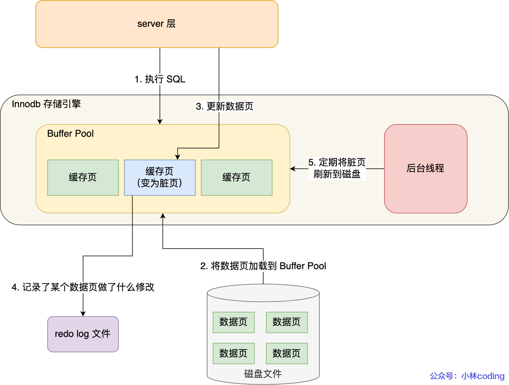

在事务提交时，只要先将redo log持久化到磁盘上即可，可以不需要等到Buffer Pool中的脏页持久到磁盘。当系统崩溃时，虽然脏页数据没有持久化，但是redo log已经持久化，MySQL重启后可以根据redo log里的内容将数据恢复到最新的状态。

undo log修改也会记录至redo log。

undo log和redo log都是innodb存储引擎的日志，区别：

- redo log记录了此次**事务完成后**的数据状态，记录的是**更新之后**的值。
- undo log记录的是此次**事务开始前**的数据状态，记录的是**更新前**的值。

**产生的redo log直接写入磁盘吗**

不是的，redo log也有自己的缓存redo log buffer（在innodb中Log Buffer中），每当产生一条redo log时，会写入redo log buffer中，后续再持久化到磁盘。

redo log buffer默认大小16MB.

**redo log作用**：

- 实现事务的持久性，让MySQL拥有崩溃恢复的能力，能够保证MySQL在任何时间段突然崩溃，重启后之前提交的记录不会丢失。
- 将写操作从随机写变成了顺序写，提升了MySQL写入磁盘的能力。


**redo log buffer什么时候刷盘**

刷盘时机：

- MySQL正常关机时
- 当redo log buffer中记录的写入量大于redo log buffer内存空间的一半时
- Innodb后台进程每隔1s会将redo log buffer持久化到磁盘
- 每次提交事务都将redo log buffer中的redo log持久化到磁盘（由`innodb_flush_log_at_trx_commit`控制）


redo log写满了怎么办

默认情况下，InnoDB存储引擎有1个重做日志文件组(redo log group)，重做日志文件组由2个redo log文件组成。

重做日志组中，每隔redo log file的大小是固定且一致的，重做日志文件组是以**循环写**的方式工作的，从头到尾又回到开头，相当于一个环。

InnoDB存储引擎会先写file1，写满再写file2，写满后再切换回来。

redo log是为了防止内存中脏页丢失而设计的，随着程序运行，后台进程会将Buffer Pool中脏页刷新到磁盘中，redo log对应的记录也就没用了，这个时候就需要擦除这个记录，腾出空间来记录新的更新操作。

innoDB 用 write pos 表示 redo log 当前记录写到的位置，用 checkpoint 表示当前要擦除的位置

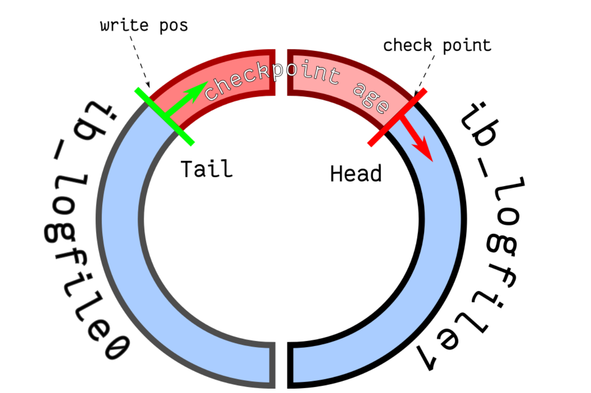

图中：

- write pos 和 checkpoint 的移动都是顺时针方向；
- write pos ～ checkpoint 之间的部分（图中的红色部分），用来记录新的更新操作；
- check point ～ write pos 之间的部分（图中蓝色部分）：待落盘的脏数据页记录；

如果 write pos 追上了 checkpoint，就意味着 **redo log 文件满了，这时 MySQL 不能再执行新的更新操作，也就是说 MySQL 会被阻塞**（*因此所以针对并发量大的系统，适当设置 redo log 的文件大小非常重要*），此时**会停下来将 Buffer Pool 中的脏页刷新到磁盘中，然后标记 redo log 哪些记录可以被擦除，接着对旧的 redo log 记录进行擦除，等擦除完旧记录腾出了空间，checkpoint 就会往后移动（图中顺时针）**，然后 MySQL 恢复正常运行，继续执行新的更新操作。


##### binlog

binlog位于server层，当事务提交后，会将该事务执行过程中的产生所有binlog同一写入binlog文件。

binlog文件**记录**了所有**数据库表结构变更和数据修改的日志**，不会记录查询类的操作。


为什么有了binlog还要有redo log

binlog早于redo log，最初的MySQL自带引擎是MylSAM,但是MylSAM没有崩溃修复的能力。Innodb是后来引入的，为了增加崩溃修复的功能，引入了redo log.

**binlog和redo log的区别**

1. 适用对象不同
   - binlog是MySQL server层实现的日志，所有存储引擎都可以用
   - redo log是Innodb存储引擎实现的日志
2. 文件格式不同
   - binlog文件格式有三种:STATEMENT（默认）、ROW、MIXED
     - STATEMENT：每一条修改数据的SQL记录都会被记录到binlog中（相当于记录了逻辑操作，所以针对这种格式，binlog可以称为逻辑日志），主从复制中salve端根据SQL语句重现。但这样会有动态函数的问题，比如使用了uuid和now这些函数，主库的执行结果不等于从库的执行结果，导致主从不一致。
     - ROW：记录数据最终被修改成什么样了。不会出现STATEMENT动态函数的问题，但是ROW的缺点是每行数据的变化都会被记录，比如执行批量update语句，更新多少行就会产生多少记录，使binlog文件过大。
     - MIXED：包含了STATEMENT和ROW两种模式，根据不同的情况自动使用STATEMENT和ROW模式。
   - redo log是物理日志，记录的是某个数据页做了什么修改。
3. 写入方式不同
   - binlog是增加写，写满一个文件，就创建一个新的binlog继续写，不会覆盖以前的日志，保存的是全量的日志。
   - redo log是循环写，日志空间大小是固定的，全部写满就从头开始，保存未被刷入磁盘的脏页日志。
4. 用途不同
   - binlog用作备份恢复、主从复制
   - redo log用于掉电等故障恢复


**主从复制是怎么实现的**

MySQL主从复制依赖于binlog，也就是记录MySQL上的所有变化并以二进制形式保存在磁盘上，复制过程就是**将binlog中的数据从主库传输到从库**上。

主从复制过程是异步的，主库上执行事务不会等待binlog的线程同步完成。

MySQL集群的主从复制过程梳理为三个阶段:

- 写入binlog：主库写入binlog，提交事务，并更新本地存储数据。
- 同步binlog：把binlog复制到所有从库上，每隔从库把binlog写到暂存日志中。
- 回放binlog：回放binlog，并更新存储引擎中的数据。

具体过程如下：

- MySQL 主库在收到客户端提交事务的请求之后，会先写入 binlog，再提交事务，更新存储引擎中的数据，事务提交完成后，返回给客户端“操作成功”的响应。
- 从库会创建一个专门的 I/O 线程，连接主库的 log dump 线程，来接收主库的 binlog 日志，再把 binlog 信息写入 relay log 的中继日志里，再返回给主库“复制成功”的响应。
- 从库会创建一个用于回放 binlog 的线程，去读 relay log 中继日志，然后回放 binlog 更新存储引擎中的数据，最终实现主从的数据一致性。

**从库是不是越多越好**

不是的，从库连接到主库的I/O越多，主库就要创建同样的**log dump线程**来处理复制的请求，对主库资源消耗比较多，同时还受限于主库的**网络带宽**。


**MySQL主从复制有哪些模型**

主要有三种。

- 同步复制：MySQL主库提交事务的线程要等到所有从库的复制成功响应，才会返回客户端结果。

  缺点：性能很差，要等复制到所有节点才返回响应；可用性很差，主库和从库中有一个数据库出问题，都会影响业务。

- 异步复制（默认）：MySQL主库提交事务的线程不会等待binlog同步到其他从库，直接返回客户端结果。

  缺点：一旦主库宕机，数据会发生丢失。

- 半同步复制：介于两者之间，事务线程不用等待所有的从库复制成功响应，只要一部分复制响应成功就行。

  优点：兼顾异步复制和同步复制的优点，即使主库宕机，至少还有一个从库存在最新的数据，不会存在丢失风险。


**binlog什么时候刷盘**

事务执行过程中，先把日志写入到server层的binlog cache中，事务提交的时候再把binlog cache写入到binlog文件中。（每个线程都有自己的binlog cache）

一个事务的binlog是不能被拆开的，因此无论这个事务有多大，也要保证一次性写入。

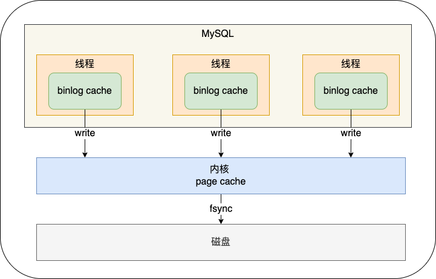

- 图中的write，指的是把日志写入到binlog文件中，但是并没有把数据持久化到磁盘，因为数据还缓存在文件系统的page cache里，write的写入速度还是比较快的，不涉及I/O。

- 图中的fsync，才是把数据持久化到磁盘的操作，这里会涉及I/O，频繁的fsync会导致磁盘的I/O升高。

MySQL提供一个sync_binlog参数控制数据库的binlog刷盘的频率：

- sync_binlog = 0 的时候，表示每次提交事务都只 write，不 fsync，后续交由操作系统决定何时将数据持久化到磁盘；
- sync_binlog = 1 的时候，表示每次提交事务都会 write，然后马上执行 fsync；（安全性最好，性能损耗最大）
- sync_binlog =N(N>1) 的时候，表示每次提交事务都 write，但累积 N 个事务后才 fsync。

默认为sync_binlog = 0，性能最好。一旦主机发生异常重启后，还没持久化到磁盘的数据就会丢失。


#### 为什么需要两阶段提交

事务提交后，redo log和binlog都要持久化到磁盘，但是这是两个独立的逻辑，可能出现一半成功一半失败的情况，这样就导致两份日志之间的逻辑不一致，出现主从不一致的问题。

为了避免两份日志逻辑不一致的问题，使用两阶段提交来解决。可以保证多个逻辑操作要不全部成功，要不全部失败，不会出现半成功的状态。


#### 两阶段提交过程

两阶段提交是把单个事务的提交拆分为两个阶段：准备阶段和提交阶段。每个阶段都有协调者和参与者共同完成。

MySQL使用内部XA事务作为协调者，存储引擎作为参与者。


两阶段提交过程就是将redo log的写入拆成两个步骤：prepare和commit，中间再穿插写入binlog。具体：

- prepare阶段：将内部XA事务的ID(XID)写入到redo log，同时将redo log对应的事务状态设置为prepare，然后将redo log持久化到磁盘中。
- commit阶段：内部XA事务的ID(XID)写入到binlog中，然后持久化到磁盘，接着调用引擎的提交事务接口，将redo log状态设置为commit，此时状态并不需要持久化到磁盘，只需要write到文件系统的page cache中就够了，因为只要binlog写磁盘成功，就算redo log的状态是prepare也没有关系，一样会被认定事务已经执行成功。  


两阶段提交过程中发生异常重启会出现什么现象

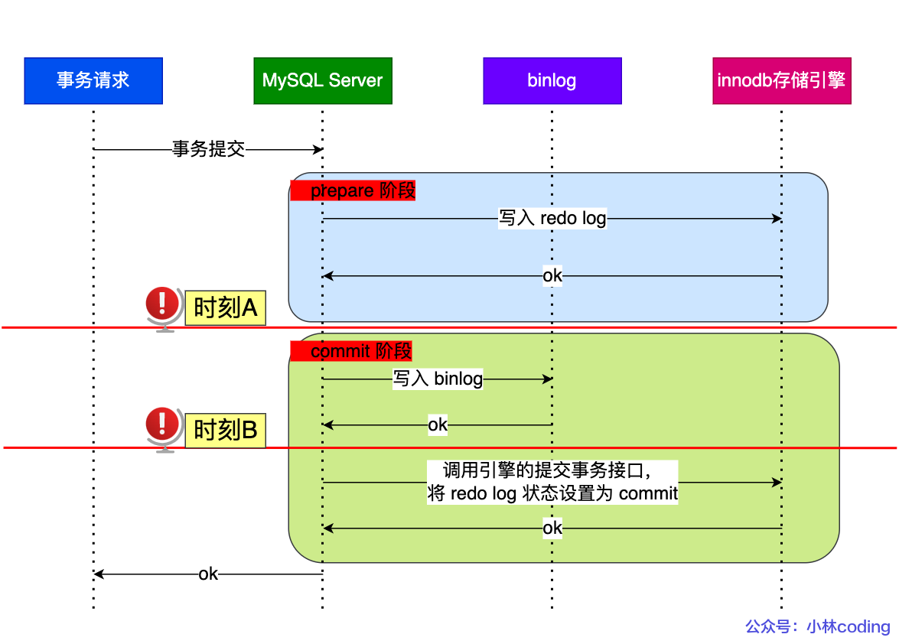

图中时刻A和时刻B都有可能发生崩溃。

不管是时刻A还是时刻B，redo log都处于prepare阶段。在MySQL重启后会按顺序扫描redo log文件，碰到处于prepare状态的redo log，就拿着redo log中的XID去binlog查看是否存在该XID:

- 如果binlog中没有当前内部事务XA事务的XID，说明redo log完成刷盘，但是binlog还没有刷盘，则回滚事务。（A时刻）
- 如果binlog中有当前事务XA事务的XID，说明redo log和binlog都完成了刷盘，则提交事务。(B时刻)

可以看到，**对于处于 prepare 阶段的 redo log，即可以提交事务，也可以回滚事务，这取决于是否能在 binlog 中查找到与 redo log 相同的 XID**，如果有就提交事务，如果没有就回滚事务。这样就可以保证 redo log 和 binlog 这两份日志的一致性了。**两阶段提交是以 binlog 写成功为事务提交成功的标识**


两阶段提交有什么问题

- 磁盘I/O次数高：每次事务提交都会进行两次刷盘，一次是redo log刷盘， 一次是binloog刷盘
- 锁竞争激烈：两阶段提交虽然能保证单事务两个日志内容一致，但是在多事务的情况下，却不能保证两者提交顺序一致。因此要在两阶段提交基础上加锁。


### SQL


DDL(Data Definition Language)：数据定义语言，用来定义数据库对象：库、表、列等

DML(Data Manipulation Language)：数据操作语言，用来定义数据库记录（数据）

DCL(Data Control Language):数据控制语言，用来定义访问权限和安全级别

DQL(Data Query Language)：数据查询语言，用来查询记录


**DML:** 

`SELECT`:从数据表中获取数据

`UPDATE`更新数据表中的数据

`DELETE`：从数据表中删除数据

`INSERT INTO`向数据库中插入数据


判断键值为空`is null`

#### 基础语法

##### DISTINCT

在数据表中，可能会包含重复值。关键词`DISTINCT`用于返回唯一不同的值

```sql
SELECT DISTINCT Company FROM Orders 
```

##### WHERE

##### AND & OR

##### ORDER BY

`ORDER BY`对指定列队结果集进行排序，默认升序`ASC`，可以使用`DESC`降序排序。

```sql
SELECT Company, OrderNumber FROM Orders ORDER BY Company
SELECT Company, OrderNumber FROM Orders ORDER BY Company DESC, OrderNumber ASC
```

##### INSERT INTO

向表格中插入新的行

```sql
INSERT INTO 表名称 VALUES (值1, 值2,....)
```

也可以将数据插入指定的列

```
INSERT INTO table_name (列1, 列2,...) VALUES (值1, 值2,....)
```

##### UPDATE

修改表中的数据

```sql
UPDATE 表名称 SET 列名称 = 新值 WHERE 列名称 = 某值
```

DELETE

删除表中的行

```sql
DELETE FROM 表名称 WHERE 列名称 = 值
```


#### 高级语法

TOP

TOP子句用于返回规定的记录数目

```sql
SELECT TOP 2 * FROM Persons
SELECT TOP 50 PERCENT * FROM Persons
```

##### LIKE

LIKE操作符用于在where子句中搜索指定模式

```sql
SELECT column_name(s)
FROM table_name
WHERE column_name LIKE pattern
```

##### 通配符

| 配符                       | 描述                       |
| :------------------------- | :------------------------- |
| %                          | 代表零个或多个字符         |
| _                          | 仅替代一个字符             |
| [charlist]                 | 字符列中的任何单一字符     |
| [^charlist]或者[!charlist] | 不在字符列中的任何单一字符 |

IN

```sql
SELECT column_name(s)
FROM table_name
WHERE column_name IN (value1,value2,...)
```

BETWEEN

操作符 BETWEEN ... AND 会选取介于两个值之间的数据范围。这些值可以是数值、文本或者日期。

```sql
SELECT column_name(s)
FROM table_name
WHERE column_name
BETWEEN value1 AND value2
```

##### JOIN

join用于根据两个或多个表中的列之间的关系，从这些表中查询数据

数据库中的表可通过**键**将彼此联系起来。主键（Primary Key）是一个列，在这个列中的每一行的值都是唯一的。在表中，每个主键的值都是唯一的。这样做的目的是在不重复每个表中的所有数据的情况下，把表间的数据交叉捆绑在一起。

- INNER JOIN 内连接

- JOIN: 如果表中有至少一个匹配，则返回行（和INNER JOIN一样）

  外连接：

- LEFT JOIN: 即使右表中没有匹配，也从左表返回所有的行

- RIGHT JOIN: 即使左表中没有匹配，也从右表返回所有的行

- FULL JOIN: 只要其中一个表中存在匹配，就返回行

- `CROSS JOIN`子句从连接的表返回行的笛卡儿乘积。

  假设使用`CROSS JOIN`连接两个表。 结果集将包括两个表中的所有行，其中结果集中的每一行都是第一个表中的行与第二个表中的行的组合。 


```sql
select column_name(s)
from table1
INNER JOIN table2
ON
table1.column_name=table2.column_name
```


##### UNION和UNION ALL操作符

UNION 操作符用于合并两个或多个 SELECT 语句的结果集

请注意，UNION 内部的 SELECT 语句必须拥有相同数量的列。列也必须拥有相似的数据类型。同时，每条 SELECT 语句中的列的顺序必须相同。

**注释：**默认地，UNION 操作符选取不同的值（去重）。如果允许重复的值，请使用 UNION ALL（不去重）。


##### with as

with as语句也叫子查询部分，可以定义一个sql片段，该sql片段会被整个sql语句用到。可以使sql语句的可读性更高。

例如：

```sql
select * from person.StateProvince where CountryRegionCode in 
         (select CountryRegionCode from person.CountryRegion where Name like 'C%')
```

使用了嵌套查询，如果嵌套层次过多，会使sql难以维护。

```sql
with cr as 
( 
    select CountryRegionCode from person.CountryRegion where Name like 'C%' 
)

select * from person.StateProvince where CountryRegionCode in (select * from cr)
```

使用with as代替嵌套


#### SQL函数

##### Date

`NOW()`返回当前的日期和时间

`CURDAE()`返回当前的日期

`CURTIME()`返回当前的时间

`DATE()`提取日期或日期/时间表达式的日期部分

`EXTEACT()`返回日期/时间的单独部分

`DATE_ADD()`给日期添加指定的时间间隔

`DATA_SUB()`给日期减去指定的时间间隔

`DATEDIFF()`返回两个日期之间的天数

`DATE_FORMAT()`用不同的格式显示日期/时间


##### GROUP BY

GROUP BY结合合计函数，根据一个或多个列对结果集进行分组。

```sql
SELECT column_name, aggregate_function(column_name)
FROM table_name
WHERE column_name operator value
GROUP BY column_name
```

AVG(column) 返回某列的平均值

COUNT(column)返回某列的行数（不包括null）

COUNT(DISTINCT column)返回相异结果的数目

FIRST(column)返回指定域中第一个记录的值

LAST(column)返回指定域中最后一个记录的值

MAX(column)返回某列的最高值

MIN(column)返回某列的最低值

SUM(column)返回某列的和

UCASE(column)将指定列的值转换为大写

LCASE(column)将指定列的值转换为小写

LEN(column)返回文本字段中值的长度

ROUND()

ROUND()函数用于把数值字段舍入为指定的小数位数。

```sql
SELECT ROUND(column_name,decimals) FROM table_name
column_name	必需。要舍入的字段。
decimals	必需。规定要返回的小数位数。

例：SELECT ProductName, ROUND(UnitPrice,0) as UnitPrice FROM Products
```


HAVING

SQL中增加having的原因是where关键字无法和合计函数一起使用

```sql
SELECT column_name, aggregate_function(column_name)
FROM table_name
WHERE column_name operator value
GROUP BY column_name
HAVING aggregate_function(column_name) operator value
```

IF

if既可作为表达式用，也可在存储过程中作为流程控制语句使用。

```
IF(expr1,expr2,expr3)
如果 expr1 是TRUE，则 IF()的返回值为expr2; 否则返回值则为 expr3。IF() 的返回值为数字值或字符串值，具体情况视其所在语境而定。
```

DATE_FORMAT()

用于不同的格式显示日期/时间数据

语法格式：

```sql
DATE_FORMAT(date,format);
date:要格式化的有效日期
format:预定义说明符组成的格式字符串，每个说明符前面都有一个百分比字符(%).
```

| **限定符** | **含义**                                                     |
| :--------- | :----------------------------------------------------------- |
| `%a`       | 三个字符缩写的工作日名称，例如:*Mon*, *Tue*, *Wed*,等        |
| `%b`       | 三个字符缩写的月份名称，例如：*Jan*，*Feb*，*Mar*等          |
| `%c`       | 以数字表示的月份值，例如：1, 2, 3…12                         |
| `%D`       | 英文后缀如：*0th*, *1st*, *2nd*等的一个月之中的第几天        |
| `%d`       | 如果是`1`个数字(小于`10`)，那么一个月之中的第几天表示为加前导加`0`， 如：00, 01,02, …31 |
| `%e`       | 没有前导零的月份的日子，例如：1,2，… 31                      |
| `%f`       | 微秒，范围在`000000..999999`                                 |
| `%H`       | 24小时格式的小时，前导加`0`，例如：00,01..23                 |
| `%h`       | 小时，12小时格式，带前导零，例如：01，02 … 12                |
| `%I`       | 与`%h`相同                                                   |
| `%i`       | 分数为零，例如：00,01，… 59                                  |
| `%j`       | 一年中的的第几天，前导为`0`，例如，001,002，… 366            |
| `%k`       | 24小时格式的小时，无前导零，例如：0,1,2 … 23                 |
| `%l`       | 12小时格式的小时，无前导零，例如：0,1,2 … 12                 |
| `%M`       | 月份全名称，例如：January, February,…December                |
| `%m`       | 具有前导零的月份名称，例如：00,01,02，… 12                   |
| `%p`       | `AM`或`PM`，取决于其他时间说明符                             |
| `%r`       | 表示时间，`12`小时格式`hh:mm:ss AM`或`PM`                    |
| `%S`       | 表示秒，前导零，如：00,01，… 59                              |
| `%s`       | 与`%S`相同                                                   |
| `%T`       | 表示时间，24小时格式`hh:mm:ss`                               |
| `%U`       | 周的第一天是星期日，例如：00,01,02 … 53时，前导零的周数      |
| `%u`       | 周的第一天是星期一，例如：00,01,02 … 53时，前导零的周数      |
| `%V`       | 与`%U`相同，它与`%X`一起使用                                 |
| `%v`       | 与`%u`相同，它与`%x`一起使用                                 |
| `%W`       | 工作日的全称，例如：Sunday, Monday,…, Saturday               |
| `%w`       | 工作日，以数字来表示(0 = 星期日，1 = 星期一等)               |
| `%X`       | 周的四位数表示年份,第一天是星期日; 经常与`%V`一起使用        |
| `%x`       | 周的四位数表示年份,第一天是星期日; 经常与`%v`一起使用        |
| `%Y`       | 表示年份，四位数，例如2000，2001，…等。                      |
| `%y`       | 表示年份，两位数，例如00，01，…等。                          |
| `%%`       | 将百分比(`%`)字符添加到输出                                  |

| DATE_FORMAT字符串    | 格式化日期                      |
| :------------------- | :------------------------------ |
| `%Y-%m-%d`           | 2017/4/30                       |
| `%e/%c/%Y`           | 4/7/2013                        |
| `%c/%e/%Y`           | 7/4/2013                        |
| `%d/%m/%Y`           | 4/7/2013                        |
| `%m/%d/%Y`           | 7/4/2013                        |
| `%e/%c/%Y %H:%i`     | 4/7/2013 11:20                  |
| `%c/%e/%Y %H:%i`     | 7/4/2013 11:20                  |
| `%d/%m/%Y %H:%i`     | 4/7/2013 11:20                  |
| `%m/%d/%Y %H:%i`     | 7/4/2013 11:20                  |
| `%e/%c/%Y %T`        | 4/7/2013 11:20                  |
| `%c/%e/%Y %T`        | 7/4/2013 11:20                  |
| `%d/%m/%Y %T`        | 4/7/2013 11:20                  |
| `%m/%d/%Y %T`        | 7/4/2013 11:20                  |
| `%a %D %b %Y`        | Thu 4th Jul 2013                |
| `%a %D %b %Y %H:%i`  | Thu 4th Jul 2013 11:20          |
| `%a %D %b %Y %T`     | Thu 4th Jul 2013 11:20:05       |
| `%a %b %e %Y`        | Thu Jul 4 2013                  |
| `%a %b %e %Y %H:%i`  | Thu Jul 4 2013 11:20            |
| `%a %b %e %Y %T`     | Thu Jul 4 2013 11:20:05         |
| `%W %D %M %Y`        | Thursday 4th July 2013          |
| `%W %D %M %Y %H:%i`  | Thursday 4th July 2013 11:20    |
| `%W %D %M %Y %T`     | Thursday 4th July 2013 11:20:05 |
| `%l:%i %p %b %e, %Y` | 7/4/2013 11:20                  |
| `%M %e, %Y`          | 4-Jul-13                        |
| `%a, %d %b %Y %T`    | Thu, 04 Jul 2013 11:20:05       |
