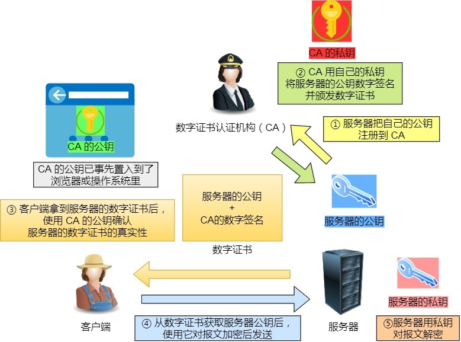
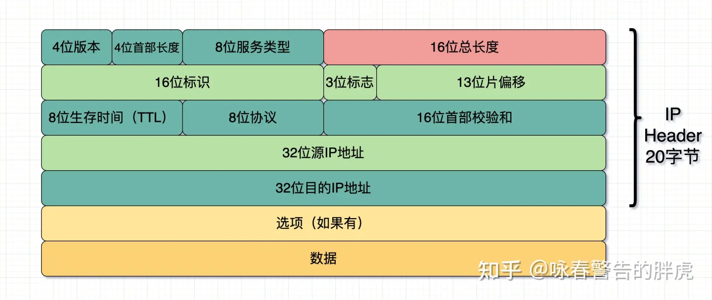

#### ICMP是什么，ARP是什么

ICMP互联网控制消息协议:网络包传输过程中产生的错误和各种控制信息。

ARP地址解析西医:用于根据IP地址查询相应的以太网MAC地址。

#### OSI七层网络模型

应表会传网数物

应用层：应用层是计算机用户以及各种程序和网络之间的接口，其功能是直接向用户提供服务。

表示层：负责数据格式的转换，将应用处理的信息转换为适合网络传输的格式，或者将下层数据转换为上层能处理的数据

会话层：建立和管理应用程序之间的通信

传输层：监控数据传输服务的质量，保证报文的正确传输（丢包重传）

网络层：通过路由选择算法，为报文通过通信子网选择最适当的路径。（通过IP地址寻址）

数据链路层：将来自物理层流形式的数据封装成帧，将上层帧数据拆分为流

物理层：解决两个硬件间的通信问题


#### HTTP常见状态码


`1xx` 类状态码属于**提示信息**，是协议处理中的一种中间状态，实际用到的比较少。

`2xx` 类状态码表示服务器**成功**处理了客户端的请求，也是我们最愿意看到的状态。

- 「**200 OK**」是最常见的成功状态码，表示一切正常。如果是非 `HEAD` 请求，服务器返回的响应头都会有 body 数据。

- 「**204 No Content**」也是常见的成功状态码，与 200 OK 基本相同，但响应头没有 body 数据。

- 「**206 Partial Content**」是应用于 HTTP 分块下载或断点续传，表示响应返回的 body 数据并不是资源的全部，而是其中的一部分，也是服务器处理成功的状态。

`3xx` 类状态码表示客户端请求的资源发生了变动，需要客户端用新的 URL 重新发送请求获取资源，也就是**重定向**。 

- 「**301 Moved Permanently**」表示永久重定向，说明请求的资源已经不存在了，需改用新的 URL 再次访问。

- 「**302 Found**」表示临时重定向，说明请求的资源还在，但暂时需要用另一个 URL 来访问。

301 和 302 都会在响应头里使用字段 `Location`，指明后续要跳转的 URL，浏览器会自动重定向新的 URL。

- 「**304 Not Modified**」不具有跳转的含义，表示资源未修改，重定向已存在的缓冲文件，也称**缓存重定向**，也就是告诉客户端可以继续使用缓存资源，用于缓存控制。

`4xx` 类状态码表示客户端发送的**报文有误**，服务器无法处理，也就是错误码的含义。

- 「**400 Bad Request**」表示客户端请求的报文有错误，但只是个笼统的错误。

- 「**403 Forbidden**」表示服务器禁止访问资源，并不是客户端的请求出错。

- 「**404 Not Found**」表示请求的资源在服务器上不存在或未找到，所以无法提供给客户端。

`5xx` 类状态码表示客户端请求报文正确，但是**服务器处理时内部发生了错误**，属于服务器端的错误码。

- 「**500 Internal Server Error**」与 400 类型，是个笼统通用的错误码，服务器发生了什么错误，我们并不知道。

- 「**501 Not Implemented**」表示客户端请求的功能还不支持，类似“即将开业，敬请期待”的意思。

- 「**502 Bad Gateway**」通常是服务器作为网关或代理时返回的错误码，表示服务器自身工作正常，访问后端服务器发生了错误。

- 「**503 Service Unavailable**」表示服务器当前很忙，暂时无法响应客户端，类似“网络服务正忙，请稍后重试”的意思。

#### HTTP常见字段

**Host** 字段:客户端发送请求时，用来指定服务器的域名。

**Content-Length** 字段:服务器在返回数据时，会有 `Content-Length` 字段，表明本次回应的数据长度。

**Connection **字段:`Connection` 字段最常用于客户端要求服务器使用「HTTP 长连接」机制，以便其他请求复用。

HTTP/1.1 版本的默认连接都是长连接，但为了兼容老版本的 HTTP，需要指定 `Connection` 首部字段的值为 `Keep-Alive`。

```
Connection: Keep-Alive
```

开启了 HTTP Keep-Alive 机制后， 连接就不会中断，而是保持连接。当客户端发送另一个请求时，它会使用同一个连接，一直持续到客户端或服务器端提出断开连接。

**Content-Type **字段:`Content-Type` 字段用于服务器回应时，告诉客户端，本次数据是什么格式。

```
Content-Type: text/html; Charset=utf-8
```

**Accept**字段：表示客户端期望服务器返回的媒体格式。客户端期望的资源类型服务器可能没有，所以客户端会期望多种类型，并且设置优先级，服务器根据优先级寻找相应的资源返回给客户端。

```text
# 注意：先逗号分割类型，再分号分割属性
Accept: audio/*; q=0.2, audio/basic
```

表示audio/basic类型的资源优先，如果没有，就随便其它什么格式的audio资源都可以。q的取值范围是(0-1]，其具体值并没有意义，它仅用来排序优先级，如果没有q，默认q=1，也就是最高优先级。

**Content-Encoding** 字段:`Content-Encoding` 字段说明数据的压缩方法。表示服务器返回的数据使用了什么压缩格式

```
Content-Encoding: gzip
```

客户端在请求时，用 `Accept-Encoding` 字段说明自己可以接受哪些压缩方法。

```
Accept-Encoding: gzip, deflate
```

**Age**字段：表示资源缓存的年龄，也就是资源自缓存以来到现在已经过去了多少时间，单位是秒。

```
Age: 86400
```

**Expires**字段：服务器使用Expect头来告知对方资源何时失效。如果它的值等于Date头的值，就表示资源已经失效。

```
Expires: Thu, 01 Dec 1994 16:00:00 GMT
```

**ETag**字段：资源标签，每个资源可以提供多个标签信息。它一般用来和下面的If-Match和If-None-Match配合使用，用来判断缓存资源的有效性。比较常见的标签是资源的版本号，比如可以拿资源数据的md5校验码作为版本号。

#### Get和Post有什么区别

|                  |                             Get                              |                             Post                             |
| ---------------- | :----------------------------------------------------------: | :----------------------------------------------------------: |
| 后退按钮/刷新    |                             无害                             |   数据会被重新提交（浏览器应该告知用户数据会被重新提交）。   |
| 书签             |                         可收藏为书签                         |                        不可收藏为书签                        |
| 缓存             |                           能被缓存                           |                           不能缓存                           |
| 编码类型         |              application/x-www-form-urlencoded               | application/x-www-form-urlencoded 或 multipart/form-data。为二进制数据使用多重编码。 |
| 历史             |                   参数保留在浏览器历史中。                   |                 参数不会保存在浏览器历史中。                 |
| 对数据长度的限制 | 是的。当发送数据时，GET 方法向 URL 添加数据；URL 的长度是受限制的（URL 的最大长度是 2048 个字符）。 | HTTP 协议没有 Body 和 URL 的长度限制，对 URL 限制的大多是浏览器和服务器的原因；服务器是因为处理长 URL 要消耗比较多的资源，为了性能和安全（防止恶意构造长 URL 来攻击）考虑，会给 URL 长度加限制 |
| 对数据类型的限制 |                     只允许 ASCII 字符。                      |                 没有限制。也允许二进制数据。                 |
| 安全性           | 与 POST 相比，GET 的安全性较差，因为所发送的数据是 URL 的一部分。在发送密码或其他敏感信息时绝不要使用 GET ！ | POST 比 GET 更安全，因为参数不会被保存在浏览器历史或 web 服务器日志中。从传输的角度来说，他们都是不安全的，因为 HTTP 在网络上是明文传输的，浏览器F12下什么都一目了然，或者抓个包，就能完整地获取数据报文 ；要想安全传输，Encode(转码)当然对于懂的人来说也不安全； 比较安全的只有加密，也就是 HTTPS |
| 可见性           |              数据在 URL 中对所有人都是可见的。               |                   数据不会显示在 URL 中。                    |

（1）post更安全（请求参数不会作为url的一部分，不会被缓存、保存在服务器日志、以及浏览器浏览记录中）

（2）post发送的数据更大（get有url长度限制）

（3）post能发送更多的数据类型（get只能发送ASCII字符）

（4）post比get慢

（5）post用于修改和写入数据，get一般用于搜索排序和筛选之类的操作（淘宝，支付宝的搜索查询都是get提交），目的是资源的获取，读取数据

##### 为什么get比Post更快

**1. post请求包含更多的请求头**

因为post需要在请求的body部分包含数据，所以会多了几个数据描述部分的首部字段（如：content-type）,这其实是微乎其微的。

**2. 最重要的一条，post在真正接收数据之前会先将请求头发送给服务器进行确认，然后才真正发送数据**

post请求的过程：
（1）浏览器请求tcp连接（第一次握手）
（2）服务器答应进行tcp连接（第二次握手）
（3）浏览器确认，并发送post请求头（第三次握手，这个报文比较小，所以http会在此时进行第一次数据发送）
（4）服务器返回100 Continue响应
（5）浏览器发送数据
（6）服务器返回200 OK响应
get请求的过程：
（1）浏览器请求tcp连接（第一次握手）
（2）服务器答应进行tcp连接（第二次握手）
（3）浏览器确认，并发送get请求头和数据（第三次握手，这个报文比较小，所以http会在此时进行第一次数据发送）
（4）服务器返回200 OK响应
也就是说，目测get的总耗是post的2/3左右。第三次握手时就携带信息。

**3.get会将数据缓存起来，而post不会**

**4.post不能进行管道化传输**

http权威指南中是这样说的：

　　http在的一次会话需要先建立tcp连接（大部分是tcp，但是其他安全协议也是可以的），然后才能通信，如果每次连接都只进行一次http会话，那这个连接过程占的比例太大了！

　　于是出现了持久连接：在http/1.0+中是connection首部中添加keep-alive值，在http/1.1中是在connection首部中添加persistent值，当然两者不仅仅是命名上的差别，http/1.1中，持久连接是默认的，除非显示在connection中添加close，否则持久连接不会关闭，而http/1.0+中则恰好相反，除非显示在connection首部中添加keep-alive，否则在接收数据包后连接就断开了。

　　出现了持久连接还不够，在http/1.1中，还有一种称为管道通信的方式进行速度优化：把需要发送到服务器上的所有请求放到输出队列中，在第一个请求发送出去后，不等到收到服务器的应答，第二个请求紧接着就发送出去，但是这样的方式有一个问题：**不安全，如果一个管道中有10个连接，在发送出9个后，突然服务器告诉你，连接关闭了，此时客户端即使收到了前9个请求的答复，也会将这9个请求的内容清空，也就是说，白忙活了……此时，客户端的这9个请求需要重新发送。这对于幂等请求还好（比如get，多发送几次都没关系，每次都是相同的结果），如果是post这样的非幂等请求（比如支付的时候，多发送几次就惨了），肯定是行不通的。**

　　**所以，post请求不能通过管道的方式进行通信！**

　　**很有可能，post请求需要重新建立连接，这个过程不跟完全没优化的时候一样了么？**

　　所以，在可以使用get请求通信的时候，不要使用post请求，这样用户体验会更好，当然，如果有安全性要求的话，post会更好。


#### HTTP1.1优点缺点

优点：

HTTP最突出的优点是简单、灵活、易于扩展、应用广泛和跨平台。

**简单**：HTTP基本报文格式是header+body，头部信息也是key-value文本的形式，易于理解。

**灵活和易于扩展**：HTTP协议里各种请求方法、URL/URI、状态码、头字段等每个组成都允许开发人员自定义和扩充。HTTP位于应用层，下层可以随意变化。

**应用广泛和跨平台**：浏览器、APP等。

缺点：

无状态、明文传输、不安全。

**无状态**：优点：服务器不会去记忆HTTP的状态，不需要额外的资源来记录状态信息，能减轻服务器的负担。缺点：没有记忆能力在完成一些关联操作时比较麻烦。（解决方案：比较简单的方式采用Cookie技术）

明文传输：优点：方便调试。缺点：传输内容容易被窃取监听。

**不安全**：明文传输内容被窃听；不验证通信方的身份，容易遭遇伪装；无法验证报文的完整写，容易被篡改。


#### HTTP为什么要设置为无状态

HTTP被设计为无状态协议是为了提高可扩展性和降低服务器的负担。HTTP请求和响应的每个过程中，服务器都不会记录客户端的信息，使得HTTP更加容易处理大量的请求。此外，无状态协议有助于提高可靠性和可用性，每个请求都是独立的，即使一个请求失败或者丢失，整个应用程序也不会受到影响。

无状态也带来问题，一些关联操作时需要重复认证身份和授权，导致性能下降，解决方法：HTTP引入了cookie或者session来解决。

**[Session在服务端](https://juejin.cn/post/6942852054847062053)**，也就是网站的服务器，用来保存用户的会话信息；**Cookies在客户端**(可以理解为浏览器端)，有了Cookies，浏览器在下次访问网站时会自动附带上它发送给服务器，服务器通过识别Cookies鉴别出是哪个用户，判断是否是登录状态，然后返回对应的响应。

Cookies保存了登录的凭证，有了它，只需要在下次请求中携带Cookies发送请求 就不用重新输入用户名，密码等信息重新登录了。所以在爬虫中，一般会将登录成功后获取的Cookies放在请求头中直接请求，而不必重新模拟登录。

Cookie工作原理

（1）浏览器端第一次发送请求到服务器端
（2）服务器端创建Cookie，该Cookie中包含用户的信息，然后将该Cookie发送到浏览器端
（3）浏览器端再次访问服务器端时会携带服务器端创建的Cookie
（4）服务器端通过Cookie中携带的数据区分不同的用户

Session工作原理

（1）浏览器端第一次发送请求到服务器端，服务器端创建一个Session，同时会创建一个特殊的Cookie（kay-value形式）（name为JSESSIONID的固定值，value为session对象的ID），然后将该Cookie发送至浏览器端
（2）浏览器端发送第N（N>1）次请求到服务器端,浏览器端访问服务器端时就会携带该name为JSESSIONID的Cookie对象
（3）服务器端根据name为JSESSIONID的Cookie的value(sessionId),去查询Session对象，从而区分不同用户。

Session和Cookie的区别

1. 存储位置不同：Session是存放在服务端的，Cookie是存放在客户端的
2. 对服务器性能影响：Session存放在服务器上，当访问增多，会占用服务器的性能。
3. 安全性不同：Session安全性高于Cookie，如果Cookie被截获，会被冒充进行服务器访问。
4. 生命周期不同：Session在长时间不活跃后自动过期，Cookie可以设置过期时间，在浏览器关闭后很长时间依然存在。

所以对于登录等重要信息可以存放为Session，其他信息如果需要保留可以放在Cookie中。

#### HTTP缓存技术

HTTP 缓存有两种实现方式，分别是**强制缓存和协商缓存**。

1. **强制缓存**

**强制缓存**指的是只要浏览器判断缓存没有过期，则直接使用浏览器的本地缓存，决定是否使用缓存的主动性在于浏览器这边。


强制缓存是利用下面这两个 HTTP 响应头部（Response Header）字段实现的，它们都用来表示资源在客户端缓存的有效期：

- `Cache-Control`， 是一个相对时间；
- `Expires`，是一个绝对时间；

如果 HTTP 响应头部同时有 Cache-Control 和 Expires 字段的话，**Cache-Control 的优先级高于 Expires** 。

Cache-control 选项更多一些，设置更加精细，所以建议使用 Cache-Control 来实现强缓存。具体的**实现流程**如下：

- 当浏览器第一次请求访问服务器资源时，服务器会在返回这个资源的同时，在 Response 头部加上 Cache-Control，Cache-Control 中设置了过期时间大小；
- 浏览器再次请求访问服务器中的该资源时，会先**通过请求资源的时间与 Cache-Control 中设置的过期时间大小，来计算出该资源是否过期**，如果没有，则使用该缓存，否则重新请求服务器；
- 服务器再次收到请求后，会再次更新 Response 头部的 Cache-Control。

2. **协商缓存**

   当我们在浏览器使用开发者工具的时候，你可能会看到过某些请求的响应码是 `304`，这个是告诉浏览器可以使用本地缓存的资源，通常这种通过服务端告知客户端是否可以使用缓存的方式被称为协商缓存。


协商缓存可以基于两种头部来实现。

第一种：请求头部中的 `If-Modified-Since` 字段与响应头部中的 `Last-Modified` 字段实现，这两个字段的意思是：

- 响应头部中的 `Last-Modified`：标示这个响应资源的最后修改时间；
- 请求头部中的 `If-Modified-Since`：当资源过期了，发现响应头中具有 Last-Modified 声明，则再次发起请求的时候带上 Last-Modified 的时间，服务器收到请求后发现有 If-Modified-Since 则与被请求资源的最后修改时间进行对比（Last-Modified），如果最后修改时间较新（大），说明资源又被改过，则返回最新资源，HTTP 200 OK；如果最后修改时间较旧（小），说明资源无新修改，响应 HTTP 304 走缓存。


第二种：请求头部中的 `If-None-Match` 字段与响应头部中的 `ETag` 字段，这两个字段的意思是：

  - 响应头部中 `Etag`：唯一标识响应资源；
  - 请求头部中的 `If-None-Match`：当资源过期时，浏览器发现响应头里有 Etag，则再次向服务器发起请求时，会将请求头 If-None-Match 值设置为 Etag 的值。服务器收到请求后进行比对，如果资源没有变化返回 304，如果资源变化了返回 200。

第一种实现方式是基于时间实现的，第二种实现方式是基于一个唯一标识实现的，相对来说后者可以更加准确地判断文件内容是否被修改，避免由于时间篡改导致的不可靠问题。

如果在第一次请求资源的时候，服务端返回的 HTTP 响应头部同时有 Etag 和 Last-Modified 字段，那么客户端再下一次请求的时候，如果带上了 ETag 和 Last-Modified 字段信息给服务端，**这时 Etag 的优先级更高**，也就是服务端先会判断 Etag 是否变化了，如果 Etag 有变化就不用在判断 Last-Modified 了，如果 Etag 没有变化，然后再看  Last-Modified。

**为什么 ETag 的优先级更高？** 这是因为 ETag 主要能解决 Last-Modified 几个比较难以解决的问题：

1. 在没有修改文件内容情况下文件的最后修改时间可能也会改变，这会导致客户端认为这文件被改动了，从而重新请求；
2. 可能有些文件是在秒级以内修改的，`If-Modified-Since` 能检查到的粒度是秒级的，使用 Etag就能够保证这种需求下客户端在 1 秒内能刷新多次；
3. 有些服务器不能精确获取文件的最后修改时间。

**协商缓存这两个字段都需要配合强制缓存中 Cache-Control 字段来使用，只有在未能命中强制缓存的时候，才能发起带有协商缓存字段的请求**。

当使用 ETag 字段实现的协商缓存的过程：

- 当浏览器第一次请求访问服务器资源时，服务器会在返回这个资源的同时，在 Response 头部加上 ETag 唯一标识，这个唯一标识的值是根据当前请求的资源生成的；
- 当浏览器再次请求访问服务器中的该资源时，首先会先检查强制缓存是否过期：
  - 如果没有过期，则直接使用本地缓存；
  - 如果缓存过期了，会在 Request 头部加上 If-None-Match 字段，该字段的值就是 ETag 唯一标识；
- 服务器再次收到请求后，**会根据请求中的 If-None-Match 值与当前请求的资源生成的唯一标识进行比较**：
  - **如果值相等，则返回 304 Not Modified，不会返回资源**；
  - 如果不相等，则返回 200 状态码和返回资源，并在 Response 头部加上新的 ETag 唯一标识；
- 如果浏览器收到 304 的请求响应状态码，则会从本地缓存中加载资源，否则更新资源。

#### HTTP和HTTPS区别

- HTTP(超文本传输协议)和HTTPS(安全超文本传输协议)主要区别在于安全性和数据传输的方式，
- HTTP 是超文本传输协议，信息是明文传输，存在安全风险的问题。HTTPS 则解决 HTTP 不安全的缺陷，在 TCP 和 HTTP 网络层之间加入了 SSL/TLS 安全协议，使得报文能够加密传输。
- HTTP 连接建立相对简单， TCP 三次握手之后便可进行 HTTP 的报文传输。而 HTTPS 在 TCP 三次握手之后，还需进行 SSL/TLS 的握手过程，才可进入加密报文传输。
- HTTPS 协议需要向 CA（证书权威机构）申请数字证书，来保证服务器的身份是可信的。
- 两者的默认端口不一样，HTTP 默认端口号是 80，HTTPS 默认端口号是 443。

#### HTTPS解决了HTTP哪些问题

HTTP是明文传输，存在以下三个风险：

**窃听风险**；**篡改风险**；**冒充风险**；

HTTPS在TCP和HTTP层之间加入了`SSL/TLS`协议，可以解决上述风险：

**信息加密**；**校验机制**；**身份证书**；

如何解决的？

- **混合加密**的方式实现了信息的机密性，解决了**窃听**的风险
- **摘要算法**的方式实现完整性，能够根据数据生成独一无二的指纹，指纹用于校验信息的完整性，解决了**篡改**的风险
- 将服务器的公钥放入到**数字证书**中，解决了**冒充**的风险。


#### HTTPS如何保证安全性

1. 混合加密

   HTTPS采用了**对称加密**和**非对称加密**结合的混合加密的方式：

   - 在**通信建立阶段**采用**非对称加密**的方式交换会话密钥，后续就不再采用非对称加密
   - 在通信过程中全部使用**对称加密**的会话密钥的方式加密明文数据。

> 为什么要采用混合加密?
>
> **对称加密**只使用**一个密钥**，运算速度快，密钥必须保密，无法做到安全的密钥交换；
>
> 非对称加密使用两个密钥：**公钥**和**私钥**，公钥可以任意分发而私钥保密，解决了密钥交换问题但速度慢。
2. 摘要算法+数字签名

   为了保证传输的内容不被篡改，我们需要对内容计算出一个指纹，然后同内容一起传输给对方。

   对方收到后，先是对内容也计算出一个指纹，然后跟发送的指纹做一个比较，如果指纹相同，说明内容没有被篡改，否则就可以判断出内容被篡改了。

   通过**摘要算法(哈希函数)**来计算内容的**哈希值**。**哈希值是唯一的**，无法通过哈希值推导出内容。
   
   > 常见的摘要算法：MD5(信息摘要算法版本5)、SHA(安全散列算法)


   通过哈希算法可以确保内容不会被篡改，**但是并不能保证「内容 + 哈希值」不会被中间人替换，因为这里缺少对客户端收到的消息是否来源于服务端的证明**。

​	为了避免这种情况，计算机里会用**非对称加密算法**来解决，共有两个密钥：公钥和私钥。

​	非对称加密的用途主要在于**通过「私钥加密，公钥解密」的方式，来确认消息的身份**，我们常说的**数字签名算法**，就是用的是这种方式，不过私钥加密内容不是内容本身，而是**对内容的哈希值加密**。


​	私钥是由服务端保管，然后服务端会向客户端颁发对应的公钥。如果客户端收到的信息，能被公钥解密，就说明该消息是由服务器发送的。

3. 数字证书

​	可以通过哈希算法来保证消息的完整性；可以通过数字签名来保证消息的来源可靠性（能确认消息是由持有私钥的一方发送的）；但无法保证信息是由服务器方发送的（公私钥可能被伪造）。

​	此时引入CA(数字证书认证机构)，服务器将自己的公钥注册到CA,CA用自己的私钥将服务器的公钥数字签名并颁发数字证书，将服务器公钥放在数字证书中，只要证书是可信的，公钥就是可信的。



​	通过数字证书的方式保证服务器公钥的身份，解决冒充的风险。


#### HTTPS连接建立过程

SSL/TLS 协议基本流程：

- 客户端向服务器索要并验证服务器的公钥。
- 双方协商生产「会话秘钥」。
- 双方采用「会话秘钥」进行加密通信。

TLS 的「握手阶段」涉及**四次**通信，使用不同的密钥交换算法，TLS 握手流程也会不一样的，现在常用的密钥交换算法有两种：[RSA 算法](https://xiaolincoding.com/network/2_http/https_rsa.html) 和 [ECDHE 算法](https://xiaolincoding.com/network/2_http/https_ecdhe.html)。

基于RSA握手过程：


TLS 协议建立的详细流程：

*1. ClientHello*

首先，由客户端向服务器发起加密通信请求，也就是 `ClientHello` 请求。

在这一步，客户端主要向服务器发送以下信息：

（1）客户端支持的 **TLS 协议版本**，如 TLS 1.2 版本。

（2）客户端生产的**随机数**（`Client Random`），后面用于生成「会话秘钥」条件之一。

（3）客户端支持的**密码套件列表**，如 RSA 加密算法。

*2. SeverHello*

服务器收到客户端请求后，向客户端发出响应，也就是 `ServerHello`。服务器回应的内容有如下内容：

（1）**确认 TLS 协议版本**，如果浏览器不支持，则关闭加密通信。

（2）服务器生产的**随机数**（`Server Random`），也是后面用于生产「会话秘钥」条件之一。

（3）**确认的密码套件列表**，如 RSA 加密算法。

（4）服务器的**数字证书**。

*3.客户端回应*

客户端收到服务器的回应之后，首先通过浏览器或者操作系统中的 CA 公钥，确认服务器的**数字证书**的**真实性**。

如果证书没有问题，客户端会**从数字证书中取出服务器的公钥**，然后使用它加密报文，向服务器发送如下信息：

（1）一个**随机数**（`pre-master key`）。该随机数会被服务器公钥加密。

（2）**加密通信算法改变**通知，表示随后的信息都将用「会话秘钥」加密通信。

（3）**客户端握手结束通知**，表示客户端的握手阶段已经结束。这一项同时把之前所有内容的发生的数据做个**摘要**，用来供服务端校验。

上面第一项的随机数是整个握手阶段的第三个随机数，会发给服务端，所以这个随机数客户端和服务端都是一样的。

**服务器和客户端有了这三个随机数（Client Random、Server Random、pre-master key），接着就用双方协商的加密算法，各自生成本次通信的「会话秘钥」**。

*4. 服务器的最后回应*

服务器收到客户端的第三个随机数（`pre-master key`）之后，通过协商的加密算法，计算出本次通信的「会话秘钥」。

然后，向客户端发送最后的信息：

（1）**加密通信算法改变通知**，表示随后的信息都将用「会话秘钥」加密通信。

（2）**服务器握手结束通知**，表示服务器的握手阶段已经结束。这一项同时把之前所有内容的发生的数据做个**摘要**，用来供客户端校验。

至此，整个 TLS 的握手阶段全部结束。接下来，客户端与服务器进入加密通信，就完全是使用普通的 HTTP 协议，只不过用「会话秘钥」加密内容。


基于 RSA 算法的 HTTPS 存在「**前向安全**」的问题：如果服务端的**私钥泄漏**了，过去被第三方截获的所有 TLS 通讯密文都会被破解。为了解决这个问题，后面就出现了 [ECDHE 密钥协商算法](#ECDHE原理以及握手流程)。


#### CA机构签发证书和校验证书流程


CA 签发证书的过程，如上图左边部分：

- 首先 CA 会把持有者的公钥、用途、颁发者、有效时间等信息打成一个包，然后对这些信息进行 Hash 计算，得到一个 Hash 值；
- 然后 CA 会使用自己的**私钥**将该 Hash 值加密，生成 Certificate Signature，也就是 CA 对证书做了签名；
- 最后将 Certificate Signature 添加在文件证书上，形成数字证书；

客户端校验服务端的数字证书的过程，如上图右边部分：

- 首先客户端会使用同样的 Hash 算法获取该证书的 Hash 值 H1；
- 通常浏览器和操作系统中集成了 CA 的公钥信息，浏览器收到证书后可以使用 CA 的**公钥**解密 Certificate Signature 内容，得到一个 Hash 值 H2 ；
- 最后比较 H1 和 H2，如果值相同，则为可信赖的证书，否则则认为证书不可信。


#### http2相较于http1.1优化哪些地方

HTTP/2是基于**HTTPS**的，所以HTTP/2的安全性有保障。

HTTP/2相比HTTP/1.1性能上的改进：

**头部压缩**、**二进制格式**、**并发传输**、**服务器主动推送**

1. **头部压缩**

   如果同时发送多个请求，头部是一样的或者相似的，那么协议会消除重复的部分。

2. **二进制格式**
   HTTP/2不再像HTTP/1.1纯文本的报文，而是全面采用了二进制格式，头信息和数据体都是二进制，统称为帧：头信息帧和数据帧

3. **并发传输**
   HTTP/1.1是基于请求-响应模型的，同一个连接中，HTTP完成一个事务（请求与响应）才能处理下一事务，容易造成队头阻塞。
   HTTP/2引入stream的概念，多个Stream复用一条TCP连接
   
   1 个 TCP 连接包含多个 Stream，Stream 里可以包含 1 个或多个 Message，Message 对应 HTTP/1 中的请求或响应，由 HTTP 头部和包体构成。Message 里包含一条或者多个 Frame，Frame 是 HTTP/2 最小单位，以二进制压缩格式存放 HTTP/1 中的内容（头部和包体)。服务/客户端收到后，会根据相同的 Stream ID 有序组装成 HTTP 消息。

4. **服务器推送**

   ​	HTTP/2服务端可以主动向客户端发送信息，客户端和服务器都可以建立Stream。客户端建立的 Stream ID 必须是奇数号，而服务器建立的 Stream ID 必须是偶数号。

#### http/3做了哪些优化

HTTP/3采用了UDP协议替代TCP协议，使用QUIC实现可靠性传输。

HTTP/3解决了HTTP/1.1和HTTP/2的对头阻塞问题。

> HTTP/1.1中的**管道解决了请求的队阻塞**，但没有解决响应的队头阻塞。因为服务器端需要按顺序响应收到的请求，如果服务器端处理某个请求的时间消耗比较长，那么只能等待响应完这个请求后才能处理下一请求，这属于**HTTP层队头阻塞**。
>
> HTTP/2通过**多个请求复用**一个TCP连接**解决了HTTP的队头阻塞**，但是一旦发生丢包，就会阻塞住所有的HTTP请求，这属于TCP层的队头阻塞。

#### RSA算法的缺陷

使用RSA算法密钥协商算法最大的问题是**不支持前向保密**。

客户端传递随机数（用于生成对称加密密钥的条件之一）给服务端时使用的是公钥加密的，，服务端收到后会用私钥解密得到随机数。所以一旦服务端的私钥泄露了。过去被第三方截获的所有TLS通讯密文都会被破解。

解决方法：使用ECDHE密钥协商算法。


#### ECDHE原理以及握手流程

核心数学思想是**离散对数**


是当模数 p 是一个很大的质数，即使知道底数 a 和真数 b ，在现有的计算机的计算水平是几乎无法算出离散对数的，这就是 DH 算法的数学基础

**DHE算法**

基于离散对数，客户端和服务端要先确定**模数**和**底数**作为算法的参数，这两个参数公开，分别记为P和G。

客户端和服务端各自生成一个随机数作为**私钥**，客户端记为a,服务端记为b。

客户端和服务端可以很具P,G,双方的私钥计算出**公钥**：

客户端公钥记为A：A = G ^ a ( mod P )；

服务端公钥记为B：B = G ^ b ( mod P )；

A和B也是公开的，据离散对数的原理，从真数（A 和 B）反向计算对数 a 和 b 是非常困难的。

双方交换各自 DH 公钥后，客户端手上共有 5 个数：P、G、a、A、B，服务端手上也同样共有 5 个数：P、G、b、B、A。

然后客户端执行运算： B ^ a ( mod P )，其结果为 K，

因为**离散对数的幂运算有交换律**，所以服务器端执行运算： A ^ b ( mod P )，得到的结果也是 K。

这个 K 就是小红和小明之间用的**对称加密密钥**，可以作为会话密钥使用。

**ECDHE算法**

DHE算法需要做大量的乘法计算性能不佳，ECDHE算法在 DHE 算法的基础上利用了 **ECC 椭圆曲线特性**，可以用更少的计算量计算出公钥，以及最终的会话密钥。

ECDHE 密钥交换算法的过程：

- 客户端和服务端双方实现确定好使用哪种椭圆曲线，和曲线上的G点，这两个参数是公开的。

- 双方各自随机生成一个随机数作为私钥d，并于基点G相乘得到公钥Q(Q=dG)。此时客户端公私钥为Q1和d1，服务端的公私钥为Q2和d2。

- 双方交换各自的公钥，最后客户端计算点（x1，y1） = d1Q2，服务端计算点（x2，y2） = d2Q1，由于**椭圆曲线上是可以满足乘法交换和结合律**，所以 d1Q2 = d1d2G = d2d1G = d2Q1 ，因此**双方的 x 坐标是一样的，所以它是共享密钥，也就是会话密钥**。

这个过程中，双方的私钥都是随机、临时生成的，都是不公开的，即使根据公开的信息（椭圆曲线、公钥、基点 G）也是很难计算出椭圆曲线上的离散对数（私钥）。

**ECDHE握手过程**

ECDHE密钥协商的TLS握手是**四次握手**。

**使用了 ECDHE，在 TLS 第四次握手前，客户端就已经发送了加密的 HTTP 数据**，而对于 RSA 握手过程，必须要完成 TLS 四次握手，才能传输应用数据。

**TLS第一次握手**：

- 客户端首先发送一个「**Client Hello**」信息，信息里面有客户端使用的TLS版本号，支持的密码套件列表，以及生成的**随机数。**

**TLS第二次握手**：

- 服务端收到消息后会返回「**Server Hello**」信息，信息里面有服务器确认的**TLS版本号**，生成的**随机数**，选用的密码套件。接着将自己**数字证书**「**Certificate**」发给客户端。
- 服务器选用的ECDHE算法，所以会在发送完证书后发送「**Server Key Exchange**」消息。这个过程服务器做了三件事：
  - 选择**椭圆曲线**和椭圆曲线**G点**。（公开给客户端）
  - 生成随机数作为服务端椭圆曲线的**私钥**，保留到本地。
  - 根据G点和私钥计算出服务器端的椭圆曲线**公钥**（公开给客户端）。

​		为了保证椭圆曲线的公钥不被篡改，服务器端会使用摘要算法给服务端椭圆曲线公钥做个签名。接着就是「**Server Hello Done**」消息，服务端跟客户端表明此次握手结束。

**TLS第三次握手**

- 客户端收到服务端的证书后先校验证书是否合法，合法后取出服务端公钥。

- 客户端会生成一个随机数作为客户端椭圆曲线的私钥，然后根据服务端给出的信息（椭圆曲线、G点），生成客户端的椭圆曲线公钥，然后用「**Client Key Exchange**」消息发给服务端。

至此，双方都有对方的椭圆曲线公 ，自己的椭圆曲线私钥、椭圆曲线G点，双方可以计算出点（x，y）,其中x坐标值双方都是一样的。**最终的会话密钥，就是用「客户端随机数 + 服务端随机数 + x（ECDHE 算法算出的共享密钥x） 」三个材料生成的**。

- 算好会话密钥后，客户端会发一个「**Change Cipher Spec**」消息，告诉服务端后续改用对称算法加密通信。
- 接着，客户端会发「**Encrypted Handshake Message**」消息，把之前发送的数据做一个摘要，再用对称密钥加密一下，让服务端做个验证，验证下本次生成的对称密钥是否可以正常使用。

**TLS第四次握手**

- 服务端也会有一个同样的操作，发「**Change Cipher Spec**」和「**Encrypted Handshake Message**」消息，如果双方都验证加密和解密没问题，那么握手正式完成。于是，就可以正常收发加密的 HTTP 请求和响应了。


#### HTTPS如何优化

**协议优化**：RSA密钥协商算法需要4次握手，花费2RTT（往返时延）才能进行数据传输，且不具备前向安全性。

尽量选用ECDHE密钥协商算法，客户端可以在第三次握手后，第四次握手前发送加密的应用数据，以此将TLS握手往返消息时延由2RTT降为1RTT，且具备前向安全性。

**TLS升级**：TLS1.3简化握手的步骤，完成TLS握手只需要1RTT,且安全性更高。（**TLS 1.3 把 Hello 和公钥交换这两个消息合并成了一个消息，于是这样就减少到只需 1 RTT 就能完成 TLS 握手**。）

**会话复用：**将首次TLS握手协商的对称加密密钥话存起来，等下次建立HTTPS连接时，直接复用这个密钥。

会话密钥有两种：

1. Session ID

   Session ID 的工作原理是，**客户端和服务器首次 TLS 握手连接后，双方会在内存缓存会话密钥，并用唯一的 Session ID 来标识**，Session ID 和会话密钥相当于 key-value 的关系。

   缺点：

   - 服务器必须保持每一个客户端的会话密钥，随着客户端的增多，**服务器的内存压力也会越大**。
   - 现在网站服务一般是由多台服务器通过负载均衡提供服务的，**客户端再次连接不一定会命中上次访问过的服务器**，于是还要走完整的 TLS 握手过程；

2. Session Ticket

   为了解决 Session ID 的问题，就出现了 Session Ticket，**服务器不再缓存每个客户端的会话密钥，而是把缓存的工作交给了客户端**，类似于 HTTP 的 Cookie。

   客户端与服务器首次建立连接时，服务器会加密「会话密钥」作为 Ticket 发给客户端，交给客户端缓存该 Ticket。客户端再次连接服务器时，客户端会发送 Ticket，服务器解密后就可以获取上一次的会话密钥，然后验证有效期，如果没问题，就可以恢复会话了，开始加密通信。

   对于集群服务器的话，**要确保每台服务器加密 「会话密钥」的密钥是一致的**，这样客户端携带 Ticket 访问任意一台服务器时，都能恢复会话。

   Session ID 和 Session Ticket **都不具备前向安全性**，因为一旦加密「会话密钥」的密钥被破解或者服务器泄漏「会话密钥」，前面劫持的通信密文都会被破解。

   容易遭受重放攻击，避免重放攻击的方式就是需要给**对话密钥设定一个合适的过期时间**。

3. Pre-shared Key

   前面的 Session ID 和 Session Ticket 方式都需要在 1 RTT 才能恢复会话。

   而 TLS1.3 更为牛逼，对于重连 TLS1.3 只需要 **0 RTT**，原理和 Ticket 类似，只不过在重连时，客户端会把 Ticket 和 HTTP 请求一同发送给服务端，这种方式叫 **Pre-shared Key**。

#### http1.1如何优化

- 尽量避免发送HTTP请求（使用缓存）
- 需要发送HTTP请求时，考虑减少HTTP请求次数
  - 减少重定向次数
  - 合并请求
  - 延迟发送请求
- 减少服务器的HTTP响应的数据大小
  - 无损压缩
  - 有损压缩

#### http2哪些不足

HTTP/2是基于TCP实现的，存在以下几点缺陷：

1. **队头阻塞**

   HTTP/2多个请求是在一个TCP连接中的，当TCP发生丢包时，整个TCP都要等待重传，那么就会阻塞该TCP连接中的所有请求。

   （TCP是字节流协议，TCP层必须保证收到的字节数据是完整且有序的，如果序列号较低的TCP段在网络传输中丢失了，即使序列号较高的TCP段已经被接收了，应用层也无法从内核中读取这部分数据。）

2. **TCP与TLS的握手时延迟**

   发起HTTP请求时，需要经过TCP三次握手和TLS四次握手（TLS1.2）的过程，因此共需要3RTT的时延才能发出请求数据。

   另外，TCP具有拥塞控制的特性，所以刚建立连接的TCP会有个慢启动的过程，会对TCP连接产生减速效果。

3. **网络迁移需要重新连接**

   一个TCP连接是由四元组（源IP地址、源端口、目标IP地址、目标端口）确定的，意味着如果IP变了或者端口变了，就会导致TCP与TLS重新握手。（比如4G切换wifi）

**解决方法**：将TCP切换成UDP。


#### QUIC优点、特点

UDP是一个简单、不可靠的传输协议，而且UDP包之间是无序的。

HTTP/3基于UDP协议在应用层实现了QUIC协议，具有 控制，将UDP变为可靠传输。

QUIC优点：无队头阻塞、更快的建立连接、连接迁移

1. 无队头阻塞

   QUIC也有HTTP/2 Stream多路复用的概念，在同一条连接上并发传输多个Stream,Stream可以认为就是一条HTTP请求。QUIC 连接上的多个 Stream 之间并没有依赖，都是独立的，某个流发生丢包了，只会影响该流，其他流不受影响。

2. 更快的建立连接

   HTTP/3在传输数据前要先进行QUIC握手，此过程只需要1RTT。握手的过程是确认双方的连接ID,连接迁移就是基于连接ID进行的。

   （QUIC中包含了TLS，QUIC使用的是TLS1.3，只需要1RTT就能完成建立连接和密钥协商，甚至在**第二次连接**的时候，应用数据包可以和QUIC握手信息（连接信息+TLS信息）一起发送，达到0RTT的效果）

3. 连接迁移

   QUIC 协议没有像TCP用四元组的方式来“绑定”连接，而是通过**连接 ID** 来标记通信的两个端点，客户端和服务器可以各自选择一组 ID 来标记自己，因此即使移动设备的网络变化后，导致 IP 地址变化了，只要仍保有**上下文信息**（比如连接 ID、TLS 密钥等），就可以“无缝”地复用原连接，消除重连的成本，没有丝毫卡顿感，达到了**连接迁移**的功能。


#### 怎么理解TCP面向字节流、UDP面向报文的

UDP面向报文：UDP对应用层交下来的报文，既不合并也不拆分，而是保留这些报文的边界，也就是说应用层交给UDP多长报文，UDP照常发送，一次发送一个报文。

TCP面向字节流：虽然应用程序和TCP的交互是一次一个数据块（大小不等），但是TCP把应用程序交下来的数据仅仅看成一连串无结构的字节流，TCP并不知道所传的字节流的含义。另外如果应用程序传送到TCP的数据块太长，TCP就可以把它划分短一些再传送，如果数据太短，也可以合并传送。TCP字节流都是有序的，能够保证按序和非冗余。

#### TCP和UDP区别，应用场景

TCP是面向连接的、可靠的、字节流传输层通信协议。

UDP是无连接的、不可靠的、报文传输层通信协议。


补充：

首部开销：TCP首部长度较长，会有一定的开销，首部再没有使用选项字段时是20字节，如果使用了选项会更长；UDP首部只有8个字节并且是固定不变的，开销较小。

分片不同：TCP的数据大小如果大于MSS，则会在传输层进性分片，目的主机收到后也同样再传输层组装TCP数据包，如果中途丢失一个分片，只需要传输这个丢失的分片；UDP在传输层不会分片，如果长度大于MTU，则会在IP层进行分片，目的主机收到后在IP层组装完数据，接着传给传输层。

TCP应用场景：要求文件传输可靠（如文件传输、邮件传输）、HTTP/HTTPS

UDP应用场景：面向数据报方式，对响应速度要求高（即时通信，语音视频直播等）、拥有大量客户端


#### TCP和UDP可以使用同一个端口吗

可以的。

传输层端口号的作用是为了区分同一主机不同应用程序的数据包。传输层有两个传输协议TCP和UDP在内核中是两个完全独立的软件模块。

当主机收到数据包后，可以在IP包头中的`协议号`字段直到该数据包时TCP/UDP，可以根据这个信息确定送给哪个模块处理。


#### TCP建立连接握手相关问题

##### 三次握手流程

第三次握手是可以携带数据的，前两次握手是不可以携带数据的


为什么握手三次？不是两次、四次？

**三次握手才可以初始化Socket、序列号和窗口大小并建立TCP连接，保证双方都具有接收和发送的能力**。

##### 三次握手的原因

- 三次握手才可以阻止重复历史连接的初始化（主要原因）

- 三次握手才可以同步双方的初始序列号

- 三次握手才可以避免资源浪费

**原因一：避免历史连接**

三次握手的首要原因为了防止旧的重复连接初始化造成混乱。


客户端连续发送多次 SYN（都是同一个四元组）建立连接的报文，在**网络拥堵**情况下：

- 一个「旧 SYN 报文」比「最新的 SYN」 报文早到达了服务端，那么此时服务端就会回一个 `SYN + ACK` 报文给客户端，此报文中的确认号是 91（90+1）。
- 客户端收到后，发现自己期望收到的确认号应该是 100 + 1，而不是 90 + 1，于是就会回 RST 报文。
- 服务端收到 RST 报文后，就会释放连接。
- 后续最新的 SYN 抵达了服务端后，客户端与服务端就可以正常的完成三次握手了。

上述中的「旧 SYN 报文」称为历史连接，TCP 使用三次握手建立连接的**最主要原因就是防止「历史连接」初始化了连接**。

**原因二：同步双方初始化序列号**

TCP协议通信双方都需要维持一个序列号作用：

- 接收方可以去除重复数据
- 接收方可以根据数据包的序列号按序接收
- 可以表示发送出去的数据包中，哪些已经被对方收到（通过ACK报文中的序列号）

序列号在 TCP 连接中占据着非常重要的作用，所以当客户端发送携带「初始序列号」的 `SYN` 报文的时候，需要服务端回一个 `ACK` 应答报文，表示客户端的 SYN 报文已被服务端成功接收，那当服务端发送「初始序列号」给客户端的时候，依然也要得到客户端的应答回应，**这样一来一回，才能确保双方的初始序列号能被可靠的同步。**

**原因三：避免资源浪费**

三次握手就能建立连接，就不需要额外的握手。

##### 为什么不使用两次握手和四次握手

`两次握手`：无法防止历史连接的建立，会造成双方浪费资源，也无法可靠的同步双方序列号。

`四次握手`：三次握手就能后完成连接的建立，无需更多的通信次数


##### 为什么每次建立TCP连接时，初始化的序列号都要求不一样呢

主要有两个原因：

- 为了防止历史报文被下一个相同四元组的连接接收（主要方面）
- 为了安全性，防止黑客伪造相同序列号的TCP报文被对方接收。

##### 为什么IP层分片前TCP层还需要MSS分片呢

`MSS`:除去IP和TCP头部之后，一个网络包能够容纳的TCP数据的最大长度。

`MTU`：一个网络包的最大长度，以太网中一般为1500字节

**原因**：如果一个IP分片丢失，那么整个IP报文的所有分片都要重传。因为IP层没有超时重传机制，它由传输层的TCP来负责超时和重传当某一个IP分片丢失后，接收方的IP层就无法组装出一个完整的TCP报文（头部+数据），也就无法将数据报文送到TCP，接收方不会响应ACK给发送方，发送方迟迟收不到ACK确认报文后就会触发超时重传，重传整个TCP报文。经TCP层分片后，如果分片丢失也是以MSS为单位重发。

##### 第一次握手丢失会发生什么

客户端迟迟收不到服务端的`SYN-ACK`报文会触发**超时重传**。（每次超时时间是上次的2倍）当超过最大重传次数时客户端不再发送`SYN`，断开连接。

##### 第二次握手丢失会发生什么

客户端以为可能自己的`SYN`包丢失了，触发**超时重传**。（每次超时时间是上次的2倍）当超过最大重传次数时客户端不再发送`SYN`，断开连接。服务端第二次的`SYN-ACK`也会重传。

##### 第三次握手丢失发生什么

服务端收不到客户端发送的`ACK`，会认为自己发送的`SYN-ACK`报文丢失，触发**超时重传**，直到收到第三次握手或者达到最大重传次数。

##### 什么时SYN攻击，如何避免SYN攻击

攻击者短时间伪造不同IP地址的`SYN`报文，服务端每收到一个`SYN`报文，就进入`SYN_RCVD`状态，但服务器发送的`ACK+SYN`无法得到应答，久而久之就**占满了服务端的半连接队列**，使服务器不能为正常用户服务（不管是全连接队列还是半连接队列都有最大长度限制，超过的SYN报文会丢弃）。

避免SYN攻击：

增大TCP半连接队列；减少`SYN+ACK`重传次数;开启`tcp_syncookies`

开启`tcp_syncookies`:

- 当SYN队列满之后，后续服务端收到SYN包不会丢弃，而是根据算法，计算出一个`cookie`值
- 将`cookie`值放到第二次握手报文的序列号里，然后服务端回第二次握手给客户端
- 服务端收到客户端的应答报文时，服务端会检查或者ACK报文的合法性。如果合法，将该连接对象放入到`Accept队列`。

#### TCP四次挥手相关问题

##### 四次挥手流程


- 客户端打算关闭连接，此时会发送一个 TCP 首部 `FIN` 标志位被置为 `1` 的报文，也即 `FIN` 报文，之后客户端进入 `FIN_WAIT_1` 状态。
- 服务端收到该报文后，就向客户端发送 `ACK` 应答报文，接着服务端进入 `CLOSE_WAIT` 状态。
- 客户端收到服务端的 `ACK` 应答报文后，之后进入 `FIN_WAIT_2` 状态。
- 等待服务端处理完数据后，也向客户端发送 `FIN` 报文，之后服务端进入 `LAST_ACK` 状态。
- 客户端收到服务端的 `FIN` 报文后，回一个 `ACK` 应答报文，之后进入 `TIME_WAIT` 状态
- 服务端收到了 `ACK` 应答报文后，就进入了 `CLOSE` 状态，至此服务端已经完成连接的关闭。
- 客户端在经过 `2MSL` 一段时间后，自动进入 `CLOSE` 状态，至此客户端也完成连接的关闭。

##### 为什么要四次挥手

结合双方发送`FIN`的过程就可以理解了

- 关闭连接时，客户端发送`FIN`仅仅表示客户端不再发送数据，但是还可以接收数据。

- 服务端收到`FIN`后先回复`ACK`，而服务端可能还有数据需要处理和发送，等服务端不再发送数据时才发送`FIN`表示服务端不再发送数据同意关闭连接。

  服务端通常需要等待完成数据的处理和发送，所以服务端的`ACK`和`FIN`通常时分开发送的。

##### 第一次挥手丢失会发生什么

正常情况下客户端发送完`FIN`后进入`FIN_WAIT_1`，很快收到`ACK`后进入`FIN_WAIT_2`。第一次挥手丢失会触发重传直至超过重传次数断开连接。

##### 第二次挥手丢失会发生什么

服务端的第二次挥手丢失了，客户端就会触发超时重传机制，重传 FIN 报文，直到收到服务端的第二次挥手，或者达到最大的重传次数。

##### 第三次挥手丢失会发生什么

服务端发送完`FIN`后迟迟收不到`ACK`会触发重传，重新发送`FIN`报文直至收到报文或者达到重传次数断开连接。

##### 第四次挥手丢失会发生什么

服务端发送完`FIN`后迟迟收不到`ACK`会触发重传，重新发送`FIN`报文直至收到报文或者达到重传次数断开连接。客户端在收到第三次挥手后，就会进入 TIME_WAIT 状态，开启时长为 2MSL 的定时器，如果途中再次收到第三次挥手（FIN 报文）后，就会重置定时器，当等待 2MSL 时长后，客户端就会断开连接。

##### 为什么需要 TIME_WAIT状态

主要是两个原因：

- 防止历史连接中的数据被后面相同的四元组的连接错误接收

- 保证被动关闭连接的一方能够正确的关闭。

  （等待足够的时间确保最后的ACK能让被动关闭方接收，从而帮助其正常关闭。如果客户端（主动关闭方）最后一次 ACK 报文（第四次挥手）在网络中丢失了，那么按照 TCP 可靠性原则，服务端（被动关闭方）会重发 FIN 报文。假设客户端没有 TIME_WAIT 状态，而是在发完最后一次回 ACK 报文就直接进入 CLOSE 状态，如果该 ACK 报文丢失了，服务端则重传的 FIN 报文，而这时客户端已经进入到关闭状态了，在收到服务端重传的 FIN 报文后，就会回 RST 报文。）

##### 为什么`TIME_WAIT`等待的时间是2MSL

`MSL`：最大报文生存时间，是任何报文在网络上存在的最长时间，超过这个时间就会被丢弃。

TIME_WAIT 等待 2 倍的 MSL，比较合理的解释是： 网络中可能存在来自发送方的数据包，当这些发送方的数据包被接收方处理后又会向对方发送响应，所以**一来一回需要等待 2 倍的时间**。比如，如果被动关闭方没有收到断开连接的最后的 ACK 报文，就会触发超时重发 `FIN` 报文，另一方接收到 FIN 后，会重发 ACK 给被动关闭方， 一来一去正好 2 个 MSL。

在 Linux 系统里 `2MSL` 默认是 `60` 秒，那么一个 `MSL` 也就是 `30` 秒。**Linux 系统停留在 TIME_WAIT 的时间为固定的 60 秒**。

**`TIME_WAIT`过多**会会占用系统资源(比如文件描述符、内存资源、CPU资源、线程资源等)和端口资源。

##### 服务器出现大量的`TIME_WAIT`状态的原因有哪些

`TIME_WAIT`是主动关闭连接才会有的状态，出现这种情况有以下几种可能

- HTTP没有使用长连接
- HTTP长连接超时
- HTTP长连接请求数量达到上限

1. HTTP没有使用长连接

   在 HTTP/1.0 中默认是关闭的，如果浏览器要开启 Keep-Alive，它必须在请求的 header 中添加：
   ```cpp
   Connection: Keep-Alive
   ```
   然后当服务器收到请求，作出回应的时候，它也被添加到响应中 header 里：

   ```text
   Connection: Keep-Alive
   ```
   TCP连接完成后不会中断，当客户端发送另外一个请求会使用同一个TCP连接。直到客户端或者服务端提出断开连接。
   HTTP/1.1开始就默认开启可`Keep-Alive`。只要客户端和服务端中有一方的HTTP header中有`Connection:Close`信息，那么就无法使用HTTP的长连接机制，都是由**服务端主动断开连接**。

2. 长连接超时

   客户端超过长连接超时时间后没有发送请求后服务端会主动断开连接。当服务端出现大量 TIME_WAIT 状态的连接时，如果现象是有大量的客户端建立完 TCP 连接后，很长一段时间没有发送数据，那么大概率就是因为 HTTP 长连接超时，导致服务端主动关闭连接，产生大量处于 TIME_WAIT 状态的连接。

3. HTTP长连接请求数量达到上限

   Web 服务端通常会有个参数，来定义一条 HTTP 长连接上最大能处理的请求数量，当超过最大限制时，就会主动关闭连接。解决方案：调大长连接数量。

##### 服务器出现大量的`Close_WAIT`状态的原因有哪些

`Close_WAIT`是被动关闭的一方，当被动关闭方没有socket的调用`close`函数关闭连接，那么就无法发送`FIN`，从而使得`Close_WAIT`状态无法转为`LAST_ACK`。

可能原因：关闭socket不及时，例如IO线程被意外阻塞，或者IO线程执行用户任务比例过高导致IO操作处理不及时。


#### Socket编程流程


##### 针对TCP的Socket编程

- 服务端和客户端初始化 `socket`，得到文件描述符；
- 服务端调用 `bind`，将 socket 绑定在指定的 IP 地址和端口;
- 服务端调用 `listen`，进行监听；
- 服务端调用 `accept`，等待客户端连接；
- 客户端调用 `connect`，向服务端的地址和端口发起连接请求；
- 服务端 `accept` 返回用于传输的 `socket` 的文件描述符；
- 客户端调用 `write` 写入数据；服务端调用 `read` 读取数据；
- 客户端断开连接时，会调用 `close`，那么服务端 `read` 读取数据的时候，就会读取到了 `EOF`，待处理完数据后，服务端调用 `close`，表示连接关闭。

###### Socket中listen时候backlog的意义

Linux内核中维护两个队列：

半连接队列（SYN队列）：接收到一个SYN建立连接请求，处于SYN_RCVD状态。

全连接队列（Accept队列）：已完成TCP三次握手，处于ESTABLISHED状态。

```c
int listen (int socketfd, int backlog)
```

- 参数一 socketfd 为 socketfd 文件描述符
- 参数二 backlog，Accept 队列长度（上限值受内核参数somaxconn大小影响）

###### 没有accpet,能建立TCP连接吗

**可以的**

accept系统调用并不参与TCP三次握手过程，只负责从TCP全连接队列中去除一个已经连接好的Socket，用户层通过accept系统调用拿到了已经建立连接的socket,就可以对该socket进行读操作了。

**TCP客户端构建过程**

```cpp
import socket
#创建套接字
tcp_client = socket.socket(socket.AF_INET,socket.SOCK_STREAM)
#建立连接
tcp_client.connect(('127.0.0.1',8050))
data = input('输入信息:')
#发送数据
tcp_client.send(data.encode('utf-8'))
#接收数据
new_data = tcp_client.recv(1024)
print(new_data.decode('utf-8'))
#关闭套接字
tcp_client.close()
```

**TCP服务端**

```cpp
import socket
#创建套接字
tcp_server_socket = socket.socket(socket.AF_INET,socket.SOCK_STREAM)

#建立绑定
tcp_server_socket.bind(('127.0.0.1',8050))
#监听
tcp_server_socket.listen()
#等待客户端连接
new_server_socket,addr = tcp_server_socket.accept()
#接收数据
data = new_server_socket.recv(1024)
print(data.decode('utf-8'))
new_data=input('输入传送数据:')
#发送数据
new_server_socket.send(new_data.encode('utf-8'))
new_server_socket.close()
tcp_server_socket.close()

```

##### 针对UDP的Socket编程


```cpp
#include <sys/types.h>          
#include <sys/socket.h>
int socket(int domain, int type, int protocol);
int bind(int sockfd, const struct sockaddr* my_addr, socklen_t addrlen);
ssize_t sendto(int sockfd, const void *buf, size_t len, int flags, const struct sockaddr *dest_addr, socklen_t addrlen);
ssize_t recvfrom(int sockfd, void *buf, size_t len, int flags, struct sockaddr *src_addr, socklen_t *addrlen);
int close(int fd);//填入文件描述符
```

```cpp
int socket(int domain, int type, int protocol);
damian:用于设置网络通信的域，socket根据这个参数选择信息协议的族
AF_INET                           IPv4 Internet protocols          //用于IPV4
AF_INET6                         IPv6 Internet protocols          //用于IPV6
type:
SOCK_STREAM         Provides sequenced, reliable, two-way, connection-based byte streams.   //用于TCP
SOCK_DGRAM          Supports datagrams (connectionless, unreliable messages ). //用于UDP
SOCK_RAW              Provides raw network protocol access.  //RAW类型，用于提供原始网络访问
参数protocol：置0即可
返回值：成功：非负的文件描述符; 失败：-1
```

```cpp
int bind(int sockfd, const struct sockaddr* my_addr, socklen_t addrlen);
第一个参数sockfd:正在监听端口的套接口文件描述符，通过socket获得
第二个参数my_addr:需要绑定的IP和端口
第三个参数addrlen：my_addr的结构体的大小
返回值：成功：0; 失败：-1
```

```cpp
ssize_t sendto(int sockfd, const void *buf, size_t len, int flags, const struct sockaddr *dest_addr, socklen_t addrlen);
第一个参数sockfd:正在监听端口的套接口文件描述符，通过socket获得
第二个参数buf：发送缓冲区，往往是使用者定义的数组，该数组装有要发送的数据
第三个参数len:发送缓冲区的大小，单位是字节
第四个参数flags:填0即可
第五个参数dest_addr:指向接收数据的主机地址信息的结构体，也就是该参数指定数据要发送到哪个主机哪个进程
第六个参数addrlen:表示第五个参数所指向内容的长度
返回值：成功：返回发送成功的数据长度; 失败： -1
```

```cpp
ssize_t recvfrom(int sockfd, void *buf, size_t len, int flags, struct sockaddr *src_addr, socklen_t *addrlen);
第一个参数sockfd:正在监听端口的套接口文件描述符，通过socket获得
第二个参数buf：接收缓冲区，往往是使用者定义的数组，该数组装有接收到的数据
第三个参数len:接收缓冲区的大小，单位是字节
第四个参数flags:填0即可
第五个参数src_addr:指向发送数据的主机地址信息的结构体，也就是我们可以从该参数获取到数据是谁发出的
第六个参数addrlen:表示第五个参数所指向内容的长度
返回值：成功：返回接收成功的数据长度; 失败： -1
```


#### TCP如何保证可靠性的

TCP 是通过序列号、确认应答、重传机制、滑动窗口、流量控制以及拥塞控制等机制实现可靠性传输的

##### TCP重传机制

在TCP中，当发送端的数据到达接收主机时，接收端主机会返回一个确认应答消息，表示已收到消息。TCP针对数据包丢失的情况，会用重传机制解决。

常见的重传机制：超时重传、快速重传、SACK、D-SACK

**超时重传**

重传机制的其中一个方式，就是在发送数据时，设定一个定时器，当超过指定的时间后，没有收到对方的 `ACK` 确认应答报文，就会重发该数据，也就是我们常说的**超时重传**。

TCP 会在以下两种情况发生超时重传：

- 数据包丢失
- 确认应答丢失

超时重传时间`RTO`：略大于`RTT`。`RTT`:数据发送时刻到接收到确认时刻的差值，也就是往返时间。

当超时时间`RTO`较大时，重发就慢，丢了老半天才重发，没有效率，性能差。

当超时时间`RTO`较小时，会导致可能没有丢就重发，于是重发的很快，会增加网络拥塞，导致更多的超时，更多的超时导致更多的重发。

**快速重传**

快速重传机制不以时间为驱动，而是以数据驱动重传。


在上图，发送方发出了 1，2，3，4，5 份数据：

- 第一份 Seq1 先送到了，于是就 Ack 回 2；
- 结果 Seq2 因为某些原因没收到，Seq3 到达了，于是还是 Ack 回 2；
- 后面的 Seq4 和 Seq5 都到了，但还是 Ack 回 2，因为 Seq2 还是没有收到；
- **发送端收到了三个 Ack = 2 的确认，知道了 Seq2 还没有收到，就会在定时器过期之前，重传丢失的 Seq2。**
- 最后，收到了 Seq2，此时因为 Seq3，Seq4，Seq5 都收到了，于是 Ack 回 6 。

所以，快速重传的工作方式是**当收到三个相同的 ACK 报文**时，会在定时器过期之前，重传丢失的报文段。

快速重传存在问题：重传一个还是重传所有的问题。

比如：Seq2和Seq3都丢失了，那么发送方连续收到三个ACK2后是选择Seq2一个报文还是Seq2以后的所有报文（Seq2、Seq3、 Seq4、Seq5、 Seq6）？

- 如果只重传Seq2一个报文，那么重传的效率很低。因为对于丢失的Seq3，还需要后续收到三个重复的ACK3才能触发重传。
- 如果重传所有，对于重传 Seq4 ～Seq6 折部分数据相当于做了一次无用功，浪费资源。

为了解决重传哪些报文，有了SACK方法。

**SACK**

`SACK(Selective Acknowledgment)`选择性确认。

这种方式需要在TCP头部选项字段加一个`SACK`的东西，它可以将已收到的数据的信息发送给发送方，这样发送方就知道那么数据没收到，只传丢失的数据。

Duplicate SACK

`Duplicate SACK`又称`D-SACK`其主要使用了SACK告诉发送方有哪些数据被重复接收了。


##### 滑动窗口

引入滑动窗口原因：TCP每发送一个数据都要进行一次确认应答，上一个数据包收到应答了再发送下一个。**数据包的往返时间越长，通信效率越低**。这种方式效率比较低。

滑动窗口大小就是值**无需等待确认应答，而可以继续发送数据的最大值**。

窗口的**实现**实际上是操作系统开辟的一个缓存空间，发送方主机在等到确认应答返回前，必须在缓冲区中保留已发送的数据。如果按期收到确认应答，此时数据就可以从缓冲区清除。

假设窗口大小为 `3` 个 TCP 段，那么发送方就可以「连续发送」 `3` 个 TCP 段，并且中途若有 ACK 丢失，可以通过「下一个确认应答进行确认」。如下图：


图中的 ACK 600 确认应答报文丢失，也没关系，因为可以通过下一个确认应答进行确认，只要发送方收到了 ACK 700 确认应答，就意味着 700 之前的所有数据「接收方」都收到了。这个模式就叫**累计确认**或者**累计应答**。

**窗口的大小怎么确定**

**通常窗口的大小是由接收方的窗口大小确定的**。TCP头有一个字段叫`Window`,也就是窗口大小。

这个字段是接收端告诉发送端自己还有多少缓冲区可以接收数据，于是发送端就可以根据这个接收端的处理能力来发送数据，而不会导致数据处理不过来。


##### 流量控制

**TCP 提供一种机制可以让「发送方」根据「接收方」的实际接收能力控制发送的数据量，这就是所谓的流量控制。**

如果窗口大小为0时就会阻止发送方给接收方换地数据，直到窗口变为非0为止，这就是**窗口关闭**。

当窗口关闭后接收方处理完数据后窗口增大，会向发送方发送一个`ACK`报文告知窗口大小，如果这个报文丢失了会造成**窗口关闭死锁**。

为了解决这个问题，TCP为每个连接设有一个持续定时器，只要TCP连接一方收到对方的零窗口通知，就启动持续计时器，如果持续计时器超时，就会发送窗口探测报文，来确认接收方的窗口大小。如果窗口探测次数超过3次就会发RST中断连接。


##### 拥塞控制

**为什么有了流量控制还要有拥塞控制**？

流量控制是避免发送方的数据填满接收方的缓存，但不知道网络中的情况，可能出现一些情况导致网络拥堵。在网络拥堵时，如果持续发生大量的数据包，会导致数据包的时延、丢失，这时候就会重传数据导致网络拥堵更重。

拥塞控制的目的是为了避免发送方的数据填满整个网络。

`拥塞窗口cwnd`是**发送方维持**的一个状态变量，会根据网络的**拥塞程度动态变化**。

拥塞控制四个算法：**慢启动**、**拥塞避免**、**拥塞发生**、**快速恢复**

**慢启动**(指数增长)：TCP刚建立连接，慢启动过程一点一点提高发送数据包的数量。每当发送方收到一个ACK，拥塞窗口的大小就会加1。当拥塞窗口大小超过慢启动门限`ssthresh`是就会使用拥塞避免算法。

- 当 `cwnd` < `ssthresh` 时，使用慢启动算法。（一般来说`ssthresh`为`65535`个字节）
- 当 `cwnd` >= `ssthresh` 时，就会使用「拥塞避免算法」。

**拥塞避免**(线性增长)：进入拥塞避免算法后，规则变为每当收到一个ACK，拥塞窗口增加`1/cwnd`。当增长到拥塞的状况就会发生丢包现象，就需要对丢失的数据包进行重传，当触发了重传机制就进入了拥塞发生算法。

拥塞发生：网络出现拥塞，数据重传机制主要有两种：超时重传和快速重传。

发生超时重传的拥塞发生算法：

- 慢启动门限`ssthresh`设为`cwnd/2`
- `cwnd`重置为初始值。
- 接着重新开始慢启动

发生快速重传的拥塞发生算法：(TCP认为这种情况不严重，大部分没丢，只丢了小部分)

- `cwnd=cwnd/2`，`cwnd`设置为原来的一半。
- `ssthresh=cwnd`
- 进入快速恢复算法。

**快速恢复**

快速重传和快速恢复算法一般同时使用，快速恢复算法是认为，你还能收到 3 个重复 ACK 说明网络也不那么糟糕，所以没有必要像 `RTO` 超时那么强烈。

快速恢复算法:

- 拥塞窗口 `cwnd = ssthresh + 3` （ 3 的意思是确认有 3 个数据包被收到了）；
- 重传丢失的数据包；
- 如果再收到重复的 ACK，那么 cwnd 增加 1；
- 如果收到新数据的 ACK 后，把 cwnd 设置为第一步中的 ssthresh 的值，原因是该 ACK 确认了新的数据，说明从 duplicated ACK 时的数据都已收到，该恢复过程已经结束，可以回到恢复之前的状态了，也即再次进入拥塞避免状态


#### TCP如何解决粘包问题

**什么是TCP粘包**：TCP协议中，发送方发送的若干包数据到接收方接收时粘在一起，从接收缓冲区看，后一包数据的头紧接着前一包数据的尾。

**为什么会产生TCP粘包**：粘包最主要和TCP基于字节流整个特点有关，字节流可以理解为一个双向的通道里的流式二进制数据，这些0和1之间**没有边界**。应用层传到传输层TCP的数据不是以数据报为单位向目的主机发送，而是以字节流的方式发送到下游，这些数据可能被切割和组装成各种数据包，接收端接收到这些数据包后没有正确还原消息因此产生粘包。（粘包出现的**根本原因是不确定消息的边界**，面对二进制流的时候不知道收多少个01才是一个消息，拿多了就粘包）

怎么解决粘包：

1. 加入特殊标志

   加入头标志和尾标志，接收消息时按照头尾标志取数据。

2. 加入消息长度信息

   配合头尾特殊标志使用，加上消息长度信息，表明此后多少位属于这个消息。例如HTTP中的`Content-Length`。

3. 加入校验字段

   避免消息体中刚好出现头尾特殊标志，在发送时加入校验字段放在标志位后面，接受时确保数据完整无误。

4. 关闭Nagle算法

   Nagle算法开启状态下，

   - 如果包长度达到`MSS`（或含有`Fin`包），立刻发送，否则**等待**下一个包到来；如果下一包到来后两个包的总长度超过`MSS`的话，就会进行拆分发送；
   - 等待超时（一般为`200ms`），第一个包没到`MSS`长度，但是又迟迟等不到第二个包的到来，则立即发送。


#### UDP会粘包吗

**不会**

UDP时面向无连接、不可靠的、**基于数据报**的传输层网络协议。

基于数据包是指无论应用层交给UDP多大的报文，UDP都照样发送，即一次发送一个报文。如果数据包太长需要分片也是网络层的事情。UDP对应用层传下来的数据既不合并也不拆分，而是保留这些报文的边界。接收方接收的时候报文头部也指定了报文的长度，有明确的数据边界。



