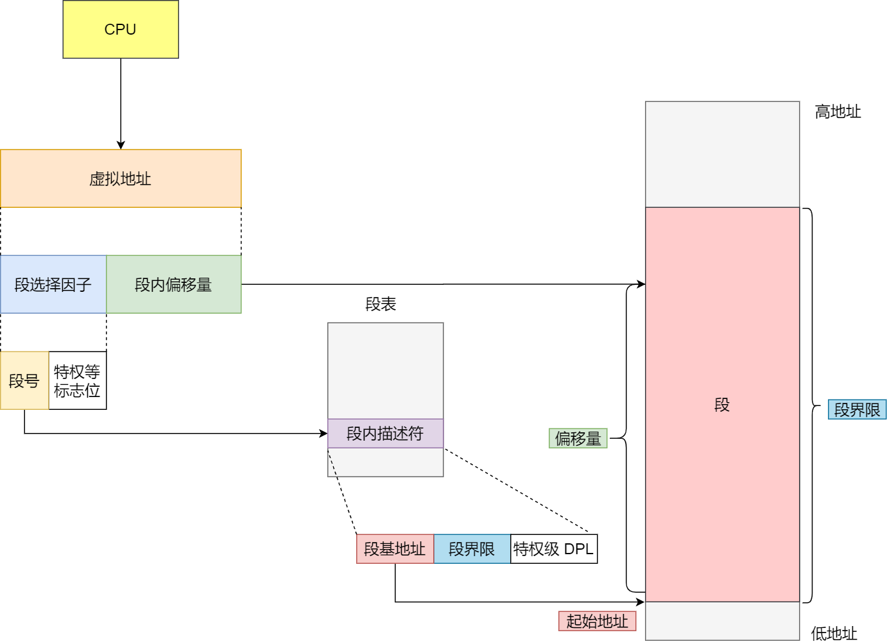

#### 进程和线程

> 进程和线程比较：
>
> - 进程是资源分配的基本单位，线程是CPU调度的基本单位
>
> - 进程拥有一个完整的资源平台，不同进程间的资源独立；同一进程内的多线程之间可以共享代码段、数据段、堆、打开的文件等资源，但每个线程各自都有一套独立的寄存器和栈。
>
> - 线程能够减少并发执行的时间和空间开销
>
> - 进程的上下文切换不仅包含了虚拟内存、栈、全局变量等用户空间的资源，还包括内核堆栈、寄存器等内核空间的资源。
>
>   同一进程下的多线程切换时，各个线程共享相同的虚拟内存和全局变量等资源，只需要切换线程私有寄存器、程序计数器、栈等不共享的数据。


协程：协程又称为微线程，协程不像线程和进程那样需要进行系统内核的上下文切换，协程的上下文切换是由开发人员决定的。

协程是一种用户级轻量级线程，协程拥有自己的寄存器、上下文和栈。协程调度切换时，将寄存器上下文和栈保存到其他地方，切回来时恢复先前保存的寄存器上下文和栈，直接操作用户空间，完全没由内核切换的开销。（对于CPU来说，协程是单线程的，所以CPU不用去考虑调度、上下文切换，省去了CPU调度的开销）

协程的优点：无需系统内核的上下文切换，减小开销；

单线程即可实现高并发，单核CPU即便支持上万的协程都不是问题，适合用于高并发处理。

协程缺点：无法利用CPU的多核；需要使用非阻塞代码。


> 线程的优缺点：
>
> 优点：
>
> - 一个进程中可以同时存在多个线程
>
> - 各个线程之间可以并发执行
>
> - 各个线程之间可以共享地址空间和文件等资源，线程间上下文切换负担小。
>
> 缺点：
>
> ​	进程中的一个线程崩溃时，会导致所属的其他所有线程崩溃(针对于C++，Java不会崩溃) 


> 什么时候需要进行上下文切换？
>
> - 时间片到期：某个进程的时间片用完了，进程从运行状态变为就绪状态。
> - 阻塞等待：当进程等待某个资源（例如I/O操作、内存不足等），操作系统将该进程阻塞，然后将CPU分配给另一个进程。当进程获取到需要的资源时，操作系统会将其唤醒。进行上下文切换。
> - 中断处理：操作系统接收到硬件中断时，操作系统会保存当前的运行状态，切换到中断服务程序，进行上下文切换。
> - 主动挂起：进程调用sleep函数主动挂起。
> - 多处理器系统：多处理器系统中，操作系统可以将多个进程分配到不同的处理器上执行，从而提高系统的并发性能。当一个进程需要访问另一个处理器上的资源时，操作系统会进行上下文切换，将该进程切换到另一个处理器上。
> - 更高优先级进程运行，低优先级进行会被挂起。

#### 进程有哪些状态

进程活动期间最少具备三种基本状态：就绪状态、运行状态、阻塞状态

运行状态：该时刻进程占用CPU

就绪状态：可运行，由于其他进程处于运行状态而暂停运行

阻塞状态：该进程正在等待某一事件发生（如输入/输出操作的完成），而暂时停止运行。


还有另外两种状态：创建状态和结束状态

#### 进程的控制结构

操作系统中使用**进程控制块**（process control block, PCB）数据结构来描述进程的

PCB是进程的唯一标识，包含以下信息：

- 进程描述信息
  - 进程标识符：标识各个进程，没个进程都有一个并且唯一的标识符。
  - 用户标识符：进程归属的用户，用户标识主要为共享和保护服务。
  
- 进程控制和管理信息
  - 进程当前状态：如new,ready,running,waiting,blocked等
  - 进程优先级：进程抢占CPU的优先级
  
- 资源分配清单
  - 有关内存地址空间和虚拟地址空间的信息，所打开文件的列表和所使用的IO设备信息。
  
    进程都有自己的文件表项，有自己的文件偏移量，可以根据文件偏移量读写数据。
  
- CPU相关信息
  - CPU各个寄存器中的值，当进程被切换时，CPU状态信息都会被保存至相应的PCB中，以便进程重新执行时能从断点处执行。

通常使用**链表**的方式组织，将具**有相同状态的进程**链在一起，组成各种队列。


#### 多进程同时访问文件

内核中文件的存储和访问方式：


每个进程有自己独立的进程表项，由文件指针指向**文件表项**，在文件表项中有两个很重要的东西：**状态指针**和当前**文件偏移量**。

情况一：父子进程同时写一个文件

父进程用fork函数创建子进程的时候，会把自己的上下文环境拷贝一份到子进程的内存空间中，这里包括进程表项。所以子进程的进程表和父进程是一样的，指向同一个文件表，当前偏移量会引起文件操作错误。

如果写操作是原子操作的话（可以用`pwrite`实现），那么父子进程写同一个文件不会出现任何问题；如果不是原子操作的话，有可能父进程的`write`函数没有返回前又执行了子进程的`write`函数，由于当前文件偏移量没有改变，所以会覆盖原先内容。（文件偏移量在`write`完成后才会改变，`write`不是原子操作）。

情况二：非父子进程写一个文件

进程各自有各自的进程表。对于fd0，假设刚刚写完一个文件，fd0指向文件表中的当前偏移量改变了，但是fd1中的偏移量没有改变，造成fd1在写文件时会覆盖fd0写入文件的内容。（每一次`write`函数执行完都会根据inode中的长度信息更新文件表内的文件偏移量，但是不会更新其他进程的文件偏移量。）

情况三：多进程同时读一个文件

多进程同时读取文件不会出问题。

如何解决数据覆盖：

1. `lseek`函数：每次写入前使用`lseek()`将文件表内的文件偏移量设置到文件数据之后。但是`lseek`和`write`是两个操作，不是原子的，在`write`前仍有可能被其他进程修改。
2. `O_APPEND`参数：在调用`open`函数时，传入`O_APPEND`参数，内核在检查到整个标志后，在写入数据前，会先将文件偏移量设置到文件数据最后，即将设置偏移量和写入操作作为一个原子操作，写入过程不会被打断，从而使数据不会被覆盖。


#### 进程调度算法

单核CPU中常见的调度算法：

1. 先来先服务调度算法
   先来后到，每次从就绪队列最先进入队列的进程运行直到进程退出或被阻塞，才会继续从队列中选择第一个进程接着运行。

2. 最短作业优先调度算法
   优先选择运行时间最短的进程来运行
3. 高响应比优先调度算法
   每次进行进程调度时，先计算响应比优先级，然后把响应比优先级最高的进程投入运行。（理想型调度算法）响应比计算公式：


4. 时间片轮转调度算法
   每个进程被分配一个时间段，称为时间片，允许该进程在该事件段内运行，超时CPU分配给下一个进程。

5. 最高优先级调度算法
   从就绪队列中选择最高优先级的进程进行运行

6. 多级反馈队列调度算法

   多级反馈队列调度算法是时间片轮转算法和最高优先级调度算法的综合和发展，兼顾了长短作业，同时有较好的响应时间。

   设置多个队列，赋予每个队列不同的优先级，每个队列优先级**从高到低**，同时优先级越高时间片**越短**。


#### 进程间的通信方式

**管道、消息队列、共享内存、信号量、信号、Socket**

**管道：**

匿名管道`|`用完就销毁。命名管道`FIFO`需要先创建管道`mkfifo xx`，写入数据后只有读取后才会退出。**无格式数据**

管道这种通信方式效率低，不适合进程间频繁地交换数据。

**消息队列：**

消息队列是保存在内核中的**消息链表**。在发送数据时，会分成一个一个独立的数据单元，也就是消息体（数据块），消息体是用户自定义的数据类型，消息的发送方和接收方要约定好消息体的**数据类型**，所以每个消息体都是**固定大小**的存储块，不像管道是无格式的字节流数据。如果进程从消息队列中读取了消息体，内核就会把这个消息体**删除**。

缺点：消息队列不适合比较大数据的传输；消息队列通信过程中，存在用户态与内核态之间的数据拷贝开销。

**共享内存：**

**共享内存就是拿出一块虚拟地址来映射到相同的物理内存中**。这样这个进程写入的东西，另外一个进程马上就能看到了，都不需要拷贝来拷贝去，传来传去，大大提高了进程间通信的速度。

缺点：多进程竞争共享资源时，容易造成数据错乱，需要保护机制使得共享的资源在任意时刻只能被一个进程访问。

信号量：

信号量是一个**整型的计数器**，主要用于实现**进程间的互斥和同步**，而不是用于缓存进程间的通信。

信号量表示资源的数量，控制信号量的方式有两种原子操作：

- 一个是 **P 操作**，这个操作会把信号量减去 1，相减后如果信号量 < 0，则表明资源已被占用，进程需阻塞等待；相减后如果信号量 >= 0，则表明还有资源可使用，进程可正常继续执行。
- 另一个是 **V 操作**，这个操作会把信号量加上 1，相加后如果信号量 <= 0，则表明当前有阻塞中的进程，于是会将该进程唤醒运行；相加后如果信号量 > 0，则表明当前没有阻塞中的进程；

P 操作是用在进入共享资源之前，V 操作是用在离开共享资源之后，这两个操作是必须成对出现的。**互斥信号量为1，同步信号量为0。**

**信号**

异常情况下的工作模式，需要用信号的方式来通知进程。

信号是进程间通信机制中唯一的异步通信机制，因为可以在任何时候发送信号给某一进程。`kill -l`查看所有的信号。

**socket**

Socket不仅可以跨网络与不同主机间的通信，还可以在同主机上进程间通信。

#### 如何实现线程的互斥与同步

- 锁：加锁和解锁操作可以解决并发线程/进程的互斥问题。

- 信号量：两种原子操作：P操作信号量减1，V操作信号量加1。互斥：信号量为1，同步：信号量为0。

  - *P 操作*：将 `sem` 减 `1`，相减后，如果 `sem < 0`，则进程/线程进入阻塞等待，否则继续，表明 P 操作可能会阻塞；
  - *V 操作*：将 `sem` 加 `1`，相加后，如果 `sem <= 0`，唤醒一个等待中的进程/线程，表明 V 操作不会阻塞；

  P 操作是用在进入临界区之前，V 操作是用在离开临界区之后，这两个操作是必须成对出现的。

#### 生产者消费者模型


生产者-消费者问题描述：

- **生产者**在生成数据后，放在一个缓冲区中；
- **消费者**从缓冲区取出数据处理；
- 任何时刻，**只能有一个**生产者或消费者可以访问缓冲区；

分析可得出：

- 任何时刻只能有一个线程操作缓冲区，说明操作缓冲区是临界代码，**需要互斥**；
- 缓冲区空时，消费者必须等待生产者生成数据；缓冲区满时，生产者必须等待消费者取出数据。说明生产者和消费者**需要同步**。

需要三个信号量，分别是：

- 互斥信号量 `mutex`：用于互斥访问缓冲区，初始化值为 1；
- 资源信号量 `fullBuffers`：用于消费者询问缓冲区是否有数据，有数据则读取数据，初始化值为 0（表明缓冲区一开始为空）；
- 资源信号量 `emptyBuffers`：用于生产者询问缓冲区是否有空位，有空位则生成数据，初始化值为 n （缓冲区大小）；


#### 怎么避免死锁（死锁产生的条件、排查死锁）

死锁产生的条件：

- **互斥条件**（互斥条件是指**多个线程不能同时使用同一个资源**）
- **请求并保持条件**（线程在等待资源的同时不会释放自己已经持有的资源）
- **不可剥夺条件**(资源在当前线程使用完前不能被其他线程剥夺)
- **环路等待条件**（两个线程获取资源的顺序构成环）

如何排查死锁：

​	Java程序排查死锁可以使用JDK自带的`jstack`工具分析堆栈。

​	Linux下可以使用`pstack+gdb`工具定位死锁问题。

> 可以多次执行 pstack 命令查看线程的函数调用过程，多次对比结果，确认哪几个线程一直没有变化，且是因为在等待锁，那么大概率是由于死锁问题导致的。
>
> 进程里面发生死锁的线程会处于阻塞的状态，此时基本不占有CPU，因此CPU的利用率、内存占有率将会比较低。 我们可以使用`ps aux` 命令来看一个进程的状态，然后，使用 top 命令来查看进程的CPU利用率、内存占有率

如何避免死锁：

破坏死锁产生的必要条件

1. 破坏请求并保持条件：一次性申请所有资源

2. 破坏不可剥夺条件：占用部分资源的线程在申请其他资源被阻塞时释放掉已经占有的资源。

3. 破坏环路等待条件：靠顺序申请资源来预防。按某一顺序申请资源，再按相反顺序释放资源。

4. 设置超时时间。

   

#### 锁的种类、应用场景

互斥锁、自旋锁、读写锁、乐观锁、悲观锁

**概念、特点、应用场景方面进行回答**

- **互斥锁**：互斥锁加锁失败后，线程会**释放CPU**，给其他线程。

   应用场景：适用于对共享资源访问需要互斥的场景，如文件修改、临界区保护等。

- **自旋锁**：自旋锁加锁失败后，线程会**忙等待**，直到它拿到锁。

   自旋锁是最比较简单的一种锁，一直自旋，利用 CPU 周期，直到锁可用。**需要注意，在单核 CPU 上，需要抢占式的调度器（即不断通过时钟中断一个线程，运行其他线程）。否则，自旋锁在单 CPU 上无法使用，因为一个自旋的线程永远不会放弃 CPU。**

   如果被锁住代码的执行时间很短时应该选择开销比较小的自旋锁，因为自旋锁加锁失败时，并不会主动产生线程切换，而是一直忙等待，直到获得锁，如果被锁住的代码执行时间比较短时，忙等待的时也更短。

   应用场景：适用于单核处理器上锁持有时间段、线程数少等场景。

- **读写锁：**
  - 写锁：独占锁
  - 读锁：共享锁，读锁可以被多个线程同时占有

   读写锁在**读多写少**的场景下能发挥出优势。

   读写锁按照实现不同可分为读优先锁和写优先锁、公平读写锁。

   公平读写锁：用队列把获取锁的线程排队，不管是写线程还是读线程都按照先进先出的原则加锁即可，这样读线程仍然可以并发，也不会出现「饥饿」的现象。

   应用场景：适用于读操作频繁、写操作较少的场景，如缓存、数据库等。

- **信号量：**信号量是控制进程间同步的机制。应用场景：适用于资源的数量有限，需要限制同时访问资源的进程数的场景，如进程池、线程池等。
- **条件变量：**条件变量是一种用于线程间通信的机制。应用场景：适用于需要等待某个条件满足才能继续执行的场景，如生产者消费者模型、任务队列等。

- **乐观锁和悲观锁**

   互斥锁、自旋锁、读写锁都是悲观锁。

   悲观锁：**多线程同时修改共享资源的概率比较高，于是很容易出现冲突，所以访问共享资源前，先要上锁**。

   乐观锁：**先修改完共享资源，再验证这段时间内有没有发生冲突，如果没有其他线程在修改资源，那么操作完成，如果发现有其他线程已经修改过这个资源，就放弃本次操作**。

   **乐观锁全程并没有加锁，所以它也叫无锁编程**。

   多线程同时修改共享资源的概率比较低时可以采用乐观锁。比如在线文档、Git、SVN。

   乐观锁虽然去除了加锁解锁的操作，但是一旦发生冲突，重试的成本非常高，所以**只有在冲突概率非常低，且加锁成本非常高的场景时，才考虑使用乐观锁。**

#### 一个进程最多可以创建多少个线程

Windows下默认2048个线程数目限制。

在Linux下，创建的线程数目受以下参数影响：

用户态的虚拟空间内存、创建每个线程分配的栈空间、系统支持的最大线程数目、系统全局PID号数目、最大文件描述符个数限制。

#### 线程崩溃了，进程也会崩溃吗

C/C++中进程中的一个线程崩溃时，会导致其所属所有线程崩溃。Java中则不会。

一般来说如果线程因为非法访问内存引起的崩溃，那么进程肯定会崩溃。因为进程中各个线程的**地址空间是共享**的，某个线程对地址的非法访问会导致内存的不确定性，进而可能影响到其他线程。

使进程崩溃的机制是**信号**（kill）

正常情况下，操作系统为了保证系统安全，所以针对非法内存访问会发送一个 SIGSEGV （段错误）信号，而操作系统一般会调用默认的信号处理函数（一般会让相关的进程崩溃）,进程也可以注册自己的信号处理函数用于处理错误或者恢复进程执行。

Java不会崩溃原因：JVM自定义了自己的信号处理函数，拦截了**SIGSEGV**信号。


#### 虚拟内存、内存分页、内存分段

为什么要使用虚拟内存

- 虚拟内存可以允许程序访问比实际物理地址更大的内存空间

- 安全性高：虚拟内存与物理内存隔离开，从而避免进程间的内存访问冲突，提高系统的安全性。
- 性能更好：虚拟内存将进程的内存分页，放置在物理内存或磁盘中，在需要时将页面加载到内存中，可以提高系统的性能。

操作系统怎么管理虚拟内存和物理地址之间的关系

主要方式有两种：**内存分段**和**内存分页**。

**内存分段：**

程序由若干个逻辑分段组成，可由代码段、数据段、堆段、栈段组成。不同的段有不同的属性，所以用分段的形式将这些段分离出来。

分段机制下虚拟地址由两部分组成：**段选择因子**和**段内偏移量**。（虚拟地址是通过**段表**与物理地址进行映射的）



段选择因子中最重要的是段号，用作段表的索引。段表里保存的是段基地址、段的界限和特权等级。

段内偏移量应该介于0和段界限之间。如果段内偏移量合法，物理内存地址=段基地址+段内偏移量

内存分段缺点：

1. 内存碎片问题（不存在内部碎片，存在外部碎片）

   每个段的长度不固定，所以多个段未必能恰好使用所有的内存空间，会产生多个不连续的物理内存，出现外部碎片。解决外部碎片的方法就是内存交换。

2. 内存交换效率低

   内存交换需要swap空间，这块空间是从磁盘中划分出来的。磁盘访问速度比内存慢的多，如果要交换很大的内存空间，就会影响CPU性能。

为了解决内存分段存在的内存碎片和外部碎片交换效率低的问题，就出现了内存分页。

**内存分页：**

分页是把整个虚拟和物理内存空间切成一段段固定尺寸的大小。Linux下每一页的大小为4kb。

（虚拟地址与物理地址之间通过**页表**来映射）。内存管理单元（MMU）负责将虚拟内存地址传唤为物理内存地址。


> 分页是怎么解决分段的外部内存碎片和内存交换效率低的问题？
>
> 内存分页由于内存空间都是预先划分好的，不会像内存分段一样在段与段之间产生间隙非常小的内存。采用了分页，页与页之间是紧密排列的，所以不会有外部碎片。
>
> 但是内存分页机制最小分配的单位是一页，即使程序不足一页大小也会分配一页，会产生内部内存碎片。
>
> 解决内存交换效率低：
>
> 如果内存空间不够，就会将进程中最近未使用的内存页面换出写到磁盘上。需要的时候再加载进来（换入）。所以一次性写入磁盘只有少数几个页，内存交换的效率就相对比较高。**只有在程序运行中，需要用到对应虚拟内存页里面的指令和数据时，再加载到物理内存里面去。**

分页机制下，虚拟地址和物理地址是如何映射的？

分页机制下，虚拟地址分为两部分：**页号**和**页内偏移**。页号作为页表的索引，页表包含物理页每页所在物理地址的基地址，基地址和页内偏移组合形成了物理内存地址。


简单分页存在**空间上的缺陷**，解决方法是使用**多级页表**。（时间换空间）

缺陷：因为操作系统是可以同时运行非常多的进程的，意味着页表会非常的庞大。

比如在 32 位的环境下，虚拟地址空间共有 4GB，假设一个页的大小是 4KB（2^12），那么就需要大约 100 万 （2^20） 个页，每个「页表项」需要 4 个字节大小来存储，那么整个 4GB 空间的映射就需要有 `4MB` 的内存来存储页表。这 4MB 大小的页表，看起来也不是很大。但是要知道每个进程都是有自己的虚拟地址空间的，也就说都有自己的页表。那么，`100` 个进程的话，就需要 `400MB` 的内存来存储页表，这是非常大的内存了，更别说 64 位的环境了。


多级页表

64位系统通常需要4级分页。

局部性原理：**如果某个一级页表的页表项没有被用到，也就不需要创建这个页表项对应的二级页表了，即可以在需要时才创建二级页表**


TLB(快表)

多级页表解决了空间上的问题，但是虚拟地址到物理地址的转换就多了几道转换的工序，降低了地址转换的速度，带来了**时间上的开销**。

程序是有局部性的，在一段时间内，整个程序的执行仅限于程序中某一部分。那么相应的执行所访问的存储空间也局限于某个内存区域。

可以将最常访问的几个页表存储到访问更快的硬件中，于是就在CPU芯片中加入了一个专门存放程序最常访问的页表项的Cache,也就是**TLB**（通常称为页表缓存、转址旁路缓存、**快表**等）

在CPU芯片内，封装了内存管理单元芯片，用来完成地址转换和TLB的访问交互。在寻址时会先查TLB，没找到才会继续查常规的页表。


**段页式内存管理**

内存分段和内存分页并不是对立的，组合起来在系统中使用的，通常称为段页式内存管理。


段页式内存管理实现的方式：

- 先将程序划分为多个有逻辑意义的段，也就是前面提到的分段机制；
- 接着再把每个段划分为多个页，也就是对分段划分出来的连续空间，再划分固定大小的页；

地址结构就由**段号、段内页号和页内位移**三部分组成

**Linux主要采用了分页管理**。


#### 写时复制原理

写时复制(copy on write)：在Linux系统中，调用fork系统调用创建子进程时，并不会把父进程所有占用的内存页也复制一份，而是与父进程共用相同的内存页，当子进程或者父进程对内存页进行修改时才会进行复制，这就是写时复制机制。

虚拟内存：进程申请的内存为虚拟内存。

物理内存：电脑中安装的内存条中的实际物理内存。

虚拟内存需要与物理内存进行映射才能使用，如果不同进程的虚拟内存地址映射到相同的物理内存地址，就实现了共享内存的机制。


写时复制的优点：Linux为了加速创建子进程过程与节省内存使用的原因，实现了写时复制的机制。

写时复制原理：

- 创建子进程时，将父进程的虚拟内存与物理内存映射关系（段表+页表）复制到子进程中，并将内存设置为只读。（设置只读时为了当内存进行写操作时触发缺页异常，从而内核可以在缺页异常处理函数中进行物理内存页的复制（无论父子进程执行写操作都会导致缺页））
- 当子进程或者父进程对内存数据进行修改时，便会触发写时复制机制：将原来的内存页复制一份新的，并重新设置其内存映射关系，将父子进程的内存权限设置为可读写

#### 内存页面置换算法

**什么时候需要进行内存页面置换**：遇到缺页问题且物理内存已满。

> 缺页异常（缺页中断）：
>
> 当 CPU 访问的页面不在物理内存时，便会产生一个缺页中断，请求操作系统将所缺页调入到物理内存。那它与一般中断的主要区别在于：
>
> - 缺页中断在指令执行「期间」产生和处理中断信号，而一般中断在一条指令执行「完成」后检查和处理中断信号。
> - 缺页中断返回到该指令的开始重新执行「该指令」，而一般中断返回回到该指令的「下一个指令」执行。
>
> 
>
> 1. 在 CPU 里访问一条 Load M 指令，然后 CPU 会去找 M 所对应的页表项。
> 2. 如果该页表项的状态位是「有效的」，那 CPU 就可以直接去访问物理内存了，如果状态位是「无效的」，则 CPU 则会发送缺页中断请求。
> 3. 操作系统收到了缺页中断，则会执行缺页中断处理函数，先会查找该页面在磁盘中的页面的位置。
> 4. 找到磁盘中对应的页面后，需要把该页面换入到物理内存中，但是在换入前，需要在物理内存中找空闲页，如果找到空闲页，就把页面换入到物理内存中。
> 5. 页面从磁盘换入到物理内存完成后，则把页表项中的状态位修改为「有效的」。
> 6. 最后，CPU 重新执行导致缺页异常的指令
>
> 第四步如果操作系统在物理内存中找不到空闲页就需要**页面置换**。选择一个物理页将其换出到磁盘（如果没被修改过，修改过的跳过换出），然后将其页表项状态改成无效的。最后把正在访问的页面装入到这个物理页中。

页表项字段：


- *状态位*：用于表示该页是否有效，也就是说是否在物理内存中，供程序访问时参考。
- *访问字段*：用于记录该页在一段时间被访问的次数，供页面置换算法选择出页面时参考。
- *修改位*：表示该页在调入内存后是否有被修改过，由于内存中的**每一页都在磁盘上保留一份副本**，因此，如果没有修改，在置换该页时就不需要将该页写回到磁盘上，以减少系统的开销；如果已经被修改，则将该页重写到磁盘上，以保证磁盘中所保留的始终是最新的副本。
- *硬盘地址*：用于指出该页在硬盘上的地址，通常是物理块号，供调入该页时使用。

内存访问流程：


**常见的页面置换算法**

**先进先出置换算法（FIFO）**

**选择在内存驻留时间很长的页面进行中置换**，这个就是「先进先出置换」算法的思想。

**最近最久未使用的置换算法（LRU）**

最近最久未使用置换算法的基本思路是发生缺页时，**选择最长时间没有被访问的页面进行置换**。该算法假设已经很久没有使用的页面很有可能在未来较长的一段时间内仍然不会被使用。**LRU代价较高**，需要在内存中维护一个所有页面的链表，每次访问内存都要更新整个链表，在链表中找到一个页面删除它然后在头部添加。

**时钟页面置换算法**

Clock页面置换算法，LRU的近似，对FIFO的一种改进

该算法的思路是：将所有的页面都保存在一个类似钟面的环形链表中，需要用到页表项当中的访问位，当一个页面被装入内存时，把该位初始化为0，然后如果这个页面被访问（读/写），则把该位置为1；把各个页面组织成环形链表（类似于钟表面），把指针指向最老的页面（最先进来）；当发生缺页中断时，算法首先检查表针指向的页面：

- 如果它的访问位是 0 就淘汰该页面，并把新的页面插入这个位置，然后把表针前移一个位置；
- 如果访问位是 1 就清除访问位，并把表针前移一个位置，重复这个过程直到找到了一个访问位为 0 的页面为止；


**最不常用算法（LFU）**

当发生缺页中断时，选择「访问次数」最少的那个页面，并将其淘汰。它的实现方式是，对每个页面设置一个「访问计数器」，每当一个页面被访问时，该页面的访问计数器就累加 1。在发生缺页中断时，淘汰计数器值最小的那个页面。

缺点：使用时需要遍历链表找到计数最少的页面。还有个问题，LFU 算法只考虑了频率问题，没考虑时间的问题，比如有些页面在过去时间里访问的频率很高，但是现在已经没有访问了，而当前频繁访问的页面由于没有这些页面访问的次数高，在发生缺页中断时，就会可能会误伤当前刚开始频繁访问，但访问次数还不高的页面。

**最佳页面置换算法（OPT）**

最佳页面置换算法基本思路是，**置换在「未来」最长时间不访问的页面**。该算法实现需要计算内存中每个逻辑页面的「下一次」访问时间，然后比较，选择未来最长时间不访问的页面。这很理想，但是实际系统中**无法实现**，因为程序访问页面时是动态的，我们是无法预知每个页面在「下一次」访问前的等待时间。


#### 传统的I/O流程

- CPU 发出对应的指令给磁盘控制器，然后返回；
- 磁盘控制器收到指令后，于是就开始准备数据，会把数据放入到磁盘控制器的内部缓冲区中，然后产生一个**中断**；
- CPU 收到中断信号后，停下手头的工作，接着把磁盘控制器的缓冲区的数据一次一个字节地读进自己的寄存器，然后再把寄存器里的数据写入到内存，而在数据传输的期间 CPU 是无法执行其他任务的。


#### DMA技术

DMA技术称为直接内存访问技术(Direct Memory Acess)

**在进行 I/O 设备和内存的数据传输的时候，数据搬运的工作全部交给 DMA 控制器，而 CPU 不再参与任何与数据搬运相关的事情，这样 CPU 就可以去处理别的事务**


- 用户进程调用 read 方法，向操作系统发出 I/O 请求，请求读取数据到自己的内存缓冲区中，进程进入阻塞状态；
- 操作系统收到请求后，进一步将 I/O 请求发送 DMA，然后让 CPU 执行其他任务；
- DMA 进一步将 I/O 请求发送给磁盘；
- 磁盘收到 DMA 的 I/O 请求，把数据从磁盘读取到磁盘控制器的缓冲区中，当磁盘控制器的缓冲区被读满后，向 DMA 发起中断信号，告知自己缓冲区已满；
- **DMA 收到磁盘的信号，将磁盘控制器缓冲区中的数据拷贝到内核缓冲区中，此时不占用 CPU，CPU 可以执行其他任务**；
- 当 DMA 读取了足够多的数据，就会发送中断信号给 CPU；
- CPU 收到 DMA 的信号，知道数据已经准备好，于是将数据从内核拷贝到用户空间，系统调用返回；

#### 传统的文件传输


发生**四次**内核态和用户态的**上下文切换**（两次系统调用，read()和write()，每次系统调用都是先从用户态切换到内核态，等内核完成任务后，再从内核中切换回来）

发生**四次文件拷贝**（两次DMA拷贝和两次CPU拷贝）

如何优化文件传输性能：1.减少系统调用  2.减少文件拷贝次数

#### 如何实现零拷贝

零拷贝技术通常有两种：`mmap+write`和`snedfile`

**零拷贝（\*Zero-copy\*）技术，没有在内存层面去拷贝数据，也就是说全程没有通过 CPU 来搬运数据，所有的数据都是通过 DMA 来进行传输的。**

1. `mmap+write`

   mmap（Memory-mapped）内存映射

   使用`mmap`代替`read`,`mmap`系统调用函数会把内核缓冲区内的数据**映射**到用户空间，这样操作系统内核与用户空间就不需要数据拷贝操作。

   发生**四次**内核态和用户态的**上下文切换**（两次系统调用）

   **一次CPU拷贝**和**两次DMA拷贝**。


- 应用进程调用了 `mmap()` 后，DMA 会把磁盘的数据拷贝到内核的缓冲区里。接着，应用进程跟操作系统内核「共享」这个缓冲区；
- 应用进程再调用 `write()`，操作系统直接将内核缓冲区的数据拷贝到 socket 缓冲区中，这一切都发生在内核态，由 CPU 来搬运数据；
- 最后，把内核的 socket 缓冲区里的数据，拷贝到网卡的缓冲区里，这个过程是由 DMA 搬运的。

2. `sendfile`

   ```cpp
   #include <sys/socket.h>
   ssize_t sendfile(int out_fd, int in_fd, off_t *offset, size_t count);
   ```

 2 次上下文切换(一次系统调用)，和 3 次数据拷贝（一次CPU拷贝，两次DMA拷贝）


如果网卡支持 SG-DMA（*The Scatter-Gather Direct Memory Access*）技术（和普通的 DMA 有所不同），我们可以进一步减少通过 CPU 把内核缓冲区里的数据拷贝到 socket 缓冲区的过程。

- 第一步，通过 DMA 将磁盘上的数据拷贝到内核缓冲区里；
- 第二步，缓冲区描述符和数据长度传到 socket 缓冲区，这样网卡的 SG-DMA 控制器就可以直接将内核缓存中的数据拷贝到网卡的缓冲区里，此过程不需要将数据从操作系统内核缓冲区拷贝到 socket 缓冲区中，这样就减少了一次数据拷贝；


使用零拷贝的例子：Kafka、Nginx、C++中vector的emplace_back()。


#### 阻塞IO和非阻塞IO区别和应用场景

阻塞IO模型是指在应用程序执行IO操作时，会一直等待直到操作完成才返回，期间无法执行其他的任务。

非阻塞IO模型是指在程序执行IO操作时，会立刻返回，CPU可以执行其他的任务，无论数据有没有读完。需要轮询IO状态判断是否完成操作。

阻塞IO：**优点**：实现简单，编译调试和理解。缺点：等待IO操作期间CPU无法执行其他的任务，降低系统的并发能力。

非阻塞IO：优点：提高系统的并发能力。缺点：实现复杂。

应用：实际应用中一般阻塞IO和非阻塞IO搭配使用，阻塞IO负责等待连接请求，非阻塞IO负责处理数据传输。

**阻塞等待的是「内核数据准备好」和「数据从内核态拷贝到用户态」这两个过程**

**非阻塞等待的是「数据从内核态拷贝到用户态」这个过程**


#### 同步和异步的区别

无论 read 和 send 是阻塞 I/O，还是非阻塞 I/O 都是同步调用。因为在 read 调用时，内核将数据**从内核空间拷贝到用户空间的过程都是**需要等待的，也就是说这个过程是同步的，如果内核实现的拷贝效率不高，read 调用就会在这个同步过程中等待比较长的时间。

**异步 I/O** 是「内核数据准备好」和「数据从内核态拷贝到用户态」这**两个过程都不用等待**。


应用场景：

同步：在文件读取、数据库查询等需要获取数据的操作中，通常会使用同步的方式。同步调用会阻塞程序程序的执行，直到获取到所需的数据或者发生超时等异常情况。

异步：在网络通信、信息传递需要等待响应的操作，通常会使用异步方式，异步调用不会阻塞程序的执行，而是在发送请求后立即返回，然后再收到响应后再进行后续处理。

阻塞：在用户输入、文件读取等需要等待外部事件的操作中们通常会使用阻塞方式。阻塞调用会一致等待外部事件的发生，直到事件发生或者超时等异常情况。

非阻塞：在多任务并发处理、GUI界面更新等需要同时处理多个任务的操作中们通常会使用非阻塞的方式。

异步阻塞通常不会出现。

> 阻塞 I/O 好比，你去饭堂吃饭，但是饭堂的菜还没做好，然后你就一直在那里等啊等，等了好长一段时间终于等到饭堂阿姨把菜端了出来（数据准备的过程），但是你还得继续等阿姨把菜（内核空间）打到你的饭盒里（用户空间），经历完这两个过程，你才可以离开。
>
> 非阻塞 I/O 好比，你去了饭堂，问阿姨菜做好了没有，阿姨告诉你没，你就离开了，过几十分钟，你又来饭堂问阿姨，阿姨说做好了，于是阿姨帮你把菜打到你的饭盒里，这个过程你是得等待的。
>
> 异步 I/O 好比，你让饭堂阿姨将菜做好并把菜打到饭盒里后，把饭盒送到你面前，整个过程你都不需要任何等待。
>
> 很明显，异步 I/O 比同步 I/O 性能更好，因为异步 I/O 在「内核数据准备好」和「数据从内核空间拷贝到用户空间」这两个过程都不用等待。

#### IO多路复用、select、poll、epoll

**IO多路复用**：IO多路复用允许在一个线程或进程中同时监听和处理多个输入/输出事件，从而提高系统的性能和资源利用率。一个I/O进程任一时刻只能处理一个请求，但是在处理每个请求事件时，耗时控制在1毫秒内，这样一秒就可以处理上千个请求，把时间拉长就是多个请求复用一个I/O进程。进程通过一个系统调用函数从内核中获取多个事件。网络编程中通过一个进程监听多个socket文件描述符，一旦某个文件描述符就绪，就通知程序进行相应的读写操作的一种机制。

IO多路复用和多线程多进程相比**优点**：

- 和多进程多线程相比，IO多路复用最大的优势就是系统开销小，系统不必创建大量的进程或线程，也不必维护这些进程或线程，从而大大减小了系统的开销。

- 同时也不需要频繁的上下文切换，IO多路复用模型将多个文件描述符注册到一个等待队列中，在有数据可读或者可写时，操作系统就会通知应用程序，应用程序通过系统调用来写入或者读取数据。

常见的IO多路复用机制有如下几种：

**select、poll、epoll这些系统调用都是同步阻塞的**：如果传入的多个文件描述符中有描述符就绪，则返回就绪的描述符；否则如果所有的文件描述符都未就绪，就阻塞调用进程，直到某个描述符就绪，或者阻塞超时后返回。I/O多路复用内部使用的是非阻塞I/O检查每个描述符的就绪状态。

##### select

select 实现多路复用的方式是，将已连接的 Socket 都放到一个**文件描述符集合**，然后调用 select 函数将文件描述符集合**拷贝**到内核里，让内核来检查是否有网络事件产生，检查的方式很粗暴，就是通过**遍历**文件描述符集合的方式，当检查到有事件产生后，将此 Socket 标记为可读或可写， 接着再把整个文件描述符集合**拷贝**回用户态里，然后用户态还需要再通过**遍历**的方法找到可读或可写的 Socket，然后再对其处理。

所以，对于 select 这种方式，需要进行 **2 次「遍历」文件描述符集合**，一次是在内核态里，一个次是在用户态里 ，而且还会发生 **2 次「拷贝」文件描述符集合**，先从用户空间传入内核空间，由内核修改后，再传出到用户空间中。

select 使用固定长度的 BitsMap，表示文件描述符集合，而且所支持的文件描述符的个数是有限制的，在 Linux 系统中，由内核中的 FD_SETSIZE 限制， 默认最大值为 `1024`，只能监听 0~1023 的文件描述符。

```cpp
#include <sys/select.h>
#include <sys/time.h>
int select(int maxfdp1, fd_set *readset, fd_set *writeset, fd_set *exceptset,
          const struct timeval *timeout);
// return：表示此时有多少个监控的描述符就绪，若超时则为0，出错为-1。
select 函数监视的文件描述符分三类，分别是 writefds(写)、readfds(读) 和 exceptfds(异常)
```

select优点：简单有效，几乎所有操作系统都对应实现，精度高（理论上超时事件可以精确到微秒级，而poll和epoll直到毫秒级）

缺点：每次调用select和返回都经历两次遍历、两次拷贝；受select文件描述符限制，32 位系统最多能监听 1024 个 fd，64 位最多监听 2048 个。

select底层：三个数组：读事件数组、写事件数组、异常事件数组。数组中存放文件描述符。


##### poll

poll 函数与 select 原理相似，都需要来回拷贝全部监听的文件描述符，不同的是：

1）poll 函数采用**链表**的方式替代原来 select 中 fd_set 结构，因此可监听文件描述符数量不受限(仍受系统内核限制)。（用户态通过数组方式传递文件描述符，在内核中转为链表方式存储）

2）poll 函数返回后，对文件描述符链表进行遍历，找到就绪事件。

3）**水平触发**：也就是通知程序 fd 就绪后，这次没有被处理，那么下次 poll 的时候会再次通知同个 fd 已经就绪。

```cpp
int poll(struct pollfd* fds, int nfds, int timeout);
/*
struct pollfd{
	int fd;        // 感兴趣fd
	short events;  // 监听事件
	short revents; // 就绪事件
};
*/
// return：表示此时有多少个监控的描述符就绪，若超时则为0，出错为-1。
```

poll缺点：和 select 函数一样，poll 返回后，需要轮询 pollfd 来获取就绪的描述符，性能开销会随着文件描述符数量增大线性增大。

poll有点：没有最大连接数量的限制（基于链表存储）。

##### epoll

epoll 通过两个方面，很好解决了 select/poll 的问题，避免了性能开销大和文件描述符数量少的缺点。

*第一点*，epoll 在内核里使用**红黑树来跟踪进程所有待检测的文件描述字**，把需要监控的 socket 通过 `epoll_ctl()` 函数加入内核中的红黑树里，红黑树是个高效的数据结构，增删改一般时间复杂度是 `O(logn)`。而 select/poll 内核里没有类似 epoll 红黑树这种保存所有待检测的 socket 的数据结构，所以 select/poll 每次操作时都传入整个 socket 集合给内核，而 epoll 因为在内核维护了红黑树，可以保存所有待检测的 socket ，所以只需要传入一个待检测的 socket，减少了内核和用户空间大量的数据拷贝和内存分配。

*第二点*， epoll 使用**事件驱动**的机制，内核里**维护了一个链表来记录就绪事件**，当某个 socket 有事件发生时，通过**回调函数**内核会将其加入到这个就绪事件列表中，当用户调用 `epoll_wait()` 函数时，只会返回有事件发生的文件描述符的个数，不需要像 select/poll 那样轮询扫描整个 socket 集合，大大提高了检测的效率。

```cpp
int epoll_create(int size)；//创建一个epoll的句柄，size用来告诉内核这个监听的数目一共有多大
int epoll_ctl(int epfd, int op, int fd, struct epoll_event *event)；
//OP 用三个宏来表示：添加（EPOLL_CTL_ADD）、删除（EPOLL_CTL_DEL）、修改（EPOLL_CTL_MOD）。分别表示添加、删除和修改 fd 的监听事件。
int epoll_wait(int epfd, struct epoll_event * events, int maxevents, int timeout);
```

epoll 支持两种事件触发模式，分别是**边缘触发（edge-triggered，ET）和水平触发（level-triggered，LT）**。

- 使用边缘触发模式时，当被监控的 Socket 描述符上有可读事件发生时，**服务器端只会从 epoll_wait 中苏醒一次**，即使进程没有调用 read 函数从内核读取数据，也依然只苏醒一次，因此我们程序要保证**一次性将内核缓冲区的数据读取完**；
  - 优点：每次内核只会通知一次，大大减少了内核资源的浪费，提高效率
  - 缺点：不能保证数据的完整性，不能及时取出所有的数据
- 使用水平触发模式时（默认），当被监控的 Socket 上有可读事件发生时，**服务器端不断地从 epoll_wait 中苏醒，直到内核缓冲区数据被 read 函数读完才结束**，目的是告诉我们有数据需要读取；
  - 优点：能够保证数据的完整性，进行IO操作时只要缓冲区有数据就会一直通知
  - 缺点：只要缓冲区有数据，内核就会不断从内核空间转到用户空间，占用大量的内核资源。

边缘触发模式时必须使用非阻塞套接头，以避免由于一个文件句柄的读写阻塞导致把其他多个文件描述符饿死。

epoll优点：

1）没有最大并发连接的限制，能打开的 FD 的上限远大于 1024。（收系统文件描述符上限影响）

2）效率提升，不是轮询的方式，不会随着 FD 数目的增加效率下降。

3）内存拷贝，利用 mmap() 文件映射内存加速与内核空间的消息传递，即 epoll 使用 mmap 减少复制开销。（ mmap 的引入，**将用户空间的一块地址和内核空间的一块地址同时映射到相同的一块物理内存地址**（不管是用户空间还是内核空间都是虚拟地址，最终要通过地址映射映射到物理地址），使得这块物理内存对内核和对用户均可见，减少用户态和内核态之间的数据交换。）

4）新增 ET 模式。

##### 什么时候用边缘触发、什么时候用水平触发

边缘触发：边缘触发适用于需要精确数据流的应用场景。

- 适用于高并发、高吞吐量的场景，当数据流到来时，内核立即通知应用程序进行读写操作，避免了重复触发事件和重新读取套接字的开销
- 适用于需要精确控制的场景，数据流到达时内核只会通知一次。

水平触发：适用于少量数据或者需要保护数据完整性的场景；适用于阻塞IO网络模型的场景。

##### 实际使用时IO多路复用模型的选择

首先说明不同IO多路复用模型特点：

- select:最久、最常用的IO多路复用机制，几乎所有的操作系统都可以使用。适用于需要同时监视文件描述都数量较小的情况，通常在几百个以下。可移植性好，适用于多平台开发。
- poll：poll是对select的改进，能够处理更多的文件描述符，没有select的限制；适用于同时监控文件描述符数量较大的情况，通常在几千个以下；可移植性好。
- epoll：epoll是Linux平台下的IO多路复用机制，可移植性差；通过内核事件通知处理；适用于大规模高并发的情况，通常在几万个甚至更多，对于少量文件描述符来说开销较大，需要维持就绪事件列表；支持边缘触发和水平触发两种模式。

选择IO多路复用模型需要考虑一下因素：

- 并发连接数：如果需要同时监听的文件描述符数量较少，可以考虑使用select或者poll。文件描述符数量特别多可以考虑使用epoll。
- 平台兼容性：如果要在多个操作系统上允许，尤其是非Linux平台可以使用select或者poll。
- 性能需要：如果对性能要求较高，特别是大规模高并发场景下可以考虑使用epoll。


#### Reactor模型

Reactor模型是基于事件驱动的高性能IO模型，使用IO多路复用机制。Reactor的核心机制是将IO事件的处理分离开来，由一个主线程Reactor负责监听所有的IO事件，根据事件的类型分发给Acceptor对象或者Handler对象来处理事件，从而实现高效的IO操作。

##### Reactor模型组成

Reactor主要有Reactor和处理资源池两个核心部分组成，负责事项如下：

- Reactor负责监听和分发事件，事件类型包括连接事件、读写事件
- 处理资源池负责处理事件，如read->业务逻辑->write

##### Reactor分类

1. 单Reactor单线程/进程

​	进程中有Reactor、Acceptor、Handler对象。

- Reactor 对象通过 select （IO 多路复用接口） 监听事件，收到事件后通过 dispatch 进行分发，具体分发给 Acceptor 对象还是 Handler 对象，还要看收到的事件类型；
- 如果是连接建立的事件，则交由 Acceptor 对象进行处理，Acceptor 对象会通过 accept 方法 获取连接，并创建一个 Handler 对象来处理后续的响应事件；
- 如果不是连接建立事件， 则交由当前连接对应的 Handler 对象来进行响应；
- Handler 对象通过 read -> 业务处理 -> send 的流程来完成完整的业务流程。

​	缺点：1. 只有一个进程，无法充分利用多核CPU的性能。

​				2. Handler对象在处理业务逻辑时，无法处理其他事件，如果业务处理耗时长，就会造成响应的延迟。

​	应用场景：适用于业务处理速度非常快的场景，不适用于计算密集型场景。


2. 单Reactor多线程模式

- Reactor 对象通过 select （IO 多路复用接口） 监听事件，收到事件后通过 dispatch 进行分发，具体分发给 Acceptor 对象还是 Handler 对象，还要看收到的事件类型；
- 如果是连接建立的事件，则交由 Acceptor 对象进行处理，Acceptor 对象会通过 accept 方法 获取连接，并创建一个 Handler 对象来处理后续的响应事件；
- 如果不是连接建立事件， 则交由当前连接对应的 Handler 对象来进行响应；

- Handler 对象不再负责业务处理，**只负责数据的接收和发送**，Handler 对象通过 read 读取到数据后，会将数据发给子线程里的 Processor 对象进行业务处理；
- 子线程里的 Processor 对象就进行业务处理，处理完后，将结果发给主线程中的 Handler 对象，接着由 Handler 通过 send 方法将响应结果发送给 client；

​	优点：多线程可以充分利用CPU多核的性能

​	缺点：一个Reactor对象负责所有事件的监听和响应，而且只在主线程执行，面对瞬间高并发的场景，容易称为性能的瓶颈。


3. 多Reactor多线程模式

- 主线程中的 MainReactor 对象通过 select 监控连接建立事件，收到事件后通过 Acceptor 对象中的 accept 获取连接，将新的连接分配给某个子线程；
- 子线程中的 SubReactor 对象将 MainReactor 对象分配的连接加入 select 继续进行监听，并创建一个 Handler 用于处理连接的响应事件。
- 如果有新的事件发生时，SubReactor 对象会调用当前连接对应的 Handler 对象来进行响应。
- Handler 对象通过 read -> 业务处理 -> send 的流程来完成完整的业务流程

​	多 Reactor 多线程的方案虽然看起来复杂的，但是实际实现时比单 Reactor 多线程的方案要简单的多，原因如下：

- 主线程和子线程分工明确，主线程只负责接收新连接，子线程负责完成后续的业务处理。
- 主线程和子线程的交互很简单，主线程只需要把新连接传给子线程，子线程无须返回数据，直接就可以在子线程将处理结果发送给客户端。


#### Proactor模型

Proactor模型整体与Reactor模型一致，区别在于Proactor模型将所有IO操作都交给主线程和内核来处理，工作线程只负责业务处理。

Reactor是同步非阻塞网络模式，Proactor是**异步网络模式**。

Proactor关注的不是就绪事件，而是完成事件。

- Proactor Initiator 负责创建 Proactor 和 Handler 对象，并将 Proactor 和 Handler 都通过 Asynchronous Operation Processor（异步运算处理器） 注册到内核；
- Asynchronous Operation Processor 负责处理注册请求，并处理 I/O 操作；
- Asynchronous Operation Processor 完成 I/O 操作后通知 Proactor；
- Proactor 根据不同的事件类型回调不同的 Handler 进行业务处理；
- Handler 完成业务处理；


Linux下的异步IO是不完善的，POSIX异步操作接口不是操作系统级别支持的，而是用户空间模拟出来的异步，仅仅适用于本地文件的异步IO操作，网络编程中的socket是不支持的，因此，Linux下高性能网络编程都是使用Reactor方案的。

而在Windows里实现了一套完整的socket异步编程接口，ICOP，是操作系统级别实现的异步IO,因此在Windows下可以实现效率更高的Proactor方案。

##### Proactor和Reactor的区别

- **Reactor 是非阻塞同步网络模式，感知的是就绪可读写事件**。在每次感知到有事件发生（比如可读就绪事件）后，就需要应用进程主动调用 read 方法来完成数据的读取，也就是要应用进程主动将 socket 接收缓存中的数据读到应用进程内存中，这个过程是同步的，读取完数据后应用进程才能处理数据。
- **Proactor 是异步网络模式， 感知的是已完成的读写事件**。在发起异步读写请求时，需要传入数据缓冲区的地址（用来存放结果数据）等信息，这样系统内核才可以自动帮我们把数据的读写工作完成，这里的读写工作全程由操作系统来做，并不需要像 Reactor 那样还需要应用进程主动发起 read/write 来读写数据，操作系统完成读写工作后，就会通知应用进程直接处理数据。

**Reactor 可以理解为「来了事件操作系统通知应用进程，让应用进程来处理」**，而 **Proactor 可以理解为「来了事件操作系统来处理，处理完再通知应用进程」**。这里的「事件」就是有新连接、有数据可读、有数据可写的这些 I/O 事件这里的「处理」包含从驱动读取到内核以及从内核读取到用户空间。


####  为什么区分用户态内核态

内核态（内核空间）：一种特殊的软件程序，用来控制计算机的硬件资源，如协调CPU资源、分配内存资源，并提供稳定的环境供应用程序运行。

用户态（用户空间）：提供应用程序运行的空间，为了使程序访问到内核管理的资源，如CPU、内存、IO,内核必须提供一组通用的访问接口。

区分用户态和内核态的**目的**：给不同的操作不同的权限。

在CPU指令中，有些指令是非常危险的，如果错用就会导致系统崩溃，比如清内存、设置时钟等。如果允许所有程序使用这些指令，那么系统崩溃的概率将大大增加。所以CPU指令分为特权指令和非特权指令，对于危险的指令，只允许操作系统及相关模块使用，普通应用程序只能用一些安全的指令。

内核态和用户态的**切换方式**：系统调用、异常、外围设备的中断


#### 文件系统

Linux一切皆文件，不仅普通的文件和目录，就连块设备、管道、socket，也都是统一交给文件系统管理的。

Linux会为每个文件分配两个数据结构：索引节点(index node)和目录项(directory entry)，主要记录文件的元信息和目录层次结构。

- 索引节点：也就是**inode**，记录文件的**元信息**，比如inode编号、文件大小、访问权限、创建时间、修改时间、**数据在磁盘中的位置**等等。inode是文件的唯一标识，**inode也占用磁盘空间**
- 目录项，也就是dentry，用来记录文件的名字、索引节点指针以及与其他目录项的层级关联关系。多个目录关联起来就会形成目录结构，但他与inode不同的是，目录项是由内核维护的一个数据结构，不存放于磁盘，而是**缓存在内存**中。

索引节点inode唯一标识一个文件，而目录项记录文件的名字，所以目录项和索引节点的关系是多对一，一个文件可以有多个别名。比如硬链接。

目录项和目录：

目录是文件，也是用inode唯一标识，持久化在磁盘。和普通文件不同，普通文件在磁盘中保存的是文件数据，目录文件在磁盘中保存子目录或文件。

目录项是内核一个数据结构，缓存在内存中。如果查询目录频繁从磁盘中读效率会很低，所以内核会把已经读过的目录用目录项这个数据结构缓存在内存中，下次读到相同的目录时，只需从内存读就可以，大大提高文件系统的效率。


##### inode

什么是inode？

磁盘读写的最小单位是扇区，扇区的大小只有512B，如果每次读写都以这么小的单位进行，那么读写的效率就会非常低。

文件系统把多个扇区组成了一个数据块，每次读写的最小单位就是数据块，Linux中的数据块大小为4kb,也就是一次读写8个扇区，大大提高了读写效率。

文件数据都储存在块中，我们必须找到一个地方存储文件的元信息，比如文件的创建者、文件的创建日期、文件的修改日期、文件的大小、文件的权限、文件的位置等等，这种存储文件元信息的区域就叫做inode，中文索引节点。**注意没有文件名**。

inode包含的内容如下：

```text
　　* 文件的字节数

　　* 文件拥有者的User ID

　　* 文件的Group ID

　　* 文件的读、写、执行权限

　　* 文件的时间戳，共有三个：ctime指inode上一次变动的时间，mtime指文件内容上一次变动的时间，atime指文件上一次打开的时间。

　　* 链接数，即有多少文件名指向这个inode

　　* 文件数据block的位置
```

查看一个文件的inode信息：`stat exmaple.txt`

inode大小

inode也会消耗硬盘空间。硬盘格式化的时候，操作系统会自动将硬盘分为两个区域：一个是数据区，存放文件数据；一个是inode区，存放inode包含的信息。

每个inode节点大小一般为128b或者256b,inode的总数在格式化文件系统时就已经确定。一般是1kb或者2kb设置一个inode。（indoe区是以数组形式存储的）

文件创建是要为文件分配一个inode号，如何保证分配的inode号没有被占用？

`inode Bitmap`：inode位图，通过二进制的形式记录了inode的使用情况，比如inode是否空闲。

`block Bitmap`：块位图，通过二进制方式记录了块的使用情况。当查找或创建文件时，会扫描此位图来寻找空闲的inode号对应的块。

查看inode数量信息：`df -i`

每个inode都会有一个inode号码，操作系统通过inode号码来识别不同的文件。（Linux系统内部不使用文件名，而是inode号码来识别文件，目录项中存储文件名和inode对应关系。）

如果文件系统比较大，indoe Bitmap本身就很大，每次存储文件都要进行扫描，会导致效率不高。优化的方式是将文件系统占用的block划分成组，每个组都有自己的inode Bitmap范围，以减少检索时间。


系统对文件的操作可能影响inode：

复制：创建一个包含全部数据与新inode号的新文件

移动：同一磁盘下移动时，所在目录变化，inode号与实际数据存储的块的位置都不会变化，跨磁盘移动会在删除本次盘的数据并创建一条新的数据在另一磁盘中，inode号重新分配。

硬链接：同一个inode号代表的文件有多个文件名，他们指向的inode编号是相同的

删除：删除文件时，首先会检查indoe中的连接数。如果链接数大于1，只会删除一个硬链接，不影响数据。如果链接数为1，那么这个inode就会被释放掉，对应的indoe指向的块也会被标记为空闲。（数据不会被置0，所以硬盘数据被误删除后，若没有新数据写入可恢复）。如果是软链接，源文件删除后链接文件就变成了悬挂链接，无法正常访问。


#### 中断

在计算机中，中断时系统用于响应硬件设备请求的一种机制，操作系统收到硬件的中断请求，会打断正在执行的进程，然后调用内核的中断处理程序来响应请求。

中断服务程序在响应中断时，可能还会临时关闭中断。这就意味着如果当前中断处理程序没有执行完之前，系统中其他的中断请求都无法响应，也就说中断有可能丢失，所以中断服务程序一定要快。

##### 软中断和硬中断

Linux系统为了解决中断服务程序执行过长和中断丢失的问题，将中断过程分为两个阶段：

- **上半部分直接处理硬件请求，也就是硬中断**，一般会关闭中断请求，主要是负责耗时短的工作，特点是快速执行。
- **下半部分用来延迟处理上半部分未完成的工作，由内核触发，也就是软中断**，一般以内核线程的方式运行，一般是耗时比较长的任务，特点是延时执行。

硬中断会打断CPU正在执行的任务，然后立即执行中断处理程序，而软中断是以内核线程的方式运行。

不过软中断不只是包括硬件设备中断服务程序的下半部分，一些内核自定义事件也属于软中断，比如内核调度，RCU锁（内核中常用的一种锁）等。

##### 中断实现

中断全过程分为5个阶段：中断请求、中断判优、中断响应、中断处理、中断返回。

1. 中断源发出中断请求
2. 判断当前操作系统是否允许中断和该中断源是否被屏蔽
3. 中断优先级排队，选择优先级高的中断请求进行处理
4. 操作系统执行完当前指令或者暂停执行，立即停止当前程序，保护现场（保存当前程序计数器、寄存器状态、堆栈指针），切换堆栈，执行中断服务程序
5. 中断服务程序执行完后返回，恢复被保护的状态。

##### 中断作用

中断是一种异步事件处理机制，可以提高系统的并发处理能力。


软件中断


Linux上电启动整个流程

Linux系统启动过程可以按步划分如下几步：

1. BIOS
   - POST自检
   - BIOS(Boot Sequence)
2. 引导操作系统
   - 加载对应引导上的MBR(bootloader)
   - 主引导设置加载其BootLoader
3. 加载操作系统

1. BIOS初始化

   首先进行上电自检(POST, Power on self Test)。计算机启动的第一个运行的就是BIOS，BIOS负责检查硬件并且查找可启动设备。包括对CPU、系统存储、基本内存、显卡，系统ROMBIOS等器件的测试。如果发现错误，给操作者提示或警告。简化或加快该过程，可使系统能够快速启动。

2. 引导加载程序

   BIOS找到可启动设备，从启动设备的引导扇区加载程序（grub或者lilo）到内存中。

3. 内核启动阶段

   - 内核加载：引导加载程序加载Linux内核的压缩镜像文件到内存中。
   - 解压缩内核：内核解压缩到内存中合适位置，并将控制权转移到解压后的内核镜像。
   - 设置系统参数：内核进行基本的系统配置和初始化，如设置页面调度、内存管理、设备驱动等
   - 初始化设备驱动程序：内核初始化各种设备驱动程序，以便操作系统能够与硬件进行通信。
   - 建立内核数据结构：内核建立和初始化核心数据结构，如页表，进程控制块等。

4. 用户空间初始化

   - 初始化进程：内核启动初始化进程init或者systemd，作为用户空间的第一个进程。
   - 运行启动脚本：初始化进程运行启动脚本，负责加载系统所需的配置文件和服务。
   - 启动系统服务：初始化进程启动各种系统服务，如网络服务、日志服务、定时任务等。
   - 加载用户空间程序和库：初始化进程加载用户空间程序和库，使得用户可以执行各种应用程序。
   - 提供用户登录的界面。

5. 用户登录和系统运行阶段

   - 用户可以通过终端或者界面系统进行登录
   - 执行应用程序，运行系统服务和守护进程。


#### 守护进程Daemon

##### 定义

守护进程是运行在后台的一种特殊进程，独立于控制终端并周期性地执行某种任务或循环等待某些事件的发生。

守护进程一般是在系统启动时开始运行，除非强制终止，否则直到系统关机才随之一起停止运行。

守护进程一般都以root权限运行，因为要使用某些特殊的端口（1-1024）或者资源。

守护进程的父进程一般都是init进程，因为它真正的父进程在fork出守护进程侯就直接退出了，所以守护进程都是孤儿进程，由init接管。

守护进程时非交互式进程，没有控制终端，任何输出无论是向标准输出设备stdout还是标准出错设备stderr输出都要特殊处理。

守护进程的名称通常以d结尾，比如sshd、xinetd、crond

Linux系统的大多数服务器都是通过守护进程来实现的，常见的守护进程：

- 系统日志进程syslogd
- web服务器httpd
- 邮件服务器sendmall
- 数据库服务器mysqld


##### 作用

1. 守护继承是一个生存周期较长的进程，通常独立于控制终端并且周期性的执行某种任务或者等待某些待发生的事件
2. 大多数服务器都是通过守护进程实现的
3. 关闭终端，相应的进程都会被关闭，守护进程能够突破这种限制


##### 守护进程创建流程

1.创建子进程，父进程退出

子进程变成孤儿进程，然后由1号init进程收养

2.子进程创建新会话

调用setsid创建新的会话，摆脱原会话，原进程组，原终端的控制，自己成为新会话的组长

3.将当前工作目录改为根目录(`chdir`函数）

fork创建的子进程继承了父进程的当前工作目录。在进程运行中，当前目录所在的文件系统(如/mnt/usb)是不能卸载的，这对以后使用会造成麻烦。因此通常做法是让根目录作为守护进程的工作目录。当然如果有特殊需要，也可以把当前工作目录换成其他的路径，如/tmp，改变工作目录的常见函数是`chdir`

4.重设文件权限掩码（`umask`函数）

子进程的文件权限掩码是复制的父进程的，不重新设置的话，会给子进程使用文件带来诸多麻烦，通常的使用方法为umask(0)。

5.关闭不需要的文件描述符

子进程的文件描述符也是从父进程复制来的，那些不需要的文件描述符永远不会被守护进程使用，会白白的浪费系统资源，还可能导致文件系统无法结束

6.守护进程退出处理

当用户需要外部停止守护进程运行时，往往会使用kill命令停止该守护进程所以守护进程中要编码实现kill发出的信号处理函数，达到进程的正常退出。
