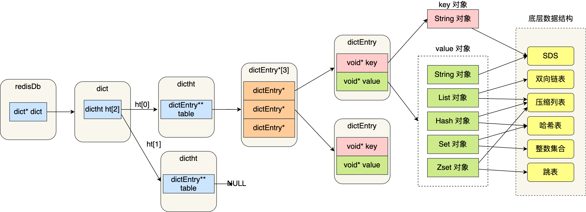
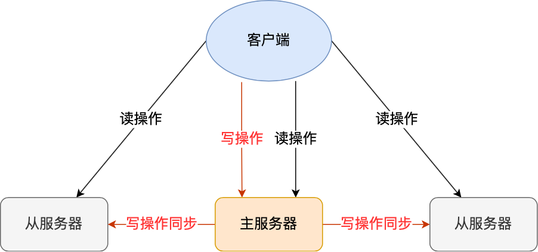
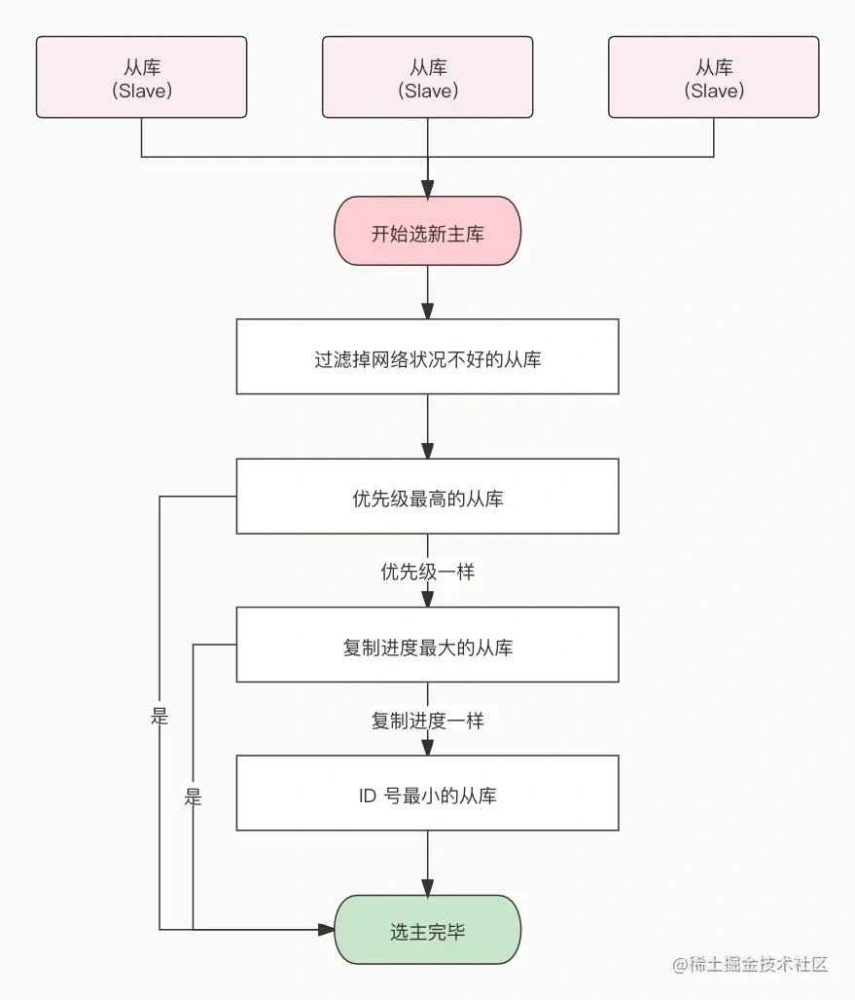

#### 什么是Redis

Redis是一种**基于内存**的**非关系型**数据库，对数据的读写操作都是在内存中完成的，因此**读写速度非常快**，常用于**缓存**、**消息队列**、**分布式锁**等场景。

Redis提供了**多种数据类型**来支持不同的业务场景，比如 String(字符串)、Hash(哈希)、 List (列表)、Set(集合)、Zset(有序集合)、Bitmap（位图）、HyperLogLog（基数统计）、GEO（地理信息）、Stream（流），并且对于数据类型的操作都是**原子性**的，因为执行命令由**单线程**负责的，不存在并发竞争的问题。

除此之外，Redis还支持**事务**、**持久化**、Lua脚本、多种集群方案（主从复制模式、哨兵模式、切片机群模式）、发布/订阅模式，内存淘汰机制、过期删除机制等。


#### 为什么用Redis作为MySQL的缓存

用户的数据一般是存储在数据库，数据库的数据是落在磁盘上的，磁盘的读写速度比较慢。当用户请求量比较大，数据库很容易崩溃，为了避免用户直接访问数据库，会选用Redis作为数据库MySQL的缓存。

主要原因是Redis具备高性能和高并发两种特性

1. Redis具备高性能

   假如用户第一次访问MySQL中的某些数据，这个过程从硬盘中读取比较慢。将用户访问的数据缓存在Redis中，这样下一次访问这些数据就可以直接从缓存中获取了，操作Redis缓存就是直接操作内存，所以速度非常快。

2. Redis具备高并发

   单台设备Redis的QPS（每秒处理完请求的次数）是MySQL的10倍，Redis单机的QPS能轻松破10w，而MySQL单机的QPS很难破1w。

   所以直接访问Redis能够承受的请求是远远大于直接访问MySQL的，所以可以考虑将数据库中的部分数据转移到缓存中去，这样用户的一部分请求会直接到缓存而不经过数据库。

### Redis数据结构

#### Redis的数据类型以及应用场景

Redis提供了丰富的数据类型，常见的五种数据类型：**String（字符串），Hash（哈希），List（列表），Set（集合）、Zset（有序集合）**。


随着 Redis 版本的更新，后面又支持了四种数据类型： **BitMap（2.2 版新增）、HyperLogLog（2.8 版新增）、GEO（3.2 版新增）、Stream（5.0 版新增）**。

Redis常用五种类型的应用场景：

- String：缓存对象、常规计数、分布式锁、共享session信息的等
- List：消息队列（有两个问题：1.生产者需要自行实现全局唯一ID；2.不能消费组形式的数据）
- Hash：缓存对象、购物车等
- Set：聚合计算（并集、交集、差集）场景，比如点赞、共同关注、抽奖活动等。
- Zset：排序场景，比如排行榜、电话和姓名排序等。

后续退出的四种数据类型：

- BitMap：二值状态统计的场景，比如签到、判断用户登录状态、连续签到用户总数等。
- HyperLogLog：用于估计一个集合中不同元素的数量，海量数据基数统计的场景，比如百万级网页UV计数等。
- GEO：存储地理位置信息的场景，比如滴滴叫车
- Stream：消息队列，相比于基于Lsit类型实现的消息队列，有两个特性：自动生成全局唯一ID，支持与组的形式消费数据。


#### 五种常见数据类型怎么实现的

##### String内部实现

String类型的底层数据结构实现主要是int和SDS(Simple Dynamic String)。

字符串对象内部编码有三种：`int`、`raw`、`embstr`


如果字符串对象保存的是整数值，并且整数值可以用`long`类型表示，那么字符串对象会将编码设为`int`，保存至`ptr`属性中。


如果字符串保存的是一个字符串使用简单动态字符串SDS保存，如果字符串长度小于32字节，将对象编码设置为`embstr`，`embstr`是专门用于保存短字符串的一种优化编码方式。


如果字符串的长度大于32字节，那么将对象编码设置为`raw`:


`embstr`和`raw`都使用`SDS`保存值，不同之处在于`embstr`会通过内存分配函数分配一块连续空间来保存`redisObject`和`SDS`，而`raw`编码会通过调用两次内存分配函数来分配两块内存来保存`redisObject`和`SDS`。

> 这样做的好处：
>
> - `embstr`编码将创建字符串对象所需的内存分配次数从 `raw` 编码的两次降低为一次；
> - 释放 `embstr`编码的字符串对象同样只需要调用一次内存释放函数；
> - 因为`embstr`编码的字符串对象的所有数据都保存在一块连续的内存里面可以更好的利用 CPU 缓存提升性能。
>
> 缺点：
>
> - 如果embstr编码的字符串的长度增加需要重新分配内存时，整个redisObject和sds都需要重新分配空间，所以**embstr编码的字符串对象实际上是只读的**，redis没有为embstr编码的字符串对象编写任何相应的修改程序。当我们对embstr编码的字符串对象执行任何修改命令（例如append）时，程序会先将对象的编码从embstr转换成raw，然后再执行修改命令。


SDS与C字符串区别：

- **SDS不仅可以保存文本数据，还可以保存二进制数据。**C语言字符串以‘\0’为标志作为结尾，导致某些二进制数据无法存储。SDS使用len属性的值而不是空字符来判断字符串是否结束，并且SDS的所有API都会以二进制的方式来处理SDS存放在buf[]数据里的数据，所以SDS不仅可以存储文本数据，而且能保存图片、音频、视频、压缩文件这样的二进制数据。
- **SDS获取字符串长度的时间复杂度为O(1)**。C语言获取字符串长度需要进行遍历，而SDS使用len属性记录了字符串的长度。
- **Redis的SDS API是安全的，拼接字符串不会造成缓冲区溢出**。因为SDS在拼接字符串前会检查SDS空间是否满足要求，如果空间不足会自动扩容，所以不会导致缓冲区的溢出。

##### LIst内部实现

List类型的底层数据结构是双向链表(linkedlist)或压缩列表(ziplist)实现的，列表最大长度为`2^32-1`。

- 如列表的元素个数小于512个，列表的每个元素的值都小于64字节，Redis会使用**压缩列表**作为List的底层数据结构。
- 如果列表的元素不满足上面条件，使用**双向列表**。

**在 Redis 3.2 版本之后，List 数据类型底层数据结构就只由 quicklist 实现了，替代了双向链表和压缩列表**。

> `quicklist`:
>
> Redis数据结构双向链表和压缩列表这两种数据结构是Redis List(列表)对象的底层实现方式。但是考虑到链表的附加空间相对太高，prev 和 next 指针就要占去 16 个字节 (64bit 系统的指针是 8 个字节)，另外每个节点的内存都是单独分配，会加剧内存的碎片化，影响内存管理效率。因此Redis3.2版本开始对列表数据结构进行了改造，使用 quicklist 代替了 ziplist 和 linkedlist.
>
> quicklist 实际上是 zipList 和 linkedList 的混合体，它将 linkedList 按段切分，每一段使用 zipList 来紧凑存储，多个 zipList 之间使用双向指针串接起来。
>
> 

**应用场景**：消息队列

消息队列在存取消息时，要满足三个需求，分别是**消息保序**、**处理重复的消息**和**保证消息可靠性**

**消息保序**：List本身就是先进先出的顺序。（`LPUSH + RPOP`）

不过生产者往List中写入数据时,List并不会主动通知消费者有新消息写入，如果消费者要及时处理消息，就要在程序中不停的调用`pop`命令，占用CPU资源。解决这个问题，Redis提供了`BRPOP`。阻塞式读取，客户端在没有读取到队列数据时，自动阻塞，直到有新的数据写入队列，再开始读取新数据。


**处理重复的消息**：手动自行为每个消息生成一个全局唯一ID。

生成之后，使用`LPUSH`把消息插入List时，需要在消息中包含这个全局唯一ID。

**保证消息可靠性**：

List读取一条消息后就不会留存这条消息了，如果消费者程序在处理消息过程中出现了宕机或故障，就会导致消息没有处理完成，那么消费者再次启动后就没法再次从List中读取消息了。

解决方法：`BRPOPLPUSH`命令留存消息，这个命令的作用时让消费者程序从一个List中读取消息，同时，Redis会把这个消息插入到另一个LIst备份留存。

- 消息保序：使用 LPUSH + RPOP；
- 阻塞读取：使用 BRPOP；
- 重复消息处理：生产者自行实现全局唯一 ID；
- 消息的可靠性：使用 BRPOPLPUSH

List作为消息队列**缺陷**：不支持多个消费者消费一条消息；不支持消费组的形式读取。

##### Hash内部实现

Hash数据结构是由压缩列表或哈希表实现的

- 如果哈希元素的个数小于512个，所有值小于64个字节，Redis会使用压缩列表作为Hash类型的底层数据结构。
- 不满足上述条件使用哈希表来作为Hash类型的底层数据结构。、

常用命令：

```shell
# 存储一个哈希表key的键值
HSET key field value   
# 获取哈希表key对应的field键值
HGET key field

# 在一个哈希表key中存储多个键值对
HMSET key field value [field value...] 
# 批量获取哈希表key中多个field键值
HMGET key field [field ...]       
# 删除哈希表key中的field键值
HDEL key field [field ...]    

# 返回哈希表key中field的数量
HLEN key       
# 返回哈希表key中所有的键值
HGETALL key 

# 为哈希表key中field键的值加上增量n
 HINCRBY key field n    
```

应用场景：

1. 缓存对象

   Hash 类型的 （key，field， value） 的结构与对象的（对象id， 属性， 值）的结构相似，也可以用来存储对象。

2. 购物车

   以用户 id 为 key，商品 id 为 field，商品数量为 value，恰好构成了购物车的3个要素

##### Set内部实现

Set是一个**无序并唯一**的键值集合，存储顺序不会按照插入的先后顺序进行存储。

一个集合最多存储`2^32-1`个元素，可以进行并交差集计算。

Set底层数据结构是由**哈希表**或**整数集合**实现的：

- 如果集合中的元素都为整数且数量小于512，Redis使用整数集合实现

- 如果不满足上述条件使用哈希表作为底层数据结构。

常用命令

```shell
# 往集合key中存入元素，元素存在则忽略，若key不存在则新建
SADD key member [member ...]
# 从集合key中删除元素
SREM key member [member ...] 
# 获取集合key中所有元素
SMEMBERS key
# 获取集合key中的元素个数
SCARD key

# 判断member元素是否存在于集合key中
SISMEMBER key member

# 从集合key中随机选出count个元素，元素不从key中删除
SRANDMEMBER key [count]
# 从集合key中随机选出count个元素，元素从key中删除
SPOP key [count]
```

Set运算操作：

```shell
 交集运算
SINTER key [key ...]
# 将交集结果存入新集合destination中
SINTERSTORE destination key [key ...]

# 并集运算
SUNION key [key ...]
# 将并集结果存入新集合destination中
SUNIONSTORE destination key [key ...]

# 差集运算
SDIFF key [key ...]
# 将差集结果存入新集合destination中
SDIFFSTORE destination key [key ...]
```

应用场景

Set类型比较适合用来数据去重和保障数据的唯一性，还可以用来统计多个集合的交集、差集、并集。

> Set的交集、差集、并集计算复杂度比较高，在数据量较大情况下，如果直接执行这些计算，会导致Redis实例阻塞。
>
> 在主从集群中，为了避免主库因为 Set 做聚合计算（交集、差集、并集）时导致主库被阻塞，我们可以选择一个从库完成聚合统计，或者把数据返回给客户端，由客户端来完成聚合统计。

点赞、共同关注、抽奖活动

##### Zset内部实现

Zset 类型（有序集合类型）相比于 Set 类型多了一个排序属性 score（分值），对于有序集合 ZSet 来说，每个存储元素相当于有两个值组成的，一个是有序集合的元素值，一个是排序值。有序集合保留了集合不能有重复成员的特性（分值可以重复），但不同的是，有序集合中的元素可以排序。

Zset类型底层数据结构是有**压缩列表**或**跳表**实现的：

- 如果有序集合的元素小于**128**个，并且每个元素的值小于64个字节时，Redis会使用压缩列表作为Zset类型的底层数据结构。
- 如果有序集合不满足上述条件，则使用跳表作为底层数据结构

常用命令

```shell
# 往有序集合key中加入带分值元素
ZADD key score member [[score member]...]   
# 往有序集合key中删除元素
ZREM key member [member...]                 
# 返回有序集合key中元素member的分值
ZSCORE key member
# 返回有序集合key中元素个数
ZCARD key 

# 为有序集合key中元素member的分值加上increment
ZINCRBY key increment member 

# 正序获取有序集合key从start下标到stop下标的元素
ZRANGE key start stop [WITHSCORES]
# 倒序获取有序集合key从start下标到stop下标的元素
ZREVRANGE key start stop [WITHSCORES]

# 返回有序集合中指定分数区间内的成员，分数由低到高排序。
ZRANGEBYSCORE key min max [WITHSCORES] [LIMIT offset count]

# 返回指定成员区间内的成员，按字典正序排列, 分数必须相同。
ZRANGEBYLEX key min max [LIMIT offset count]
# 返回指定成员区间内的成员，按字典倒序排列, 分数必须相同
ZREVRANGEBYLEX key max min [LIMIT offset count]
```

Zset不支持差集运算

```shell
# 并集计算(相同元素分值相加)，numberkeys一共多少个key，WEIGHTS每个key对应的分值乘积
ZUNIONSTORE destkey numberkeys key [key...] 
# 交集计算(相同元素分值相加)，numberkeys一共多少个key，WEIGHTS每个key对应的分值乘积
ZINTERSTORE destkey numberkeys key [key...]
```

**应用场景**

Zset可以根据元素的权重排序，可以自己决定每个元素的权重值。在面对需要展示最新列表、排行榜等场景时，如果数据更新频繁或者需要分页显示可以优先使用Zset


Redis键值对数据库是怎么实现的



- redisDb 结构，表示 Redis 数据库的结构，结构体里存放了指向了 dict 结构的指针；
- dict 结构，结构体里存放了 2 个哈希表，正常情况下都是用「哈希表1」，「哈希表2」只有在 rehash 的时候才用，具体什么是 rehash，我在本文的哈希表数据结构会讲；
- ditctht 结构，表示哈希表的结构，结构里存放了哈希表数组，数组中的每个元素都是指向一个哈希表节点结构（dictEntry）的指针；
- dictEntry 结构，表示哈希表节点的结构，结构里存放了 **void * key 和 void * value 指针， *key 指向的是 String 对象，而 \*value 则可以指向 String 对象，也可以指向集合类型的对象，比如 List 对象、Hash 对象、Set 对象和 Zset 对象**。


#### Redis数据结构


##### 链表

Redis链表的结构


```c
typedef struct listNode {
    //前置节点
    struct listNode *prev;
    //后置节点
    struct listNode *next;
    //节点的值
    void *value;
} listNode;

typedef struct list {
    //链表头节点
    listNode *head;
    //链表尾节点
    listNode *tail;
    //节点值复制函数
    void *(*dup)(void *ptr);
    //节点值释放函数
    void (*free)(void *ptr);
    //节点值比较函数
    int (*match)(void *ptr, void *key);
    //链表节点数量
    unsigned long len;
} list;
```

链表优点：

- listNode 链表节点的结构里带有 prev 和 next 指针，**获取某个节点的前置节点或后置节点的时间复杂度只需O(1)，而且这两个指针都可以指向 NULL，所以链表是无环链表**；
- list 结构因为提供了表头指针 head 和表尾节点 tail，所以**获取链表的表头节点和表尾节点的时间复杂度只需O(1)**；
- list 结构因为提供了链表节点数量 len，所以**获取链表中的节点数量的时间复杂度只需O(1)**；
- listNode 链表节使用 **void*** 指针保存节点值，并且可以通过 list 结构的 dup、free、match 函数指针为节点设置该节点类型特定的函数，因此**链表节点可以保存各种不同类型的值**；

链表缺点：

- 链表每个节点之间的内存都是不连续的，意味着**无法很好利用 CPU 缓存**。能很好利用 CPU 缓存的数据结构就是数组，因为数组的内存是连续的，这样就可以充分利用 CPU 缓存来加速访问。
- 还有一点，保存一个链表节点的值都需要一个链表节点结构头的分配，**内存开销较大**。


##### 压缩列表

压缩列表是 Redis 为了节约内存而开发的，它是**由连续内存块组成的顺序型数据结构**，有点类似于数组。


压缩列表在表头有三个字段：

- ***zlbytes***，记录整个压缩列表占用对内存字节数；
- ***zltail***，记录压缩列表「尾部」节点距离起始地址由多少字节，也就是列表尾的偏移量；
- ***zllen***，记录压缩列表包含的节点数量；
- ***zlend***，标记压缩列表的结束点，固定值 0xFF（十进制255）。

在压缩列表中，如果我们要查找定位第一个元素和最后一个元素，可以通过表头三个字段（zllen）的长度直接定位，复杂度是 O(1)。而**查找其他元素时，就没有这么高效了，只能逐个查找，此时的复杂度就是 O(N) 了，因此压缩列表不适合保存过多的元素**。

压缩列表节点包含三部分内容：

- ***prevlen***，记录了「前一个节点」的长度，目的是为了实现从后向前遍历；
- ***encoding***，记录了当前节点实际数据的「类型和长度」，类型主要有两种：字符串和整数。
- ***data***，记录了当前节点的实际数据，类型和长度都由 `encoding` 决定；

压缩列表优点：

- 被设计成一种内存紧凑型的数据结构，占用一块连续的内存空间，不仅可以利用 CPU 缓存，而且会针对不同长度的数据，进行相应编码，这种方法可以有效地节省内存开销。

压缩列表缺点：

- 不能保存过多的元素，否则查询效率就会降低；
- 新增或修改某个元素时，压缩列表占用的内存空间需要重新分配，甚至可能引发连锁更新的问题。导致压缩列表占用的内存空间要多次重新分配，这就会直接影响到压缩列表的访问性能。

连锁更新：

**压缩列表新增某个元素或修改某个元素时，如果空间不不够，压缩列表占用的内存空间就需要重新分配。而当新插入的元素较大时，可能会导致后续元素的 prevlen 占用空间都发生变化，从而引起「连锁更新」问题，导致每个元素的空间都要重新分配，造成访问压缩列表性能的下降**。


##### 哈希表

哈希表是一种保存键值对（key-value）的数据结构。

Redis采用了**链式哈希**来解决哈希冲突。

```cpp
typedef struct dictht {
    //哈希表数组
    dictEntry **table;
    //哈希表大小
    unsigned long size;  
    //哈希表大小掩码，用于计算索引值
    unsigned long sizemask;
    //该哈希表已有的节点数量
    unsigned long used;
} dictht;

typedef struct dictEntry {
    //键值对中的键
    void *key;
  
    //键值对中的值
    union {
        void *val;
        uint64_t u64;
        int64_t s64;
        double d;
    } v;
    //指向下一个哈希表节点，形成链表
    struct dictEntry *next;
} dictEntry;
```

哈希表优点：以 O(1) 的复杂度快速查询数据

哈希表缺点：数据量增多会引起哈希冲突，链式哈希随着链表长度的增加，查询这一位置的数据的耗时就会增加。

解决方法：采用rehash。

###### rehash


在dictht 哈希表使用时，定义两个哈希表

在正常服务请求阶段，插入的数据，都会写入到「哈希表 1」，此时的「哈希表 2 」 并没有被分配空间。

随着数据逐步增多，触发了 rehash 操作，这个过程分为三步：

- 给「哈希表 2」 分配空间，一般会比「哈希表 1」 大 2 倍；
- 将「哈希表 1 」的数据迁移到「哈希表 2」 中；
- 迁移完成后，「哈希表 1 」的空间会被释放，并把「哈希表 2」 设置为「哈希表 1」，然后在「哈希表 2」 新创建一个空白的哈希表，为下次 rehash 做准备。

这个过程看起来简单，但是其实第二步很有问题，**如果「哈希表 1 」的数据量非常大，那么在迁移至「哈希表 2 」的时候，因为会涉及大量的数据拷贝，此时可能会对 Redis 造成阻塞，无法服务其他请求**。

###### 渐进式rehash

为了避免rehash在数据迁移过程中因数据拷贝的耗时，影响Redis性能，所以Redis采用了**渐进式rehash**，也就是数据迁移时不是一次性迁移完成，而是分多次迁移。

渐进式 rehash 步骤如下：

- 给「哈希表 2」 分配空间；
- **在 rehash 进行期间，每次哈希表元素进行新增、删除、查找或者更新操作时，Redis 除了会执行对应的操作之外，还会顺序将「哈希表 1 」中索引位置上的所有 key-value 迁移到「哈希表 2」 上**；
- 随着处理客户端发起的哈希表操作请求数量越多，最终在某个时间点会把「哈希表 1 」的所有 key-value 迁移到「哈希表 2」，从而完成 rehash 操作。

在进行渐进式 rehash 的过程中，会有两个哈希表，所以在渐进式 rehash 进行期间，哈希表元素的删除、查找、更新等操作都会在这两个哈希表进行。

另外，在渐进式 rehash 进行期间，新增一个 key-value 时，会被保存到「哈希表 2 」里面，而「哈希表 1」 则不再进行任何添加操作，这样保证了「哈希表 1 」的 key-value 数量只会减少，随着 rehash 操作的完成，最终「哈希表 1 」就会变成空表。

###### rehash触发条件

rehash的触发条件和负载因子有关，


触发 rehash 操作的条件，主要有两个：

- **当负载因子大于等于 1 ，并且 Redis 没有在执行 bgsave 命令或者 bgrewiteaof 命令，也就是没有执行 RDB 快照或没有进行 AOF 重写的时候，就会进行 rehash 操作。**
- **当负载因子大于等于 5 时，此时说明哈希冲突非常严重了，不管有没有有在执行 RDB 快照或 AOF 重写，都会强制进行 rehash 操作。**


##### 整数集合

整数集合是 Set 对象的底层实现之一。当一个 Set 对象只包含整数值元素，并且元素数量不大时（小于512），就会使用整数集这个数据结构作为底层实现。

```C
typedef struct intset {
    //编码方式
    uint32_t encoding;
    //集合包含的元素数量
    uint32_t length;
    //保存元素的数组
    int8_t contents[];
} intset;
```

保存元素的容器是一个 contents 数组，虽然 contents 被声明为 int8_t 类型的数组，但是实际上 contents 数组并不保存任何 int8_t 类型的元素，contents 数组的真正类型取决于 intset 结构体里的 encoding 属性的值。比如：

- 如果 encoding 属性值为 INTSET_ENC_INT16，那么 contents 就是一个 int16_t 类型的数组，数组中每一个元素的类型都是 int16_t；
- 如果 encoding 属性值为 INTSET_ENC_INT32，那么 contents 就是一个 int32_t 类型的数组，数组中每一个元素的类型都是 int32_t；
- 如果 encoding 属性值为 INTSET_ENC_INT64，那么 contents 就是一个 int64_t 类型的数组，数组中每一个元素的类型都是 int64_t；

不同类型的 contents 数组，意味着数组的大小也会不同

**整数集合的升级操作**：当一个新元素加入到整数集合里面，如果新元素的类型（int32_t）比整数集合现有所有元素的类型（int16_t）都要长时，整数集合需要先进行升级，也就是按照新元素的类型扩展contents数组的空间大小，再将新元素加入到整数集合中，升级过程也要维持整数集合的有序性。

整数集合升级后**不支持降级**（删除了最大元素类型也不会降级）

整数集合升级优点：节省内存资源，能够根据集合中元素的类型选择合适的类型。


##### 跳表

Redis只有Zset对象的底层结构使用了跳表，跳表的优势是能支持**`O(logN)`复杂度**节点查找。

Zset结构体中有两个数据结构：跳表和哈希表。好处是既能进行高效的范围查询，也能进行高效单点查询。

```c
typedef struct zset {
    dict *dict;
    zskiplist *zsl;
} zset;
```

Zset 对象在执行数据插入或是数据更新的过程中，会依次在跳表和哈希表中插入或更新相应的数据，从而保证了跳表和哈希表中记录的信息一致。

**跳表结构设计**

链表在查找元素的时候需要逐一查找，所以效率非常低，时间复杂度为`O(N)`。跳表是在链表的基础上改进来的，实现了**一种多层的有序链表**，这样的好处是能快读定位数据。

跳表节点数据结构

```c
typedef struct zskiplistNode {
    //Zset 对象的元素值
    sds ele;
    //元素权重值
    double score;
    //后向指针
    struct zskiplistNode *backward;
  
    //节点的level数组，保存每层上的前向指针和跨度
    struct zskiplistLevel {
        struct zskiplistNode *forward;
        unsigned long span;
    } level[];
} zskiplistNode;
```


> 
>
> 如图为3级跳表，图中头节点有 L0~L2 三个头指针，分别指向了不同层级的节点，然后每个层级的节点都通过指针连接起来：
>
> - L0 层级共有 5 个节点，分别是节点1、2、3、4、5；
> - L1 层级共有 3 个节点，分别是节点 2、3、5；
> - L2 层级只有 1 个节点，也就是节点 3 。
>
> 如果我们要在链表中查找节点 4 这个元素，只能从头开始遍历链表，需要查找 4 次，而使用了跳表后，只需要查找 2 次就能定位到节点 4，因为可以在头节点直接从 L2 层级跳到节点 3，然后再往前遍历找到节点 4。

跳表的查询流程就是在多个层级上跳来跳去，最后定位到元素。

###### **跳表节点查询流程**

查找一个跳表节点的过程时，跳表会从头节点的最高层开始，逐一遍历每一层。在遍历某一层的跳表节点时，会用跳表节点中的 SDS 类型的元素和元素的权重来进行判断，共有两个判断条件：

- 如果当前节点的权重「小于」要查找的权重时，跳表就会访问该层上的下一个节点。
- 如果当前节点的权重「等于」要查找的权重时，并且当前节点的 SDS 类型数据「小于」要查找的数据时，跳表就会访问该层上的下一个节点。

如果上面两个条件都不满足，或者下一个节点为空时，跳表就会使用目前遍历到的节点的 level 数组里的下一层指针，然后沿着下一层指针继续查找，这就相当于跳到了下一层接着查找。

Zset 对象要同时保存「元素」和「元素的权重」，对应到跳表节点结构里就是 sds 类型的 ele 变量和 double 类型的 score 变量。

**跳表节点层数的设置**

跳表的相邻两层的节点数量最理想比例是2:1，查询复杂度可以降到`O(logN)`

###### **如何维持相邻两层的节点数量为2:1**

Redis跳表在创建节点的时候，随机生成每个节点的层数，并没有严格维持相邻两层的比例。具体做法是，跳表创建节点的时候，会生成范围为[0,1]的一个随机数，如果这个随机数小于p=0.25（相当于概率25%），那么层数就增加一层，然后继续生成下一个随机数，直到最技术的结果大于0.25结束，最终确定该节点的层数。

这样相当于每增加一层的概率不超过25%，层数越高，概率越低，**层高最大限制是64**。

**如果层高最大限制是 64，那么在创建跳表「头节点」的时候，就会直接创建 64 层高的头节点**。

###### 为什么用跳表而不用平衡树

从内存占用、范围查找、实现难易程度三方面总结：

- **从内存占用上来比较，跳表比平衡树更灵活一些**。平衡树每个节点包含 2 个指针（分别指向左右子树），而跳表每个节点包含的指针数目平均为 1/(1-p)，具体取决于参数 p 的大小。如果像 Redis里的实现一样，取 p=1/4，那么平均每个节点包含 1.33 个指针，比平衡树更有优势。
- **在做范围查找的时候，跳表比平衡树操作要简单**。在平衡树上，我们找到指定范围的小值之后，还需要以中序遍历的顺序继续寻找其它不超过大值的节点。如果不对平衡树进行一定的改造，这里的中序遍历并不容易实现。而在跳表上进行范围查找就非常简单，只需要在找到小值之后，对第 1 层链表进行若干步的遍历就可以实现。
- **从算法实现难度上来比较，跳表比平衡树要简单得多**。平衡树的插入和删除操作可能引发子树的调整，逻辑复杂，而跳表的插入和删除只需要修改相邻节点的指针，操作简单又快速。


### Redis线程模型

#### 为什么说Redis是单线程

Redis单线程指的是**接收客户端请求-->解析请求-->进行数据读写等操作-->发送数据给客户端**这个过程由一个线程（主线程）完成的。

实际上，Redis程序并不是单线程的，Redis在启动的时候是会**启动后台线程（BIO）**的:

- Redis在2.6版本后，会启动2个后台线程，分别处理**关闭文件**、**AOF刷盘**两个任务。
- Redis在4.0版本后，新增了一个新的后台线程，用来**异步释放Redis内存**，也就是**lazyfree线程**。

当我们要删除一个大 key 的时候，不要使用 del 命令删除，因为 del 是在主线程处理的，这样会导致 Redis 主线程卡顿，因此我们应该使用 unlink 命令来异步删除大key。

之所以 Redis 为「关闭文件、AOF 刷盘、释放内存」这些任务创建单独的线程来处理，是因为这些任务的操作都是很**耗时**的，如果把这些任务都放在主线程来处理，那么 Redis 主线程就很容易发生阻塞，这样就无法处理后续的请求了。

后台线程相当于一个消费者，生产者把耗时任务丢到任务队列中，消费者（BIO）不停轮询这个队列，拿出任务就去执行对应的方法即可。


关闭文件、AOF 刷盘、释放内存这三个任务都有各自的任务队列：

- BIO_CLOSE_FILE，关闭文件任务队列：当队列有任务后，后台线程会调用 close(fd) ，将文件关闭；
- BIO_AOF_FSYNC，AOF刷盘任务队列：当 AOF 日志配置成 everysec 选项后，主线程会把 AOF 写日志操作封装成一个任务，也放到队列中。当发现队列有任务后，后台线程会调用 fsync(fd)，将 AOF 文件刷盘，
- BIO_LAZY_FREE，lazy free 任务队列：当队列有任务后，后台线程会 free(obj) 释放对象 / free(dict) 删除数据库所有对象 / free(skiplist) 释放跳表对象

Redis单线程模式


#### Redis为什么采用单线程/采用单线程为什么这么快

- Redis大部分操作都是在**内存中完成**的，并且采用了**高效的数据结构**。因此Redis的性能瓶颈可能是机器的内存或者网络IO，而不是CPU，既然**CPU不是性能瓶颈**，那么自然采用单线程解决方案。
- Redis采用单线程模型可以**避免多线程之间的竞争**，省去了多线程切换带来**时间和性能上的开销**，不需要维护锁机制，而且也不会导致死锁问题。
- Redis采用了**I/O多路复用机制**处理大量的客户端Socket请求，IO多路复用就是使用一个线程处理多个IO流。Redis只运行单线程的情况下，IO多路复用机制允许内核同时存在多个监听Socket和已连接Socket，一旦有请求到达，就交给Redis线程处理，实现了一个Redis线程处理多个IO流的效果。


#### Redis6.0之后为什么引入了多线程

Redis6.0之后采用了多个I/O线程来处理网络请求，这是因为随着网络硬件的性能提升，Redis的性能瓶颈有时会出现在网络I/O的处理上。

所以为了提升网络I/O的处理速度，采用多线程来处理。但是对于命令的执行，Redis仍然使用的单线程来处理。

通过Redis.conf配置文件可以修改IO线程的数量，默认情况会额外创建6个线程（不包括主线程）


### Redis持久化

#### Redis如何实现数据不丢失

Redis 的读写操作都是在内存中，所以 Redis 性能才会高，但是当 Redis 重启后，内存中的数据就会丢失，那为了保证内存中的数据不会丢失，Redis 实现了数据持久化的机制，这个机制会把数据存储到磁盘，这样在 Redis 重启就能够从磁盘中恢复原有的数据。

Redis三种数据持久化的方式：

- **AOF日志**（append only file）：每执行一条写操作指令，就把该指令以追加的形式写入到一个文件中
- **RDB快照**：将某一时刻的内存数据，以二进制的方式写入磁盘。
- **混合持久化方式**：Redis4.0新增的方式，集成了AOF和RDB的优点。

##### **AOF日志**

redis在执行完**写操作后**会将该命令以追加的方式写入到文件中，然后Redis重启时，会读取文件记录的命令，然后逐一执行命令的方式来恢复数据。


开启方法：redis.conf文件中进行参数配置


**为什么要写操作后追加日志**

- 不会阻塞当前写操作命令的执行。
- 避免额外的检查开销。如果先将写操作命令记录到AOF中，如果当前命令语法有问题不进行语法检查的话，在日志恢复时可能出错。

**AOF写回操作**

Redi提供3中写回硬盘策略，在Redis.conf配置文件中的appendfsync配置项中修改

- **Always**，这个单词的意思是「总是」，所以它的意思是每次写操作命令执行完后，同步将 AOF 日志数据写回硬盘；

- **Everysec**，这个单词的意思是「每秒」，所以它的意思是每次写操作命令执行完后，先将命令写入到 AOF 文件的内核缓冲区，然后每隔一秒将缓冲区里的内容写回到硬盘；

- **No**，意味着不由 Redis 控制写回硬盘的时机，转交给操作系统控制写回的时机，也就是每次写操作命令执行完后，先将命令写入到 AOF 文件的内核缓冲区，再由操作系统决定何时将缓冲区内容写回硬盘。

优缺点


**AOF重写机制**

原因：AOF日志是一个文件，随着执行的写操作命令越来越多，文件大小越来越大。如果AOF日志过大会带来性能问题，比如重启Redis后恢复数据过程很慢。

Redis为了避免AOF文件过大，提供了AOF重写机制，当AOF文件大小超过阈值后就会启用AOF重写机制，来压缩AOF文件。

Redis重写AOF过程是通过后台子进程bgrewriteaof来完成的，触发重写机制后，主进程就会创建AOF子进程，此时父子进程共享物理内存，重写子进程对内存只读，重写AOF子进程会读取数据库里的所有数据，并逐一把内存数据的键值对转换成一条命令（只保留最新的），再将命令记录到重写日志（新的AOF文件）。当子进程完成AOF重写工作后，会向主进程发送信号，主进程收到信号后调用信号处理函数，将AOF重写缓冲区中的内容追加到新的AOF文件中，使得新旧两个AOF文件数据一致，新的AOF文件进行改名覆盖现有的AOF文件。

重写过程中，主进程依然可以正常处理命令。重写AOF日志过程中，如果主进程修改已经存在的key-value，就会发生写时复制，此时这个key-value数据在子进程的**内存数据**就跟主进程**不一致**了，**怎么解决？**

为了解决这种数据不一致问题，Redis设置了一个**AOF重写缓冲区**，这个缓冲区在创建bgrewriteaof子进程之后开始使用，在重写AOF期间，当Redis执行完一个写命令后，它会同时将这个写命令写入到AOF缓冲区和AOF重写缓冲区。

**重写AOF为什么不直接复用现有的AOF文件，而是要先写到新的文件**

因为**如果 AOF 重写过程中失败了，现有的 AOF 文件就会造成污染**，可能无法用于恢复使用。所以 AOF 重写过程，先重写到新的 AOF 文件，重写失败的话，就直接删除这个文件就好，不会对现有的 AOF 文件造成影响。

##### RDB快照

为什么需要RDB快照：

因为AOF日志记录的是操作命令，不是实际的变量值，所以AOF日志做数据恢复时需要将日志全部执行一遍，AOF日志过多的话会导致恢复过程很慢。

为了解决这个问题，Redis增加了RDB快照，记录某一瞬间的内存数据，恢复时将RDB文读取到内存中就可以，恢复数据的效率比AOF高一些。

**RDB快照时会阻塞线程吗**

Redis提供两个命令生成RDB文件，分别是`save`和`bgsave`。

`save`：在主线程中生成RDB文件，如果耗时较长会阻塞。

`bgsave`：创建一个子进程来生成RDB文件，可以避免主线程的阻塞。

Redis也可以通过配置文件来实现每隔一段时间自动执行一次`bgsave`。

RDB快照为全量快照，也就是每次执行快照都是把内存中所有数据都记录到磁盘中，所以是一个比较重的操作，如果操作太频繁会对Redis的性能产生影响，如果频率太低服务器故障时丢失的数据会更多。

**RDB执行快照期间，数据能修改吗**

**可以的**，执行bgsave期间，Redis依然可以继续处理操作命令的，关键技术在于**写时复制**（COW）.

执行bgsave时，主线程会通过fork创建子进程，子进程和父进程共享同一片内存数据（创建子进程的时候，会复制一份主进程的页表，指向同一片内存），如果主进程执行写操作，则被修改的数据会复制一份副本，然后bgsave子进程会把该副本（原数据）数据写入RDB文件，这个过程主进程仍然可以修改原来的数据。

RDB快照期间主进程发生修改，则修改的数据无法被备份至RDB快照，只能交给下一次RDB快照。


##### 为什么要有混合持久化

RDB优点在于数据恢复速度快，缺点在于快照的频率不好把我，太快影响性能，太慢丢失数据较多。

AOF优点丢失数据少，缺点数据恢复速度慢。

为了集合两者的优点，Redis4.0提出混合使用AOF日志和RDB快照，既保证了数据恢复速度，又降低数据丢失风险。

开启混合持久化，Redis配置文件修改：

```shell
aof-use-rdb-preamble yes
```

混合持久化工作在**AOF日志重写过程**，当开启了混合持久化，在AOF重写日志时，fork出的重写子进程会先将主线程共享的**内存数据以RDB形式**写入到AOF文件中，然后将重写期间主进程的操作命令记录到重写缓冲区中，**重写缓存区内的命令会以AOF方式**写入到AOF文件中。写入完成后主进程将含有RDB和AOF格式的AOF文件替换旧的AOF文件。

混合持久化AOF文件前半部分式RDB格式全量数据，后半部分是AOF格式的增量数据。


重启 Redis 加载数据的时候，由于前半部分是 RDB 内容，这样**加载的时候速度会很快**。

加载完 RDB 的内容后，才会加载后半部分的 AOF 内容，这里的内容是 Redis 后台子进程重写 AOF 期间，主线程处理的操作命令，可以使得**数据更少的丢失**。

混合持久化优点：

- 混合持久化集合两者的优点，混合使用AOF日志和RDB快照，既保证了数据恢复速度，又降低数据丢失风险。

混合持久化缺点：

- AOF文件中既有RDB格式内容，也有AOF格式内容，使AOF文件的可读性变差。
- 兼容性差，对于Redis4.0之前版本不兼容。


### Redis过期删除策略

过期删除策略是可以对key设置过期时间的，因此需要有相应的机制将已过期的键值对删除，而这个工作就是过期键值删除策略。

**设置过期时间方式**:

对key设置过期时间命令：

- `expire <key> <n>`：设置 key 在 n 秒后过期，比如 expire key 100 表示设置 key 在 100 秒后过期；
- `pexpire <key> <n>`：设置 key 在 n 毫秒后过期，比如 pexpire key2 100000 表示设置 key2 在 100000 毫秒（100 秒）后过期。
- `expireat <key> <n>`：设置 key 在某个时间戳（精确到秒）之后过期，比如 expireat key3 1655654400 表示 key3 在时间戳 1655654400 后过期（精确到秒）；
- `pexpireat <key> <n>`：设置 key 在某个时间戳（精确到毫秒）之后过期，比如 pexpireat key4 1655654400000 表示 key4 在时间戳 1655654400000 后过期（精确到毫秒）

设置字符串时也可以同时对key设置过期时间：

- `set <key> <value> ex <n>` ：设置键值对的时候，同时指定过期时间（精确到秒）；
- `set <key> <value> px <n>` ：设置键值对的时候，同时指定过期时间（精确到毫秒）；
- `setex <key> <n> <valule>` ：设置键值对的时候，同时指定过期时间（精确到秒）。

查看某个key剩余存活时间：使用`TTL <key>`命令

```redis
# 设置键值对的时候，同时指定过期时间位 60 秒
> setex key1 60 value1
OK

# 查看 key1 过期时间还剩多少
> ttl key1
(integer) 56
> ttl key1
(integer) 52
```

取消key的过期时间使用`PERSISIT <key>`命令

**如何判定key已经过期了**

key设置过期时间时，redis会把该key带上过期时间存储到一个过期字典中，也就是过期字典保存了数据库的所有key的过期时间，这个过期字典使用的是哈希表，可以在O(1)复杂度下查询。查询key的过期时间与当前时间进行比较，如果比系统时间大就没有过期，反之过期。

过期删除策略有哪些

#### 常见的过期删除策略

- 定时删除：在设置key过期时间时，同时创建一个定时事件，当时间到达时，由事件处理器自动执行key的删除操作
- 惰性删除：不主动删除过期键，每次从数据库访问key时都检测key是否过期，如果过期就删除key
- 定期删除：每隔一段时间随机从数据库中取出一定数量的key进行检查，并删除其中的过期的key

定时删除策略优点：

- 可以保证过期key会被尽快删除，也就是内存可以尽快释放，对内存友好在

定时删除策略缺点：

- 过期key较多情况下，删除过期key可能会占用相当一部分CPU时间，在内存不紧张但CPU时间紧张的情况下，将CPU时间用于删除过期key上会对性能造成影响，定时删除策略对CPU不友好

惰性删除策略优点：

- 每次访问时才会检查key是否过期，所以此策略只会使用很少的系统资源，对CPU友好

惰性删除策略缺点：

- 如果一个key已经过期，这个key仍然保留在数据库中，如果这个过期key一直没有被访问，它占用的内存就不会释放，造成一定的内存空间浪费，对内存不友好。

定期删除策略优点：

- 通过限制删除操作执行的时长和频率，来减少删除操作对CPU的影响，同时也能删除一部分过期的数据，减少过期键对空间的无效占用。

定期删除策略缺点：

- 内存清理方面没有定时删除效果好，同时没有惰性删除使用的资源少。
- 难以确定删除操作的时长和频率，如果执行太频繁，定期删除和定时删除策略一样对CPU不友好；如果执行的太少，和惰性删除一样，过期key不会及时释放。

#### Redis过期删除策略

redis过期删除策略是**惰性删除+定期删除**两种策略搭配使用，在合理使用CPU时间和避免内存浪费之间取得平衡。

其中惰性删除流程：

Redis 在访问或者修改 key 之前，都会调用 expireIfNeeded 函数对其进行检查，检查 key 是否过期：

- 如果过期，则删除该 key，至于选择异步删除，还是选择同步删除，根据 `lazyfree_lazy_expire` 参数配置决定（Redis 4.0版本开始提供参数），然后返回 null 客户端；
- 如果没有过期，不做任何处理，然后返回正常的键值对给客户端；

定期删除流程：

redis.conf中可以配置定期删除的频率，随机抽查的数量在代码中固定为20个每次。

1. 从过期字典中随机抽取 20 个 key；
2. 检查这 20 个 key 是否过期，并删除已过期的 key；
3. 如果本轮检查的已过期 key 的数量，超过 5 个（20/4），也就是「已过期 key 的数量」占比「随机抽取 key 的数量」大于 25%，则继续重复步骤 1；如果已过期的 key 比例小于 25%，则停止继续删除过期 key，然后等待下一轮再检查。

### Redis内存淘汰策略

redis运行内存已经超过Redis设置的最大内存之后会使用内存淘汰策略删除符号条件的key，以此保障Redis的高效运行。

Redis最大运行内存，在配置文件`redis.conf`中参数`maxmemory <bytes>`设定最大运行内存。只有在Redis运行内存超过设置的最大内存才会触发内存淘汰策略。

- 64位操作系统，maxmemory 默认位0，表示没有大小限制。
- 32位操作系统，maxmemory 默认位3G。因为32G机器最大支持4GB的内存，而系统本身就需要一定的内存资源来支持运行。

#### Redis内存淘汰策略有哪些

Redis内存淘汰策略共有八种，分为**不进行数据淘汰策略**和**进行数据淘汰策略**

1. 不进行数据淘汰策略

   **noeviction**（redis3.0后默认的内存淘汰策略）：表示当运行内存超过最大设置内存时，不淘汰任何数据，这是如果有新的数据写入不再服务，会触发OOM内存溢出，但是没有数据写入只是单纯查询和删除操作的话可以正常工作。

2. 进行数据淘汰策略

   进行数据淘汰策略可以分为**在设置了过期时间的数据中进行淘汰**和在**所有数据范围内进行淘汰**

   在设置了过期时间的数据中进行淘汰：

   - **volatile-random**：随机淘汰设置了过期时间的任意键值；（随机淘汰）
   - **volatile-ttl**：优先淘汰更早过期的键值。（最早过期）
   - **volatile-lru**（Redis3.0 之前，默认的内存淘汰策略）：淘汰所有设置了过期时间的键值中，最久未使用的键值；（最久未使用）
   - **volatile-lfu**（Redis 4.0 后新增的内存淘汰策略）：淘汰所有设置了过期时间的键值中，最少使用的键值；（最少使用）

   在所有数据范围内进行淘汰：

   - **allkeys-random**：随机淘汰任意键值;（随机）
   - **allkeys-lru**：淘汰整个键值中最久未使用的键值；（最久未使用）
   - **allkeys-lfu**（Redis 4.0 后新增的内存淘汰策略）：淘汰整个键值中最少使用的键值。（最少使用）

查看当前redis的内存淘汰策略：`config get maxmemery-policy`

修改Redis内存淘汰策略：`config set maxmemory-policy <策略>`或修改配置文件`maxmemory-policy <策略>`

#### LRU和LFU算法区别

##### LRU

LRU(Least recently Used):最近最少使用，会淘汰最近最少使用的数据。

> 传统的LRU算法是基于链表结构的，链表中的元素按照操作顺序从前往后排列，最新操作的键会被移动到表头，当需要内存淘汰时，只需要删除链表尾部的元素即可，因为链表尾部的元素就代表最久未被使用的元素。
>
> Redis 并没有使用这样的方式实现 LRU 算法，因为传统的 LRU 算法存在两个问题：
>
> - 需要用链表管理所有的缓存数据，这会带来额外的空间开销；
> - 当有数据被访问时，需要在链表上把该数据移动到头端，如果有大量数据被访问，就会带来很多链表移动操作，会很耗时，进而会降低 Redis 缓存性能。

Redis的LRU实现：redis实现的是一种**近似**LRU算法，目的是为了更好的节约内存，实现方法是在**redis的对象结构体中添加一个额外的字段**，用于记录此数据的**最后一次访问时间**。当Redis进行内存淘汰时，会使用**随机采样的方式淘汰数据**，它是随机取5个值，然后淘汰最久未使用的那个。

Redis实现LRU优点：

- 不要为所有数据维护一个大链表，节省了内存空间。
- 不用在每次数据访问时都移动链表项，提升了缓存的性能。

缺点：

- **无法解决缓存污染问题**，比如应用一次读取了大量的数据，而这些数据只会被读一次，那么这些数据会留存在redis缓存中很长一段时间，造成缓存污染。


Redis4.0之后引入了LFU解决这个问题

##### LFU

LFU(Least Frequently Used)最近最不常用，LFU算法是根据数据访问次数来淘汰数据的，它的核心思想是“如果数据过去被访问多次，那么将来被访问的频率也很高”。

LFU算法会记录每个数据的访问次数，当一个数据被再次访问时，就会增加数据的访问次数。Redis对象结构如下：

```c
typedef struct redisObject {
    ...
      
    // 24 bits，用于记录对象的访问信息
    unsigned lru:24;  
    ...
} robj;
```

Redis对象头中的lru字段，LRU算法和LFU算法使用方法并不相同。

LRU算法中记录的时key访问时间戳。

LFU算法中24位lru被分为两部分来存储，高16位存储使用上次访问时间戳，低8位存储访问频率（会随时间推移衰减），


### 主从复制

redis数据存储在一台服务器上存在一些缺陷，比如：

- 如果服务器发生了宕机，由于数据恢复需要时间，在这个期间服务器无法服务新的请求
- 如果这台服务器硬盘出故障，可能数据就丢失了。

解决办法就是多台服务器保存一份数据，同时服务器之间要保持一致性。

Redis提供**主从复制模式**来避免上面的问题，主从复制模式可以保证多台服务器的**数据一致性**，且主从服务器之间采用的是**读写分离**方式。

#### 主从复制作用

1.数据备份 2.读写分离

主服务器可以进行读写操作，当发生写操作时自动将写操作同步给从服务器，而从服务器一般只读，并接受主服务器同步过来的写操作命令，执行这条命令。



#### 主从复制工作原理

设置主从服务器关系

可以使用 `replicaof`（Redis 5.0 之前使用 slaveof）命令形成主服务器和从服务器的关系

比如，现在有服务器 A 和 服务器 B，我们在服务器 B 上执行下面这条命令：

```redis
# 服务器 B 执行这条命令
replicaof <服务器 A 的 IP 地址> <服务器 A 的 Redis 端口号>
```

`runid`：Redis服务器的随机标识符runid（重启后会改变），从节点第一次请求复制主节点的时候，主节点会将此runid返回。复制时发现runid不同时会进行全量复制。

`offset`：当前数据的偏移量，从节点请求复制主节点的时候会带上这个信息，主节点将从此偏移量处返回数据。

主从复制分为**全量复制**和**增量复制**

##### 全量复制/第一次同步

1. 建立连接、协商同步

​	执行了`replicaof`后，从服务器给主服务器发送`psync`命令，表示进行数据同步。`psync`命令包括两个参数`runid`和`offset`。

​	`runid`第一次同步从服务器不知道主服务器的`runid`，设置为`?`

​	`offset`偏移量表示复制的进度，第一次同步时设置为`-1`

​	主服务器收到`psync`命令后，会发送`FULLRESYNC`给对方，同时附带自己的`runid`和`offset`。`FULLRESYNC`表示全量复制

2. 主服务器同步数据给从服务器

​	主服务器执行`bgsave`创建子进程进行RDB快照，然后把RDB文件发送给从服务器。从服务器接收到RDB文件后，先清空内存中的数据，再加载RDB快照。

​	RDB快照是异步进行的，不会阻塞主进程，在快照期间的写操作命令会写入`replication buffer`缓冲区里（保证主从服务器的数据一致性）。

3. 主服务器发送新写操作命令给从服务器

​	从服务器将RDB快照写入内存后会向主服务器发送一个确认消息，接着主服务器将`replication buffer`缓冲区数据发送给从服务器，从服务器执行缓冲区内的命令后完成第一次同步。


**基于长连接的命令传输**

主从服务器在完成第一次同步后就会维持一条TCP连接，后续主服务器可以通过这个连接继续将写操作命令同步给从服务器，从服务器执行该命令，使主从服务器数据一致。


##### 增量复制

主从服务器在完成第一次同步后就进入基于长连接的命令传输。如果主从服务器间网络断开就无法进行命令传输了，从服务器无法与主服务器进行数据同步。

网络恢复后进行主从服务器数据同步使用增量复制，也就是只把网络断开期间主服务器收到的写操作命令同步给从服务器。

1. 从服务器发送`psync`命令给主服务器，参数为主服务器的`runid`和偏移量`offset`。
2. 主服务器收到命令后，发送`CONTINUE`命令告诉从服务器采用增量复制的方式进行同步。（如果`runid`不一致或者`offset`不在主服务器环形缓冲区内进行全量复制）
3. 主服务器将`offset`至最新的命令同步给从服务器，从服务器执行这些命令

`repl_backlog_buffer`环形缓冲区大小默认为1M，当缓冲区写满后，主服务器继续写入的话就会覆盖之前的数据，因此，当主服务器写入速度远超过从服务器的读取速度，这个缓冲区就会被覆盖，执行全量复制。**为了避免在网络恢复时，主服务器频繁地使用全量同步的方式，我们应该调整下 repl_backlog_buffer 缓冲区大小，尽可能的大一些**，

`repl_backlog_buffer`估算：从服务器断线重连平均时间×平均每秒主服务器写数据量。


**主服务器压力分摊**

第一次数据同步时主服务器会进行两项耗时操作：生成RDB文件和传输RDB文件。

如果从服务器数量很多的情况下，并且都要与主服务器进行全量复制会产生问题：

- 主服务器fork出很多子进程生成RDB文件，在执行fork过程中会阻塞主进程，使得redis无法响应正常请求。
- 传输RDB文件会占用主服务器网络带宽，影响主服务器响应命令的性能。

解决方法：从服务器有自己的从服务器，进行全量复制的任务交给从服务器进行。


#### 怎么判断Redis某个节点是否正常工作

Redis判断节点是否正常工作都是通过互相ping-pong心态检测机制，如果有一半以上的节点都去ping一个节点都没有pong回应的时候，集群就认为这个节点挂掉了，会断开与这个节点的连接。

Redis主从节点发送心态间隔是不一样的，而且作用也有区别：

- Redis主节点每隔10s对从节点发送ping命令，判断从节点的存活性和连接状态，可通过配置文件修改发送频率
- Redis从节点每隔1s发送`replconf ack(offset)`命令，给主节点上报自身的偏移量，目的：
  - 实时检测主从节点网络的状态
  - 上报自身偏移量，检测复制数据是否丢失，如果从节点数据丢失，再从主节点复制缓冲区中拉取数据

#### 为什么会出现主从数据不一致

主从数据不一致是指客户端从从节点读到的值和主节点读到的值不一致。

产生原因：主从服务器信息不同步，数据发送有时延

产生主从数据不一致的原因是主从节点间的命令复制是异步进行的，所以无法实现主从数据时时刻刻保持一致。在主从节点命令传播阶段，主节点收到新的写命令后会发送给从节点，但是主节点并不会等到从节点实际执行完命令后再把结果发送给客户端，而是主节点自己在本地执行完命令后，就会向客户端返回结果了，如果从节点还没有执行主节点同步来的命令，主从节点间的数据就不一致了。

#### 如何应对主从数据不一致

1. 优化主从服务器间的网络环境，通常要放在一个机房进行部署。
2. 短时间的时延是允许的，监控主从节点延迟（通过offset判断），如果延迟过大，暂时屏蔽该从服务器节点的访问。

#### 主从切换如何减少数据丢失

数据丢失不可避免，只能说是尽量减少数据丢失。

主从切换过程中，产生数据丢失的情况有两种：

- 异步复制同步丢失
- 集群产生脑裂数据丢失

**异步复制同步丢失**

**产生原因**：Redis主节点和从节点之间的数据复制是异步复制的，当客户端发送写请求给主节点的时候，主节点处理完之后将写请求同步到各从节点，如果此时主节点还没来得及同步给从节点时发生了断电，那么主节点内存中的数据会丢失。

**解决方法**：修改Redis参数配置`min-slaves-max-lag`,表示一旦所有的节点数据复制和同步的延迟都超过了`min-slaves-max-lag`的值，主节点就会拒绝接收任何请求，即使主节点宕机也只时丢失`min-slaves-max-lag`时间内的数据。

对于客户端发现主节点不可写后，可以通过降级措施，将数据暂时写入本地缓存或者磁盘或者消息队列，在主节点恢复后重写写入保证数据的不丢失。

**集群产生脑裂数据丢失**

**产生原因**：Redis主从架构中部署方式一般是一主多从，主节点负责写操作，从节点负责读操作。由于网络问题，主节点和所有从节点失联。客户端不知道Redis内部出现问题，主节点正常与客户端完成读写操作，写操作被缓存到缓冲区内由于网络原因无法同步给从节点。哨兵机制发现主节点失联，以为主节点挂了，就从从节点中选举一个节点作为主节点，此时主节点降级为从节点。在网络状态恢复时，原主节点向新主节点请求数据同步，第一次同步是全量复制，原主节点就会清空本地数据导致原主节点中写入的数据丢失，这就是集群产生脑裂数据丢失。

**解决方法**：当主节点发现从节点下线数量太多或者网络延时太大时，主节点禁止写操作，把错误返回给客户端。可以在配置文件中修改对主节点至少x个节点连接和主从数据复制和同步延时不能超过x秒，否则禁止主节点写数据。

#### 主从如何做到故障自动切换

Redis哨兵机制，哨兵在发现主节点出现故障时，由哨兵自动完成故障发现和故障转移，并通知给应用方，从而实现高可用性。


### 哨兵机制

#### 什么是哨兵机制

Redis主从架构中，由于主从模式是读写分离的，如果主节点挂了，那么将没有主节点来服务客户端的写请求，也没有主节点给从节点进行数据同步了。

此时如果要恢复redis服务的话就需要人工介入，选择一个从节点作为主节点，然后让其他从节点指向新的主节点，还需要通知连接Redis主节点的客户端将配置中的主节点ip更新为新主节点的ip。

哨兵机制作用就是实现主从节点故障转移，监测主节点是否存活，如果发现主节点挂了会选举一个从节点切换为主节点，并且把新主节点的信息同步给从节点和客户端。

#### 哨兵机制工作原理

哨兵是一个运行在特殊模式下的Redis进程，所以它也是一个节点，哨兵节点主要负责：**监控**、**选主**、**通知**。

**监控**

哨兵会每隔1s给所有主从节点发送ping命令，当主从节点收到ping命令后，会发送一个响应命令给哨兵，这样就可以判断它们是否正常运行。

如果主节点或者从节点没有在规定时间内响应哨兵的ping命令，哨兵就会标记他们为**主观下线**

> 主观下线：某个哨兵节点对redis节点离线的”偏见“。
>
> 可能主节点没有故障，只是因为主节点系统压力大或者网络发生阻塞，导致主节点没有在规定时间内响应哨兵的ping命令
>
> 客观下线：所有哨兵节点对redis节点离线达成共识。主节点发生故障离线了

为了避免误判节点下线，哨兵在部署的时候使用多个组成哨兵集群，通过多个哨兵投票判断主节点是否下线，避免因为某个哨兵网络状态不好导致误判。

当一个哨兵判断主节点主观下线后，会向其他哨兵发起命令，其他节点跟据自身的网络状况和主节点的响应，做出赞成和反对投票，当赞成票数超过`quorum`(一般是哨兵个数/2+1)，就判定主节点客观下线。


哨兵判断出主节点客观下线后，就需要在从节点中选出一个作为新的主节点。

**选主**

谁选？

哨兵集群中哨兵有多个，发现主节点下线的那个哨兵作为候选人。其他节点进行投票，超过半数赞成并且达到`quorum`则当选leader。

怎么选？

哨兵集群通过投票的方式选举出哨兵leader后，就可以进行主从故障转移的过程了。


主从故障转移操作包含以下四个步骤：

- 第一步：在已下线主节点（旧主节点）属下的所有「从节点」里面，挑选出一个从节点，并将其转换为主节点。
- 第二步：让已下线主节点属下的所有「从节点」修改复制目标，修改为复制「新主节点」；
- 第三步：将新主节点的 IP 地址和信息，通过「发布者/订阅者机制」通知给客户端；
- 第四步：继续监视旧主节点，当这个旧主节点重新上线时，将它设置为新主节点的从节点；

**步骤一：选出新节点**

先将网络状态不好的从节点过滤掉，然后把以往网络连接状态连接不好的从节点也过滤掉，在剩下从节点中进行优先级、复制进度、ID号三轮考察。

优先级：哨兵会根据从节点优先级进行排序，优先级越小排名越靠前

复制进度：优先级相同查看复制的下标，哪个从主节点同步的数据多哪个靠前

ID号：如果优先级和复制进度都靠前，选ID号小的那个

在选完之后，哨兵leader向被选中的从节点发送`SLAVEOF NO ONE`命令，将该节点升级为新主节点。



**步骤二：将从节点指向新主节点**

哨兵向从节点发送`SLAVEOF 主节点IP 主节点PORT`

**步骤三：通知客户的主节点已更换**

通过Redis的发布者/订阅者机制来实现，每个哨兵节点提供发布者/订阅者机制，客户端可以从哨兵订阅信息。**主从切换完成后，哨兵就会向 `+switch-master` 频道发布新主节点的 IP 地址和端口的消息，这个时候客户端就可以收到这条信息，然后用这里面的新主节点的 IP 地址和端口进行通信了**。

**步骤四 ：将旧主节点变为从节点**

哨兵继续监视旧主节点，当旧主节点重新上线时，哨兵集群就会向它发送`SLAVEOF 主节点IP 主节点PORT`，让它成为主节点的从节点。

#### 哨兵集群组成

搭建哨兵集群，配置哨兵信息只需要主节点名字、主节点ip和端口号以及quorum值

```shell
sentinel monitor <master-name> <ip> <redis-port> <quorum> 
```

哨兵是如何互相感知的？

哨兵节点通过Redis的发布者/订阅者机制来互相发现的，主从集群中，主节点有一个`_sentinal_:hello`的频道，不同哨兵通过它互相发现互相通信。

哨兵将自己的IP地址和端口发布到该频道上，其他哨兵就会获取IP和端口号建立连接。

哨兵如何感知从节点信息的？

主节点知道所有从节点的信息，所以哨兵会每10s以此的频率向主节点发送INFO命令获取所有从节点的信息。以此来和从节点建立连接。

### 缓存

数据库是存放在磁盘上的，用户直接访问数据库速度较慢，为了避免用户直接访问数据库，会用Redis作为缓存层。

引入缓存层会有缓存异常的三个问题：**缓存雪崩**、**缓存击穿**、**缓存穿透**


#### 缓存雪崩

通常为了保持缓存数据与数据库中的数据一致性，会给Redis设置过期时间，当缓存数据过期后，用户访问的数据如果不再缓存里，业务系统就需要重新生成缓存，因此就会访问数据库，并将数据更新至redis里，这样后续的请求可以直接命中缓存。


当**大量缓存数据同一时间过期（失效）或者redis故障宕机**时，如果此时有大量的用户请求，都无法在Redis中处理，于是全部请求直接访问数据库，从而导致数据库压力骤增，严重的或造成数据库宕机，从而引起一系列连锁反应，这就是缓存雪崩问题。

发生缓存雪崩**原因**：大量缓存数据同一时间过期；redis故障宕机

**应对策略**：

针对大量缓存同一时间过期：

1. 均匀设置过期时间

​		设置过期时间时避免将大量的数据设置成同一过期时间。可以在对数据设置过期时间时给这些数据过期时间加上随机数。

2. 互斥锁

​		业务线程处理用户请求时，如果发现访问的数据不在Redis里，就加一个互斥锁，保证同一时间只有一个请求来构建缓存，缓存构建完之后再释放锁。设置互斥锁的时候最好设置过期时间，避免一个请求拿到锁之后由于某些原因阻塞影响其他请求。

3. 后台更新缓存

   业务线程不负责更新缓存也不设置有效期，将更新缓存的工作交给后台进程定时更新。

针对redis宕机：

1. 服务熔断或者请求限流机制

​	当redis故障宕机而导致缓存雪崩时，启动服务熔断机制，暂停业务应用对缓存服务的访问，直接返回错误，不再继续访问数据库，从而降低对数据库的访问压力。

​	但是这样全部业务无法正常工作，为了降低对业务的影响，可以启用请求限流机制，只将少部分请求发送到数据库进行处理，再多的请求就在入口直接拒绝访问，等到redis恢复正常并把缓存预热完之后，接触请求限流的机制。

2. 构建redis缓存高可靠集群

服务熔断或者请求限流机制是针对缓存雪崩发生后的处理机制，最好通过主从节点的方式构建Redis缓存高可靠集群。

#### 缓存击穿

会被频繁访问的数据称为热点数据。当缓存中的某个热点数据过期了，此时大量的请求访问该热点数据，就无法从缓存中读取，直接访问数据库，数据库很容易被高并发的请求冲垮，这就是缓存击穿的问题。

产生原因：热点数据过期。

解决方法：

1. 互斥锁方案：同一时间只有一个业务线程构建缓存。
2. 不给热点数据设置过期时间，由后台异步更新缓存，或者在热点数据准备要过期前，提前通知后台进程更新缓存以及重新设置过期时间。

#### 缓存穿透

当用户访问的数据**既不在缓存中也不在数据库中**，导致请求在访问缓存时，发现缓存缺失，再去访问数据库时，发现数据库中也没有要访问的数据，没办法构建缓存数据来服务后续的请求。当有大量这样请求到来时数据库压力骤增，这就是缓存穿透问题。

缓存穿透发生原因：业务误操作，缓存中的数据和数据库中的数据被误删除了，所以导致缓存和数据库中都没有数据；黑客恶意攻击，故意访问大量不存在的数据

解决方法：

1. 非法请求的限制

   大量恶意请求访问不存在数据时发生缓存穿透，可以在API入口处判断请求参数是否合理，请求参数是否含有非法值、请求字段是否存在。

2. 缓存空值或者默认值

   发现缓存穿透时，可以针对查询的数据在缓存中设置一个空值或者默认值。这样后续请求就会从缓存中读取空值或者默认值不会继续查询数据库。

3. 使用布隆过滤器快速判断数据是否存在，避免通过查询数据库来判断数据是否存在

​		可以在写入数据库数据时，使用布隆过滤器做个标记，然后在用户请求到来时，业务线程确认缓存失效后，可以通过查询布隆过滤器快速判断数据是否存在，如果不存在就不访问数据库。即使发生了缓存穿透，大量请求也只会访问redis和布隆过滤器，而不会查询数据库。

> 布隆过滤器
>
> 布隆过滤器由「初始值都为 0 的位图数组」和「 N 个哈希函数」两部分组成。当我们在写入数据库数据时，在布隆过滤器里做个标记，这样下次查询数据是否在数据库时，只需要查询布隆过滤器，如果查询到数据没有被标记，说明不在数据库中。
>
> 布隆过滤器会通过 3 个操作完成标记：
>
> - 第一步，使用 N 个哈希函数分别对数据做哈希计算，得到 N 个哈希值；
> - 第二步，将第一步得到的 N 个哈希值对位图数组的长度取模，得到每个哈希值在位图数组的对应位置。
> - 第三步，将每个哈希值在位图数组的对应位置的值设置为 1；
>
> 举个例子，假设有一个位图数组长度为 8，哈希函数 3 个的布隆过滤器。
>
> 
>
> 在数据库写入数据 x 后，把数据 x 标记在布隆过滤器时，数据 x 会被 3 个哈希函数分别计算出 3 个哈希值，然后在对这 3 个哈希值对 8 取模，假设取模的结果为 1、4、6，然后把位图数组的第 1、4、6 位置的值设置为 1。**当应用要查询数据 x 是否数据库时，通过布隆过滤器只要查到位图数组的第 1、4、6 位置的值是否全为 1，只要有一个为 0，就认为数据 x 不在数据库中**。
>
> 布隆过滤器由于是基于哈希函数实现查找的，高效查找的同时**存在哈希冲突的可能性**，比如数据 x 和数据 y 可能都落在第 1、4、6 位置，而事实上，可能数据库中并不存在数据 y，存在误判的情况。
>
> 所以，**查询布隆过滤器说数据存在，并不一定证明数据库中存在这个数据，但是查询到数据不存在，数据库中一定就不存在这个数据**。


### 数据库和缓存如何保持一致性

##### 先更新数据库、再更新缓存


A 请求先将数据库的数据更新为 1，然后在更新缓存前，请求 B 将数据库的数据更新为 2，紧接着也把缓存更新为 2，然后 A 请求更新缓存为 1。

并发下会出现数据库与缓存不一致问题。

如果对缓存命中率有较高要求选择先更新数据库、再更新缓存方案。

针对先更新数据库，再更新缓存出现的极端情况解决方法：

1. 更新缓存前添加分布式锁，保证同一时间只运行一个请求更新缓存，但是引入锁之后对写入的性能会带来影响。
2. 更新完缓存后，给缓存加一个较短的过期时间，这样即使出现缓存不一致问题，缓存的数据也很快会过期。

##### 先更新缓存、再更新数据库


A 请求先将缓存的数据更新为 1，然后在更新数据库前，B 请求来了， 将缓存的数据更新为 2，紧接着把数据库更新为 2，然后 A 请求将数据库的数据更新为 1。

**无论先更新数据库还是先更新缓存，并发访问时都会出现数据不一致问题**

##### 先删除缓存、再更新数据库


先删除缓存、再更新数据库，在读+写并发的时候，还是会出现缓存和数据库的数据不一致问题。

##### 先更新数据库、再删除缓存

**Cache Aside策略**：更新数据库后，不更新缓存，而是直接删除缓存，再读取数据时从数据库中读数据，之后更新到缓存。

正常情况下：


读+写并发极端情况下：


这种问题出现概率较小，因为缓存写入通常远远快于数据库的写入，所以很难出现请求B已经更新了数据库并删除了缓存，请求A才更新完缓存的情况。

先更新数据库，再删除缓存能够保证数据库与缓存的一致性，但是每次更新数据的时候，缓存的数据都会被删除，这样对缓存的命中率带来影响。

当删除缓存出错时也会导致数据库缓存不一致问题，解决方法：

1. 重试机制（引入消息队列，删除成功删除移除，删除失败重试）
2. 订阅MySQL binlog，再操作缓存。
