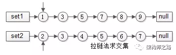
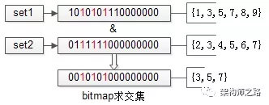

#### 两个非常大的数字集合求交集

集合无序：

​	先排序，再按照有序集合来处理。

集合有序：

1. 拉链法

   有序集合1{1,3,5,7,8,9}
   有序集合2{2,3,4,5,6,7}
   两个指针指向首元素，比较元素的大小：
   （1）如果相同，放入结果集，随意移动一个指针；
   （2）否则，移动值较小的一个指针，直到队尾；
   这种方法的好处是：
   （1）集合中的元素最多被比较一次，时间复杂度为O(n)；
   （2）多个有序集合可以同时进行

   

2. 分桶并行优化

   数据量大时，分桶水平切分+并行运算是一种常见的优化方法，如果能将list1和list2分成若干个桶区间，每个区间利用多线程并行求交集，各个线程结果集的并集，作为最终的结果集，能够大大的减少执行时间。

   举例：
   有序集合1{1,3,5,7,8,9, 10,30,50,70,80,90}
   有序集合2{2,3,4,5,6,7, 20,30,40,50,60,70}
   求交集，先进行分桶拆分：
   桶1的范围为[1, 9]
   桶2的范围为[10, 100]
   桶3的范围为[101, max_int]
   于是：
   集合1就拆分成
   集合a{1,3,5,7,8,9}
   集合b{10,30,50,70,80,90}
   集合c{}
   集合2就拆分成
   集合d{2,3,4,5,6,7}
   集合e{20,30,40,50,60,70}
   集合e{}每个桶内的数据量大大降低了，并且每个桶内没有重复元素，可以利用多线程并行计算：
   桶1内的集合a和集合d的交集是x{3,5,7}
   桶2内的集合b和集合e的交集是y{30, 50, 70}
   桶3内的集合c和集合d的交集是z{}
   最终，集合1和集合2的交集，是x与y与z的并集，即集合{3,5,7,30,50,70}。

3. 分桶+bitmap优化

   数据进行了水平分桶拆分之后，每个桶内的数据一定处于一个范围之内，如果集合符合这个特点，就可以使用bitmap来表示集合：

   

   如上图，假设set1{1,3,5,7,8,9}和set2{2,3,4,5,6,7}的所有元素都在桶值[1, 16]的范围之内，可以用16个bit来描述这两个集合，原集合中的元素x，在这个16bitmap中的第x个bit为1，此时两个bitmap求交集，只需要将两个bitmap进行“与”操作，结果集bitmap的3，5，7位是1，表明原集合的交集为{3,5,7}。

   水平分桶，bitmap优化之后，能极大提高求交集的效率，但时间复杂度仍旧是O(n)。bitmap需要大量连续空间，占用内存较大。

#### 不使用临时变量的情况下交换两个参数的值

方法一：加减

```cpp
a = a+b;
b = a-b;
a = a-b;
```

方法二：异或

```cpp
a = a^b;
b = a^b;
a = a^b;
```

